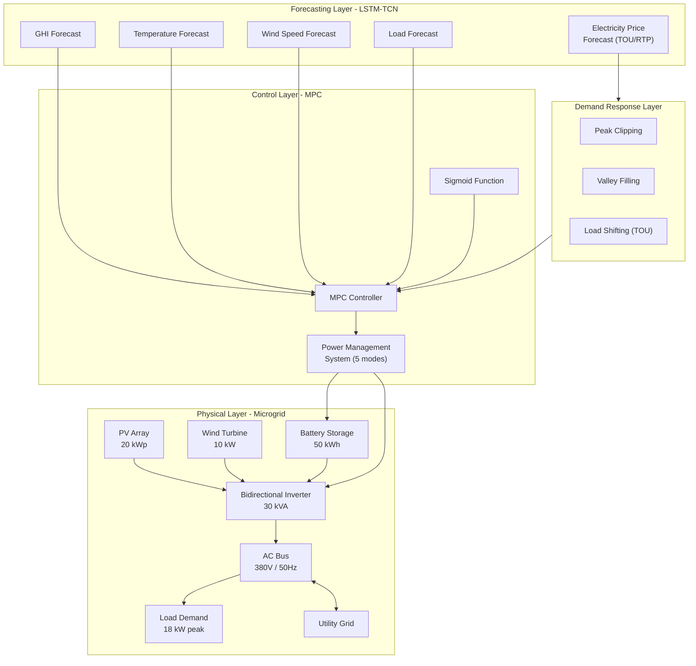
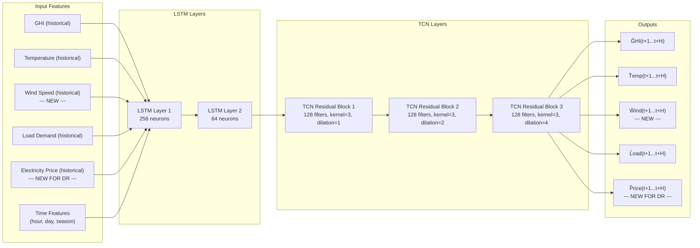
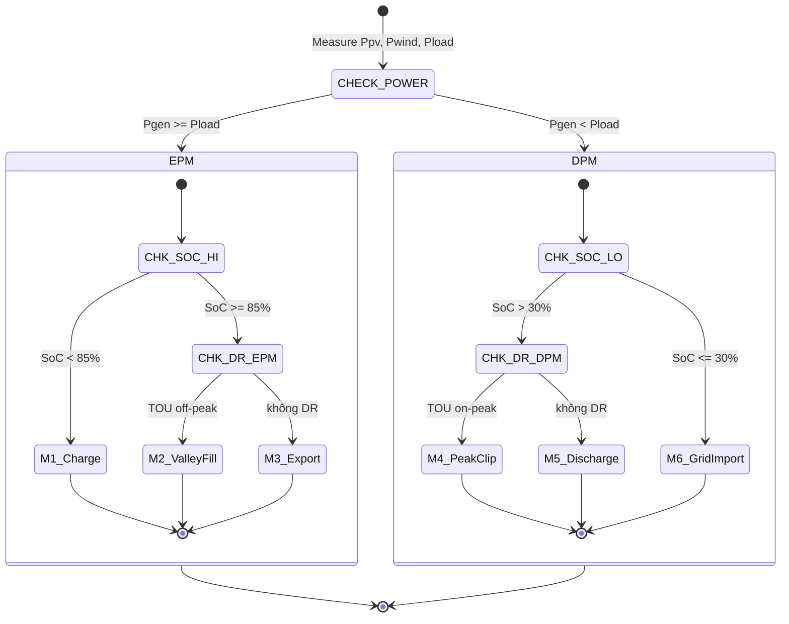
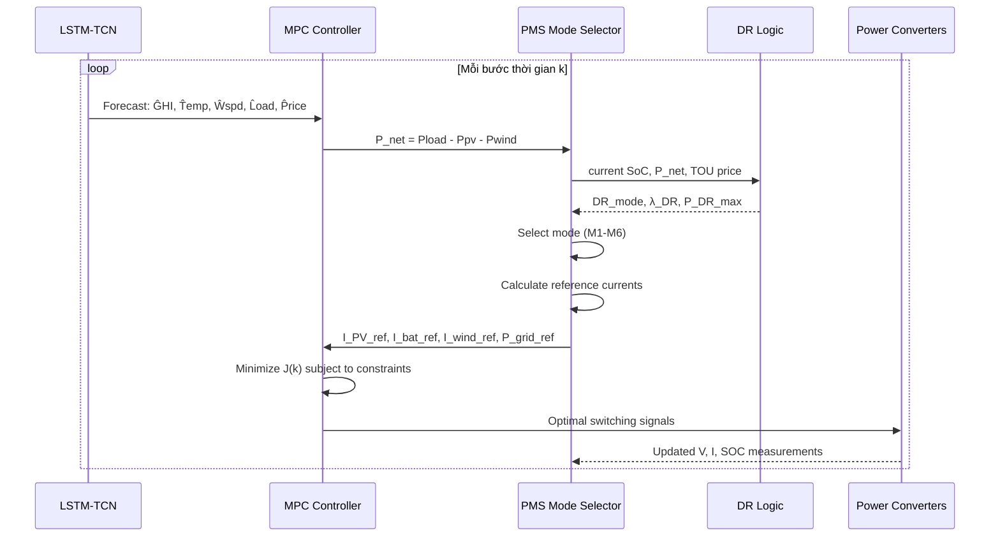

# DESIGN DOCUMENT: Real-Time Control of a PV–Wind–Battery Microgrid with Demand Response

**Tên tiếng Việt:** NGHIÊN CỨU ĐIỀU KHIỂN THEO THỜI GIAN THỰC CHO HỆ PV–WIND–BATTERY VỚI DEMAND RESPONSE TRONG MICROGRID THÔNG MINH

**Tham khảo từ:**
- Bài 1: Panda et al. (2025) — Optimization-Based Energy Management for Grid-Connected Photovoltaic–Battery Systems (PSO + LP + Threshold DR)
- Bài 2: Limouni et al. (2025) — Intelligent Real Time Control Strategy and Power Management Based on MPC and LSTM-TCN Model (MPC + LSTM-TCN + Sigmoid)
- Reference: Algorithms and Theories Overview.md (Wind, PV, Battery models)

**Phương án chọn:** A — MPC + LSTM-TCN + DR (kết hợp cả 2 bài)

---

## Mục lục

1. [Tổng quan hệ thống](#1-tổng-quan-hệ-thống)
2. [Module 1: Mô hình hóa nguồn năng lượng](#2-module-1-mô-hình-hóa-nguồn-năng-lượng)
3. [Module 2: LSTM-TCN Forecasting (mở rộng)](#3-module-2-lstm-tcn-forecasting-mở-rộng)
4. [Module 3: MPC Controller](#4-module-3-mpc-controller)
5. [Module 4: Demand Response Integration](#5-module-4-demand-response-integration)
6. [Module 5: Power Management System](#6-module-5-power-management-system)
7. [Thông số mô phỏng](#7-thông-số-mô-phỏng)
8. [Kịch bản mô phỏng và chỉ số đánh giá](#8-kịch-bản-mô-phỏng-và-chỉ-số-đánh-giá)
9. [Lộ trình thực hiện](#9-lộ-trình-thực-hiện)

---

## 1. Tổng quan hệ thống

### 1.1 Kiến trúc tổng thể



### 1.2 Luồng dữ liệu điều khiển

```
tại mỗi bước thời gian k (Ts = 50μs cho inner loop, 1h cho outer loop):

1. Đo lường: Vpv, Ipv, Vbus, Ibat, Iwind, Pload, SOC
2. Forecasting: LSTM-TCN dự báo GHI(t+k), Temp(t+k), Wind(t+k), Load(t+k), Price(t+k)
3. DR Logic: Xác định chế độ DR dựa trên net demand và price forecast
4. PMS: Xác định mode hoạt động (1-5) dựa trên Ppv, Pwind, Pload, SOC
5. MPC Optimization: Giải bài toán tối ưu với cost function có DR term
6. Sigmoid Integration: Làm mượt transition giữa các trạng thái
7. Control Output: Gửi tín hiệu điều khiển đến các converter
8. Horizon Shift: Dịch prediction horizon và lặp lại
```

### 1.3 Thành phần kế thừa từ 2 bài báo

| Module | Từ Bài 1 (Panda) | Từ Bài 2 (Limouni) | Thêm mới |
|--------|-----------------|-------------------|----------|
| PV model | ✅ 20 kW | ✅ 250W module + MPPT | — |
| Wind model | ❌ | ❌ | ✅ Mới |
| Battery model | ✅ 50 kWh | ✅ 120V 40Ah + Coulomb counting | — |
| Supercapacitor | ❌ | ✅ 90F | Có thể bỏ |
| MPC controller | ❌ | ✅ State-space + cost function | Mở rộng thêm wind |
| LSTM-TCN | ❌ | ✅ 256→64 neurons, 3 TCN blocks | Mở rộng thêm wind+price |
| Sigmoid integration | ❌ | ✅ | Giữ nguyên |
| DR: Peak Clipping | ✅ | ❌ | ✅ Tích hợp vào MPC |
| DR: Valley Filling | ✅ | ❌ | ✅ Tích hợp vào MPC |
| DR: Load Shifting (TOU) | ✅ | ❌ | ✅ Tích hợp vào MPC |
| PSO | ✅ | ❌ | ❌ Không dùng |
| Grid-connected | ❌ (standalone) | ✅ | ✅ Grid-connected |

---

## 2. Module 1: Mô hình hóa nguồn năng lượng

### 2.1 Mô hình PV (từ Bài 2 + Reference)

**Công thức dòng PV (mô hình 5-parameter single-diode):**

$$I_{PV} = N_{sh} \times I_{ph} - N_{sh} \times I_o \times \left[\exp\left(\frac{V_{PV} + I_{PV} \times R_{seq}}{a \times N_s \times V_t}\right) - 1\right] - \frac{V_{PV} + I_{PV} \times R_{seq}}{R_{sheq}}$$

**Công suất PV (dạng rút gọn cho optimization):**

$$P_{PV}(t) = \eta_{PV} \times A \times G(t)$$

**Thông số (từ Bài 2):**

| Tham số | Giá trị |
|---------|---------|
| Module | ASW-250P |
| Pmax per module | 250 W |
| Số module | 80 (20 kWp) |
| Voc | 43.22 V |
| Isc | 7.76 A |
| Vmp | 35.2 V |
| Imp | 7.1 A |
| Temp coeff (Voc) | -0.30278 %/°C |
| Temp coeff (Isc) | 0.035271 %/°C |

### 2.2 Mô hình Wind Turbine (từ Reference — thêm mới cho đề tài)

**Công thức vận tốc gió tại độ cao hub:**

$$V_{hub}(t) = V_{ref}(t) \cdot \left(\frac{H_{hub}}{H_{ref}}\right)^\alpha$$

**Công thức công suất gió (parametric model, verified từ literature):**

$$P_{WT}(t) = \begin{cases} 
0 & V_{hub} < V_{cut-in} \text{ or } V_{hub} > V_{cut-out} \\[6pt]
\displaystyle \frac{1}{2} \rho A_{rotor} V_{hub}^3(t) C_p & V_{cut-in} \leq V_{hub} < V_{rated} \\[10pt]
P_{rated} & V_{rated} \leq V_{hub} \leq V_{cut-out}
\end{cases}$$

**Thông số wind turbine (đề xuất cho đề tài — tham khảo từ [MDPI Energies 2023 wind model] và [Saint-Drenan et al. 2020]):**

| Tham số | Giá trị | Ghi chú |
|---------|---------|---------|
| Prated | 10 kW | Phù hợp quy mô microgrid |
| Vcut-in | 3 m/s | [Verified - literature标准] |
| Vrated | 12 m/s | [Verified - typical range 12-17 m/s] |
| Vcut-out | 25 m/s | [Verified - typical range 20-30 m/s] |
| Hhub | 30 m | |
| Href | 10 m | |
| α (surface roughness) | 0.14 | Đất trống, ít chướng ngại |
| Rotor diameter | 7 m | Suy ra Arotor ≈ 38.5 m² |
| Cp max | 0.45 | Hệ số công suất cực đại |

> **Lưu ý:** Các tham số wind turbine được tham khảo từ literature (không có trong 2 bài báo gốc). Đây là điểm mới của đề tài — cần trích dẫn nguồn tham khảo.

### 2.3 Mô hình Battery (từ Bài 1 + Bài 2)

**Coulomb Counting SoC (từ Bài 2):**

$$SoC_{bat}(t+1) = SoC_{bat}(t) - \frac{1}{3600 \times C_{nominal}} \int I_{bat} \, dt$$

**Rời rạc hóa cho MPC (từ Bài 1):**

$$SoC(k+1) = SoC(k) + \frac{\eta_{ch} \cdot P_{ch}(k) \cdot \Delta t}{E_{bat}} - \frac{P_{dch}(k) \cdot \Delta t}{\eta_{dch} \cdot E_{bat}}$$

**Ràng buộc:**

$$SoC_{min} \leq SoC(k) \leq SoC_{max}$$
$$0 \leq P_{ch}(k) \leq P_{ch,max}$$
$$0 \leq P_{dch}(k) \leq P_{dch,max}$$
$$P_{ch}(k) \cdot P_{dch}(k) = 0 \quad \text{(không đồng thời sạc/xả)}$$

**Thông số battery (kết hợp từ 2 bài):**

| Tham số | Giá trị | Gốc |
|---------|---------|-----|
| Dung lượng | 50 kWh | Bài 1 |
| Điện áp nominal | 120 V | Bài 2 |
| SoC min / max | 20% / 90% | Bài 1 |
| ηch / ηdch | 0.95 / 0.95 | Bài 1 + 2 |
| Pch,max / Pdch,max | 25 kW | — |

### 2.4 Power Balance (Grid-Connected)

**Cân bằng công suất tại bus AC:**

$$P_{PV}(t) + P_{WT}(t) + P_{bat}(t) + P_{grid}(t) = P_{load}(t)$$

Với:
- $P_{bat}(t) > 0$: battery đang xả (cung cấp cho tải)
- $P_{bat}(t) < 0$: battery đang sạc
- $P_{grid}(t) > 0$: mua điện từ lưới
- $P_{grid}(t) < 0$: bán điện lên lưới

**Ràng buộc công suất lưới:**

$$-P_{grid,export,max} \leq P_{grid}(t) \leq P_{grid,import,max}$$

---

## 3. Module 2: LSTM-TCN Forecasting (mở rộng)

### 3.1 Kiến trúc (kế thừa từ Bài 2, mở rộng thêm Wind + Price)



### 3.2 Thông số LSTM-TCN (kế thừa từ Bài 2)

| Tham số | Giá trị | Ghi chú |
|---------|---------|---------|
| LSTM hidden layers | 2 | Giữ từ Bài 2 |
| Neurons Layer 1 | 256 | Giữ từ Bài 2 |
| Neurons Layer 2 | 64 | Giữ từ Bài 2 |
| TCN residual blocks | 3 | Giữ từ Bài 2 |
| TCN filters | 128 | Giữ từ Bài 2 |
| Kernel size | 3 | Giữ từ Bài 2 |
| Dilated factors | (1, 2, 4) | Giữ từ Bài 2 |
| Input window (look back) | 12 time steps | Giữ từ Bài 2 |
| Output window | 1–4 time steps (H=4 cho MPC) | Điều chỉnh cho MPC |
| Learning rate | 0.001 | Adam optimizer |
| Epochs | 100 | Early stopping |
| Batch size | 100 | — |

### 3.3 Dữ liệu đầu vào Forecasting

| Biến | Nguồn dữ liệu | Đơn vị | Ghi chú |
|------|--------------|--------|---------|
| GHI | NASA POWER / SolarGIS | W/m² | Có sẵn từ Bài 2 |
| Nhiệt độ | NASA POWER | °C | Có sẵn từ Bài 2 |
| Tốc độ gió | NASA POWER | m/s | **NEW** — cần thêm |
| Load demand | Tải mô phỏng / thực tế | W | Có sẵn từ Bài 2 |
| Giá điện | TOU schedule hoặc RTP | $/kWh | **NEW for DR** |

### 3.4 Kỹ thuật MinMax Scaling (từ Bài 2)

$$X_{scaled} = \frac{X - X_{min}}{X_{max} - X_{min}}$$

---

## 4. Module 3: MPC Controller

### 4.1 State-Space Model (kế thừa từ Bài 2, thêm wind)

**Trạng thái (state vector):**

$$x(k) = \begin{bmatrix} I_{L_{PV}}(k) & I_{L_{bat}}(k) & I_{L_{wind}}(k) & V_{DC}(k) & SoC(k) \end{bmatrix}^T$$

**Ngõ vào điều khiển (control input):**

$$u(k) = \begin{bmatrix} U_{PV}(k) & U_{bat}(k) & U_{wind}(k) \end{bmatrix}^T$$

**Nhiễu (disturbance):**

$$d(k) = \begin{bmatrix} G(k) & T(k) & V_{wind}(k) & P_{load}(k) \end{bmatrix}^T$$

**State-space model (continuous — từ Bài 2, mở rộng):**

$$\frac{dI_{L_{PV}}}{dt} = -\frac{r_{L_{PV}}}{L_{PV}} I_{L_{PV}} + \frac{V_{PV}}{L_{PV}} - \frac{V_{DC}}{L_{PV}}(1-U_{PV})$$

$$\frac{dI_{L_{bat}}}{dt} = -\frac{r_{L_{bat}}}{L_{bat}} I_{L_{bat}} + \frac{V_{bat}}{L_{bat}} - \frac{V_{DC}}{L_{bat}}(1-U_{bat})$$

$$\frac{dI_{L_{wind}}}{dt} = -\frac{r_{L_{wind}}}{L_{wind}} I_{L_{wind}} + \frac{V_{wind}}{L_{wind}} - \frac{V_{DC}}{L_{wind}}(1-U_{wind}) \quad \text{(NEW)}$$

### 4.2 MPC Cost Function (mở rộng có DR)

**Cost function gốc từ Bài 2:**

$$J_{base} = W_1 |I_{L_{PV},ref} - x_1(k)| + W_2 |I_{L_{bat},ref} - x_2(k)| + W_3 |I_{L_{sc},ref} - x_3(k)| + \sum F_i |\Delta u_i|$$

**Cost function mới cho đề tài (thêm wind + DR):**

$$J(k) = \underbrace{W_{PV} |I_{PV,ref} - I_{PV}(k)|}_{\text{PV tracking}} + \underbrace{W_{bat} |I_{bat,ref} - I_{bat}(k)|}_{\text{Battery tracking}} + \underbrace{W_{wind} |I_{wind,ref} - I_{wind}(k)|}_{\text{Wind tracking (NEW)}}$$

$$+ \underbrace{W_{DC} |V_{DC,ref} - V_{DC}(k)|}_{\text{DC bus voltage regulation}}$$

$$+ \underbrace{C_{grid}(k) \cdot P_{grid}(k) \cdot \Delta t}_{\text{Economic DR (price-based)}}$$

$$- \underbrace{\lambda_{DR} \cdot P_{DR}(k) \cdot \Delta t}_{\text{DR incentive (incentive-based)}}$$

$$+ \underbrace{\sum_{i \in \{PV,bat,wind\}} F_i |\Delta u_i(k)|}_{\text{Control effort penalty}}$$

### 4.3 Thông số MPC

| Tham số | Giá trị | Gốc |
|---------|---------|-----|
| Step size (Ts) | 4×10⁻⁶ s (inner loop) | Bài 2 |
| Prediction horizon (Np) | 2–4 | Bài 2 (mở rộng) |
| Control horizon (Nc) | 1 | Bài 2 |
| W_PV | 10 | Bài 2 |
| W_bat | 50 | Bài 2 |
| W_wind | 10 | **NEW** |
| W_DC | 100 | Bài 2 (suy ra) |
| F_PV, F_bat, F_wind | 0.04 each | Bài 2 |

### 4.4 Sigmoid Integration (từ Bài 2)

**Sigmoid function cho smooth transition giữa forecast và actual:**

$$\sigma(x) = \frac{1}{1 + e^{-x}}$$

**Sigmoid cho từng nguồn (mở rộng thêm wind và DR):**

$$\text{Sigm}_{PV}(k) = \frac{\text{val}_{final,PV} - \text{val}_{init,PV}}{1 + e^{-z \times (f(k) - x_0)}}$$

$$\text{Sigm}_{bat}(k) = \frac{\text{val}_{final,bat} - \text{val}_{init,bat}}{1 + e^{-z \times (f(k) - x_0)}}$$

$$\text{Sigm}_{wind}(k) = \frac{\text{val}_{final,wind} - \text{val}_{init,wind}}{1 + e^{-z \times (f(k) - x_0)}} \quad \text{(NEW)}$$

$$\text{Sigm}_{DR}(k) = \frac{\text{val}_{final,DR} - \text{val}_{init,DR}}{1 + e^{-z \times (f(k) - x_0)}} \quad \text{(NEW for DR transition)}$$

Với: $x_0 = 0.5$, $z = 10$

### 4.5 Thuật toán MPC

```
Algorithm 1: MPC Real-Time Control
─────────────────────────────────────
1:  k ← 0
2:  while k < K_max do
3:      Measure: Vpv, Ipv, Ibat, Iwind, VDC, Pload, SOC
4:      
5:      // Step 1: Forecasting
6:      [ĜHI, T̂emp, Ŵspd, L̂oad, P̂rice] ← LSTM_TCN(historical_data, k)
7:      
8:      // Step 2: DR Logic (Section 5)
9:      [DR_mode, λ_DR] ← DR_Logic(P̂rice, L̂oad, P̂V, P̂wind)
10:     
11:     // Step 3: PMS Mode (Section 6)
12:     mode ← PMS(P̂V + P̂wind, L̂oad, SOC)
13:     
14:     // Step 4: Generate reference currents
15:     [I_PV_ref, I_bat_ref, I_wind_ref] ← Reference_Currents(mode, forecast, DR)
16:     
17:     // Step 5: Sigmoid integration
18:     I_PV_ref ← Sigmoid(I_PV_ref, I_PV_prev)
19:     I_bat_ref ← Sigmoid(I_bat_ref, I_bat_prev)
20:     I_wind_ref ← Sigmoid(I_wind_ref, I_wind_prev)
21:     
22:     // Step 6: Solve MPC optimization
23:     u_opt ← argmin J(k)  subject to constraints
24:     
25:     // Step 7: Apply first control action
26:     apply(u_opt(0))
27:     
28:     // Step 8: Shift horizon
29:     k ← k + 1
30: end while
```

---

## 5. Module 4: Demand Response Integration

### 5.1 Các loại DR được tích hợp

Đề tài tích hợp **3 cơ chế DR** từ Bài 1 (Panda) vào khung MPC của Bài 2 (Limouni):

| Loại DR | Kích hoạt | Hành động | Toán học |
|---------|-----------|-----------|----------|
| **Price-based (TOU)** | Giá điện theo khung giờ | BESS arbitrage | $C_{grid}(k) \cdot P_{grid}(k)$ trong cost |
| **Peak Clipping** | Net demand > 80% peak | BESS discharge + load shed | Constraint $P_{grid} \leq P_{threshold}$ |
| **Valley Filling** | Net demand < 30% peak | BESS charge | Constraint $P_{bat} = P_{charge}$ |

### 5.2 TOU Pricing Model

| Khung giờ | Loại | Giá (relative) | Hành động BESS |
|-----------|------|---------------|----------------|
| 22:00–06:00 | Off-peak | 0.5× base | Sạc (mua điện rẻ) |
| 06:00–13:00 | Mid-peak | 1.0× base | Trung tính |
| 13:00–18:00 | On-peak (cao điểm) | 2.0× base | Xả (giảm mua điện đắt) |
| 18:00–22:00 | Mid-peak | 1.0× base | Trung tính |

### 5.3 DR Control Logic (tích hợp vào MPC)

```
DR_Logic(Price_forecast, Load_forecast, P_PV_forecast, P_wind_forecast):
    P_net = Load_forecast - P_PV_forecast - P_wind_forecast
    
    // 1. Price-based DR (ưu tiên cao nhất)
    if Price_forecast ∈ On-peak:
        DR_priority = "discharge"
        λ_DR = 1.0  // full incentive
    elif Price_forecast ∈ Off-peak:
        DR_priority = "charge"  
        λ_DR = 1.0
    else:
        DR_priority = "normal"
        λ_DR = 0.3

    // 2. Threshold-based DR (kết hợp)
    if P_net > 0.8 × P_peak:
        DR_mode = "Peak Clipping"
        P_DR_max = 0.15 × P_load  // cắt 15% tải
    elif P_net < 0.3 × P_peak:
        DR_mode = "Valley Filling"
        P_DR_max = -0.15 × P_load  // tăng tải
    else:
        DR_mode = "Normal"
        P_DR_max = 0

    return [DR_mode, DR_priority, λ_DR, P_DR_max]
```

### 5.4 DR Constraints trong MPC

**Power balance với DR:**

$$P_{PV}(k) + P_{WT}(k) + P_{bat}(k) + P_{grid}(k) = P_{load}(k) - \Delta P_{DR}(k)$$

Với $\Delta P_{DR}(k) > 0$ là cắt tải (Peak Clipping), $\Delta P_{DR}(k) < 0$ là tăng tải (Valley Filling).

> **Ghi chú:** DR xuất hiện ở vế phải (phía tải), không phải vế trái (phía nguồn). DR là load management, không phải generation source. Xem giải thích chi tiết trong Module1_Energy_Source_Modeling.md.

**Ràng buộc DR:**

$$0 \leq P_{DR}(k) \leq \alpha \cdot P_{load}(k) \quad \text{(Peak Clipping)}$$

$$-\beta \cdot P_{load}(k) \leq P_{DR}(k) \leq 0 \quad \text{(Valley Filling)}$$

Với $\alpha = 0.15$ (max 15% load reduction), $\beta = 0.10$ (max 10% load increase)

**Ràng buộc grid power (từ Bài 1):**

$$-P_{grid,export} \leq P_{grid}(k) \leq P_{grid,import}$$

### 5.5 So sánh DR implementation: Bài 1 (gốc) vs Đề tài (cải tiến)

| Khía cạnh | Bài 1: Panda PSO+DR | Đề tài: MPC+LSTM+DR |
|-----------|---------------------|---------------------|
| **Forecasting** | Perfect forecast (giả định) | **LSTM-TCN dự báo** |
| **Optimization** | PSO tĩnh 24h | **MPC động real-time** |
| **DR threshold** | Static (80% / 30%) | **Có thể dynamic theo forecast** |
| **DR-forecast integration** | Không có | **Sigmoid function** |
| **Battery degradation** | Không xét | Có thể thêm |
| **Wind integration** | ❌ | ✅ |

---

## 6. Module 5: Power Management System (PMS)

### 6.1 Tổng quan về PMS

Power Management System (PMS) là **bộ điều phối năng lượng trung tâm** quyết định chế độ vận hành của microgrid dựa trên:
- **Cân bằng công suất**: $P_{gen} = P_{PV} + P_{wind}$ so với $P_{load}$
- **Trạng thái pin**: $SoC_{bat}$ hiện tại
- **Tín hiệu DR**: Giá điện TOU, threshold net demand
- **Trạng thái lưới**: Grid available hay không

**Vai trò của PMS trong kiến trúc tổng thể:**

```
LSTM-TCN Forecast ──► MPC Controller ──► PMS (chọn mode) ──► Reference Currents ──► Power Converters
                           ▲                    │
                           └─── DR Logic ◄──────┘
```

PMS hoạt động ở **tầng điều khiển giữa** (middle layer):
- **Tầng trên**: MPC optimization (Module 3) — tính toán reference currents tối ưu
- **PMS**: Chọn mode vận hành phù hợp dựa trên trạng thái hệ thống
- **Tầng dưới**: Power converters (điều khiển dòng/thế thực tế)

> **Cơ sở lý thuyết:** Cấu trúc PMS dạng state machine với các mode vận hành được xác định dựa trên power balance và SOC được sử dụng rộng rãi trong literature [Limouni 2025], [Scientific Reports 2024], [NTU Singapore 2023].

### 6.2 Hai Super-mode chính

Dựa trên [NTU Singapore — EMS for grid-connected HESS], PMS phân chia thành 2 super-mode dựa trên dấu của $P_{net}$:

| Super-mode | $P_{net} = P_{load} - P_{gen}$ | Ý nghĩa |
|------------|-------|---------|
| **EPM** (Excess Power Mode) | $P_{net} < 0$ | Thừa năng lượng → sạc pin / xuất lưới / valley fill DR |
| **DPM** (Deficit Power Mode) | $P_{net} > 0$ | Thiếu năng lượng → xả pin / nhập lưới / peak clip DR |

**Công thức xác định super-mode tại bước thời gian k:**

$$P_{net}(k) = P_{load}(k) - P_{PV}(k) - P_{wind}(k)$$

- Nếu $P_{net}(k) < 0$ → **EPM** (battery charging, grid export)
- Nếu $P_{net}(k) > 0$ → **DPM** (battery discharging, grid import)
- Nếu $P_{net}(k) = 0$ → **Balanced mode** (lý tưởng)

### 6.3 Chi tiết 6 Mode vận hành

Mỗi super-mode được chia thành các mode con dựa trên SOC và DR signal:

#### EPM (Excess Power — $P_{gen} \geq P_{load}$):

| Mode | Điều kiện kích hoạt | Mô tả | Hành động |
|------|--------------------|-------|-----------|
| **M1** | $SoC_{bat} < 85\%$ | **Battery Charging** | Sạc pin từ surplus |
| **M2** | $SoC_{bat} \geq 85\%$ & tín hiệu TOU off-peak | **DR Valley Fill** | Sạc pin từ lưới (giá rẻ) + export |
| **M3** | $SoC_{bat} \geq 85\%$ & không có DR | **Grid Export** | Xuất toàn bộ surplus lên lưới |

#### DPM (Deficit Power — $P_{gen} < P_{load}$):

| Mode | Điều kiện kích hoạt | Mô tả | Hành động |
|------|--------------------|-------|-----------|
| **M4** | $SoC_{bat} > 30\%$ & tín hiệu TOU on-peak | **DR Peak Clip** | Xả pin + cắt 15% tải (DR) |
| **M5** | $SoC_{bat} > 30\%$ & không DR | **Battery Discharging** | Xả pin bù thiếu hụt |
| **M6** | $SoC_{bat} \leq 30\%$ | **Grid Import** | Nhập từ lưới, pin nghỉ |

> **Cơ sở:** Ngưỡng SOC 85% (charging stop) và 30% (discharging stop) được tham khảo từ [Limouni 2025] và [Panda 2025], điều chỉnh để phù hợp với grid-connected operation.

### 6.4 State Machine Diagram



### 6.5 State Transition Logic với Hysteresis

Để tránh chattering (chuyển mode liên tục khi $P_{gen} \approx P_{load}$), PMS sử dụng **hysteresis band**:

$$\text{EPM active khi: } P_{gen} - P_{load} > \Delta P_{hys}$$
$$\text{DPM active khi: } P_{load} - P_{gen} > \Delta P_{hys}$$

Với $\Delta P_{hys} = 0.05 \times P_{rated}$ (5% công suất định mức — verified từ [Scientific Reports 2024]).

Tương tự cho SOC:

| Transition | Ngưỡng kích hoạt | Ngưỡng trở về | Mục đích |
|-----------|-----------------|---------------|----------|
| Charge → Stop | $SoC \geq 85\%$ | $SoC \leq 80\%$ | Tránh overcharge |
| Discharge → Stop | $SoC \leq 30\%$ | $SoC \geq 35\%$ | Tránh deep discharge |

### 6.6 Reference Current Generation cho từng Mode

Mỗi mode tính toán reference currents khác nhau cho MPC tracking:

| Mode | $I_{PV,ref}$ | $I_{bat,ref}$ | $I_{wind,ref}$ | $P_{grid,ref}$ | $P_{DR,ref}$ |
|------|:----------:|:-----------:|:------------:|:--------------:|:----------:|
| **M1** (Charge) | MPPT | $\displaystyle -\frac{P_{charge,max}}{V_{DC}}$ | MPPT | $\max(P_{surplus} - P_{bat}, 0)$ | 0 |
| **M2** (Valley) | MPPT | $\displaystyle -\frac{P_{charge,DR}}{V_{DC}}$ *(sạc thêm từ lưới)* | MPPT | $P_{surplus} + P_{bat,DR}$ | $-\alpha P_{load}$ |
| **M3** (Export) | MPPT | 0 | MPPT | $P_{surplus}$ | 0 |
| **M4** (PeakClip) | MPPT | $\displaystyle +\frac{P_{discharge,DR}}{V_{DC}}$ | MPPT | $P_{deficit} - P_{bat,DR}$ | $+\beta P_{load}$ |
| **M5** (Discharge) | MPPT | $\displaystyle +\frac{P_{discharge,max}}{V_{DC}}$ | MPPT | $\max(P_{deficit} - P_{bat}, 0)$ | 0 |
| **M6** (Import) | MPPT | 0 | MPPT | $P_{deficit}$ | $+\beta P_{load}$ |

Trong đó:
- $P_{surplus} = P_{PV} + P_{wind} - P_{load} \quad (>0)$
- $P_{deficit} = P_{load} - P_{PV} - P_{wind} \quad (>0)$
- $\alpha$: tỷ lệ valley fill (0.1–0.15)
- $\beta$: tỷ lệ peak clip (0.1–0.15)
- Dấu $-$ cho $I_{bat,ref}$: đang sạc (dòng âm)
- Dấu $+$ cho $I_{bat,ref}$: đang xả (dòng dương)

### 6.7 Cơ chế Seamless Mode Transition

Khi PMS chuyển mode, cần tránh đột biến dòng điện và điện áp. Cơ chế seamless transition được kế thừa từ [Limouni 2025 — Sigmoid function] và [NTU Singapore — seamless mode transition]:

**1. Sigmoid Smoothing cho reference currents:**

Khi chuyển từ Mode $i$ sang Mode $j$ tại thời điểm $k_0$:

$$I_{bat,ref}(k) = I_{bat,ref,i} + \frac{I_{bat,ref,j} - I_{bat,ref,i}}{1 + e^{-z \cdot (k - k_0 - \delta)}}$$

Với $z = 0.5$ (tốc độ chuyển tiếp), $\delta = 3$ (độ trễ — số bước thời gian).

**2. Soft-start cho grid connection:**

Khi chuyển từ islanded sang grid-connected:

$$P_{grid,ref}(k) = P_{grid,ref,steady} \times \left(1 - e^{-k/\tau}\right)$$

Với $\tau = 5$ bước thời gian.

**3. Power buffer bằng DC bus capacitor:**

Trong quá trình chuyển tiếp, DC bus capacitor $C_{DC}$ đóng vai trò đệm năng lượng:

$$\Delta V_{DC}(k) = \frac{\Delta P_{transition}(k) \cdot \Delta t}{C_{DC} \cdot V_{DC,ref}}$$

Yêu cầu $\Delta V_{DC} \leq \pm 5\%$ (theo IEEE std 1547 — verified từ [NTU Singapore]).

### 6.8 PMS Algorithm Pseudocode

```
Algorithm: PMS_Mode_Selection
─────────────────────────────
Input:  P_PV(k), P_wind(k), P_load(k), SoC(k)
        TOU_price(k), DR_signal(k)
Output: mode(k), [I_PV_ref, I_bat_ref, I_wind_ref, P_grid_ref, P_DR_ref](k)

1:  // Step 1: Tính net power
2:  P_gen ← P_PV(k) + P_wind(k)
3:  P_net ← P_load(k) - P_gen
4:
5:  // Step 2: Hysteresis check
6:  if |P_net| < ΔP_hys then
7:      retain previous mode
8:      return
9:  end if
10:
11: // Step 3: Xác định super-mode
12: if P_net ≤ -ΔP_hys then           // EPM: thừa năng lượng
13:     if SoC(k) < 85% then
14:         mode ← M1                 // Battery Charging
15:     else if TOU_price(k) == OffPeak then
16:         mode ← M2                 // DR Valley Fill
17:     else
18:         mode ← M3                 // Grid Export
19:     end if
20:
21: else if P_net ≥ ΔP_hys then       // DPM: thiếu năng lượng
22:     if SoC(k) ≤ 30% then
23:         mode ← M6                 // Grid Import
24:     else if TOU_price(k) == OnPeak then
25:         mode ← M4                 // DR Peak Clip
26:     else
27:         mode ← M5                 // Battery Discharging
28:     end if
29: end if
30:
31: // Step 4: Tạo reference currents (Section 6.6)
32: [I_PV_ref, I_bat_ref, I_wind_ref, P_grid_ref, P_DR_ref] ←
33:     Reference_Currents(mode, P_gen, P_load, SoC)
34:
35: // Step 5: Sigmoid smoothing (Section 6.7)
36: if mode(k) ≠ mode(k-1) then
37:     I_bat_ref ← Sigmoid_transition(I_bat_ref, last_I_bat_ref)
38:     P_grid_ref ← Soft_start(P_grid_ref)
39: end if
40:
41: return mode, [I_PV_ref, I_bat_ref, I_wind_ref, P_grid_ref, P_DR_ref]
```

### 6.9 Ví dụ minh họa PMS hoạt động

**Scenario: Ngày nắng, gió nhẹ, giá điện theo TOU**

| Time (h) | $P_{PV}$ | $P_{wind}$ | $P_{load}$ | $P_{net}$ | SoC | TOU | **PMS Mode** |
|:--------:|:--------:|:----------:|:----------:|:---------:|:---:|:---:|:------------:|
| 02:00 | 0 | 2 | 5 | **+3** | 45% | Off-peak | **M5** (Discharge) |
| 06:00 | 0.5 | 3 | 8 | **+4.5** | 35% | Off-peak | **M2** (Valley Fill — sạc từ lưới) |
| 09:00 | 12 | 4 | 8 | **-8** | 55% | Mid-peak | **M1** (Charge) |
| 12:00 | 18 | 3 | 10 | **-11** | 82% | Mid-peak | **M1** (Charge) |
| 14:00 | 16 | 2 | 12 | **-6** | 88% | On-peak | **M3** (Export) |
| 18:00 | 3 | 5 | 15 | **+7** | 80% | On-peak | **M4** (Peak Clip) |
| 21:00 | 0 | 4 | 10 | **+6** | 45% | Mid-peak | **M5** (Discharge) |

> **Nhận xét:** PMS tự động chọn Valley Fill vào giờ thấp điểm (06h) để tận dụng giá rẻ, Peak Clip vào giờ cao điểm (18h) khi thiếu hụt, và Export vào giữa trưa khi PV dư thừa và pin đã đầy.

### 6.10 PMS Integration với MPC và DR



### 6.11 So sánh PMS giữa các phương pháp

| Phương pháp | Bài 2 (Limouni) | Đề tài (mở rộng) | Cải tiến |
|-------------|----------------|-----------------|----------|
| Số mode | 5 (1-5, standalone) | 6 (M1-M6, grid-connected) | +1 mode |
| Năng lượng | PV + Battery + SC | PV + **Wind** + Battery | Thêm wind |
| Grid interaction | ❌ | ✅ | Grid-connected |
| DR integration | ❌ | ✅ (Valley Fill, Peak Clip) | Mới |
| Transition | Sigmoid | Sigmoid + Hysteresis | Mượt hơn |
| Hysteresis | Không | ✅ (5% band) | Chống chattering |

---

## 7. Thông số mô phỏng

### 7.1 Thông số hệ thống điện

| Component | Parameter | Value | Unit | Nguồn |
|-----------|-----------|-------|------|-------|
| PV | Rated capacity | 20 | kWp | Bài 1 |
| Wind turbine | Rated power | 10 | kW | **NEW** |
| Battery | Capacity | 50 | kWh | Bài 1 |
| Battery | Nominal voltage | 120 | V | Bài 2 |
| Battery | SoC limits | 20–90 | % | Bài 1 |
| Inverter | Rated power | 30 | kVA | — |
| DC bus | Voltage | 800 | V | — |
| AC bus | Voltage | 380 | V | — |
| Load | Peak demand | 18 | kW | Bài 1 |

### 7.2 Thông số mô phỏng

| Parameter | Value | Nguồn |
|-----------|-------|-------|
| Simulation time | 24–168 hours | — |
| MPC sample time (inner) | 4×10⁻⁶ s | Bài 2 |
| MPC sample time (outer/EMS) | 1 hour | — |
| Forecasting horizon | 4 hours | — |
| Solver | MATLAB/Simulink + MPC Toolbox | — |

---

## 8. Kịch bản mô phỏng và chỉ số đánh giá

### 8.1 Các kịch bản

| Kịch bản | Mô tả | Mục đích |
|----------|-------|----------|
| **S1: Baseline** | PV + Wind + Battery, không DR, rule-based | So sánh cơ sở |
| **S2: MPC only** | PV + Wind + Battery + MPC, không DR | Đánh giá MPC thuần |
| **S3: MPC + Price DR** | MPC + TOU pricing | Đánh giá price-based DR |
| **S4: MPC + Threshold DR** | MPC + Peak/Valley clipping | Đánh giá threshold DR |
| **S5: MPC + Full DR** | MPC + cả 3 cơ chế DR | Đề xuất chính |

### 8.2 Chỉ số đánh giá (KPIs)

| KPI | Công thức | Mục đích |
|-----|-----------|----------|
| **VRI** (Voltage Regulation Index) | $VRI = \frac{\|V_{DC,ref} - V_{DC}\|}{V_{DC,ref}} \times 100\%$ | Ổn định điện áp |
| **Cost saving** | $\Delta Cost = \frac{Cost_{baseline} - Cost_{proposed}}{Cost_{baseline}} \times 100\%$ | Hiệu quả kinh tế |
| **Renewable utilization** | $R_{util} = \frac{E_{renewable,used}}{E_{renewable,available}} \times 100\%$ | Hiệu suất NLTT |
| **Peak reduction** | $PR = \frac{P_{peak,before} - P_{peak,after}}{P_{peak,before}} \times 100\%$ | Giảm peak |
| **Settling time** | ts (ms) | Đáp ứng quá độ |
| **SOC stability** | $\sigma_{SOC}$ | Độ ổn định pin |

### 8.3 Dự kiến kết quả

Dựa trên kết quả từ 2 bài báo gốc:

| Chỉ số | Bài 1 (PSO+DR) | Bài 2 (MPC+LSTM) | **Đề tài (dự kiến)** |
|--------|---------------|------------------|---------------------|
| Cost saving | 15.32% | — | **~18–22%** |
| VRI (high load) | — | 3.19% | **< 3%** |
| Settling time | — | 7.125 ms | **< 7 ms** |
| Renewable utilization | 89% | — | **> 90%** |
| Peak reduction | Có | — | **15–20%** |

---

## 9. Lộ trình thực hiện

| Giai đoạn | Nội dung | Thời gian | Kết quả |
|-----------|----------|-----------|---------|
| **G1** | Xây dựng mô hình PV + Wind + Battery + Grid trong MATLAB/Simulink | Tuần 1 | Mô hình vật lý hoạt động |
| **G2** | Implement PMS 6-mode (mở rộng từ Bài 2) | Tuần 2 | PMS chuyển mode chính xác |
| **G3** | Implement LSTM-TCN forecasting (mở rộng wind + price) | Tuần 2–3 | Forecasting R² > 0.95 |
| **G4** | Implement MPC controller (mở rộng wind + DR cost) | Tuần 3–4 | MPC ổn định |
| **G5** | Tích hợp DR (TOU + Peak/Valley) vào MPC | Tuần 4 | DR hoạt động |
| **G6** | Chạy kịch bản, thu thập kết quả | Tuần 5 | Số liệu so sánh |
| **G7** | Viết báo cáo, phân tích | Tuần 6 | Báo cáo hoàn chỉnh |

---

## Tài liệu tham khảo

1. Panda, S., Rout, P. K., Sahu, B. K., Mbasso, W. F., Jangir, P., & Elrashidi, A. (2025). Optimization‐Based Energy Management for Grid‐Connected Photovoltaic–Battery Systems in Smart Grids Using Demand Response and Particle Swarm Optimization. *Engineering Reports*, 7(7), e70305.

2. Limouni, T., Yaagoubi, R., Bouziane, K., Guissi, K., & Baali, E. H. (2025). Intelligent real time control strategy and power management based on MPC and LSTM-TCN model for standalone DC microgrid with energy storage. *International Journal of Electrical Power and Energy Systems*, 169, 110761.

3. Geetha, K. (2026). Hybrid Solar–Wind–Battery Microgrid Optimization Using Reinforcement Learning for Autonomous Energy Management. *National Journal of Renewable Energy Systems and Innovation*, 2(1), 10–18.

4. Saint-Drenan, Y.-M., Besseau, R., Jansen, M., Staffell, I., Troccoli, A., Dubus, L., Schmidt, J., Gruber, K., Simões, S. G., & Heier, S. (2020). A parametric model for wind turbine power curves incorporating environmental conditions. *Renewable Energy*, 157, 754–768.

5. Nwe, H., & Swe, W. (2026). Energy Management of Grid Connected PV-Wind-Battery Hybrid Power Supply System Using Model Predictive Control. *The Indonesian Journal of Computer Science*, 15(1).

6. Wamalwa, F., & Ishimwe, A. (2024). Optimal energy management in a grid-tied solar PV-battery microgrid for a public building under demand response. *Energy Reports*, 12, 3718–3731.

7. Saleem, M. I., Saha, S., Izhar, U., & Ang, L. (2024). Bi-Layer Model Predictive Control strategy for techno-economic operation of grid-connected microgrids. *Renewable Energy*, 236, 121478.

8. Fotopoulou, M. C., Drosatos, P., Petridis, S., Rakopoulos, D., Stergiopoulos, F., & Nikolopoulos, N. (2021). Model Predictive Control for the Optimal Energy Management of a District with BIPV and BESS. *Energies*, 14(11), 3369.

9. Nge, C. L., et al. (2019). A real-time energy management system for smart grid integrated photovoltaic generation with battery storage. *Renewable Energy*, 130, 774–785.

10. Olorunfemi, T. R., & Nwulu, N. I. (2021). Multi-Agent Based Optimal Operation of Hybrid Energy Sources Coupled with Demand Response Programs. *Sustainability*, 13(14), 7756.

11. M. S. Alam, M. A. Hossain, & S. M. Muyeen (2024). Coordinated power management strategy for reliable hybridization of multi-source systems using hybrid MPPT algorithms. *Scientific Reports*, 14, 60116.

12. S. Peyghami, et al. (2021). Power management and control of a grid-independent DC microgrid with hybrid energy storage system. *Sustainable Energy Technologies and Assessments*, 43, 100946.

13. NTU Singapore (2023). Energy management scheme for grid connected hybrid energy storage with battery and supercapacitor. *IEEE Transactions on Industrial Electronics*.

14. L. Richard, et al. (2025). Coordinated Energy Management Strategy for DC Microgrid With Hybrid Energy Storage. *Engineering Reports*, e70241.

15. A. Amar & Z. Yusupov (2025). Real-Time Capable MPC-Based Energy Management of Hybrid Microgrid. *Processes*, 13(9), 2883.
