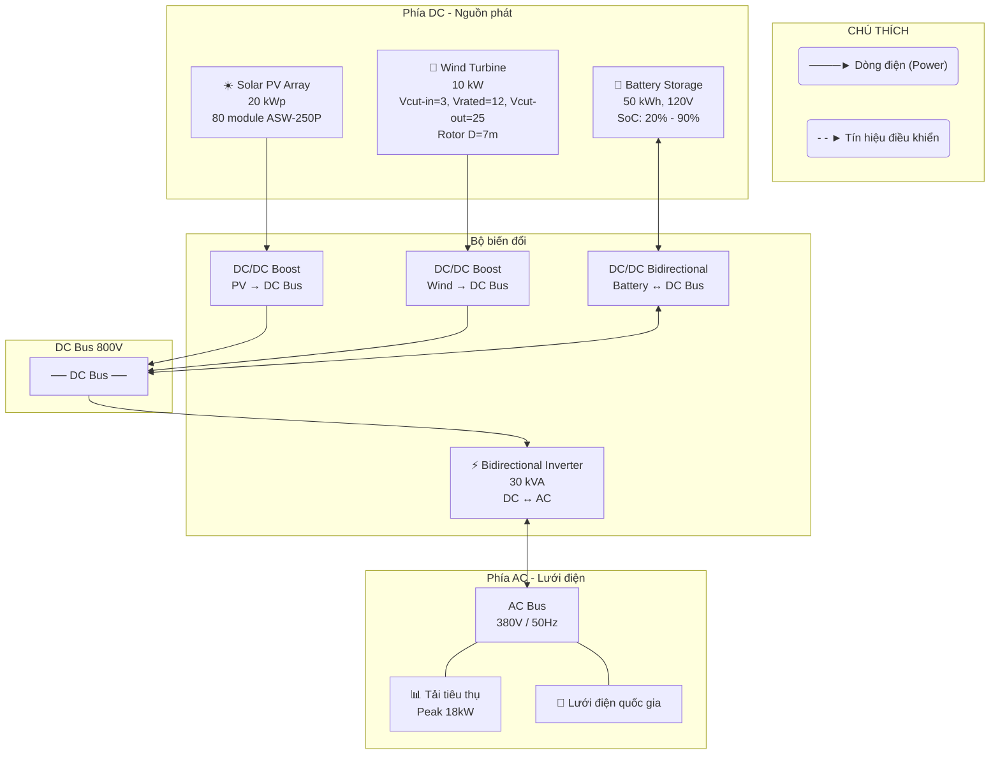
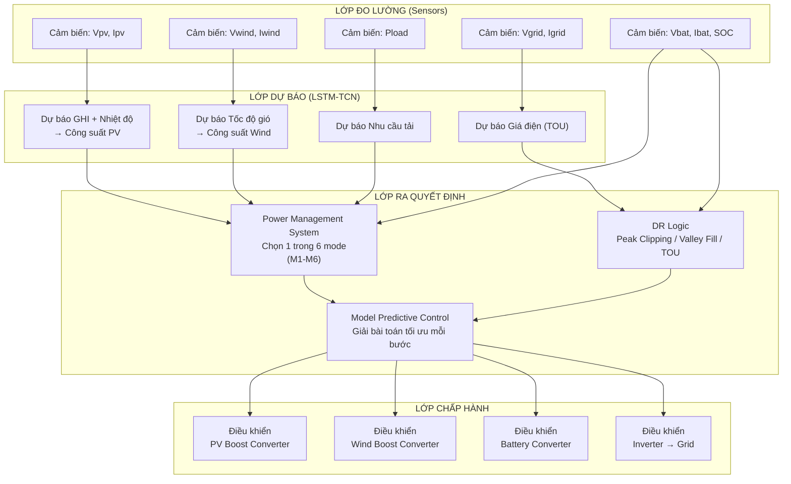
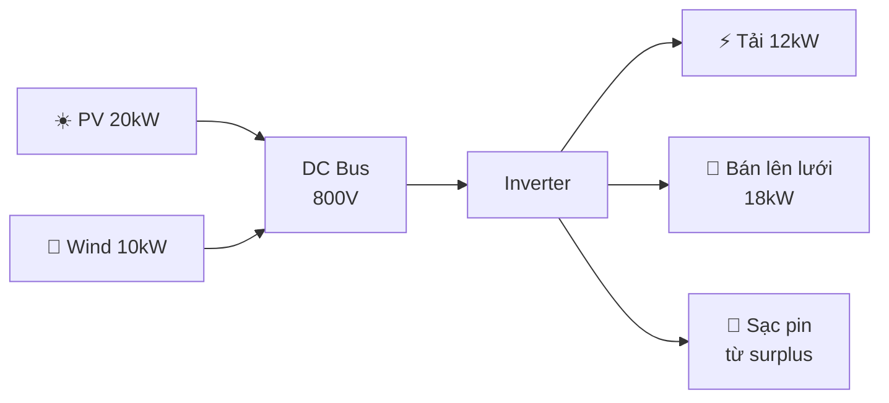
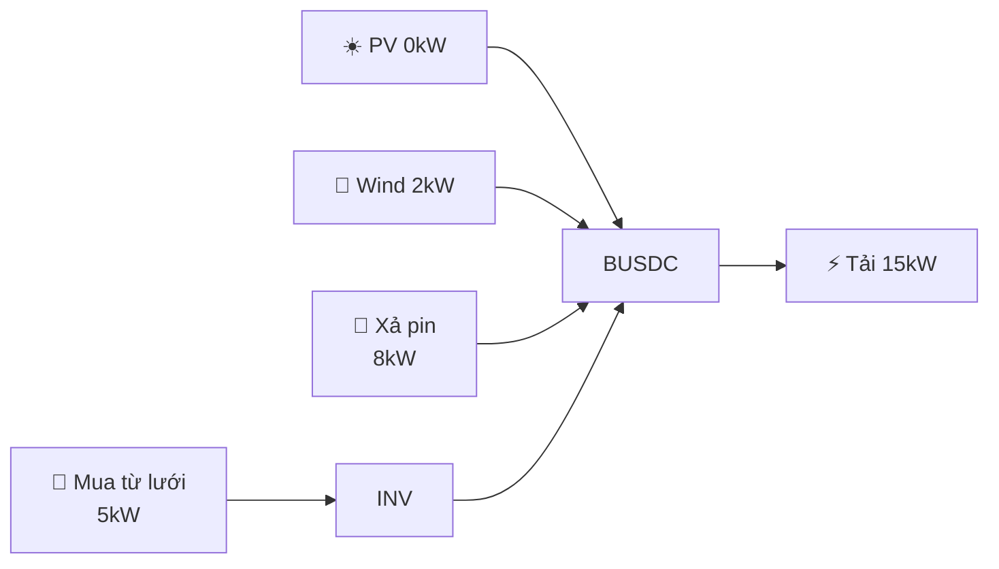
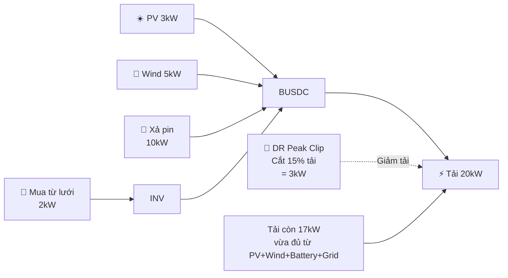
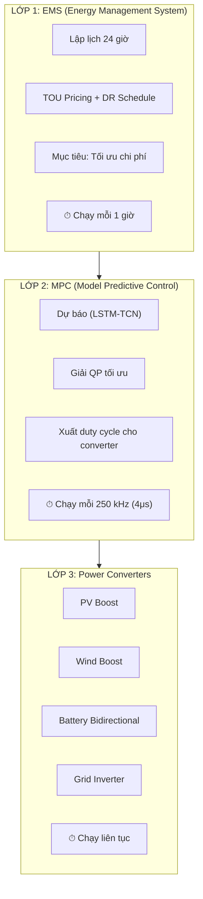
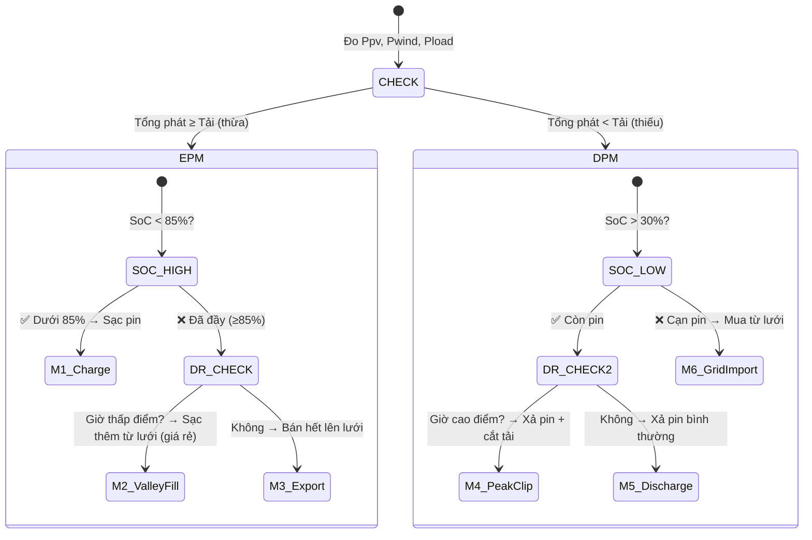
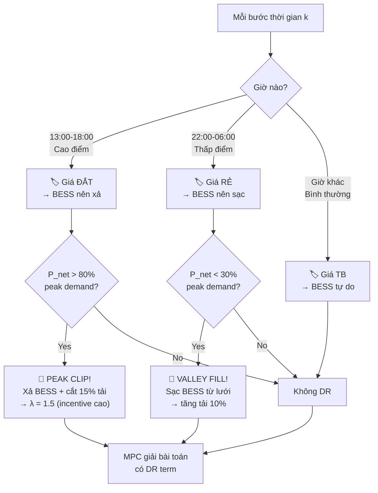
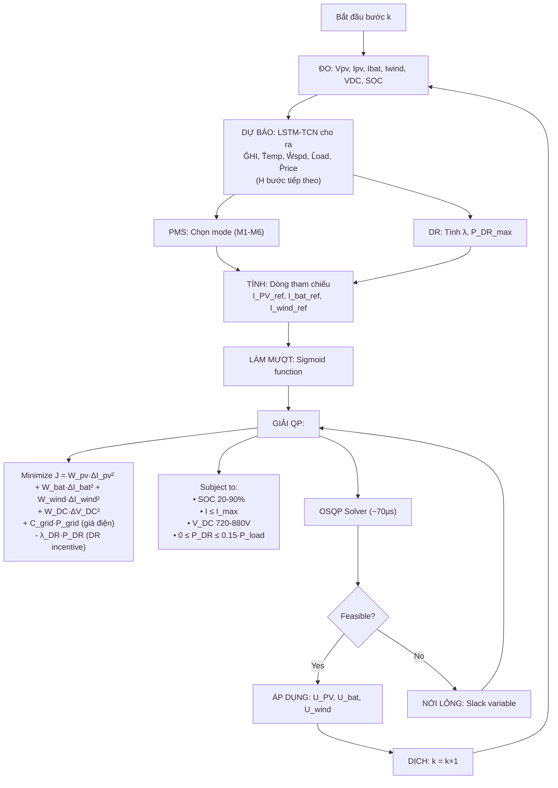
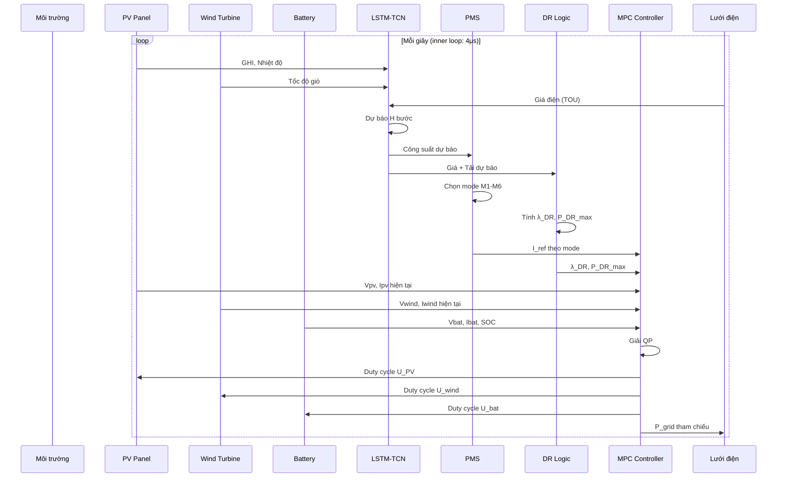

# HỆ THỐNG NGHIÊN CỨU — PV-WIND-BATTERY MICROGRID VỚI DEMAND RESPONSE

---

## 1. HỆ THỐNG VẬT LÝ GỒM NHỮNG GÌ?



**Giải thích bằng lời:**

| Thiết bị | Thông số | Làm gì? |
|----------|---------|---------|
| ☀️ **PV Array** | 20 kWp, 80 tấm pin ASW-250P | Biến ánh sáng mặt trời thành điện DC |
| 💨 **Wind Turbine** | 10 kW, rotor 7m | Biến gió thành điện AC, chỉnh lưu thành DC |
| 🔋 **Battery** | 50 kWh, Lithium-Ion 120V | Tích trữ điện dư, xả khi thiếu |
| ⚡ **Inverter** | 30 kVA | Chuyển DC↔AC, kết nối với lưới |
| 🔌 **Grid** | Lưới quốc gia | Mua/bán điện khi cần |

---

## 2. HỆ THỐNG ĐIỀU KHIỂN CÓ NHỮNG THÀNH PHẦN NÀO?



---

## 3. DÒNG NĂNG LƯỢNG ĐI NHƯ THẾ NÀO?

### 3.1 Khi nắng to, gió mạnh (Thừa năng lượng)



**Tổng phát = 30kW, Tải = 12kW → Dư 18kW → Sạc pin + Bán lưới**

### 3.2 Khi tối, lặng gió (Thiếu năng lượng)



**Tổng phát = 2kW, Tải = 15kW → Thiếu 13kW → Xả pin + Mua lưới**

### 3.3 DR kích hoạt (Cắt tải đỉnh)



---

## 4. BAO NHIÊU LỚP ĐIỀU KHIỂN?



---

## 5. PMS CÓ 6 CHẾ ĐỘ HOẠT ĐỘNG NÀO?



**6 chế độ tóm tắt:**

```
THỪA NĂNG LƯỢNG (Pgen > Pload):
  M1: Pin chưa đầy (<85%)   → SẠC PIN
  M2: Pin đã đầy + giá rẻ    → VALLEY FILL (sạc từ lưới để hưởng giá rẻ)
  M3: Pin đã đầy + giá thường → BÁN LƯỚI

THIẾU NĂNG LƯỢNG (Pgen < Pload):
  M4: Pin còn + giá đắt      → PEAK CLIP (xả pin + cắt tải 15%)
  M5: Pin còn + giá thường   → XẢ PIN bình thường
  M6: Pin hết                → MUA LƯỚI
```

---

## 6. DEMAND RESPONSE HOẠT ĐỘNG THẾ NÀO?



**Cơ chế DR là 2 lớp (2-layer DR):**

```
LỚP 1 - Price-based:
  • Giá cao điểm (13-18h)  → Khuyến khích xả pin
  • Giá thấp điểm (22-6h)  → Khuyến khích sạc pin
  • Đây là DR GIÁN TIẾP (BESS tự arbitrage)

LỚP 2 - Threshold-based (bổ sung):
  • Nếu net > 80% peak → Peak Clipping (cắt tải)
  • Nếu net < 30% peak → Valley Filling (tăng tải)
  • Đây là DR TRỰC TIẾP (có incentive λ)
```

---

## 7. MPC GIẢI BÀI TOÁN GÌ MỖI BƯỚC?



---

## 8. DỮ LIỆU CHẠY QUA CÁC MODULE THẾ NÀO?



---

## 9. TỔNG KẾT: MÔ HÌNH NGHIÊN CỨU LÀ GÌ?

```
┌────────────────────────────────────────────────────────────────────┐
│                 MÔ HÌNH NGHIÊN CỨU (RESEARCH MODEL)                │
├────────────────────────────────────────────────────────────────────┤
│                                                                    │
│  "XÂY DỰNG HỆ THỐNG ĐIỀU KHIỂN THỜI GIAN THỰC CHO MICROGRID      │
│   NỐI LƯỚI GỒM PIN MẶT TRỜI, TUABIN GIÓ, PIN LITHIUM-ION,         │
│   TÍCH HỢP DEMAND RESPONSE SỬ DỤNG MPC VÀ LSTM-TCN"               │
│                                                                    │
├────────────────────────────────────────────────────────────────────┤
│                                                                    │
│  HỆ THỐNG VẬT LÝ:    PV 20kW + Wind 10kW + Battery 50kWh         │
│                       + Inverter 30kVA + Grid                      │
│                                                                    │
│  BỘ ĐIỀU KHIỂN:      MPC (Model Predictive Control)               │
│                       - Inner loop: 250kHz (dòng điện)             │
│                       - Outer loop: 1h (EMS scheduling)            │
│                                                                    │
│  BỘ DỰ BÁO:          LSTM-TCN (2 LSTM layers + 3 TCN blocks)      │
│                       - Đầu vào: GHI, Temp, Wind, Load, Price      │
│                       - Đầu ra: PV, Wind, Load, Price (H bước)     │
│                                                                    │
│  DEMAND RESPONSE:     2 lớp:                                       │
│                       - Lớp 1: Price-based (TOU 5 khung giờ)       │
│                       - Lớp 2: Threshold-based (Peak/Valley)       │
│                                                                    │
│  PMS:                 6 modes (M1-M6)                              │
│                       - EPM: Charge / ValleyFill / Export          │
│                       - DPM: PeakClip / Discharge / Import         │
│                                                                    │
│  MỤC TIÊU:           Ổn định điện áp DC bus (VRI < 3%)            │
│                       Tiết kiệm chi phí (15-20%)                   │
│                       Tận dụng NLTT (> 90%)                        │
│                       Giảm peak demand (15-20%)                    │
│                                                                    │
└────────────────────────────────────────────────────────────────────┘
```

---

## PHỤ LỤC: CÁC CÔNG THỨC CHÍNH

### PV
$$P_{PV} = \eta_{PV} \times A \times G$$

### Wind
$$P_{WT}(t) = \begin{cases} 
0 & V < V_{ci} \\ 
\frac{1}{2} \rho A V^3 C_p & V_{ci} \leq V < V_r \\
P_{rated} & V_r \leq V \leq V_{co} \\
0 & V > V_{co}
\end{cases}$$

### Battery
$$SoC(k+1) = SoC(k) + \frac{\eta_{ch} P_{ch} \Delta t}{E_{bat}} - \frac{P_{dch} \Delta t}{\eta_{dch} E_{bat}}$$

### Power Balance
$$P_{PV} + P_{WT} + P_{bat} + P_{grid} = P_{load} - P_{DR}$$

### MPC Cost Function
$$J(k) = W_{PV} \Delta I_{PV}^2 + W_{bat} \Delta I_{bat}^2 + W_{wind} \Delta I_{wind}^2 + W_{DC} \Delta V_{DC}^2 + C_{grid} P_{grid} - \lambda_{DR} P_{DR}$$

### DR Threshold Logic
$$\text{Peak Clip: } 0 \leq P_{DR} \leq 0.15 P_{load} \quad \text{khi } P_{net} > 0.8 P_{peak}$$
$$\text{Valley Fill: } -0.10 P_{load} \leq P_{DR} \leq 0 \quad \text{khi } P_{net} < 0.3 P_{peak}$$
