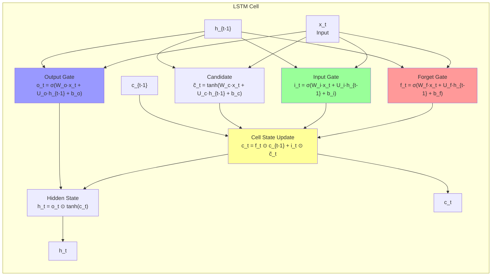
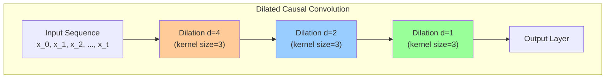
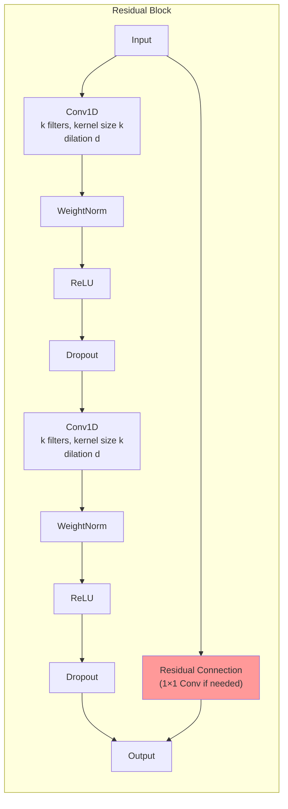
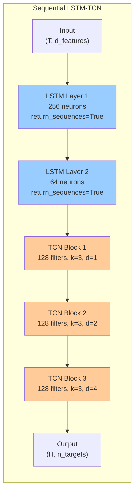
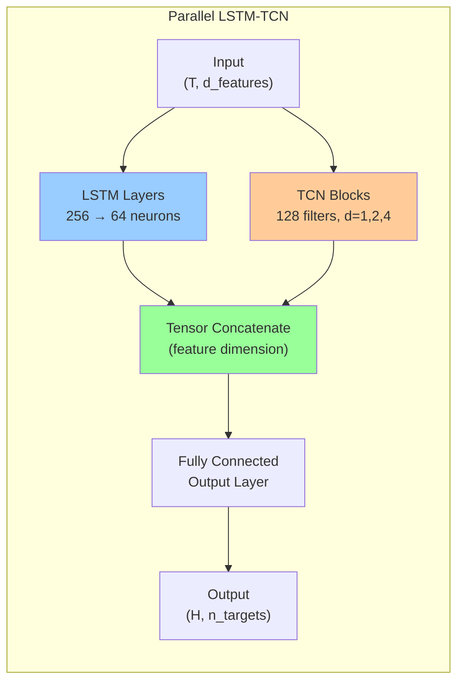
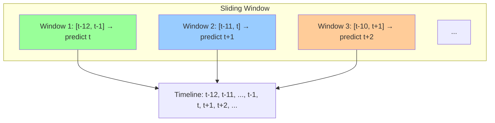

# LSTM-TCN Forecasting: Kiến trúc, Toán học và Ứng dụng trong Dự báo Năng lượng

**Tài liệu tham khảo cho đề tài:** Real-Time Control of a PV–Wind–Battery Microgrid with Demand Response

**Nguồn tham khảo chính:**
- Limouni et al. (2025) — Intelligent real time control strategy... MPC and LSTM-TCN model
- Hochreiter & Schmidhuber (1997) — Long Short-Term Memory
- Bai et al. (2018) — An Empirical Evaluation of Generic Convolutional and Recurrent Networks for Sequence Modeling
- Keras-TCN documentation (philipperemy/keras-tcn)
- Các bài báo hybrid LSTM-TCN gần đây (2024–2025)

---

## Mục lục

1. [Giới thiệu](#1-giới-thiệu)
2. [LSTM — Long Short-Term Memory](#2-lstm--long-short-term-memory)
3. [TCN — Temporal Convolutional Network](#3-tcn--temporal-convolutional-network)
4. [Hybrid LSTM-TCN](#4-hybrid-lstm-tcn)
5. [Hyperparameters và Kỹ thuật Huấn luyện](#5-hyperparameters-và-kỹ-thuật-huấn-luyện)
6. [Ứng dụng trong Dự báo Năng lượng](#6-ứng-dụng-trong-dự-báo-năng-lượng)
7. [Kết luận](#7-kết-luận)

---

## 1. Giới thiệu

### 1.1 Tại sao cần dự báo trong microgrid?

Trong hệ thống microgrid tích hợp năng lượng tái tạo, dự báo chính xác các đại lượng đầu vào là **yêu cầu bắt buộc** để vận hành tối ưu. MPC (Model Predictive Control) cần dự báo ngắn hạn để đưa ra quyết định điều khiển tối ưu trong cửa sổ dự báo.

**Các đại lượng cần dự báo:**
| Đại lượng | Tính chất | Mức độ khó |
|-----------|-----------|-------------|
| Bức xạ mặt trời (GHI) | Chu kỳ ngày, nhiễu thời tiết | Trung bình |
| Nhiệt độ môi trường | Xu hướng chậm, chu kỳ mùa | Thấp |
| Tốc độ gió | Hỗn loạn, phi tuyến mạnh | Cao |
| Nhu cầu tải | Chu kỳ ngày/tuần, theo mùa | Trung bình |
| Giá điện (TOU/RTP) | Biết trước (TOU) hoặc ngẫu nhiên (RTP) | Thấp–Cao |

### 1.2 Lựa chọn LSTM-TCN

LSTM-TCN hybrid được chọn vì:
- **LSTM**: Xử lý phụ thuộc dài hạn (long-term dependencies) trong chuỗi thời gian
- **TCN**: Nắm bắt pattern cục bộ (local temporal patterns) với tính song song cao
- **Kết hợp**: Tận dụng ưu điểm của cả hai, khắc phục nhược điểm riêng lẻ

| Tiêu chí | LSTM thuần | TCN thuần | LSTM-TCN hybrid |
|----------|-----------|-----------|-----------------|
| Long-term dependencies | ✅ Tốt | ⚠️ Cần dilation lớn | ✅ Rất tốt |
| Short-term patterns | ⚠️ Trung bình | ✅ Tốt | ✅ Rất tốt |
| Song song hóa | ❌ Tuần tự | ✅ Song song | ⚠️ Partial |
| Vanishing gradient | ✅ Giải quyết | ✅ Ổn định | ✅ Ổn định |
| Số parameters | 4× (h²) | Ít hơn | Trung bình |

---

## 2. LSTM — Long Short-Term Memory

### 2.1 Lịch sử và Ý tưởng

LSTM được giới thiệu bởi **Hochreiter & Schmidhuber (1997)** để giải quyết vấn đề **vanishing gradient** trong RNN truyền thống. Ý tưởng chính là thay thế phép nhân ma trận lặp đi lặp lại (gây triệt tiêu gradient) bằng một **cơ chế cộng dồn có kiểm soát** thông qua các cổng (gates).

> **Vấn đề của vanilla RNN:**
> $$\frac{\partial h_T}{\partial h_k} = \prod_{i=k+1}^{T} W_{hh}^T \cdot \text{diag}(\sigma'(h_i))$$
> 
> Tích của nhiều ma trận $W_{hh}^T$ gây ra exponential growth/decay của gradient.

### 2.2 Kiến trúc LSTM Cell

Một LSTM cell có **4 thành phần chính**: forget gate, input gate, candidate cell state, output gate.



### 2.3 Công thức Toán học Đầy đủ

#### Ký hiệu

| Ký hiệu | Ý nghĩa | Kích thước |
|---------|---------|------------|
| $x_t \in \mathbb{R}^d$ | Input vector tại time step t | $d$ |
| $h_{t-1} \in \mathbb{R}^h$ | Hidden state trước đó | $h$ |
| $c_{t-1} \in \mathbb{R}^h$ | Cell state trước đó | $h$ |
| $W_* \in \mathbb{R}^{h \times d}$ | Input weight matrix | $h \times d$ |
| $U_* \in \mathbb{R}^{h \times h}$ | Recurrent weight matrix | $h \times h$ |
| $b_* \in \mathbb{R}^h$ | Bias vector | $h$ |

#### 1. Forget Gate — Cổng quên

Quyết định **thông tin nào cần xóa khỏi cell state**.

$$f_t = \sigma(W_f \cdot x_t + U_f \cdot h_{t-1} + b_f)$$

- $\sigma$: sigmoid function, output trong $(0, 1)$
- $f_t^{(j)} \to 0$: quên hoàn toàn chiều thứ j
- $f_t^{(j)} \to 1$: giữ nguyên chiều thứ j

#### 2. Input Gate — Cổng đầu vào

Quyết định **thông tin mới nào cần ghi vào cell state**.

$$i_t = \sigma(W_i \cdot x_t + U_i \cdot h_{t-1} + b_i)$$

#### 3. Candidate Cell State — Ứng viên

Thông tin mới **có thể được thêm vào** cell state.

$$\tilde{c}_t = \tanh(W_c \cdot x_t + U_c \cdot h_{t-1} + b_c)$$

- $\tanh$: output trong $(-1, 1)$, cho phép cả tăng và giảm cell state

#### 4. Cell State Update — Cập nhật trạng thái (quan trọng nhất)

$$c_t = \underbrace{f_t \odot c_{t-1}}_{\text{giữ lại thông tin cũ}} + \underbrace{i_t \odot \tilde{c}_t}_{\text{thêm thông tin mới}}$$

**Ý nghĩa:** Đây là phép **cộng có kiểm soát** — thay vì nhân ma trận (gây vanishing gradient), LSTM dùng phép cộng element-wise.

**Đạo hàm qua các time step:**
$$\frac{\partial c_T}{\partial c_k} = \prod_{i=k+1}^{T} f_i$$

Nếu $f_i \approx 1$ (giữ nguyên), gradient truyền gần như không suy giảm. Đây gọi là **Constant Error Carousel (CEC)**.

#### 5. Output Gate — Cổng đầu ra

Quyết định **phần nào của cell state được đưa ra làm hidden state**.

$$o_t = \sigma(W_o \cdot x_t + U_o \cdot h_{t-1} + b_o)$$

#### 6. Hidden State Update

$$h_t = o_t \odot \tanh(c_t)$$

#### Tổng hợp (6 công thức chính)

$$
\boxed{\begin{aligned}
f_t &= \sigma(W_f x_t + U_f h_{t-1} + b_f) \quad &\text{(forget gate)} \\
i_t &= \sigma(W_i x_t + U_i h_{t-1} + b_i) \quad &\text{(input gate)} \\
\tilde{c}_t &= \tanh(W_c x_t + U_c h_{t-1} + b_c) \quad &\text{(candidate)} \\
c_t &= f_t \odot c_{t-1} + i_t \odot \tilde{c}_t \quad &\text{(cell state)} \\
o_t &= \sigma(W_o x_t + U_o h_{t-1} + b_o) \quad &\text{(output gate)} \\
h_t &= o_t \odot \tanh(c_t) \quad &\text{(hidden state)}
\end{aligned}}
$$

### 2.4 Forward Pass Algorithm

```
Input: sequence X = [x_1, x_2, ..., x_T], x_t ∈ ℝ^d
Output: hidden states H = [h_1, h_2, ..., h_T], h_t ∈ ℝ^h

Khởi tạo:
  h_0 = 0, c_0 = 0
  
for t = 1 to T:
    // 1. Tính các cổng
    f_t = sigmoid(W_f @ x_t + U_f @ h_{t-1} + b_f)
    i_t = sigmoid(W_i @ x_t + U_i @ h_{t-1} + b_i)
    c̃_t = tanh(W_c @ x_t + U_c @ h_{t-1} + b_c)
    o_t = sigmoid(W_o @ x_t + U_o @ h_{t-1} + b_o)
    
    // 2. Cập nhật cell state
    c_t = f_t * c_{t-1} + i_t * c̃_t
    
    // 3. Tính hidden state
    h_t = o_t * tanh(c_t)
    
    // 4. Lưu output
    outputs[t] = h_t
    
return outputs
```

### 2.5 So sánh: Vanilla RNN vs LSTM

| Feature | Vanilla RNN | LSTM |
|---------|-------------|------|
| State update | $h_t = \tanh(W \cdot [h_{t-1}, x_t])$ | $c_t = f_t \odot c_{t-1} + i_t \odot \tilde{c}_t$ |
| Memory type | Đơn (1 hidden state) | Kép (cell state + hidden state) |
| Gradient flow | $\prod W_{hh}^T \to$ exponential | $\prod f_i \to$ controlled |
| Long-range dependencies | ❌ Kém | ✅ Tốt |
| Parameters | $O(h^2)$ | $O(4h^2)$ |
| Computational cost | 1× | ~4× |

### 2.6 Bidirectional LSTM (BiLSTM)

Trong một số ứng dụng, có thể dùng BiLSTM — xử lý chuỗi theo cả 2 chiều:

$$\overrightarrow{h}_t = \text{LSTM}_{\text{forward}}(x_t, \overrightarrow{h}_{t-1})$$
$$\overleftarrow{h}_t = \text{LSTM}_{\text{backward}}(x_t, \overleftarrow{h}_{t+1})$$
$$h_t = [\overrightarrow{h}_t; \overleftarrow{h}_t]$$

> **Lưu ý cho dự báo thời gian thực:** BiLSTM không phù hợp vì cần nhìn vào tương lai. Chỉ dùng LSTM một chiều (causal) cho forecasting.

---

## 3. TCN — Temporal Convolutional Network

### 3.1 Giới thiệu

TCN được hệ thống hóa bởi **Bai et al. (2018)** — "An Empirical Evaluation of Generic Convolutional and Recurrent Networks for Sequence Modeling". TCN dùng **causal dilated convolutions** để xử lý chuỗi thời gian với receptive field có thể điều chỉnh.

**Nguyên lý:** Thay vì xử lý tuần tự như RNN/LSTM, TCN dùng các convolutional layer với dilation để "nhìn xa" trong quá khứ.

### 3.2 Causal Convolution

Khác với convolution thông thường (nhìn cả 2 phía), **causal convolution** chỉ nhìn về quá khứ:

$$y_t = \sum_{i=0}^{k-1} f(i) \cdot x_{t - i}$$

Trong đó:
- $f$: convolution kernel
- $k$: kernel size
- $x_{t-i}$: dữ liệu tại thời điểm $t-i$ (chỉ quá khứ, không có tương lai)

### 3.3 Dilated Convolution

Để tăng receptive field mà không tăng số parameters, TCN dùng **dilated convolution**:

$$F(s) = (x *_{d} f)(s) = \sum_{i=0}^{k-1} f(i) \cdot x_{s - d \cdot i}$$

Trong đó:
- $d$: dilation factor (hệ số giãn)
- $k$: kernel size
- $s - d \cdot i$: bỏ qua $d-1$ mẫu giữa các kernel weights



**Ý nghĩa dilation:**
- Layer 1: d=1 → kernel nhìn 3 time step liên tiếp
- Layer 2: d=2 → kernel nhìn cách 1 step
- Layer 3: d=4 → kernel nhìn cách 3 steps
- Tổng receptive field: $1 + (k-1) \times \sum d_i = 1 + 2 \times (1 + 2 + 4) = 15$

### 3.4 Residual Block

Mỗi layer trong TCN là một **residual block**:



**Residual connection:**
$$Output = \text{Activation}(F(x) + x)$$

Nếu input và output khác số chiều, dùng 1×1 convolution để align:
$$Output = \text{Activation}(F(x) + W \cdot x)$$

### 3.5 Receptive Field

**Công thức tính receptive field của TCN:**

$$R_{field} = 1 + 2 \cdot (k - 1) \cdot N_{stack} \cdot \sum_{i=1}^{N_b} d_i$$

Trong đó:
- $k$: kernel size
- $N_{stack}$: số stacks
- $N_b$: số residual blocks per stack
- $d_i$: dilation của block thứ i

**Ví dụ từ Bài 2 (Limouni et al.):**
- $k = 3$, $N_{stack} = 1$, $N_b = 3$, $d = [1, 2, 4]$
- $R_{field} = 1 + 2 \cdot (3-1) \cdot 1 \cdot (1 + 2 + 4) = 1 + 2 \cdot 2 \cdot 7 = 29$

Với input window = 12 time steps, receptive field = 29 > 12 → đủ "nhìn" toàn bộ input.

### 3.6 TCN Architecture Stack

```
Input: sequence X = [x_1, x_2, ..., x_T], x_t ∈ ℝ^d

Residual Block 1:
  Dilated Conv1D (filters=128, kernel=3, dilation=1)
  → WeightNorm → ReLU → Dropout(0.2)
  → Dilated Conv1D (filters=128, kernel=3, dilation=1)
  → WeightNorm → ReLU → Dropout(0.2)
  → + Residual Connection → ReLU

Residual Block 2:
  Dilated Conv1D (filters=128, kernel=3, dilation=2)
  → WeightNorm → ReLU → Dropout(0.2)
  → Dilated Conv1D (filters=128, kernel=3, dilation=2)
  → WeightNorm → ReLU → Dropout(0.2)
  → + Residual Connection → ReLU

Residual Block 3:
  Dilated Conv1D (filters=128, kernel=3, dilation=4)
  → WeightNorm → ReLU → Dropout(0.2)
  → Dilated Conv1D (filters=128, kernel=3, dilation=4)
  → WeightNorm → ReLU → Dropout(0.2)
  → + Residual Connection → ReLU
  
Output: Features có kích thước (T, 128)
```

### 3.7 TCN vs LSTM: So sánh

| Tiêu chí | LSTM | TCN |
|----------|------|-----|
| **Cơ chế** | Cổng + cell state tuần tự | Dilated convolution song song |
| **Long-term dependencies** | ✅ Tự nhiên qua cell state | ⚠️ Cần dilation đủ lớn |
| **Parallel computation** | ❌ Tuần tự theo time step | ✅ Song song toàn bộ |
| **Vanishing gradient** | ✅ Giải quyết (CEC) | ✅ Ổn định (residual) |
| **Receptive field** | ∞ (vô hạn về quá khứ) | Hữu hạn (tính được) |
| **Thích hợp cho** | Dữ liệu có phụ thuộc xa | Dữ liệu có pattern cục bộ |
| **Training speed** | Chậm hơn | Nhanh hơn 2-5× |

---

## 4. Hybrid LSTM-TCN

### 4.1 Tại sao kết hợp?

LSTM và TCN có ưu điểm bổ sung cho nhau:

```
Dữ liệu forecasting:
  x_t: [GHI, Temp, Wind, Load, Price, Hour]
  
  Pattern ngắn hạn (giờ hiện tại → 1-2h tới):
    → TCN nắm bắt tốt (cục bộ, song song)
    
  Pattern dài hạn (hôm qua → hôm nay):
    → LSTM nắm bắt tốt (cell state xuyên suốt)
    
  → Hybrid LSTM-TCN: cả hai!
```

### 4.2 Kiến trúc Nối tiếp (Sequential) — Bài 2 sử dụng



**Luồng dữ liệu:**
1. Input sequence (T=12 time steps, 5+ features) → LSTM
2. LSTM xử lý **phụ thuộc dài hạn**, xuất sequence (T, 64)
3. Sequence → TCN blocks (3 residual blocks)
4. TCN nắm bắt **pattern cục bộ**, dilation tăng dần
5. Output: dự báo H bước tiếp theo

**Ưu điểm:** Đơn giản, dễ implement, kế thừa trực tiếp từ Bài 2.
**Nhược điểm:** Tuần tự, không tận dụng hoàn toàn parallelism của TCN.

### 4.3 Kiến trúc Song song (Parallel)



**Luồng dữ liệu:**
1. Input → LSTM branch và TCN branch **độc lập, song song**
2. LSTM branch: học phụ thuộc dài hạn
3. TCN branch: học pattern cục bộ
4. Tensor Concatenate: ghép feature vectors
5. FC layer: dự báo đầu ra

**Ưu điểm:**
- Tận dụng tối đa parallelism
- Mỗi branch học chuyên sâu thế mạnh riêng
- Không làm tăng độ sâu mô hình

**Nhược điểm:**
- Phức tạp hơn
- Nhiều parameters hơn

### 4.4 Kiến trúc trong Bài báo Limouni et al. (2025)

Bài 2 sử dụng kiến trúc **sequential LSTM-TCN** với thông số:

```
Input window: 12 time steps
Output window: 1 time step

Input features: GHI, Temperature, Load Demand
  → MinMax scaling

LSTM Layer 1: 256 neurons, return_sequences=True
LSTM Layer 2: 64 neurons, return_sequences=True

TCN Residual Block 1: 128 filters, kernel=3, dilation=1
TCN Residual Block 2: 128 filters, kernel=3, dilation=2
TCN Residual Block 3: 128 filters, kernel=3, dilation=4

Output: Dense layer → predicted values (GHI, Temp, Load)

Loss function: MSE (Mean Squared Error)
Optimizer: Adam (lr=0.001)
Batch size: 100
Epochs: 100 (with early stopping)
```

### 4.5 Mở rộng cho Đề tài PV-Wind-Battery + DR

Đề tài của bạn mở rộng đầu vào và đầu ra của LSTM-TCN:

```
Input features (mở rộng):
  - GHI (bức xạ mặt trời)           ← từ Bài 2
  - Temperature (nhiệt độ)           ← từ Bài 2
  - Wind Speed (tốc độ gió)          ← THÊM MỚI
  - Load Demand (nhu cầu tải)        ← từ Bài 2
  - Electricity Price (giá điện)     ← THÊM MỚI (cho DR)
  - Time features (hour, day, season)← THÊM MỚI

Output targets (mở rộng):
  - ĜHI(t+1 ... t+H)                 ← dự báo
  - T̂emp(t+1 ... t+H)                ← dự báo
  - Ŵind(t+1 ... t+H)                ← THÊM
  - L̂oad(t+1 ... t+H)                ← dự báo
  - P̂rice(t+1 ... t+H)               ← THÊM (cho DR)

Prediction horizon H = 4 (cho MPC với 4 bước dự báo)
```

### 4.6 Sliding Window Technique



**Multi-step ahead forecasting (dùng cho MPC):**

Có 2 cách:
1. **Direct multi-step:** Dự báo trực tiếp H bước — đầu ra là vector (H,)
2. **Recursive multi-step:** Dự báo 1 bước, dùng kết quả làm đầu vào cho bước tiếp theo

Bài 2 dùng direct multi-step với H=1. Đề tài mở rộng lên H=4 cho MPC.

---

## 5. Hyperparameters và Kỹ thuật Huấn luyện

### 5.1 Bảng Hyperparameters

| Hyperparameter | Giá trị Bài 2 | Khoảng thường dùng | Ảnh hưởng |
|---------------|---------------|-------------------|-----------|
| LSTM units (layer 1) | 256 | 32–512 | Dung lượng học phụ thuộc dài hạn |
| LSTM units (layer 2) | 64 | 16–128 | Đặc trưng tinh chỉnh |
| TCN filters | 128 | 32–256 | Dung lượng học pattern cục bộ |
| TCN kernel size | 3 | 2–7 | Độ rộng pattern cục bộ |
| TCN dilations | [1,2,4] | [1,2,4,8,16,...] | Receptive field |
| TCN stacks | 1 | 1–3 | Độ sâu TCN |
| Input window | 12 | 6–48 | Độ dài quá khứ xem xét |
| Output horizon | 1 (H=4 mở rộng) | 1–24 | Tầm dự báo |
| Learning rate | 0.001 | 1e-4 – 1e-2 | Tốc độ hội tụ |
| Batch size | 100 | 16–256 | Ổn định gradient |
| Epochs | 100 | 50–500 | Dừng sớm (early stopping) |
| Dropout rate | 0.2 | 0.1–0.5 | Chống overfitting |
| Optimizer | Adam | Adam/AdamW/RMSprop | — |

### 5.2 Tiền xử lý dữ liệu

**MinMax Scaling (từ Bài 2):**

$$X_{scaled} = \frac{X - X_{min}}{X_{max} - X_{min}}$$

**Tại sao dùng MinMax thay vì Standardization?**
- Dữ liệu năng lượng (GHI, Load) có bounds rõ ràng [0, max]
- MinMax giữ nguyên phân phối gốc

**Tách train/validation/test:**
- Train: 70% (dữ liệu quá khứ)
- Validation: 15% (early stopping)
- Test: 15% (đánh giá cuối cùng)

### 5.3 Hàm Loss và Metrics

**Hàm loss (training):**

$$MSE = \frac{1}{n} \sum_{i=1}^{n} (Y_{pred,i} - Y_{true,i})^2$$

**Metrics đánh giá (từ Bài 2):**

| Metric | Công thức | Ý nghĩa |
|--------|----------|---------|
| RMSE | $\sqrt{\frac{1}{n} \sum (Y_{pred} - Y_{true})^2}$ | Sai số căn bậc 2 (cùng đơn vị) |
| MAE | $\frac{1}{n} \sum \|Y_{pred} - Y_{true}\|$ | Sai số tuyệt đối trung bình |
| R² | $1 - \frac{\sum (Y_{pred} - Y_{true})^2}{\sum (Y_{true} - \bar{Y})^2}$ | Mức độ giải thích phương sai |

### 5.4 Kết quả dự báo từ Bài 2

| Đại lượng | RMSE | MAE | R² |
|-----------|------|-----|-----|
| GHI | 62.46 W/m² | 27.57 W/m² | **0.963** |
| Nhiệt độ | 1.23 °C | 0.41 °C | **0.981** |
| Nhu cầu tải | 8.81 W | 6.787 W | **0.996** |

> **Nhận xét:** R² > 0.96 cho tất cả các đại lượng → Mô hình dự báo rất chính xác. Load demand có R² = 0.996 là tốt nhất, GHI là khó dự báo nhất do ảnh hưởng của mây.

---

## 6. Ứng dụng trong Dự báo Năng lượng

### 6.1 LSTM-TCN trong microgrid forecasting

```
┌─────────────────────────────────────────────────────────┐
│              LSTM-TCN FORECASTING PIPELINE               │
├─────────────────────────────────────────────────────────┤
│                                                          │
│  INPUT DATA (Historical):                                │
│    ┌─────┐ ┌──────┐ ┌──────┐ ┌──────┐ ┌───────┐        │
│    │ GHI │ │ Temp │ │ Wind │ │ Load │ │ Price │        │
│    └──┬──┘ └──┬───┘ └──┬───┘ └──┬───┘ └───┬───┘        │
│       │       │        │        │         │             │
│       └───────┴────────┴────────┴─────────┘             │
│                         │                                │
│                    [MinMax Scaling]                       │
│                         │                                │
│              ┌──────────▼──────────┐                     │
│              │  LSTM-TCNN Model     │                     │
│              │  (sequential hybrid) │                     │
│              └──────────┬──────────┘                     │
│                         │                                │
│              ┌──────────▼──────────┐                     │
│              │  Inverse Scaling    │                     │
│              └──────────┬──────────┘                     │
│                         │                                │
│  FORECAST OUTPUT (H steps ahead):                        │
│    ┌─────┐ ┌──────┐ ┌──────┐ ┌──────┐ ┌───────┐        │
│    │ ĜHI │ │ T̂emp │ │ Ŵind │ │ L̂oad │ │ P̂rice │        │
│    └─────┘ └──────┘ └──────┘ └──────┘ └───────┘        │
│                         │                                │
│                         ▼                                │
│                    ┌──────────┐                          │
│                    │   MPC    │                          │
│                    └──────────┘                          │
└─────────────────────────────────────────────────────────┘
```

### 6.2 Tích hợp với MPC

```
Tại mỗi bước thời gian k:

1. Lấy dữ liệu lịch sử 12 bước: [X_{k-11}, ..., X_k]
2. LSTM-TCN dự báo H bước: [Ŷ_{k+1}, ..., Ŷ_{k+H}]
3. Forecast → Sigmoid function → MPC
4. MPC giải bài toán tối ưu với dự báo
5. Áp dụng control action đầu tiên
6. Dịch sliding window → lặp lại
```

### 6.3 Thách thức khi dự báo wind speed

Wind speed là đại lượng khó dự báo nhất do:
- Tính hỗn loạn (chaotic) của khí quyển
- Ảnh hưởng của địa hình
- Thay đổi nhanh theo thời gian

**Cách xử lý:**
- Dùng LSTM-TCN với input window lớn hơn (24 steps thay vì 12)
- Thêm mean wind direction làm input feature
- Dùng sequence-to-sequence (seq2seq) cho wind speed

### 6.4 Cải tiến cho đề tài

| Cải tiến | Mô tả | Kỳ vọng |
|----------|-------|----------|
| Thêm wind speed feature | Đầu vào mới cho LSTM-TCN | RMSE dự kiến ~1.5 m/s |
| Thêm electricity price | Đầu vào mới cho DR | Sai số giá ~5% |
| Tăng horizon H=4 | Phục vụ MPC multi-step | Duy trì R² > 0.9 |
| Multi-output | Dự báo đồng thời 5 đại lượng | Giảm computation |

---

## 7. Kết luận

### 7.1 Tóm tắt

- **LSTM**: Giải quyết vanishing gradient qua cơ chế cell state cộng dồn. 6 công thức chính: forget gate, input gate, candidate, cell state update, output gate, hidden state.
- **TCN**: Dùng dilated causal convolution + residual blocks. Receptive field có thể tính chính xác. Song song hóa tốt hơn LSTM.
- **Hybrid LSTM-TCN**: Kết hợp long-term (LSTM) và local pattern (TCN). Kiến trúc sequential (Bài 2) hoặc parallel.
- **Bài 2**: LSTM(256→64) + TCN(3 blocks, 128 filters, d=[1,2,4]) → R² > 0.96.

### 7.2 Áp dụng cho đề tài

Mô hình LSTM-TCN của Bài 2 được giữ nguyên kiến trúc sequential và mở rộng:
- **Thêm input:** wind speed, electricity price, time features
- **Thêm output:** wind speed forecast, price forecast
- **Tăng horizon:** H=1 → H=4 cho MPC
- **Kết nối với DR:** Price forecast được dùng làm tín hiệu cho Demand Response logic

---

## Tài liệu tham khảo

1. Hochreiter, S., & Schmidhuber, J. (1997). Long Short-Term Memory. *Neural Computation*, 9(8), 1735–1780.
2. Bai, S., Kolter, J. Z., & Koltun, V. (2018). An Empirical Evaluation of Generic Convolutional and Recurrent Networks for Sequence Modeling. *arXiv preprint arXiv:1803.01271*.
3. Limouni, T., et al. (2025). Intelligent real time control strategy and power management based on MPC and LSTM-TCN model for standalone DC microgrid. *International Journal of Electrical Power and Energy Systems*, 169, 110761.
4. Oord, A. van den, et al. (2016). WaveNet: A Generative Model for Raw Audio. *arXiv preprint arXiv:1609.03499*.
5. Lara-Benítez, P., Carranza-García, M., & Riquelme, J. C. (2021). An Experimental Review on Deep Learning Architectures for Time Series Forecasting. *International Journal of Neural Systems*, 31(3), 2130001.
6. Wang, Y., et al. (2024). Short-term power load forecasting for integrated energy system based on a residual and attentive LSTM-TCN hybrid network. *Frontiers in Energy Research*, 12, 1384142.
7. Chen, Y., et al. (2024). A hybrid deep learning model based on parallel architecture TCN-LSTM for wind power prediction. *Energy Conversion and Management*, 302, 118119.
8. He, K., Zhang, X., Ren, S., & Sun, J. (2016). Deep Residual Learning for Image Recognition. *CVPR 2016*.
