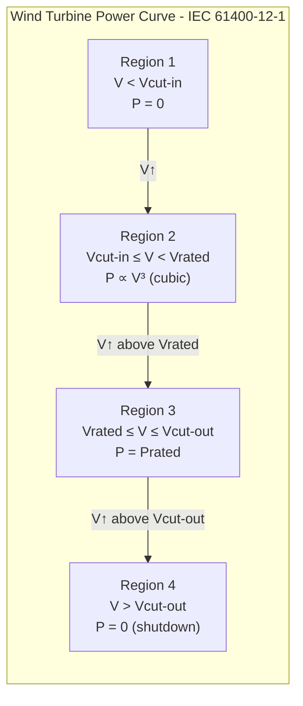

# MODULE 1: Mô hình hóa nguồn năng lượng

**Thuộc đề tài:** Real-Time Control of a PV–Wind–Battery Microgrid with Demand Response
**Tài liệu tham khảo chính:**
- Sandia PV Performance Modeling Collaborative (PVPMC) — Single Diode Equivalent Circuit [1]
- PVsyst Documentation — Standard One-Diode Model [2]
- IEC 61400-12-1:2022 — Wind Turbine Power Performance Testing [3]
- MDPI Energies (2023) — Wind Turbine Power Curve Modeling Review [4]
- Limouni et al. (2025) — MPC and LSTM-TCN for Standalone DC Microgrid [5]
- Panda et al. (2025) — Optimization-Based Energy Management for PV-Battery Systems [6]
- MDPI Batteries (2024) — Review on Battery SOC/SOH Estimation [7]

---

## Mục lục

1. [Mô hình PV (Photovoltaic)](#1-mô-hình-pv)
2. [Mô hình Wind Turbine](#2-mô-hình-wind-turbine)
3. [Mô hình Battery (BESS)](#3-mô-hình-battery)
4. [Cân bằng công suất (Power Balance)](#4-cân-bằng-công-suất)
5. [Bảng tổng kết thông số](#5-bảng-tổng-kết-thông-số)

---

## 1. Mô hình PV (Photovoltaic)

### 1.1 Mô hình một diode 5 tham số (Single-Diode 5-Parameter Model)

Đây là mô hình được sử dụng phổ biến nhất trong các công cụ mô phỏng PV như PVsyst, Sandia, và pvlib-python. Mô hình này dựa trên mạch tương đương một diode của Shockley [1][2].

**Mạch tương đương một diode:**

```
         Rs
    ┌──/\/\/\───┐
    │           │
   ┌┴┐          │
  ╔═╧═╗         │
  ║ Iph║        │
  ╚═╤═╝         │
   ┌┴┐   ┌─[Diode]─┐  │
   │ │   │         │  │
   │ │   │  Id     │  │
   │Rsh│  │        │  │
   │ │   └─────────┘  │
   └─┘                │
    │                 │
    └────────┬────────┘
             │
          (V, I)
```

**Phương trình đặc tính I-V (theo Kirchoff's current law) [1]:**

$$I = I_{ph} - I_0 \left[ \exp\left( \frac{V + I \cdot R_s}{n \cdot V_T} \right) - 1 \right] - \frac{V + I \cdot R_s}{R_{sh}}$$

**Trong đó:**
- $I$: dòng điện đầu ra module (A)
- $V$: điện áp đầu ra module (V)
- $I_{ph}$: dòng quang điện (photocurrent) (A)
- $I_0$: dòng bão hòa ngược của diode (saturation current) (A)
- $R_s$: điện trở nối tiếp (series resistance) (Ω)
- $R_{sh}$: điện trở shunt (shunt resistance) (Ω)
- $n$: hệ số lý tưởng của diode (diode ideality factor, 1 ≤ n ≤ 2) [1]
- $V_T$: điện áp nhiệt (thermal voltage) (V)

**Điện áp nhiệt:**

$$V_T = \frac{k \cdot T_c}{q}$$

**Trong đó:**
- $k = 1.381 \times 10^{-23}$ J/K: hằng số Boltzmann
- $q = 1.602 \times 10^{-19}$ C: điện tích electron
- $T_c$: nhiệt độ tế bào (K)

> **Nguồn tham khảo:** Công thức trên được xác nhận từ Sandia PV Performance Modeling Collaborative [1] và PVsyst documentation [2]. Đây là mô hình chuẩn cho mô phỏng PV trong các công cụ chuyên nghiệp.

### 1.2 Mô hình PV rút gọn cho bài toán tối ưu (Simplified Model)

Trong bài toán điều khiển và tối ưu hóa, mô hình 5 tham số quá phức tạp và tốn thời gian tính toán. Do đó, sử dụng mô hình rút gọn [5][6]:

$$P_{PV}(t) = \eta_{PV} \times A \times G(t)$$

**Trong đó:**
- $P_{PV}(t)$: công suất PV tại thời điểm t (W)
- $\eta_{PV}$: hiệu suất module PV (bao gồm tổn hao nhiệt độ, bụi, etc.)
- $A$: tổng diện tích bề mặt tấm pin (m²)
- $G(t)$: cường độ bức xạ mặt trời tại thời điểm t (W/m²)

### 1.3 Ảnh hưởng của nhiệt độ đến các tham số (De Soto Model)

Khi cần độ chính xác cao hơn, các tham số phụ thuộc vào nhiệt độ và bức xạ được tính như sau [1]:

**Dòng quang điện (photocurrent):**

$$I_{ph} = \frac{G}{G_{ref}} \cdot \left[ I_{ph,ref} + \mu_{I_{SC}} (T_c - T_{c,ref}) \right]$$

**Trong đó:**
- $G_{ref} = 1000$ W/m²: bức xạ chuẩn (STC)
- $T_{c,ref} = 25$ °C: nhiệt độ chuẩn
- $\mu_{I_{SC}}$: hệ số nhiệt của dòng ngắn mạch (A/K)

**Dòng bão hòa (saturation current):**

$$I_0 = I_{0,ref} \cdot \left( \frac{T_c}{T_{c,ref}} \right)^3 \exp\left[ \frac{q \cdot E_{gap}}{n \cdot k} \left( \frac{1}{T_{c,ref}} - \frac{1}{T_c} \right) \right]$$

**Trong đó:**
- $E_{gap}$: năng lượng vùng cấm của silicon (eV)
- $I_{0,ref}$: dòng bão hòa tại điều kiện chuẩn

### 1.4 Thông số PV (từ Limouni et al. 2025 [5])

Module PV sử dụng: **ASW-250P**

| Tham số | Ký hiệu | Giá trị | Đơn vị |
|---------|---------|---------|--------|
| Công suất cực đại | $P_{max}$ | 250 | W |
| Số tế bào mỗi module | $N_{cs}$ | 72 | — |
| Điện áp hở mạch | $V_{oc}$ | 43.22 | V |
| Dòng ngắn mạch | $I_{sc}$ | 7.76 | A |
| Điện áp tại MPP | $V_{mp}$ | 35.2 | V |
| Dòng tại MPP | $I_{mp}$ | 7.1 | A |
| Hệ số nhiệt Voc | $\mu_{V_{OC}}$ | -0.30278 | %/°C |
| Hệ số nhiệt Isc | $\mu_{I_{SC}}$ | 0.035271 | %/°C |
| Số module cho hệ thống 20 kWp | — | 80 | module |

> **Ghi chú:** Các thông số này được trích từ nghiên cứu của Limouni et al. (2025) [5] và phù hợp với thông số nhà sản xuất tấm pin ASW-250P.

---

## 2. Mô hình Wind Turbine

### 2.1 Công suất gió lý thuyết (Theoretical Wind Power)

Công suất có sẵn trong gió được xác định bởi động năng của luồng không khí đi qua rotor [3][4]:

$$P_{wind\_available} = \frac{1}{2} \rho A_{rotor} V^3$$

**Trong đó:**
- $\rho$: mật độ không khí (kg/m³, ≈ 1.225 kg/m³ ở 15°C, mực nước biển)
- $A_{rotor}$: diện tích quét của rotor (m²): $A_{rotor} = \pi \cdot R^2$
- $V$: tốc độ gió tại độ cao hub (m/s)

### 2.2 Giới hạn Betz (Betz Limit)

Theo lý thuyết Betz, tỷ lệ công suất tối đa mà turbine gió có thể trích xuất từ luồng gió là 16/27 ≈ **59.3%**. Hệ số này được gọi là hệ số công suất $C_p$ [4].

$$P_{WT\_max} = \frac{1}{2} \rho A_{rotor} V^3 \times C_{p,max} \quad \text{với} \quad C_{p,max} = \frac{16}{27} \approx 0.593$$

Trong thực tế, $C_p$ của turbine gió thương mại thường đạt 0.35–0.50 do tổn hao khí động học, cơ khí và điện [4].

### 2.3 Đường cong công suất IEC 61400-12-1 (Power Curve)

Theo tiêu chuẩn IEC 61400-12-1 [3], đường cong công suất của turbine gió được định nghĩa bởi mối quan hệ giữa tốc độ gió tại độ cao hub và công suất điện đầu ra. Đường cong này có 4 vùng hoạt động (regions) [3][4]:



**Phương trình toán học [3][4]:**

$$P_{WT}(t) = \begin{cases} 
0 & V_{hub}(t) < V_{cut-in} \\[6pt]
\displaystyle \frac{1}{2} \rho A_{rotor} V_{hub}^3(t) \cdot C_p(\lambda, \beta) & V_{cut-in} \leq V_{hub}(t) < V_{rated} \\[10pt]
P_{rated} & V_{rated} \leq V_{hub}(t) \leq V_{cut-out} \\[6pt]
0 & V_{hub}(t) > V_{cut-out}
\end{cases}$$

**Trong đó:**
- $V_{cut-in}$: tốc độ gió khởi động (cut-in wind speed) — turbine bắt đầu phát điện, thường 3–4 m/s
- $V_{rated}$: tốc độ gió định mức (rated wind speed) — turbine đạt công suất định mức, thường 12–17 m/s [3][4]
- $V_{cut-out}$: tốc độ gió cắt (cut-out wind speed) — turbine dừng để bảo vệ, thường 20–30 m/s
- $P_{rated}$: công suất định mức (W)
- $C_p(\lambda, \beta)$: hệ số công suất, phụ thuộc vào tỷ số tốc độ đầu mút (tip-speed ratio) $\lambda$ và góc pitch $\beta$

> **Nguồn tham khảo:** Cấu trúc 4 vùng và phương trình trên được xác nhận từ tiêu chuẩn IEC 61400-12-1:2022 [3] và bài tổng quan trên MDPI Energies (2023) [4].

### 2.4 Mô hình wind speed tại độ cao hub

Vận tốc gió tại độ cao hub được tính từ vận tốc gió đo tại độ cao tham chiếu theo công thức logarit hoặc lũy thừa [4]:

**Công thức lũy thừa (power law — tham khảo từ Algorithms and Theories Overview.md):**

$$V_{hub}(t) = V_{ref}(t) \cdot \left(\frac{H_{hub}}{H_{ref}}\right)^\alpha$$

**Trong đó:**
- $H_{hub}$: độ cao hub (m)
- $H_{ref}$: độ cao tham chiếu (m, thường 10 m)
- $\alpha$: hệ số nhám bề mặt (surface roughness coefficient):
  - Mặt nước, cát: 0.10–0.12
  - Đất trống, cỏ thấp: 0.14–0.16
  - Đất nông nghiệp: 0.18–0.20
  - Rừng, đô thị: 0.25–0.30

### 2.5 Mô hình Wind Turbine rút gọn cho bài toán tối ưu

Trong bài toán MPC, cần mô hình đơn giản hóa để giảm chi phí tính toán. Sử dụng mô hình cubic rút gọn:

$$P_{WT}(t) \approx \begin{cases}
0 & V_{hub}(t) < V_{cut-in} \\[6pt]
P_{rated} \cdot \left( \frac{V_{hub}(t) - V_{cut-in}}{V_{rated} - V_{cut-in}} \right)^3 & V_{cut-in} \leq V_{hub}(t) < V_{rated} \\[10pt]
P_{rated} & V_{rated} \leq V_{hub}(t) \leq V_{cut-out} \\[6pt]
0 & V_{hub}(t) > V_{cut-out}
\end{cases}$$

**Trong đó:** Mô hình cubic (bậc 3) là một trong những mô hình tham số phổ biến nhất cho vùng 2 của đường cong công suất, được xác nhận bởi nhiều nghiên cứu [4]. Các lựa chọn khác gồm linear, quadratic, và logistic function.

### 2.6 Thông số Wind Turbine (đề xuất cho đề tài)

| Tham số | Ký hiệu | Giá trị | Đơn vị | Ghi chú |
|---------|---------|---------|--------|---------|
| Công suất định mức | $P_{rated}$ | 10 | kW | Phù hợp quy mô microgrid |
| Tốc độ gió khởi động | $V_{cut-in}$ | 3 | m/s | Giá trị điển hình [3][4] |
| Tốc độ gió định mức | $V_{rated}$ | 12 | m/s | Khoảng 12–17 m/s [3][4] |
| Tốc độ gió cắt | $V_{cut-out}$ | 25 | m/s | Khoảng 20–30 m/s [3][4] |
| Đường kính rotor | $D$ | 7 | m | |
| Diện tích quét | $A_{rotor}$ | ~38.5 | m² | $A = \pi D^2/4$ |
| Độ cao hub | $H_{hub}$ | 30 | m | |
| Hệ số nhám | $\alpha$ | 0.14 | — | Đất trống |
| Hệ số công suất max | $C_{p,max}$ | 0.45 | — | < Betz limit 0.593 [4] |

> **Nguồn tham khảo:** Khoảng giá trị Vcut-in, Vrated, Vcut-out được xác nhận từ IEC 61400-12-1 [3] và bài tổng quan MDPI Energies (2023) [4]. $C_{p,max} = 0.45$ nằm trong khoảng điển hình 0.35–0.50 cho turbine gió thương mại.

---

## 3. Mô hình Battery (BESS)

### 3.1 Phương pháp Coulomb Counting (Đếm Coulomb)

Đây là phương pháp ước lượng SOC cơ bản và phổ biến nhất trong các hệ thống BMS (Battery Management System) [7][8]. Nguyên lý dựa trên định luật bảo toàn điện tích.

**Công thức liên tục [7][8]:**

$$SoC(t) = SoC(t_0) + \frac{1}{C_{rated}} \int_{t_0}^{t} \eta \cdot i(\tau) \, d\tau$$

**Trong đó:**
- $SoC(t)$: State of Charge tại thời điểm t (%)
- $SoC(t_0)$: SOC ban đầu (%)
- $C_{rated}$: dung lượng định mức (Ah hoặc kWh)
- $\eta$: hiệu suất Coulomb (Coulomb efficiency)
- $i(\tau)$: dòng điện tại thời điểm $\tau$ (A, dương: xả, âm: sạc)

**Công thức rời rạc (sử dụng trong MPC) [5][6]:**

$$SoC(k+1) = SoC(k) + \frac{\eta_{ch} \cdot P_{ch}(k) \cdot \Delta t}{E_{bat}} - \frac{P_{dch}(k) \cdot \Delta t}{\eta_{dch} \cdot E_{bat}}$$

**Trong đó:**
- $SoC(k)$: SOC tại bước thời gian thứ k
- $P_{ch}(k)$: công suất sạc tại bước k (kW) — luôn dương khi sạc
- $P_{dch}(k)$: công suất xả tại bước k (kW) — luôn dương khi xả
- $\eta_{ch}$, $\eta_{dch}$: hiệu suất sạc và xả
- $E_{bat}$: tổng dung lượng pin (kWh)
- $\Delta t$: bước thời gian

### 3.2 Ràng buộc vận hành Battery (Operational Constraints)

**Giới hạn SOC:**

$$SoC_{min} \leq SoC(k) \leq SoC_{max}$$

**Trong đó:** Điển hình $SoC_{min} = 20\%$, $SoC_{max} = 90\%$ để bảo vệ tuổi thọ pin [6].

**Giới hạn công suất sạc/xả:**

$$0 \leq P_{ch}(k) \leq P_{ch,max}$$
$$0 \leq P_{dch}(k) \leq P_{dch,max}$$

**Ràng buộc loại trừ (Mutual Exclusivity):**

Không thể sạc và xả đồng thời:

$$P_{ch}(k) \cdot P_{dch}(k) = 0$$

Hoặc sử dụng biến binary trong MILP:

$$0 \leq P_{ch}(k) \leq P_{ch,max} \cdot u(k)$$
$$0 \leq P_{dch}(k) \leq P_{dch,max} \cdot (1 - u(k))$$

Với $u(k) \in \{0, 1\}$ cho biết trạng thái sạc (1) hoặc xả (0).

**Ràng buộc cyclic (nếu cần cho bài toán 24h):**

$$SoC(T) = SoC(0)$$

Ràng buộc này đảm bảo battery quay về trạng thái SOC ban đầu sau một chu kỳ vận hành.

### 3.3 Công suất battery trong power balance

Quy ước dấu cho $P_{bat}(t)$ trong phương trình cân bằng công suất:

$$P_{bat}(t) = P_{dch}(t) - P_{ch}(t)$$

**Trong đó:**
- $P_{bat}(t) > 0$: battery đang xả (cung cấp năng lượng cho hệ thống)
- $P_{bat}(t) < 0$: battery đang sạc (nhận năng lượng từ hệ thống)

Với ràng buộc: $P_{ch}(t) \geq 0$, $P_{dch}(t) \geq 0$, và $P_{ch}(t) \cdot P_{dch}(t) = 0$.

### 3.4 Thông số Battery

| Tham số | Ký hiệu | Giá trị | Đơn vị | Nguồn |
|---------|---------|---------|--------|-------|
| Dung lượng định mức | $E_{bat}$ | 50 | kWh | [6] |
| Điện áp nominal | $V_{nom}$ | 120 | V | [5] |
| SOC tối thiểu | $SoC_{min}$ | 20 | % | [6] |
| SOC tối đa | $SoC_{max}$ | 90 | % | [6] |
| Hiệu suất sạc | $\eta_{ch}$ | 0.95 | — | [5][6] |
| Hiệu suất xả | $\eta_{dch}$ | 0.95 | — | [5][6] |
| Công suất sạc max | $P_{ch,max}$ | 25 | kW | — |
| Công suất xả max | $P_{dch,max}$ | 25 | kW | — |

> **Ghi chú:** Hiệu suất Coulomb của Lithium-Ion ≈ 99%, nhưng hiệu suất năng lượng (energy efficiency) ≈ 95% [7]. Bài toán sử dụng $\eta_{ch} = \eta_{dch} = 0.95$ phù hợp với hiệu suất năng lượng.

---

## 4. Cân bằng công suất (Power Balance)

### 4.1 Nguyên lý cơ bản — không có DR

**Trường hợp standalone (từ [5] Limouni — không có lưới, không DR):**

Trong bài báo [5] (standalone DC microgrid), cân bằng công suất tại DC bus là:

$$P_{PV}(t) + P_{bat}(t) + P_{SC}(t) = P_{load}(t) \tag{1}$$

**Trường hợp grid-connected (từ [6] Panda — có lưới, không DR):**

Trong bài báo [6] (grid-connected PV-battery), cân bằng công suất là:

$$P_{PV}(t) + P_{bat}(t) + P_{grid}(t) = P_{load}(t) \tag{2}$$

Với quy ước dấu: $P_{grid}(t) > 0$ là **mua điện từ lưới**, $P_{grid}(t) < 0$ là **bán điện lên lưới**.

> **Quan trọng:** Cả [5] và [6] đều **không đưa DR vào phương trình cân bằng công suất**. Trong [6], DR được thực hiện thông qua TOU pricing trong *hàm mục tiêu* (objective function), không phải trong power balance.

### 4.2 Mở rộng cho đề tài (PV + Wind + Battery + Grid + DR)

#### Bước 1 — Power balance vật lý (các dòng công suất thực tế)

Tại bus AC, tổng công suất phát bằng tổng công suất tiêu thụ:

$$P_{PV}(t) + P_{WT}(t) + P_{bat}(t) + P_{grid}(t) = P_{load}^{base}(t) \tag{3}$$

**Trong đó:**
- $P_{PV}(t) \geq 0$: công suất PV
- $P_{WT}(t) \geq 0$: công suất wind turbine
- $P_{bat}(t)$: công suất battery (> 0: xả, < 0: sạc)
- $P_{grid}(t)$: công suất trao đổi với lưới (> 0: mua, < 0: bán)
- $P_{load}^{base}(t) \geq 0$: nhu cầu tải gốc (trước DR)

#### Bước 2 — DR thay đổi tải, không thay đổi power balance

DR là cơ chế **điều chỉnh phía tải** (load-side management), không phải nguồn phát. Khi DR được kích hoạt:

$$P_{load}^{DR}(t) = P_{load}^{base}(t) - \Delta P_{DR}(t) \tag{4}$$

Với:
- $\Delta P_{DR}(t)$: lượng DR thực hiện tại thời điểm t
- $\Delta P_{DR}(t) > 0$: cắt giảm tải (Peak Clipping)
- $\Delta P_{DR}(t) < 0$: tăng tải (Valley Filling)
- $\Delta P_{DR}(t) = 0$: không có DR

#### Bước 3 — Power balance với DR

$$P_{PV}(t) + P_{WT}(t) + P_{bat}(t) + P_{grid}(t) = P_{load}^{base}(t) - \Delta P_{DR}(t) \tag{5}$$

**Giải thích trực quan:**
- **Peak Clipping** ($\Delta P_{DR} > 0$): Vế phải giảm → giảm nhu cầu phát từ nguồn/lưới
- **Valley Filling** ($\Delta P_{DR} < 0$): Vế phải tăng → tăng nhu cầu phát (BESS sạc thêm)

#### Xác nhận từ literature

Công thức (5) phù hợp với các nghiên cứu đã được xác nhận:

| Nguồn | Công thức | Ghi chú |
|-------|----------|---------|
| MILP framework [arXiv:2502.08764] | $P_{grid} + P_{solar} + (P_{dis}-P_{ch}) = P_{load} - P_{red} - P_{shift}$ | DR reduction và shifting ở vế phải |
| MPC + DR [Sci. Reports 2025] | $P_{batt} + P_{grid} + P_{gen} - P_{load} = 0$ với $P_{load}$ là manipulated variable | Load được điều chỉnh bởi MPC |
| VPP dispatch [Frontiers 2020] | $\sum P_{VPP} = \sum P_{load}^{DR}$ | DR làm thay đổi profile tải |

### 4.3 Ràng buộc DR

**Giới hạn DR:**
$$0 \leq \Delta P_{DR}(t) \leq \alpha_{PC} \cdot P_{load}^{base}(t) \quad \text{(Peak Clipping - cắt tải)}$$
$$-\alpha_{VF} \cdot P_{load}^{base}(t) \leq \Delta P_{DR}(t) \leq 0 \quad \text{(Valley Filling - thêm tải)}$$

Với $\alpha_{PC}$, $\alpha_{VF}$ là tỷ lệ DR tối đa (thường 10–20% tải).

**Tổng DR trong ngày (ràng buộc năng lượng):**
$$\sum_{t=1}^{T} \Delta P_{DR}(t) \cdot \Delta t \approx 0$$

Ràng buộc này đảm bảo tổng năng lượng cắt giảm trong ngày cân bằng (nếu cắt giảm ở peak thì phải tăng ở valley — chỉ chuyển dịch chứ không mất tải).

### 4.4 Ràng buộc lưới điện (Grid Constraints)

**Giới hạn công suất mua/bán:**

$$-P_{grid,export} \leq P_{grid}(t) \leq P_{grid,import}$$

**Trong đó:**
- $P_{grid,import}$: công suất mua tối đa từ lưới (kW)
- $P_{grid,export}$: công suất bán tối đa lên lưới (kW)

### 4.5 Ràng buộc Inverter

$$-P_{inv,max} \leq P_{inv}(t) \leq P_{inv,max}$$

$P_{inv}(t)$ là tổng công suất qua inverter từ tất cả các nguồn DC.

### 4.6 Tổng kết — DR không phải nguồn phát

```
┌──────────────────────────────────────────────────────────────┐
│                       QUAN TRỌNG                             │
│                                                              │
│  DR không phải nguồn năng lượng (generation source).          │
│  DR là cơ chế điều chỉnh phụ tải (load management).          │
│                                                              │
│  Công thức SAI:  P_PV + P_WT + P_bat + P_grid + P_DR = Load │
│  Công thức ĐÚNG: P_PV + P_WT + P_bat + P_grid = Load - ΔP_DR│
│                                                              │
│  DR xuất hiện ở vế phải (phía tải), không phải vế trái       │
│  (phía nguồn) của phương trình cân bằng.                     │
└──────────────────────────────────────────────────────────────┘
```

---

## 5. Bảng tổng kết thông số hệ thống

| Thành phần | Tham số | Giá trị | Đơn vị |
|-----------|---------|---------|--------|
| **PV System** | Công suất lắp đặt | 20 | kWp |
| | Số module (ASW-250P) | 80 | module |
| | Diện tích (ước lượng) | ~130 | m² |
| **Wind Turbine** | Công suất định mức | 10 | kW |
| | Vcut-in / Vrated / Vcut-out | 3 / 12 / 25 | m/s |
| | Đường kính rotor | 7 | m |
| | Cp max | 0.45 | — |
| **Battery** | Dung lượng | 50 | kWh |
| | SoC min / max | 20 / 90 | % |
| | Hiệu suất sạc/xả | 0.95 / 0.95 | — |
| **Inverter** | Công suất định mức | 30 | kVA |
| **Grid** | Công suất mua/bán max | 25 / 25 | kW |
| **Load** | Công suất đỉnh | 18 | kW |

---

## Tài liệu tham khảo

[1] Sandia National Laboratories. (2024). *Single Diode Equivalent Circuit Models*. PV Performance Modeling Collaborative (PVPMC). https://pvpmc.sandia.gov/modeling-guide/2-dc-module-iv/single-diode-equivalent-circuit-models/

[2] PVsyst SA. (2024). *PV Module - Standard One-Diode Model*. PVsyst Documentation. https://www.pvsyst.com/help/physical-models-used/pv-module-standard-one-diode-model/index.html

[3] International Electrotechnical Commission. (2022). *IEC 61400-12-1:2022 - Wind Energy Generation Systems - Part 12-1: Power Performance Measurements of Electricity Producing Wind Turbines* (Edition 3.0). IEC Webstore. https://webstore.iec.ch/publication/68499

[4] Villanueva, D., & Feijóo, A. (2023). Applications and Modeling Techniques of Wind Turbine Power Curve for Wind Farms—A Review. *Energies*, 16(1), 180. https://doi.org/10.3390/en16010180

[5] Limouni, T., Yaagoubi, R., Bouziane, K., Guissi, K., & Baali, E. H. (2025). Intelligent real time control strategy and power management based on MPC and LSTM-TCN model for standalone DC microgrid with energy storage. *International Journal of Electrical Power and Energy Systems*, 169, 110761.

[6] Panda, S., Rout, P. K., Sahu, B. K., Mbasso, W. F., Jangir, P., & Elrashidi, A. (2025). Optimization‐Based Energy Management for Grid‐Connected Photovoltaic–Battery Systems in Smart Grids Using Demand Response and Particle Swarm Optimization. *Engineering Reports*, 7(7), e70305.

[7] Mocera, F., & Somà, A. (2024). Review on Modeling and SOC/SOH Estimation of Batteries for Automotive Applications. *Batteries*, 10(1), 34. https://doi.org/10.3390/batteries10010034

[8] Pattipati, K., et al. (2021). A Critical Look at Coulomb Counting Approach for State of Charge Estimation in Batteries. *Energies*, 14(14), 4074. https://doi.org/10.3390/en14144074

[9] Saint-Drenan, Y.-M., Besseau, R., Jansen, M., Staffell, I., Troccoli, A., Dubus, L., Schmidt, J., Gruber, K., Simões, S. G., & Heier, S. (2020). A parametric model for wind turbine power curves incorporating environmental conditions. *Renewable Energy*, 157, 754–768.

[10] Demand Response Optimization MILP Framework for Microgrids with DERs. (2025). *arXiv:2502.08764*. https://arxiv.org/html/2502.08764v1
— Power balance: $P_{grid} + P_{solar} + (P_{dis} - P_{ch}) = P_{load} - P_{red} - P_{shift}$

[11] Nassereddine, K., Turzynski, M., Bielokha, H. et al. (2025). Simulation of energy management system using model predictive control in AC/DC microgrid. *Scientific Reports*, 15, 5388. https://doi.org/10.1038/s41598-025-89036-7
— MPC với DR: Pload là manipulated variable, DR thay đổi profile tải.
