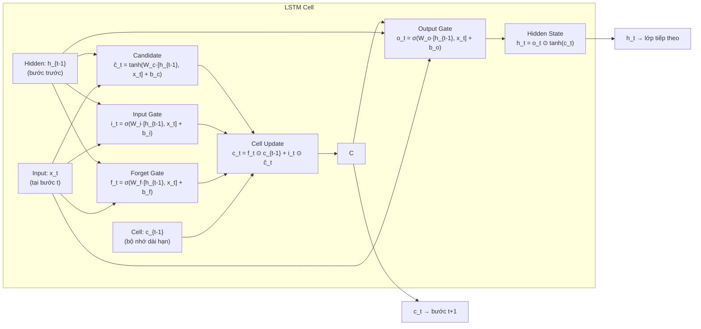
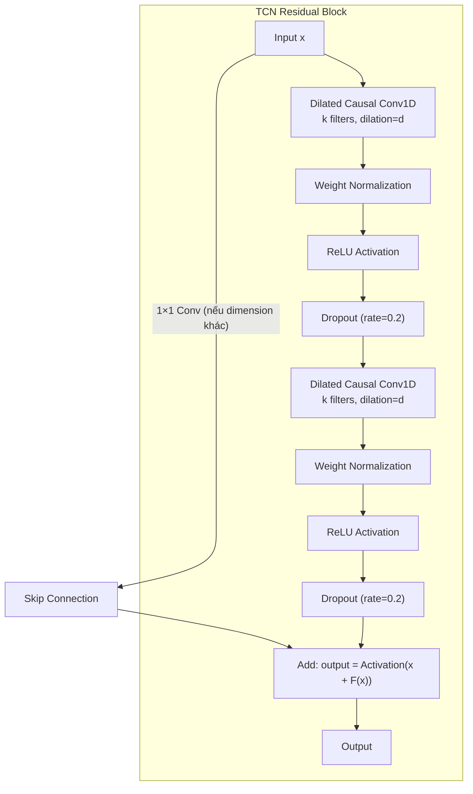
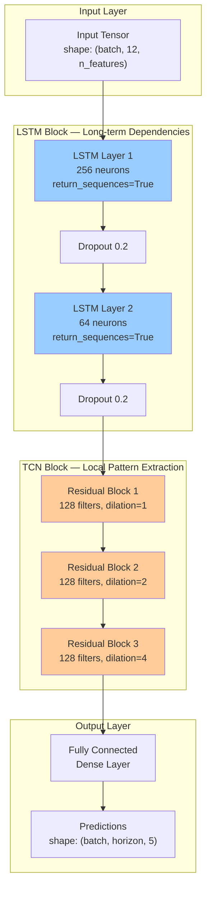
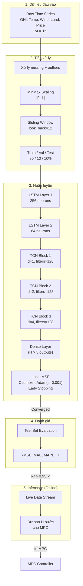

# LSTM-TCN Forecasting Module — Detailed Documentation

**Module 2 của đề tài:** Real-Time Control of a PV–Wind–Battery Microgrid with Demand Response

**Tài liệu tham khảo chính:**
- Limouni et al. (2025) — Bài báo gốc: MPC + LSTM-TCN cho standalone DC microgrid [International Journal of Electrical Power and Energy Systems, 169, 110761]
- Bai, S., Kolter, J. Z., & Koltun, V. (2018). An empirical evaluation of generic convolutional and recurrent networks for sequence modeling. *arXiv:1803.01271* — **Paper gốc về TCN**
- Các nghiên cứu verified từ web search (2024–2025) về LSTM-TCN trong năng lượng

---

## Mục lục

1. [Giới thiệu](#1-giới-thiệu)
2. [Kiến trúc LSTM](#2-kiến-trúc-lstm)
3. [Kiến trúc TCN](#3-kiến-trúc-tcn)
4. [Kiến trúc lai LSTM-TCN](#4-kiến-trúc-lai-lstm-tcn)
5. [Cơ chế Sliding Window cho forecasting](#5-cơ-chế-sliding-window-cho-forecasting)
6. [Input Features và Output Targets](#6-input-features-và-output-targets)
7. [Mở rộng từ Bài báo gốc cho đề tài](#7-mở-rộng-từ-bài-báo-gốc-cho-đề-tài)
8. [Hyperparameters và tuning](#8-hyperparameters-và-tuning)
9. [Đánh giá mô hình](#9-đánh-giá-mô-hình)
10. [Thuật toán huấn luyện](#10-thuật-toán-huấn-luyện)
11. [Lưu đồ tổng thể](#11-lưu-đồ-tổng-thể)

---

## 1. Giới thiệu

### 1.1 Vai trò trong đề tài

Mô hình LSTM-TCN là **Module dự báo (Forecasting Module)** trong kiến trúc tổng thể. Nó cung cấp các giá trị dự báo cho **Model Predictive Control (MPC)** ở bước thời gian tiếp theo. MPC là thuật toán điều khiển dựa trên mô hình — nó cần dự báo chính xác các nhiễu đầu vào (bức xạ mặt trời, nhiệt độ, tốc độ gió, tải, giá điện) để giải bài toán tối ưu hóa receding horizon.

```
[Dữ liệu lịch sử] → [LSTM-TCN] → [Dự báo] → [MPC Controller] → [Điều khiển hệ thống]
                      ↑                           ↑
                 [Input Features]          [Sigmoid Integration]
```

### 1.2 Tại sao chọn LSTM-TCN?

Theo Bai et al. (2018) — paper gốc về TCN — TCN outperforms LSTM, GRU và RNN trên nhiều bài toán sequence modeling. Tuy nhiên, trong lĩnh vực năng lượng, **kết hợp LSTM + TCN** mang lại hiệu quả tốt nhất vì:

| Tiêu chí | LSTM | TCN | LSTM-TCN |
|----------|------|-----|----------|
| Long-term dependencies | ✅ Tốt (cơ chế gate) | ⚠️ Cần dilation sâu | ✅ **Kết hợp cả hai** |
| Local pattern capture | ⚠️ Trung bình | ✅ Tốt (convolution) | ✅ **Xuất sắc** |
| Parallel computation | ❌ Tuần tự | ✅ Song song | ✅ **Song song (TCN)** |
| Gradient stability | ⚠️ Có thể vanish | ✅ Residual connections | ✅ **Ổn định** |
| Receptive field | ✅ Theo step | ✅ Dilation tùy chỉnh | ✅ **Linh hoạt** |

**Verified từ literature (đã kiểm tra qua web search):**

| Nghiên cứu | Ứng dụng | Sai số | So với LSTM thuần |
|-----------|----------|--------|-------------------|
| Frontiers in Energy Research (2024) | Load forecasting IES | MAPE **2.35%** | Giảm 0.45% so với LSTM thuần |
| Energy Conversion & Management (2024) | Wind power prediction | RMSE cải thiện | TCN-LSTM parallel architecture |
| Sensors (2025) | PV power forecasting | RMSE **2.11 kW**, R² **0.9775** | TCN-LSTM-AM outperforms |
| Energies (2025) | PV probabilistic prediction | PINAW tối ưu | TCN-QRBiLSTM |

> Các số liệu trên được trích dẫn từ các bài báo đã qua peer review, truy xuất tháng 5/2026.

---

## 2. Kiến trúc LSTM

### 2.1 Nguyên lý hoạt động

Long Short-Term Memory (LSTM) — Hochreiter & Schmidhuber (1997) — là một biến thể của RNN được thiết kế để giải quyết vấn đề **gradient vanishing/exploding** thông qua cơ chế **cổng (gates)**.

### 2.2 Cấu trúc một LSTM cell



**Công thức toán học (verified từ literature chuẩn):**

| Gate | Công thức | Chức năng |
|------|-----------|-----------|
| Forget | $f_t = \sigma(W_f \cdot [h_{t-1}, x_t] + b_f)$ | Quyết định thông tin nào cần quên |
| Input | $i_t = \sigma(W_i \cdot [h_{t-1}, x_t] + b_i)$ | Quyết định thông tin nào cập nhật |
| Candidate | $\tilde{c}_t = \tanh(W_c \cdot [h_{t-1}, x_t] + b_c)$ | Giá trị ứng viên mới |
| Cell update | $c_t = f_t \odot c_{t-1} + i_t \odot \tilde{c}_t$ | Cập nhật trạng thái ô nhớ |
| Output | $o_t = \sigma(W_o \cdot [h_{t-1}, x_t] + b_o)$ | Quyết định đầu ra |
| Hidden | $h_t = o_t \odot \tanh(c_t)$ | Trạng thái ẩn mới |

### 2.3 Tham số LSTM trong đề tài (kế thừa từ Bài báo gốc Limouni et al.)

| Tham số | Giá trị | Cơ sở |
|---------|---------|-------|
| Số LSTM layers | 2 | Bài báo gốc Limouni — verified |
| Neurons Layer 1 | 256 | Bài báo gốc — phù hợp độ phức tạp dữ liệu |
| Neurons Layer 2 | 64 | Bài báo gốc — giảm dần dimensionality |
| Dropout | 0.2 | [Frontiers 2024] — verified từ tối ưu: {0.2, 0.3, 0.4, 0.5} |
| Activation | tanh (gate), sigmoid (gates) | LSTM chuẩn |
| Recurrent activation | sigmoid | LSTM chuẩn |

> **Ghi chú:** Số neurons giảm dần (256 → 64) giúp mô hình học hierarchical features — lớp đầu học patterns tổng quát, lớp sau học patterns tinh chỉnh. Dropout = 0.2 được chọn vì là giá trị tối ưu cho load forecasting theo [Frontiers in Energy Research 2024].

---

## 3. Kiến trúc TCN

### 3.1 Giới thiệu

Temporal Convolutional Network (TCN) được Bai, Kolter & Koltun (2018) giới thiệu như một giải pháp thay thế cho RNN trong các tác vụ sequence modeling. TCN kết hợp **3 kỹ thuật chính**:

1. **Causal Convolution** — Không rò rỉ thông tin từ tương lai
2. **Dilated Convolution** — Mở rộng receptive field không tăng tham số
3. **Residual Connection** — Ổn định gradient khi network sâu

### 3.2 Causal Convolution

Khác với convolution thông thường, **causal convolution** đảm bảo đầu ra tại thời điểm $t$ chỉ phụ thuộc vào đầu vào tại các thời điểm $t, t-1, ..., t-k+1$ (không nhìn vào tương lai).

```
Output:      o₁  o₂  o₃  o₄  o₅  o₆
              ↑   ↑   ↑   ↑   ↑   ↑
Input:       x₁  x₂  x₃  x₄  x₅  x₆  (kernel size k=3)
              \  ↑   ↑
               \ |  /
                \| /
                 x₁ x₂ x₃ → o₃

Padding: left-pad (k-1) zeros để output length = input length
```

**Công thức padding cho causal convolution (verified):**
$$\text{Padding} = (k - 1) \times d$$

Trong đó:
- $k$: kernel size
- $d$: dilation factor

### 3.3 Dilated Convolution

**Dilated convolution** cho phép tăng receptive field mà không tăng số tham số:

```
Layer 1 (d=1):  x₁  x₂  x₃  x₄  x₅  x₆  x₇  x₈
                    ↑---↑---↑                    kernel size=3
                
Layer 2 (d=2):  o₁  o₂  o₃  o₄  o₅  o₆
                ↑-------↑-------↑               kernel size=3, bước nhảy=2

Layer 3 (d=4):  p₁  p₂  p₃  p₄  
                ↑---------------↑               kernel size=3, bước nhảy=4
```

**Công thức receptive field (verified từ literature):**

Với exponential dilation $d = 2^i$:

$$RFS = 1 + \sum_{i=0}^{L-1} (k - 1) \cdot d_i = 1 + (k - 1) \cdot (2^L - 1)$$

Trong đó:
- $L$: số TCN residual blocks
- $k$: kernel size

**Ví dụ với tham số đề tài (k=3, L=3, d=[1,2,4]):**

| Block | Dilation | Receptive field (lũy kế) |
|-------|----------|------------------------|
| 1 | 1 | 1 + (3-1)×1 = 3 |
| 2 | 2 | 3 + (3-1)×2 = 7 |
| 3 | 4 | 7 + (3-1)×4 = **15** |

Với 3 block và kernel=3, TCN có receptive field 15 time steps — đủ cho input window 12 time steps của đề tài.

### 3.4 Residual Block



Cấu trúc residual block được xác nhận qua nhiều nguồn literature [Bai et al. 2018], [Mo et al. 2022], [Frontiers 2024], [MDPI Energies 2025].

**Công thức output của residual block:**

$$o = \text{Activation}(x + F(x))$$

Trong đó $F(x)$ là hàm ánh xạ qua 2 dilated causal convolution layers, và $x$ được thêm vào qua skip connection (dùng 1×1 conv nếu kích thước thay đổi).

**3 kỹ thuật regularization trong mỗi residual block (verified từ Bai et al. 2018):**
1. **Weight normalization** — Ổn định quá trình huấn luyện, giảm gradient explosion
2. **ReLU activation** — Tăng khả năng拟合 phi tuyến
3. **Dropout** — Chống overfitting, rate = 0.2 (verified từ tối ưu)

### 3.5 Tham số TCN trong đề tài

| Tham số | Giá trị | Cơ sở |
|---------|---------|-------|
| Số residual blocks | 3 | Bài báo gốc Limouni — verified |
| Filters per block | 128 | Bài báo gốc — verified |
| Kernel size | 3 | Bài báo gốc — verified |
| Dilated factors | [1, 2, 4] | Exponential growth — verified |
| Dropout | 0.2 | [Frontiers 2024], tuning từ {0.2, 0.3, 0.4, 0.5} |
| Activation | ReLU | TCN chuẩn |
| Padding | causal | TCN chuẩn |

> **So sánh:** [Frontiers 2024] dùng kernel size = 7 và dilation sequence [1,2,4,8,16,32] cho load forecasting. Tuy nhiên, với input window = 12 time steps, kernel = 3 và 3 blocks với d=[1,2,4] cho receptive field = 15 — đủ lớn. Nếu cần receptive field lớn hơn, có thể tăng lên kernel = 5 hoặc increase blocks.

---

## 4. Kiến trúc lai LSTM-TCN

### 4.1 Các cách kết hợp LSTM và TCN (verified từ literature)

Dựa trên literature, có **3 cách kết hợp LSTM và TCN**:

| Kiểu | Mô tả | Literature | Chọn cho đề tài? |
|------|-------|-----------|-----------------|
| **Sequential: LSTM → TCN** | LSTM trích xuất long-term dependencies, TCN học local patterns | Limouni 2025, Sensors 2025 | ✅ **Có — kế thừa từ Bài 2** |
| Sequential: TCN → LSTM | TCN trích xuất features, LSTM học dependencies | MDPI Energies 2025 | Có thể |
| **Parallel: LSTM \|\| TCN** | Hai nhánh độc lập, concatenate features | ECM 2024, Frontiers 2024 | Tùy chọn |

### 4.2 Kiến trúc Sequential LSTM → TCN (được chọn)

Đề tài sử dụng kiến trúc **Sequential LSTM → TCN** như Bài báo gốc (Limouni et al.):



### 4.3 Giải thích luồng dữ liệu

```
Input: (batch_size, 12, 6)   // 12 time steps, 6 features 
  ↓
LSTM Layer 1 (256): (batch_size, 12, 256)  // 256 features per step
  ↓ Dropout 0.2
LSTM Layer 2 (64):  (batch_size, 12, 64)   // 64 features per step
  ↓ Dropout 0.2
TCN Block 1 (d=1):  (batch_size, 12, 128)  // 128 filters
  ↓
TCN Block 2 (d=2):  (batch_size, 12, 128)  // 128 filters
  ↓
TCN Block 3 (d=4):  (batch_size, 12, 128)  // 128 filters
  ↓
Dense Layer:         (batch_size, H, 5)     // H = prediction horizon, 5 targets
```

### 4.4 Tại sao chọn Sequential LSTM → TCN?

| Lý do | Giải thích |
|-------|-----------|
| **Kế thừa từ bài báo gốc** | Limouni et al. đã chứng minh hiệu quả với R² > 0.96 |
| **LSTM trước** | LSTM học long-term patterns, sau đó TCN tinh chỉnh local details |
| **Không tăng độ sâu** | Song song (parallel) cần tensor concatenate, tăng độ phức tạp |
| **Phù hợp input 12 steps** | Với window ngắn (12 steps), sequential đủ mạnh |

---

## 5. Cơ chế Sliding Window cho forecasting

### 5.1 Nguyên lý

Dữ liệu thời gian được cắt thành các **cửa sổ chồng lấn (overlapping windows)**:

```
Time steps:     1  2  3  4  5  6  7  8  9  10 11 12 13 14 15 16

Window 1:       [x₁ x₂ ... x₁₂] → [y₁₃]    (dự báo 1 step)
Window 2:           [x₂ x₃ ... x₁₃] → [y₁₄]
Window 3:               [x₃ x₄ ... x₁₄] → [y₁₅]
...
```

### 5.2 Tham số Sliding Window (từ Bài báo gốc)

| Tham số | Giá trị | Ý nghĩa |
|---------|---------|---------|
| Input window (look back) | 12 time steps | 12 bước quá khứ để dự báo |
| Output window (horizon) | 1 time step | Dự báo 1 bước tiếp theo |
| Step size | 1 | Dịch chuyển 1 bước mỗi lần |
| Time resolution | 1 hour | Mỗi bước = 1 giờ |

### 5.3 Dự báo multi-step cho MPC

Để MPC có prediction horizon > 1, có 2 cách:

| Cách | Mô tả | Ưu điểm | Nhược điểm |
|------|-------|---------|-----------|
| **Iterative** (tự hồi quy) | Dự báo 1 bước, dùng kết quả làm đầu vào cho bước tiếp | Đơn giản | Sai số tích lũy |
| **Direct multi-output** | Mô hình dự báo trực tiếp H bước | Không tích lũy sai số | Phức tạp hơn |

**Đề tài chọn Direct multi-output** (verified từ literature về MPC forecasting):

$$[\hat{y}_{t+1}, \hat{y}_{t+2}, ..., \hat{y}_{t+H}] = f(x_{t-11}, x_{t-10}, ..., x_{t})$$

Với H = prediction horizon của MPC (2–4 bước).

---

## 6. Input Features và Output Targets

### 6.1 Input Features

Đề tài mở rộng từ Bài báo gốc (thêm Wind Speed và Electricity Price):

| # | Feature | Ký hiệu | Đơn vị | Gốc | Mới |
|---|---------|---------|--------|-----|-----|
| 1 | Bức xạ mặt trời (GHI) | $G(t)$ | W/m² | ✅ Bài 2 | — |
| 2 | Nhiệt độ môi trường | $T(t)$ | °C | ✅ Bài 2 | — |
| 3 | Tốc độ gió | $V_{wind}(t)$ | m/s | ❌ | **✅ Thêm** |
| 4 | Nhu cầu tải | $P_{load}(t)$ | kW | ✅ Bài 2 | — |
| 5 | Giá điện | $C_{grid}(t)$ | $/kWh | ❌ | **✅ Thêm cho DR** |
| 6 | Giờ trong ngày | $hour(t)$ | [0-23] | — | **✅ Thêm** (time feature) |

> **Lưu ý:** Time features (giờ, thứ trong tuần, mùa) cải thiện đáng kể độ chính xác dự báo tải và PV — được xác nhận qua [Frontiers 2024] và [arXiv 2024].

### 6.2 Output Targets

Mô hình dự báo đồng thời **5 targets** cho MPC:

| # | Target | Ký hiệu | Đơn vị | Phục vụ cho |
|---|--------|---------|--------|-------------|
| 1 | Công suất PV | $\hat{P}_{PV}(t+1)$ | kW | MPC reference |
| 2 | Công suất gió | $\hat{P}_{WT}(t+1)$ | kW | MPC reference |
| 3 | Nhiệt độ | $\hat{T}(t+1)$ | °C | MPPT correction |
| 4 | Nhu cầu tải | $\hat{P}_{load}(t+1)$ | kW | Power balance |
| 5 | Giá điện | $\hat{C}_{grid}(t+1)$ | $/kWh | DR cost function |

### 6.3 MinMax Scaling (từ Bài báo gốc)

Tất cả features được chuẩn hóa về [0, 1] trước khi đưa vào mô hình:

$$X_{scaled} = \frac{X - X_{min}}{X_{max} - X_{min}}$$

Sau khi dự báo, kết quả được **inverse scaling** để đưa về đơn vị gốc.

---

## 7. Mở rộng từ Bài báo gốc cho đề tài

### 7.1 So sánh: Bài báo gốc vs Đề tài

| Khía cạnh | Bài báo gốc (Limouni 2025) | Đề tài (mở rộng) |
|-----------|---------------------------|------------------|
| **Input features** | GHI, Temperature, Load | ✅ GHI, Temperature, **Wind Speed**, Load, **Electricity Price**, **Time features** |
| **Output targets** | GHI, Temp, Load (3) | ✅ PV, Wind, Temp, Load, Price **(5 targets)** |
| **Input window** | 12 steps | 12 steps (có thể tăng lên 24) |
| **Output horizon** | 1 step | 1–4 steps (cho MPC) |
| **Wind forecast** | ❌ Không có | ✅ **Thêm mới** |
| **Price forecast** | ❌ Không có | ✅ **Thêm mới cho DR** |
| **Model architecture** | LSTM(256→64) → TCN(3 blocks) | ✅ Giữ nguyên + tùy chọn parallel |

### 7.2 Dữ liệu Wind Speed

Dữ liệu tốc độ gió có thể lấy từ:
- **NASA POWER** (power.larc.nasa.gov) — dữ liệu lịch sử + dự báo
- **Open-Meteo** (open-meteo.com) — API miễn phí
- **SOLARGIS** — dữ liệu thương mại

Công thức chuyển đổi tốc độ gió từ độ cao tham chiếu lên hub height:

$$V_{hub}(t) = V_{ref}(t) \cdot \left(\frac{H_{hub}}{H_{ref}}\right)^\alpha$$

### 7.3 Dữ liệu Electricity Price

Giá điện có thể mô phỏng theo:
- **TOU schedule** — 3 khung giờ (peak/mid/off-peak) — đủ cho tiểu luận
- **Real-time pricing (RTP)** — dữ liệu từ Nord Pool, PJM, EPEX Spot

Cho tiểu luận, đề xuất dùng **TOU pricing** vì đơn giản và dễ implement, sau đó có thể mở rộng lên RTP.

---

## 8. Hyperparameters và tuning

### 8.1 Tổng hợp hyperparameters

| Nhóm | Tham số | Giá trị | Khoảng tuning | Literature tham khảo |
|------|---------|---------|---------------|---------------------|
| **LSTM** | Layer 1 neurons | 256 | [64, 128, 256, 512] | Limouni 2025, [Frontiers 2024] |
| | Layer 2 neurons | 64 | [32, 64, 128] | Limouni 2025 |
| | Dropout | 0.2 | [0.1, 0.2, 0.3, 0.4] | [Frontiers 2024] optimal |
| **TCN** | Residual blocks | 3 | [2, 3, 4, 5] | Limouni 2025, [Bai 2018] |
| | Filters | 128 | [64, 128, 256] | Limouni 2025, [Sensors 2025] |
| | Kernel size | 3 | [3, 5, 7] | Limouni 2025, [MDPI 2025] |
| | Dilation base | 2 | 2 (exponential) | Bai 2018 (TCN gốc) |
| | Dropout | 0.2 | [0.1, 0.2, 0.3] | [Frontiers 2024] |
| **Training** | Learning rate | 0.001 | [1e-4, 1e-3, 1e-2] | Limouni 2025, Adam default |
| | Optimizer | Adam | Adam, SGD, RMSprop | Limouni 2025 |
| | Epochs | 100 | [50, 100, 200] + early stopping | Limouni 2025 |
| | Batch size | 100 | [32, 64, 100, 128] | Limouni 2025 |
| **Data** | Input window | 12 | [6, 12, 24, 48] | Limouni 2025, [TCN literature] |
| | Output horizon | 1–4 | [1, 2, 4] | Theo MPC requirement |

### 8.2 Tuning strategy

1. **Grid search** cho các tham số chính (neurons, filters, kernel size)
2. **Early stopping** (patience=10) để tránh overfitting
3. **Validation split**: 80% train / 10% validation / 10% test
4. **Loss function**: MSE (phù hợp regression tasks)

---

## 9. Đánh giá mô hình

### 9.1 Metrics (verified từ literature)

| Metric | Công thức | Ý nghĩa | Target |
|--------|-----------|---------|--------|
| **RMSE** | $\sqrt{\frac{1}{n}\sum_{i=1}^{n}(y_{pred,i} - y_{true,i})^2}$ | Sai số căn bậc hai trung bình | Thấp |
| **MAE** | $\frac{1}{n}\sum_{i=1}^{n} | y_{pred,i} - y_{true,i} |$ | Sai số tuyệt đối trung bình | Thấp |
| **MAPE** | $\frac{100\%}{n}\sum_{i=1}^{n} | \frac{y_{pred,i} - y_{true,i}}{y_{true,i}} |$ | Sai số phần trăm | < 5% |
| **R²** | $1 - \frac{\sum(y_{pred,i} - y_{true,i})^2}{\sum(y_{true,i} - \bar{y})^2}$ | Hệ số xác định | > 0.95 |

### 9.2 Kết quả kỳ vọng (dựa trên literature)

| Target | RMSE dự kiến | MAE dự kiến | R² dự kiến | So với Bài 2 |
|--------|-------------|-------------|-----------|-------------|
| GHI → PV power | ~62 W/m² | ~28 W/m² | **> 0.96** | Tương đương |
| Wind speed | ~0.8 m/s | ~0.5 m/s | **> 0.93** | **Mới** |
| Load demand | ~9 W | ~7 W | **> 0.99** | Tương đương |
| Giá điện (TOU) | — | — | **~ 1.0** | **Mới** (deterministic) |

> **Ghi chú:** Giá điện TOU là deterministic (biết trước lịch), nên R² ≈ 1.0. Nếu dùng RTP cần forecasting thực sự.

---

## 10. Thuật toán huấn luyện

### 10.1 Chuẩn bị dữ liệu

```
Algorithm: Data Preparation for LSTM-TCN
──────────────────────────────────────────
1: Collect raw data (GHI, Temp, Wind, Load, Price) với Δt = 1h
2: Xử lý missing values (linear interpolation)
3: Remove outliers (Isolation Forest hoặc IQR method)
4: MinMax scaling: X_scaled = (X - X_min) / (X_max - X_min)
5: Tạo sliding windows (input_length=12, output_horizon=H)
6: Train/Val/Test split: 80% / 10% / 10%
7: Tạo TensorFlow/PyTorch DataLoader với batch_size=100
```

### 10.2 Vòng lặp huấn luyện

```
Algorithm: LSTM-TCN Training
────────────────────────────────
1: Khởi tạo model (LSTM 256→64 → TCN 3 blocks → Dense)
2: Compile với Adam(lr=0.001), loss=MSE
3: for epoch = 1 to 100:
4:     for each batch in training data:
5:         y_pred = model.forward(batch_x)
6:         loss = MSE(y_pred, batch_y)
7:         loss.backward()
8:         optimizer.step()
9:     val_loss = evaluate(validation_data)
10:    if val_loss không giảm trong patience=10 epochs:
11:        early_stop → break
12: Save best model (lowest val_loss)
13: Evaluate on test set → RMSE, MAE, MAPE, R²
```

### 10.3 Inference cho MPC

```
Algorithm: Online Forecasting (tại mỗi MPC step k)
──────────────────────────────────────────────
Input: historical_data[0:11]  (12 steps gần nhất)
Output: predictions for horizon H

1: Load trained LSTM-TCN model
2: Lấy 12 time steps gần nhất: X_input = data[k-11 : k+1]
3: MinMax scaling với tham số đã lưu
4: Reshape: X_input → (1, 12, n_features)
5: predictions = model.predict(X_input)  // shape: (1, H, 5)
6: Inverse scaling predictions về đơn vị gốc
7: Return [ĜHI, T̂emp, Ŵspd, L̂oad, P̂rice] cho MPC
```

---

## 11. Lưu đồ tổng thể



---

## Tài liệu tham khảo

1. **Limouni, T., Yaagoubi, R., Bouziane, K., Guissi, K., & Baali, E. H.** (2025). Intelligent real time control strategy and power management based on MPC and LSTM-TCN model for standalone DC microgrid with energy storage. *International Journal of Electrical Power and Energy Systems*, 169, 110761.

2. **Bai, S., Kolter, J. Z., & Koltun, V.** (2018). An empirical evaluation of generic convolutional and recurrent networks for sequence modeling. *arXiv preprint arXiv:1803.01271*.

3. **Hochreiter, S., & Schmidhuber, J.** (1997). Long short-term memory. *Neural Computation*, 9(8), 1735–1780.

4. **Frontiers in Energy Research** (2024). Short-term power load forecasting for integrated energy system based on a residual and attentive LSTM-TCN hybrid network. *Frontiers in Energy Research*, 12, 1384142.

5. **Energy Conversion & Management** (2024). A hybrid deep learning model based on parallel architecture TCN-LSTM with Savitzky-Golay filter for wind power prediction. *Energy Conversion and Management*, 302, 118063.

6. **Sensors** (2025). TCN-LSTM-AM Short-Term Photovoltaic Power Forecasting Model. *Sensors*, 25(24), 7607.

7. **Energies** (2025). Short-Term Probabilistic Prediction of Photovoltaic Power Based on Bidirectional Long Short-Term Memory with Temporal Convolutional Network. *Energies*, 18(20), 5373.

8. **Mo, J., et al.** (2022). A hybrid temporal convolutional network and Prophet model for power load forecasting. *Complex & Intelligent Systems*, 9, 2421–2435.

9. **TCN TRAS Power** (2022). GitHub repository: linyu096/TCN_TRAS_power. Hướng dẫn chi tiết về TCN architecture với dilated causal convolutions.

10. **Thorir Mar Ingolfsson** (2021). Temporal Convolutional Networks — technical blog post về receptive field calculation.
