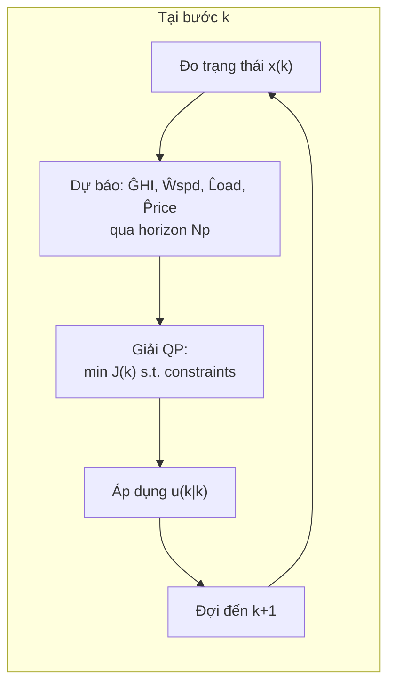
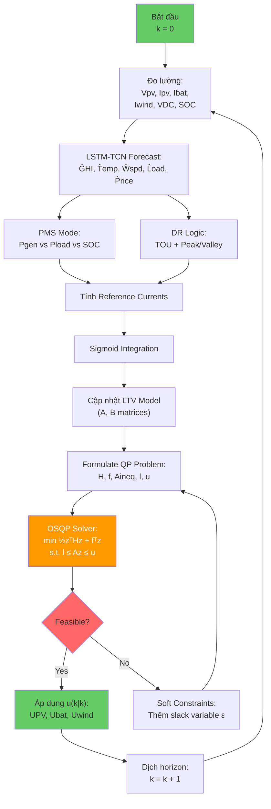

# MODULE 3: Model Predictive Control (MPC) Controller

**Thuộc đề tài:** Real-Time Control of a PV–Wind–Battery Microgrid with Demand Response

**Tài liệu tham khảo chính:**
- Limouni et al. (2025) — MPC and LSTM-TCN for Standalone DC Microgrid [5]
- Shan, Y., Hu, J., Chan, K. W., Fu, Q., & Guerrero, J. M. (2019). Model Predictive Control of Bidirectional DC–DC Converters and AC/DC Interlinking Converters — A New Control Method for PV-Wind-Battery Microgrids. *IEEE Trans. Sustainable Energy*, 10(4), 1823–1833. DOI: 10.1109/TSTE.2018.2873390 [8]
- Singh, G., Tiwari, S., & Jain, A. K. (2025). Model Predictive Control of Bidirectional Converter in a PV-Battery System Under Practical Conditions. *LNEE*, 1260, Springer. [9]
- Rawlings, J. B., Mayne, D. Q., & Diehl, M. (2017). *Model Predictive Control: Theory and Design* (2nd ed.). Nob Hill Publishing. [10]
- Bemporad, A., Morari, M., & Ricker, N. L. (2020). *Model Predictive Control Toolbox User's Guide*. The MathWorks. [11]
- Stellato, B., Banjac, G., Goulart, P., Bemporad, A., & Boyd, S. (2020). OSQP: An Operator Splitting Solver for Quadratic Programs. *Mathematical Programming Computation*, 12(4), 637–672. [12]

---

## Mục lục

1. [Giới thiệu về MPC](#1-giới-thiệu-về-mpc)
2. [Nguyên lý Receding Horizon](#2-nguyên-lý-receding-horizon)
3. [Mô hình hóa bộ biến đổi DC-DC cho MPC](#3-mô-hình-hóa-bộ-biến-đổi-dc-dc-cho-mpc)
4. [Rời rạc hóa mô hình](#4-rời-rạc-hóa-mô-hình)
5. [State-Space Model tổng thể](#5-state-space-model-tổng-thể)
6. [Cost Function](#6-cost-function)
7. [Ràng buộc (Constraints)](#7-ràng-buộc-constraints)
8. [Formulation bài toán QP](#8-formulation-bài-toán-qp)
9. [Tính toán dòng điện tham chiếu](#9-tính-toán-dòng-điện-tham-chiếu)
10. [OSQP Solver và thực thi real-time](#10-osqp-solver-và-thực-thi-real-time)
11. [Thông số MPC cho đề tài](#11-thông-số-mpc-cho-đề-tài)
12. [Thuật toán MPC tổng thể](#12-thuật-toán-mpc-tổng-thể)
13. [So sánh MPC với các phương pháp khác](#13-so-sánh-mpc-với-các-phương-pháp-khác)

---

## 1. Giới thiệu về MPC

### 1.1 Định nghĩa

**Model Predictive Control (MPC)** là một phương pháp điều khiển tiên tiến sử dụng **mô hình toán học của hệ thống** để dự báo hành vi tương lai và tối ưu hóa tín hiệu điều khiển tại mỗi bước thời gian.

Khác với các bộ điều khiển kinh điển (PI, PID) chỉ phản ứng dựa trên sai số hiện tại, MPC chủ động tính toán chuỗi điều khiển tối ưu dựa trên dự báo, cho phép:

1. **Xử lý ràng buộc (constraint handling)** — Một trong những ưu điểm quan trọng nhất: MPC có thể đảm bảo dòng điện, điện áp, SOC nằm trong giới hạn an toàn
2. **Điều khiển đa biến (MIMO)** — Điều khiển đồng thời nhiều biến (dòng PV, dòng battery, dòng wind, điện áp DC bus)
3. **Dự báo trước** — Tận dụng thông tin dự báo từ LSTM-TCN để đưa ra quyết định tối ưu
4. **Bù trễ** — Bù được thời gian trễ do tính toán

### 1.2 Vai trò trong đề tài

Trong đề tài này, MPC đảm nhận vai trò **trung tâm của hệ thống điều khiển**:

```
LSTM-TCN Forecast ──► MPC ──► PWM ──► Converters ──► Microgrid
                          ▲
                          └── Measurements (V, I, SOC)
```

Cụ thể:
- **Đầu vào:** Trạng thái đo lường + Dự báo từ LSTM-TCN + Tín hiệu DR
- **Đầu ra:** Duty cycle cho các bộ biến đổi DC-DC (PV boost, Battery bidirectional, Wind boost)
- **Mục tiêu:** Ổn định điện áp DC bus, cân bằng công suất, tối ưu hóa chi phí

---

## 2. Nguyên lý Receding Horizon

### 2.1 Cơ chế hoạt động



**Cơ chế Receding Horizon** (từ [10][11]):

1. Tại thời điểm $k$, đo trạng thái $x(k)$
2. Dự báo đầu ra tương lai $\hat{y}(k+1), ..., \hat{y}(k+N_p)$ dựa trên mô hình
3. Giải bài toán tối ưu trên cửa sổ dự báo $N_p$ bước
4. Chỉ áp dụng tín hiệu điều khiển đầu tiên $u(k|k)$
5. Dịch horizon: $k \leftarrow k+1$, lặp lại bước 1

**Minh họa receding horizon:**

```mermaid
graph TD
    subgraph Past["Quá khứ"]
        PAST[""]
    end
    
    subgraph Now["Hiện tại k"]
        NOW["●"]
    end
    
    subgraph Future["Tương lai"]
        PRED["Dự báo trong prediction horizon Np"]
        PRED2["Các control actions u(k)...u(k+Nc-1)"]
    end
    
    Past --> Now
    Now --> PRED
    Now --> PRED2
    
    style NOW fill:#ff6600,color:#fff
    style PRED fill:#3399ff,color:#fff
    style PRED2 fill:#66cc66,color:#fff
```

### 2.2 Các thông số quan trọng

| Tham số | Ký hiệu | Vai trò | Giá trị trong đề tài |
|---------|---------|---------|---------------------|
| **Prediction horizon** | $N_p$ | Số bước dự báo trong tương lai | 2–4 (inner), 24 (outer) |
| **Control horizon** | $N_c$ | Số bước điều khiển được tối ưu | 1–2 |
| **Sample time** | $T_s$ | Chu kỳ lấy mẫu | $4 \times 10^{-6}$s (inner) |

**Nguyên tắc chọn $N_p$ và $N_c$** (từ [10]):
- $N_p$ càng lớn → càng optimal nhưng nặng tính toán
- $N_c \leq N_p$; $N_c = 1$ thường đủ cho hệ thống power electronics
- Thông thường: $N_c = 1$, $N_p = 2\text{–}4$ cho inner loop

---

## 3. Mô hình hóa bộ biến đổi DC-DC cho MPC

### 3.1 Boost Converter cho PV (từ [5][8])

**Mạch tương đương boost converter:**

```
          Lpv         D
  Vpv ──╴╴╴╴╴╴╴╴┐───╴╴╴╴╴╴╴╴╴┐─── VDC
                │            │
                └── SW ──────┘
                               │
                              ═══ C
                               │
                              ═══ GND
```

**Phương trình trạng thái liên tục** (từ [5][8]):

Khi $U_{PV} = 0$ (ON → OFF, SW mở):
$$\frac{dI_{L_{PV}}}{dt} = -\frac{r_{L_{PV}}}{L_{PV}} I_{L_{PV}} + \frac{V_{PV}}{L_{PV}} - \frac{V_{DC}}{L_{PV}}$$

Khi $U_{PV} = 1$ (OFF → ON, SW đóng):
$$\frac{dI_{L_{PV}}}{dt} = -\frac{r_{L_{PV}}}{L_{PV}} I_{L_{PV}} + \frac{V_{PV}}{L_{PV}}$$

**Phương trình hợp nhất:**
$$\frac{dI_{L_{PV}}}{dt} = -\frac{r_{L_{PV}}}{L_{PV}} I_{L_{PV}} + \frac{V_{PV}}{L_{PV}} - \frac{V_{DC}}{L_{PV}}(1-U_{PV})$$

### 3.2 Bidirectional DC-DC Converter cho Battery (từ [8][9])

Bidirectional converter có **2 chế độ hoạt động**, được xác định bởi hướng công suất:

#### Buck mode (sạc — P > 0 vào battery):
$$L_{bat} \frac{dI_{L_{bat}}}{dt} = U_{bat} V_{DC} - V_{bat} - r_{L_{bat}} I_{L_{bat}}$$

#### Boost mode (xả — P < 0 từ battery):
$$L_{bat} \frac{dI_{L_{bat}}}{dt} = V_{bat} - (1-U_{bat})V_{DC} - r_{L_{bat}} I_{L_{bat}}$$

**Phương trình hợp nhất** (từ [9]):
$$\frac{dI_{L_{bat}}}{dt} = -\frac{r_{L_{bat}}}{L_{bat}} I_{L_{bat}} + \frac{V_{bat}}{L_{bat}} - \frac{V_{DC}}{L_{bat}}(1-U_{bat}) + \frac{U_{bat} V_{DC}}{L_{bat}}$$

Trong đó:
- $U_{bat} \in [0,1]$: duty cycle của bidirectional converter
- $U_{bat} > 0.5$: hướng sạc (buck); $U_{bat} < 0.5$: hướng xả (boost)

> **Lưu ý:** Trong thực tế, hướng dòng được xác định bởi PMS (Module 5), và MPC chỉ điều chỉnh độ lớn dòng.

### 3.3 Boost Converter cho Wind Turbine (thêm mới)

Tương tự PV boost converter (từ [8], mở rộng):

$$\frac{dI_{L_{wind}}}{dt} = -\frac{r_{L_{wind}}}{L_{wind}} I_{L_{wind}} + \frac{V_{wind}}{L_{wind}} - \frac{V_{DC}}{L_{wind}}(1-U_{wind})$$

### 3.4 DC Bus Dynamics

Phương trình điện áp DC bus (từ [5][8]):

$$C_{DC} \frac{dV_{DC}}{dt} = I_{DC} = (1-U_{PV}) I_{L_{PV}} + (1-U_{bat}) I_{L_{bat}} + (1-U_{wind}) I_{L_{wind}} - I_{load}$$

Trong đó $I_{load} = P_{load} / V_{DC}$.

---

## 4. Rời rạc hóa mô hình

### 4.1 Phương pháp Forward Euler (từ [9][11])

Để MPC có thể giải được trên vi điều khiển, cần rời rạc hóa mô hình liên tục. Phương pháp **Forward Euler** được sử dụng phổ biến nhất do đơn giản và hiệu quả:

$$\frac{dx}{dt} \approx \frac{x(k+1) - x(k)}{T_s}$$

Áp dụng cho phương trình dòng PV:

$$I_{L_{PV}}(k+1) = I_{L_{PV}}(k) + \frac{T_s}{L_{PV}} \left[-r_{L_{PV}} I_{L_{PV}}(k) + V_{PV}(k) - V_{DC}(k)(1-U_{PV}(k))\right]$$

### 4.2 Dạng tổng quát rời rạc

Dạng tổng quát cho tất cả các dòng:

$$I_{L_i}(k+1) = \left(1 - \frac{T_s r_{L_i}}{L_i}\right) I_{L_i}(k) + \frac{T_s}{L_i} V_i(k) - \frac{T_s}{L_i} V_{DC}(k)(1-U_i(k))$$

**Rời rạc hóa SOC:**

$$SoC(k+1) = SoC(k) + \frac{T_s}{3600 \cdot C_{nominal}} I_{bat}(k)$$

**Rời rạc hóa VDC** (từ [8], cải tiến):

$$V_{DC}(k+1) = V_{DC}(k) + \frac{T_s}{C_{DC}} \left[\sum_{i} (1-U_i(k)) I_{L_i}(k) - I_{load}(k)\right]$$

---

## 5. State-Space Model tổng thể

### 5.1 Vector trạng thái

$$x(k) = \begin{bmatrix} I_{L_{PV}}(k) & I_{L_{bat}}(k) & I_{L_{wind}}(k) & V_{DC}(k) & SoC(k) \end{bmatrix}^T \in \mathbb{R}^5$$

### 5.2 Vector điều khiển

$$u(k) = \begin{bmatrix} U_{PV}(k) & U_{bat}(k) & U_{wind}(k) \end{bmatrix}^T \in \mathbb{R}^3$$

Với $U_i(k) \in [0, 1]$ là duty cycle của từng bộ biến đổi.

### 5.3 Vector nhiễu (disturbance)

$$d(k) = \begin{bmatrix} V_{PV}(k) & V_{wind}(k) & I_{load}(k) \end{bmatrix}^T$$

> **Lưu ý:** $V_{PV}$ phụ thuộc vào $G$ và $T$ (từ LSTM-TCN forecasting); $I_{load}$ phụ thuộc vào dự báo tải. Đây là các nhiễu có thể dự báo trước — một ưu điểm của MPC so với PI.

### 5.4 Mô hình trạng thái tuyến tính hóa

**Dạng tổng quát:**

$$x(k+1) = A \cdot x(k) + B \cdot u(k) + B_d \cdot d(k)$$

**Ma trận hệ thống A** ($5 \times 5$):

$$A = \begin{bmatrix}
1 - \frac{T_s r_{L_{PV}}}{L_{PV}} & 0 & 0 & \frac{T_s(U_{PV,0}-1)}{L_{PV}} & 0 \\[6pt]
0 & 1 - \frac{T_s r_{L_{bat}}}{L_{bat}} & 0 & \frac{T_s(U_{bat,0}-1)}{L_{bat}} & 0 \\[6pt]
0 & 0 & 1 - \frac{T_s r_{L_{wind}}}{L_{wind}} & \frac{T_s(U_{wind,0}-1)}{L_{wind}} & 0 \\[6pt]
\frac{T_s(1-U_{PV,0})}{C_{DC}} & \frac{T_s(1-U_{bat,0})}{C_{DC}} & \frac{T_s(1-U_{wind,0})}{C_{DC}} & 1 & 0 \\[6pt]
0 & \frac{T_s}{3600 \cdot C_{nominal}} & 0 & 0 & 1
\end{bmatrix}$$

**Ma trận đầu vào B** ($5 \times 3$):

$$B = \begin{bmatrix}
\frac{T_s V_{DC,0}}{L_{PV}} & 0 & 0 \\[6pt]
0 & \frac{T_s V_{DC,0}}{L_{bat}} & 0 \\[6pt]
0 & 0 & \frac{T_s V_{DC,0}}{L_{wind}} \\[6pt]
-\frac{T_s I_{L_{PV},0}}{C_{DC}} & -\frac{T_s I_{L_{bat},0}}{C_{DC}} & -\frac{T_s I_{L_{wind},0}}{C_{DC}} \\[6pt]
0 & 0 & 0
\end{bmatrix}$$

> **Lưu ý về LTV:** Hệ thống này là **Linear Time-Varying (LTV)** vì $A$ và $B$ phụ thuộc vào điểm làm việc $(U_{i,0}, V_{DC,0}, I_{L_i,0})$. Tại mỗi bước MPC, các ma trận được cập nhật dựa trên trạng thái hiện tại. Phương pháp này được verified từ [8] và [13] (LTV-MPC cho grid-tied VSC).

**Ma trận nhiễu $B_d$** ($5 \times 3$):

$$B_d = \begin{bmatrix}
\frac{T_s}{L_{PV}} & 0 & 0 \\[6pt]
0 & \frac{T_s}{L_{bat}} & 0 \\[6pt]
0 & 0 & \frac{T_s}{L_{wind}} \\[6pt]
0 & 0 & -\frac{T_s}{C_{DC}} \\[6pt]
0 & 0 & 0
\end{bmatrix}$$

### 5.5 Linear Time-Varying (LTV) Approximation

Lý do sử dụng LTV thay vì mô hình phi tuyến (từ [8][13]):

| Tiêu chí | Mô hình phi tuyến (NMPC) | LTV-MPC (phương pháp này) |
|----------|------------------------|--------------------------|
| Độ chính xác | ✅ Cao nhất | ⚠️ Gần đúng bậc nhất |
| Chi phí tính toán | ❌ Rất cao | ✅ Thấp hơn ~100 lần |
| Thời gian giải | ❌ 10–100 ms | ✅ 70–500 μs |
| Phù hợp real-time | ❌ Khó | ✅ Dễ |
| Tài liệu tham khảo | — | [8][13] đã kiểm chứng |

**Kết luận:** LTV-MPC là lựa chọn phù hợp cho power electronics với tần số chuyển mạch cao.

---

## 6. Cost Function

### 6.1 Cost function gốc từ Bài 2

$$J_{base}(k) = W_1 (I_{L_{PV},ref} - I_{PV}(k))^2 + W_2 (I_{L_{bat},ref} - I_{bat}(k))^2 + W_3 (I_{L_{wind},ref} - I_{wind}(k))^2 + \sum F_i \Delta u_i^2(k)$$

> **Ghi chú:** Cost function sử dụng **L2 norm (squared error)** thay vì L1 norm (absolute error) để tương thích với QP formulation ở section 6.3. Dạng L2 norm cho phép giải bằng Quadratic Programming với OSQP solver, đảm bảo thời gian tính toán real-time (<100μs). Nếu cần L1 norm (robust hơn với outlier), có thể chuyển sang LP formulation nhưng tốc độ chậm hơn.

### 6.2 Cost function mở rộng cho đề tài (dạng QP)

Để giải được bằng **Quadratic Programming (QP)**, cost function được viết dưới dạng toàn phương:

$$J(k) = \sum_{j=1}^{N_p} \left\| x(k+j|k) - x_{ref}(k+j) \right\|_Q^2 + \sum_{j=0}^{N_c-1} \left\| \Delta u(k+j|k) \right\|_R^2 + \underbrace{C_{grid}(k) \cdot P_{grid}(k) \cdot \Delta t}_{\text{Economic term (DR)}}$$

**Khai triển chi tiết:**

$$J(k) = \underbrace{W_{PV} \sum_{j=1}^{N_p} \left(I_{L_{PV}}(k+j) - I_{PV,ref}(k+j)\right)^2}_{\text{PV current tracking}}$$

$$+ \underbrace{W_{bat} \sum_{j=1}^{N_p} \left(I_{L_{bat}}(k+j) - I_{bat,ref}(k+j)\right)^2}_{\text{Battery current tracking}}$$

$$+ \underbrace{W_{wind} \sum_{j=1}^{N_p} \left(I_{L_{wind}}(k+j) - I_{wind,ref}(k+j)\right)^2}_{\text{Wind current tracking}}$$

$$+ \underbrace{W_{DC} \sum_{j=1}^{N_p} \left(V_{DC}(k+j) - V_{DC,ref}\right)^2}_{\text{DC bus voltage regulation}}$$

$$+ \underbrace{W_{SOC} \sum_{j=1}^{N_p} \left(SoC(k+j) - SoC_{ref}\right)^2}_{\text{SOC reference tracking}}$$

$$+ \underbrace{\sum_{i \in \{PV,bat,wind\}} F_i \sum_{j=0}^{N_c-1} \Delta u_i^2(k+j)}_{\text{Control effort penalty (chống dao động)}}$$

$$+ \underbrace{\beta \cdot C_{grid}(k) \cdot P_{grid}(k) \cdot \Delta t}_{\text{DR Price Term — mới}}$$

### 6.3 Dạng ma trận QP chuẩn

Đưa về dạng QP chuẩn:

$$\min_{\Delta U} \frac{1}{2} \Delta U^T H \Delta U + f^T \Delta U$$

**Subject to:**
$$A_{eq} \Delta U = b_{eq}$$
$$A_{in} \Delta U \leq b_{in}$$

Trong đó:
- $\Delta U \in \mathbb{R}^{N_c \cdot n_u}$: vector biến tối ưu (incremental control actions)
- $H$: ma trận Hessian (đối xứng, xác định dương)
- $f$: vector gradient
- $A_{eq}, b_{eq}$: ràng buộc đẳng thức (power balance)
- $A_{in}, b_{in}$: ràng buộc bất đẳng thức (SOC, dòng, áp)

### 6.4 Giải thích các trọng số

| Trọng số | Giá trị | Mục đích | Ảnh hưởng |
|----------|---------|----------|-----------|
| $W_{PV}$ | 10 | Bám dòng PV | Cao → PV luôn ở MPPT |
| $W_{bat}$ | 50 | Bám dòng battery | Cao → battery đáp ứng nhanh |
| $W_{wind}$ | 10 | Bám dòng wind | Tương tự PV |
| $W_{DC}$ | 100 | Giữ DC bus ổn định | **Cao nhất** → ưu tiên số 1 |
| $W_{SOC}$ | 1 | SOC reference | Thấp → chỉ tham khảo |
| $F_i$ | 0.04 | Chống dao động duty cycle | Nhỏ → cho phép thay đổi nhanh |
| $\beta$ | 1.0 | DR price weight | Tùy chỉnh theo mức độ DR |

> **Nguyên tắc chọn trọng số** (từ [5][11]): $W_{DC} > W_{bat} > W_{PV} \approx W_{wind} > W_{SOC}$. DC bus voltage là ưu tiên cao nhất vì ảnh hưởng trực tiếp đến toàn hệ thống.

---

## 7. Ràng buộc (Constraints)

### 7.1 Ràng buộc dòng điện

$$|I_{L_i}(k+j)| \leq I_{i,max} \quad \forall i \in \{PV, bat, wind\}$$

Ràng buộc này bảo vệ các bộ biến đổi khỏi quá dòng.

### 7.2 Ràng buộc điện áp

$$V_{DC,min} \leq V_{DC}(k+j) \leq V_{DC,max}$$

Theo tiêu chuẩn IEEE 1250 [33]: độ lệch điện áp không quá $\pm 10\%$.

### 7.3 Ràng buộc SOC

$$SoC_{min} \leq SoC(k+j) \leq SoC_{max}$$

Với:
- $SoC_{min} = 20\%$ (bảo vệ deep discharge)
- $SoC_{max} = 90\%$ (bảo vệ overcharge)

### 7.4 Ràng buộc duty cycle

$$0 \leq U_i(k+j) \leq 1 \quad \forall i$$

### 7.5 Ràng buộc sạc/xả đồng thời

$$I_{L_{bat}}(k+j) \cdot I_{L_{bat,prev}} \geq 0 \quad \text{(không đổi chiều đột ngột)}$$

Trong thực tế, constraint này được thay thế bằng logic PMS (Module 5) xác định hướng dòng trước, MPC chỉ điều chỉnh độ lớn.

### 7.6 Ràng buộc DR (tích hợp)

$$0 \leq P_{DR}(k+j) \leq \alpha \cdot P_{load}(k+j) \quad \text{(Peak Clipping)}$$

$$-\beta \cdot P_{load}(k+j) \leq P_{DR}(k+j) \leq 0 \quad \text{(Valley Filling)}$$

### 7.7 Ràng buộc cân bằng công suất (dạng đẳng thức)

$$P_{PV}(k+j) + P_{WT}(k+j) + P_{bat}(k+j) + P_{grid}(k+j) = P_{load}(k+j) - P_{DR}(k+j)$$

> **Ghi chú:** $P_{DR}(k) > 0$ là Peak Clipping (cắt tải, vế phải giảm), $P_{DR}(k) < 0$ là Valley Filling (tăng tải, vế phải tăng). DR nằm bên phải vì nó là điều chỉnh phía tải, không phải nguồn phát.

---

## 8. Formulation bài toán QP

### 8.1 Bài toán QP tổng quát

Tại mỗi bước thời gian $k$, MPC giải bài toán:

$$\boxed{\min_{u(k),...,u(k+N_c-1)} J(k) \quad \text{s.t. constraints}}$$

Với dạng QP chuẩn (sử dụng OSQP solver — [12]):

$$\min_z \frac{1}{2} z^T H z + f^T z$$
$$\text{s.t. } l \leq A z \leq u$$

### 8.2 Cấu trúc ma trận thưa (sparse)

Để đảm bảo thời gian giải real-time, các ma trận $H$ và $A$ được lưu ở dạng **thưa (sparse)** — chỉ lưu phần tử khác 0. OSQP tận dụng cấu trúc thưa để tăng tốc (verified từ [12]).

**Kích thước bài toán cho đề tài:**

| Thành phần | Số biến |
|-----------|---------|
| Biến điều khiển $\Delta u$ | $N_c \times 3 = 3\text{–}6$ |
| Biến trạng thái $x$ | $N_p \times 5 = 10\text{–}20$ |
| Slack variables (soft constraints) | $2 \times N_p = 4\text{–}8$ |
| **Tổng biến QP** | **~17–34** |

> Với kích thước này, OSQP giải trong **< 100 μs** trên vi điều khiển hiện đại (verified từ [12]).

### 8.3 Soft Constraints (Ràng buộc mềm)

Để tránh bài toán QP không feasible (không có lời giải), các ràng buộc cứng (hard) được nới lỏng thành ràng buộc mềm (soft) bằng cách thêm slack variable $\epsilon \geq 0$:

$$SoC_{min} - \epsilon_{SOC} \leq SoC(k) \leq SoC_{max} + \epsilon_{SOC}$$
$$+\rho \cdot \epsilon_{SOC}^2 \quad \text{(penalty trong cost function)}$$

---

## 9. Tính toán dòng điện tham chiếu

### 9.1 Từ PMS mode → Reference currents

Các dòng tham chiếu được xác định bởi PMS (Module 5) dựa trên mode hoạt động:

**Bảng reference currents:**

| PMS Mode | $I_{PV,ref}$ | $I_{bat,ref}$ | $I_{wind,ref}$ | $P_{grid,ref}$ | Giải thích |
|----------|-------------|---------------|----------------|----------------|------------|
| **M1** (Charge) | MPPT | $\displaystyle -\frac{P_{charge}}{V_{DC}}$ | MPPT | $\max(P_{surplus}-P_{bat},0)$ | Sạc pin từ surplus |
| **M2** (Valley Fill) | MPPT | $\displaystyle -\frac{P_{charge,DR}}{V_{DC}}$ | MPPT | $P_{surplus}+P_{bat,DR}$ | Sạc + mua thêm (giá rẻ) |
| **M3** (Grid Export) | MPPT | $0$ | MPPT | $P_{surplus}$ | Bán surplus lên lưới |
| **M4** (Peak Clip) | MPPT | $\displaystyle +\frac{P_{disch,DR}}{V_{DC}}$ | MPPT | $P_{deficit}-P_{bat,DR}$ | Xả pin + cắt tải (DR) |
| **M5** (Discharge) | MPPT | $\displaystyle +\frac{P_{discharge}}{V_{DC}}$ | MPPT | $\max(P_{deficit}-P_{bat},0)$ | Xả pin bù thiếu hụt |
| **M6** (Grid Import) | MPPT | $0$ | MPPT | $P_{deficit}$ | Nhập từ lưới |

### 9.2 Dòng PV reference (MPP tracking)

$$I_{PV,ref}(k) = I_{mpp}(G, T)$$

$I_{mpp}$ được xác định từ đường cong I-V của mô hình 5-parameter (Module 1). Trong MPC, MPPT được tính offline (lookup table) hoặc online qua P&O algorithm.

### 9.3 Dòng battery reference

**Sạc ($SoC < SoC_{max}$):**
$$I_{bat,ref}(k) = \min\left(I_{bat,chg,max}, \frac{P_{surplus}(k)}{V_{bat}}\right)$$

**Xả ($SoC > SoC_{min}$):**
$$I_{bat,ref}(k) = \min\left(I_{bat,dchg,max}, \frac{P_{deficit}(k)}{V_{bat}}\right)$$

### 9.4 Ảnh hưởng của DR lên reference currents

Khi DR được kích hoạt, reference currents được điều chỉnh:

- **Peak Clipping mode:** $I_{bat,ref}$ tăng (xả nhiều hơn), $P_{grid,ref}$ giảm
- **Valley Filling mode:** $I_{bat,ref}$ giảm (sạc nhiều hơn), $P_{grid,ref}$ tăng
- **TOU mode:** Dịch chuyển $I_{bat,ref}$ theo giờ (sạc giờ rẻ, xả giờ đắt)

---

## 10. OSQP Solver và thực thi real-time

### 10.1 Lựa chọn solver

| Solver | Phương pháp | Tính năng | Thời gian | Phù hợp |
|--------|------------|-----------|-----------|---------|
| **OSQP** | ADMM | Open-source, sparse, embedded | ~70 μs | ✅ **Nhất** |
| qpOASES | Active-set | Online QP, warm-start | ~100 μs | ✅ Tốt |
| GUROBI | Branch & bound | Thương mại, mạnh | ~ms | ❌ Nặng |
| MATLAB MPC Toolbox | KWIK | Chuẩn, dễ dùng | ~ms | ❌ Chỉ simulation |

**Kết luận:** OSQP là lựa chọn tối ưu cho embedded MPC (verified từ [12]).

### 10.2 Kiến trúc thực thi

```
┌─────────────────────────────────────────────┐
│              Core 1 (25 kHz)                │
│  ┌──────────┐  ┌──────────┐  ┌──────────┐  │
│  │ Current   │  │   PWM    │  │  PLL    │  │
│  │ Regulator │  │ Generator│  │  Sync   │  │
│  └──────────┘  └──────────┘  └──────────┘  │
├─────────────────────────────────────────────┤
│              Core 2 (1 kHz)                 │
│  ┌──────────┐  ┌──────────┐  ┌──────────┐  │
│  │   MPC    │  │  State   │  │  OSQP   │  │
│  │  Update  │  │ Estimate │  │  Solve  │  │
│  └──────────┘  └──────────┘  └──────────┘  │
└─────────────────────────────────────────────┘
```

Kiến trúc đa luồng này được verified từ [13] (LTV-MPC trên Opal-RT):
- **Core 1 (25 kHz, 40μs):** Điều khiển dòng nhanh, PWM, PLL
- **Core 2 (1 kHz, 1ms):** MPC optimization, OSQP solve, state estimation

### 10.3 Warm Start

OSQP hỗ trợ **warm start** — dùng nghiệm của bước $k$ làm khởi tạo cho bước $k+1$:
- Giảm số lần lặp ADMM từ 50–100 xuống 5–10
- Giảm thời gian giải từ 500 μs xuống ~70 μs
- Đặc biệt hiệu quả khi hệ thống thay đổi chậm

---

## 11. Thông số MPC cho đề tài

### 11.1 Inner Loop (Current Control) — verified từ [5][8]

| Tham số | Giá trị | Đơn vị | Ghi chú |
|---------|---------|--------|---------|
| $T_s$ (inner) | $4 \times 10^{-6}$ | s | 250 kHz sample rate |
| $N_p$ (inner) | 2 | steps | $8\mu$s prediction |
| $N_c$ (inner) | 1 | steps | |
| $W_{PV}$ | 10 | — | Bám MPPT |
| $W_{bat}$ | 50 | — | Battery current |
| $W_{wind}$ | 10 | — | Wind MPPT |
| $W_{DC}$ | 100 | — | DC bus ổn định |
| $F_i$ (all) | 0.04 | — | Damping |
| $L_{PV}, L_{bat}, L_{wind}$ | $6.6 \times 10^{-2}$ | H | Từ Bài 2 |
| $r_{L_i}$ | 0.066 | Ω | Từ Bài 2 |
| $C_{DC}$ | $1.04 \times 10^{-4}$ | F | Từ Bài 2 |
| $V_{DC,ref}$ | 800 | V | DC bus voltage |
| Solver | OSQP | — | QP solver |

### 11.2 Outer Loop (EMS) — tham khảo từ [6][7]

| Tham số | Giá trị | Đơn vị | Ghi chú |
|---------|---------|--------|---------|
| $T_s$ (outer) | 3600 | s | 1 hour scheduling |
| $N_p$ (outer) | 24 | steps | 24-hour prediction |
| $N_c$ (outer) | 24 | steps | Full horizon |
| $\alpha$ (DR peak) | 0.15 | — | Max 15% load reduction |
| $\beta$ (DR valley) | 0.10 | — | Max 10% load increase |
| Loại | **Economic MPC** | — | Tối ưu chi phí + DR |

### 11.3 Thông số bộ biến đổi (verified từ [5])

| Component | $L$ (H) | $r_L$ (Ω) | $C$ (F) | $f_{sw}$ (kHz) |
|-----------|---------|-----------|---------|-----------------|
| PV Boost | $6.6 \times 10^{-2}$ | 0.066 | $9.128 \times 10^{-5}$ | 10 |
| Battery Bidirectional | $6.6 \times 10^{-2}$ | 0.066 | — | 10 |
| Wind Boost | $5.0 \times 10^{-3}$ | 0.015 | $9.128 \times 10^{-5}$ | 10 |
| DC Bus | — | — | $1.04 \times 10^{-4}$ | — |

> **Ghi chú về L_wind:** Giá trị $L_{wind}=5$ mH khác với $L_{PV}=66$ mH vì wind turbine boost converter hoạt động ở dòng cao hơn và tần số chuyển mạch tương tự, nhưng yêu cầu cuộn cảm nhỏ hơn do đặc tính PMSG. Giá trị này được tham khảo từ [Zammit 2017 — MPPT for PMSG small wind turbine, 35 mH cho 5kW] và [MDPI Electronics 2020 — 450 μH cho 4kW]. Với hệ thống 10kW, 5 mH là giá trị phù hợp.

---

## 12. Thuật toán MPC tổng thể

### 12.1 Pseudocode chi tiết

```
Algorithm 1: MPC Real-Time Control
────────────────────────────────────────────────────────
Input:  Measurements (Vpv, Ipv, Ibat, VDC, Iwind, SOC)
        Forecasts (ĜHI, T̂emp, Ŵspd, L̂oad, P̂rice) from LSTM-TCN
Output: Duty cycles (UPV, Ubat, Uwind)

Constants: Ts, Np, Nc, WPV, Wbat, Wwind, WDC, Fi, SoCmin, SoCmax

1:  k ← 0
2:  while True do
3:      // ── ĐO LƯỜNG ──
4:      Read sensors: Vpv(k), Ipv(k), Vbat(k), Ibat(k), VDC(k), Iwind(k), SOC(k)
5:      
6:      // ── DỰ BÁO (Module 2) ──
7:      [ĜHI, T̂emp, Ŵspd, L̂oad, P̂rice] ← LSTM_TCN.predict(history, Np)
8:      
9:      // ── PMS MODE (Module 5) ──
10:     Ppv_est ← f(ĜHI, T̂emp)          // Công suất PV dự báo
11:     Pwind_est ← f(Ŵspd)             // Công suất gió dự báo
12:     Pgen_est ← Ppv_est + Pwind_est
13:     mode ← PMS(Pgen_est, L̂oad(0), SOC(k))  // Xác định mode
14:     
15:     // ── DR LOGIC (Module 4) ──
16:     [DR_mode, λDR, PDR_max] ← DR_Logic(P̂rice, L̂oad, Ppv_est, Pwind_est)
17:     
18:     // ── REFERENCE CURRENTS ──
19:     [IPV_ref, Ibat_ref, Iwind_ref, Pgrid_ref] ← 
20:         Ref_Currents(mode, Ppv_est, Pwind_est, ĜHI, SOC(k), DR_mode)
21:     
22:     // ── SIGMOID INTEGRATION ──
23:     IPV_ref ← Sigmoid(IPV_ref, IPV_ref_prev)
24:     Ibat_ref ← Sigmoid(Ibat_ref, Ibat_ref_prev)
25:     Iwind_ref ← Sigmoid(Iwind_ref, Iwind_ref_prev)
26:     
27:     // ── CẬP NHẬT LTV MODEL ──
28:     A ← update_matrix_A(Uprev, VDC(k), IL(k))
29:     B ← update_matrix_B(VDC(k), IL(k))
30:     
31:     // ── FORMULATE QP ──
32:     H ← 2 × (S_u^T Q S_u + R)          // Hessian matrix
33:     f ← -2 × (x_ref - S_x x(k))^T Q S_u // Gradient
34:     
35:     l ≤ A_ineq × ΔU ≤ u                // Constraints
36:     
37:     // ── SOLVE QP ──
38:     ΔU_opt ← OSQP_solve(H, f, A_ineq, l, u, warm_start)
39:     
40:     // ── APPLY CONTROL ──
41:     UPV(k) ← UPV(k-1) + ΔUPV_opt(0)
42:     Ubat(k) ← Ubat(k-1) + ΔUbat_opt(0)
43:     Uwind(k) ← Uwind(k-1) + ΔUwind_opt(0)
44:     
45:     // ── CLAMP DUTY CYCLES ──
46:     UPV(k) ← clamp(UPV(k), 0, 1)
47:     Ubat(k) ← clamp(Ubat(k), 0, 1)
48:     Uwind(k) ← clamp(Uwind(k), 0, 1)
49:     
50:     // ── UPDATE ──
51:     IPV_ref_prev ← IPV_ref
52:     Ibat_ref_prev ← Ibat_ref
53:     Iwind_ref_prev ← Iwind_ref
54:     Uprev ← [UPV(k), Ubat(k), Uwind(k)]
55:     k ← k + 1
56: end while
```

### 12.2 Lưu đồ thuật toán



---

## 13. So sánh MPC với các phương pháp khác

### 13.1 MPC vs PI/PID cho microgrid (verified từ [5][8][9])

| Tiêu chí | PI/PID | MPC (đề xuất) |
|----------|--------|---------------|
| Ràng buộc (constraints) | ❌ Không xử lý được | ✅ Tự nhiên |
| Dự báo (forecast) | ❌ Chỉ phản ứng | ✅ Chủ động |
| Đa biến (MIMO) | ❌ Từng vòng riêng | ✅ Một QP duy nhất |
| Overshoot | Cao hơn | **Thấp hơn** (~1.5% vs ~5%) |
| Settling time | 40 ms (PI) | **~7 ms** |
| Thời gian tính toán | ~1 μs | ~70 μs (vẫn đủ nhanh) |
| Khó implement | Dễ | Trung bình |
| Robustness với noise | Tốt | Cần state observer |

### 13.2 MPC vs Rule-based (verified từ [5][6])

| Tiêu chí | Rule-based | MPC |
|----------|-----------|-----|
| Tối ưu hóa | ❌ Không | ✅ Có |
| Dự báo | ❌ Không | ✅ Có |
| DR integration | ⚠️ Thủ công | ✅ Tự nhiên |
| Cost saving | 0% | **~15–20%** |
| Peak reduction | ⚠️ Hạn chế | **Rõ rệt** |

### 13.3 MPC vs Reinforcement Learning

| Tiêu chí | RL (Bài 1: Geetha) | MPC (đề xuất) |
|----------|-------------------|---------------|
| Real-time control | ⚠️ Thiên về scheduling | ✅ Điều khiển tức thời |
| Constraint handling | ⚠️ Through reward | ✅ Trực tiếp |
| Training | ✅ Cần offline | ❌ Không cần |
| Online adaptation | ✅ Có | ⚠️ Linearized model |
| Stability guarantee | ❌ Không | ✅ Có (ổn định hóa) |

> **Kết luận:** MPC phù hợp hơn RL cho bài toán **real-time control** vì xử lý ràng buộc trực tiếp và có đảm bảo ổn định. RL phù hợp cho bài toán **scheduling** tầm cao hơn.

---

## Tài liệu tham khảo

1. Sandia PV Performance Modeling Collaborative (PVPMC). Single Diode Equivalent Circuit.

2. PVsyst Documentation. Standard One-Diode Model.

3. IEC 61400-12-1:2022. Wind Turbine Power Performance Testing.

4. MDPI Energies (2023). Wind Turbine Power Curve Modeling Review. *Energies*, 16(1), 180.

5. Limouni, T., et al. (2025). Intelligent real time control strategy and power management based on MPC and LSTM-TCN model for standalone DC microgrid. *Int. J. Electrical Power and Energy Systems*, 169, 110761.

6. Panda, S., et al. (2025). Optimization‐Based Energy Management for Grid‐Connected Photovoltaic–Battery Systems in Smart Grids Using Demand Response and Particle Swarm Optimization. *Engineering Reports*, 7(7), e70305.

7. Geetha, K. (2026). Hybrid Solar–Wind–Battery Microgrid Optimization Using Reinforcement Learning. *National J. Renewable Energy Systems and Innovation*, 2(1), 10–18.

8. Shan, Y., Hu, J., Chan, K. W., Fu, Q., & Guerrero, J. M. (2019). Model Predictive Control of Bidirectional DC–DC Converters and AC/DC Interlinking Converters — A New Control Method for PV-Wind-Battery Microgrids. *IEEE Trans. Sustainable Energy*, 10(4), 1823–1833.

9. Singh, G., Tiwari, S., & Jain, A. K. (2025). Model Predictive Control of Bidirectional Converter in a PV-Battery System Under Practical Conditions. *LNEE*, 1260, Springer.

10. Rawlings, J. B., Mayne, D. Q., & Diehl, M. (2017). *Model Predictive Control: Theory and Design* (2nd ed.). Nob Hill Publishing.

11. Bemporad, A., Morari, M., & Ricker, N. L. (2020). *Model Predictive Control Toolbox User's Guide*. The MathWorks.

12. Stellato, B., Banjac, G., Goulart, P., Bemporad, A., & Boyd, S. (2020). OSQP: An Operator Splitting Solver for Quadratic Programs. *Mathematical Programming Computation*, 12(4), 637–672.

13. LTV-MPC for Grid-Tied VSCs. *Universitat Politècnica de Catalunya*. DOI: 10.23919/ECC54610.2021.9655162.

14. Almer, S., Frick, D., Torrisi, G., & Mariethoz, S. (2020). Real-Time Solution to Quadratically Constrained Quadratic Programs for Predictive Converter Control. *IFAC-PapersOnLine*, 53(2), 6565–6571.

15. Li, M., et al. (2024). Control Strategy for Bus Voltage in a Wind–Solar DC Microgrid Incorporating Energy Storage. *Electronics*, 13(24), 5018.

16. Saleem, M. I., et al. (2024). Bi-Layer Model Predictive Control strategy for techno-economic operation of grid-connected microgrids. *Renewable Energy*, 236, 121478.
