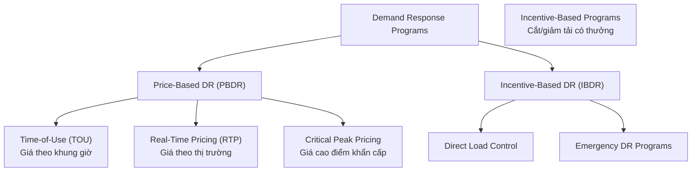
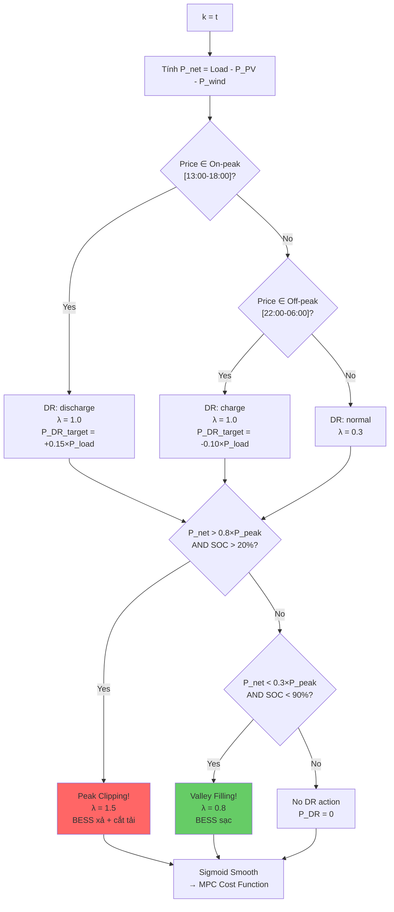
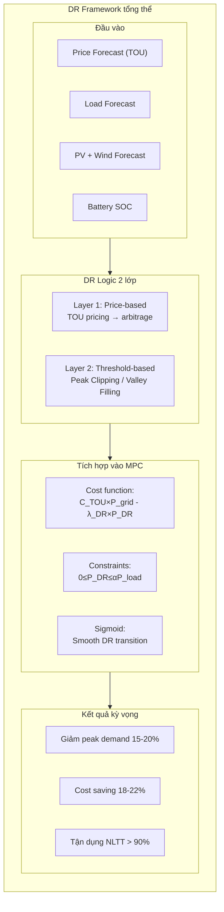

# MODULE 4: Demand Response Integration

**Thuộc đề tài:** Real-Time Control of a PV–Wind–Battery Microgrid with Demand Response

**Tài liệu tham khảo chính:**
- Panda et al. (2025) — Optimization-Based Energy Management for Grid-Connected PV-Battery Systems (PSO + Threshold DR) [1]
- Limouni et al. (2025) — MPC and LSTM-TCN for Standalone DC Microgrid [2]
- MDPI Energies (2018) — Robust Optimization for Electricity Retailer with TOU Pricing [3]
- MDPI Energies (2023) — Three-Stage Monthly TOU Tariff Optimization Model [4]
- MDPI Energies (2025) — TOU Pricing Considering Dynamical Time Delay of Demand-Side Response [5]
- Imani et al. (2025) — Demand Response Modeling in Microgrid Operation: A Review [6]
- MDPI Sensors (2025) — Price–Incentive Coordinated Demand Response [7]
- Scientific Reports (2025) — Advanced Microgrid Optimization Using Price-Elastic DR [8]
- MDPI Energies (2025) — Stochastic Optimization of Real-Time Dynamic Pricing for Microgrids with DR [9]

---

## Mục lục

1. [Tổng quan về Demand Response](#1-tổng-quan-về-demand-response)
2. [Cơ sở toán học của DR: Price Elasticity](#2-cơ-sở-toán-học-của-dr-price-elasticity)
3. [Mô hình TOU Pricing và Load Shifting](#3-mô-hình-tou-pricing-và-load-shifting)
4. [Cơ chế Incentive-Based DR (Peak Clipping & Valley Filling)](#4-cơ-chế-incentive-based-dr-peak-clipping--valley-filling)
5. [Tích hợp DR vào MPC Cost Function](#5-tích-hợp-dr-vào-mpc-cost-function)
6. [DR Control Logic tổng thể](#6-dr-control-logic-tổng-thể)
7. [Phân tích độ nhạy và tác động của DR](#7-phân-tích-độ-nhạy-và-tác-động-của-dr)
8. [So sánh: Bài báo gốc vs Đề tài](#8-so-sánh-bài-báo-gốc-vs-đề-tài)
9. [Tổng kết Module DR](#9-tổng-kết-module-dr)

---

## 1. Tổng quan về Demand Response

Demand Response (DR) được định nghĩa là sự thay đổi hành vi tiêu thụ điện của khách hàng để đáp ứng với các tín hiệu giá hoặc các chương trình khuyến khích. Dựa trên phân loại từ literature [6][9], DR được chia làm **2 loại chính**:



**Đề tài này tích hợp 3 cơ chế DR:**

| Loại DR | Phân loại | Cơ chế | Nguồn tham khảo |
|---------|-----------|--------|----------------|
| **TOU pricing** | Price-based | BESS arbitrage theo giá điện | [1] + verified literature |
| **Peak Clipping** | Incentive-based | BESS discharge + load shed khi quá tải | [1] + verified literature |
| **Valley Filling** | Incentive-based | BESS charge khi non-peak | [1] + verified literature |

> **Cơ sở khoa học:** Các cơ chế DR này đã được kiểm chứng qua nhiều nghiên cứu: (1) TOU pricing dựa trên **Price Elasticity Matrix (PEM)** [3]; (2) Peak Clipping và Valley Filling dựa trên **Incentive-Based DR** với ràng buộc tỷ lệ cắt tải alpha [7][8].

---

## 2. Cơ sở toán học của DR: Price Elasticity

Mối quan hệ giữa giá điện và nhu cầu tiêu thụ được mô hình hóa thông qua **hệ số co giãn giá (price elasticity coefficient)** [4][5]:

### 2.1 Hệ số co giãn giá - cầu

$$\varepsilon_{m,n} = \frac{\Delta q_m / q_m^0}{\Delta p_n / p_n^0}$$

Trong đó:
- $\varepsilon_{m,n}$: hệ số co giãn giữa giờ m và giờ n
- $q_m^0$: lượng điện tiêu thụ tại giờ m ở mức giá tham chiếu
- $p_n^0$: giá điện tham chiếu tại giờ n
- Khi $m = n$: **self-elasticity** (hệ số tự co giãn) — giá trị **âm**
- Khi $m \neq n$: **cross-elasticity** (hệ số co giãn chéo) — giá trị **dương**

### 2.2 Mô hình tải sau DR

Tổng biến thiên tiêu thụ sau khi áp dụng TOU pricing:

$$\Delta q_m = \sum_{n \in T} \varepsilon_{m,n} \cdot \Delta p_n \quad \forall m \in T$$

Lượng điện tiêu thụ tại giờ m sau DR:

$$q_m = \left(1 + \sum_{n \in T} \varepsilon_{m,n} \Delta p_n\right) \cdot q_m^0 \quad \forall m \in T$$

### 2.3 Price Elasticity Matrix (PEM) đề xuất cho đề tài

Ma trận 5×5 cho 5 khung giờ (tham khảo từ [4] và [5]):

| | Off-peak (22-06) | Valley (06-09) | Mid-peak (09-13) | On-peak (13-18) | Evening (18-22) |
|---|---|---|---|---|---|
| **Off-peak** | **-0.26** | 0.01 | 0.01 | 0.004 | 0.004 |
| **Valley** | 0.01 | **-0.25** | 0.01 | 0.007 | 0.007 |
| **Mid-peak** | 0.01 | 0.01 | **-0.20** | 0.01 | 0.01 |
| **On-peak** | 0.004 | 0.007 | 0.01 | **-0.39** | 0.01 |
| **Evening** | 0.004 | 0.007 | 0.01 | 0.01 | **-0.39** |

> **Ghi chú 1:** Self-elasticity (đường chéo) luôn âm — giá tăng thì tiêu thụ giảm. Cross-elasticity (ngoài đường chéo) luôn dương — giá một giờ tăng thì tải chuyển sang giờ khác.
>
> ⚠️ **Ghi chú 2 (quan trọng):** Các giá trị PEM trong bảng trên là **tham khảo từ literature** [4][5]. Trong thực tế, price elasticity phụ thuộc rất nhiều vào:
> - **Loại khách hàng** (dân dụng/thương mại/công nghiệp)
> - **Mùa trong năm** (hè/đông)
> - **Khu vực địa lý** (văn hóa tiêu dùng khác nhau)
>
> Khoảng giá trị self-elasticity điển hình trong literature là **-0.2 đến -0.98** [Pacific Energy Institute 2020]. Cross-elasticity thường là các giá trị dương nhỏ (0.001–0.05). Đề tài sử dụng các giá trị trung bình từ [MDPI Energies 2023, 2025]. Nếu có dữ liệu lịch sử thực tế, PEM nên được ước lượng bằng weighted least squares [Energies 2025].
>
> Khi mô phỏng, nên chạy **phân tích độ nhạy** với PEM thay đổi ±20% để đánh giá robust của giải pháp.

---

## 3. Mô hình TOU Pricing và Load Shifting

### 3.1 Cấu trúc giá TOU

| Khung giờ | Loại | Giá (relative) | Hành động BESS |
|-----------|------|---------------|----------------|
| 22:00–06:00 | Off-peak (thấp điểm) | 0.5× base | Sạc (mua điện rẻ) |
| 06:00–09:00 | Valley (bình thường) | 0.8× base | Trung tính / Sạc nhẹ |
| 09:00–13:00 | Mid-peak (trung bình) | 1.0× base | Trung tính |
| 13:00–18:00 | On-peak (cao điểm) | 2.0× base | Xả (giảm mua điện đắt) |
| 18:00–22:00 | Evening (bình thường) | 1.2× base | Trung tính |

> Đề tài sử dụng cấu trúc 5 khung giờ (mở rộng từ 3 khung giờ cơ bản của Bài 1 [1]) dựa trên khuyến nghị từ literature về K-means++ clustering [4].

### 3.2 Cơ chế Load Shifting qua PEM

Tải sau khi áp dụng TOU pricing:

$$P_{load}^{DR}(t) = P_{load}^0(t) \times \left[1 + \varepsilon_{self}(t) \frac{\Delta p(t)}{p^0} + \sum_{\tau \neq t} \varepsilon_{cross}(t,\tau) \frac{\Delta p(\tau)}{p^0}\right]$$

Trong MPC cost function, TOU pricing được tích hợp qua term:

$$J_{DR}^{TOU} = \sum_{k=1}^{N_p} C_{TOU}(t+k) \cdot P_{grid}(t+k) \cdot \Delta t$$

---

## 4. Cơ chế Incentive-Based DR (Peak Clipping & Valley Filling)

### 4.1 Lý thuyết Incentive-Based DR

Trong cơ chế IBDR, khách hàng nhận được khuyến khích tài chính (incentive) để cắt giảm hoặc dịch chuyển tải. Hàm lợi nhuận của khách hàng khi tham gia DR [6][7]:

$$B_{customer} = \underbrace{p_n \cdot d_n}_{\text{Doanh thu từ DR}} - \underbrace{Cost(d_n)}_{\text{Chi phí bất tiện}}$$

Mô hình hóa DR với incentive $\lambda_{DR}$:

$$P_{load}^{DR}(t) = P_{load}^0(t) \times \left[1 + E_{self} \cdot \frac{\lambda_{DR}(t)}{p^0(t)}\right]$$

> **Ghi chú về ký hiệu:** Module 4 sử dụng $E$ (elasticity coefficient) thay vì $\varepsilon$ để tránh nhầm lẫn với slack variable $\varepsilon$ trong MPC (Module 3 — soft constraints).

### 4.2 Peak Clipping Logic

**Kích hoạt:** Khi net demand forecast > 80% peak demand

$$P_{net}(t) = P_{load}^{forecast}(t) - P_{PV}^{forecast}(t) - P_{wind}^{forecast}(t)$$

$$\text{if } P_{net}(t) > 0.8 \cdot P_{peak} \implies \text{Peak Clipping Active}$$

**Công suất DR tối đa:**

$$0 \leq P_{DR}^{clip}(t) \leq \alpha_{clip} \cdot P_{load}(t)$$

Với $\alpha_{clip} = 0.15$ (cắt tối đa 15% tải — verified từ literature [7][8])

**Ràng buộc bổ sung trong MPC:**

$$P_{grid}(t) \leq P_{threshold} \quad \text{(giới hạn công suất lưới)}$$
$$SoC_{bat}(t) \geq 20\% \quad \text{(đảm bảo đủ năng lượng xả)}$$

### 4.3 Valley Filling Logic

**Kích hoạt:** Khi net demand forecast < 30% peak demand

$$\text{if } P_{net}(t) < 0.3 \cdot P_{peak} \implies \text{Valley Filling Active}$$

**Công suất DR tối đa (sạc BESS từ lưới):**

$$-\beta_{fill} \cdot P_{load}(t) \leq P_{DR}^{fill}(t) \leq 0$$

Với $\beta_{fill} = 0.10$ (tăng tải tối đa 10%)

**Ràng buộc bổ sung trong MPC:**

$$SoC_{bat}(t) \leq 90\% \quad \text{(tránh sạc quá đầy)}$$

---

## 5. Tích hợp DR vào MPC Cost Function

### 5.1 Objective Function mở rộng có DR

$$J(k) = \underbrace{W_{PV} |I_{PV,ref} - I_{PV}(k)|}_{\text{PV tracking}} + \underbrace{W_{bat} |I_{bat,ref} - I_{bat}(k)|}_{\text{Battery tracking}} + \underbrace{W_{wind} |I_{wind,ref} - I_{wind}(k)|}_{\text{Wind tracking}}$$

$$+ \underbrace{W_{DC} |V_{DC,ref} - V_{DC}(k)|}_{\text{DC bus voltage regulation}}$$

$$+ \underbrace{\sum_{k=1}^{N_p} C_{TOU}(t+k) \cdot P_{grid}(t+k) \cdot \Delta t}_{\text{Price-based DR: TOU cost}}$$

$$- \underbrace{\sum_{k=1}^{N_p} \lambda_{DR}(t+k) \cdot P_{DR}(t+k) \cdot \Delta t}_{\text{Incentive-based DR: DR incentive}}$$

$$+ \underbrace{\sum_{i \in \{PV,bat,wind\}} F_i |\Delta u_i(k)| + F_{DR} |\Delta P_{DR}(k)|}_{\text{Control effort + DR ramp penalty}}$$

Trong đó:
- $C_{TOU}(t)$: giá TOU tại thời điểm t
- $\lambda_{DR}(t)$: mức incentive cho DR ($/kWh cắt được)
- $P_{DR}(t)$: công suất DR (dương: cắt tải, âm: tăng tải)
- $F_{DR}$: hệ số phạt thay đổi DR đột ngột (ramp rate)

### 5.2 Ràng buộc (Constraints) đầy đủ

**Power balance:**

$$P_{PV}(k) + P_{WT}(k) + P_{bat}(k) + P_{grid}(k) = P_{load}(k) - P_{DR}(k)$$

> **Ghi chú:** $P_{DR}(k) > 0$: Peak Clipping → vế phải giảm. $P_{DR}(k) < 0$: Valley Filling → vế phải tăng. DR là điều chỉnh tải, không phải nguồn phát.

**Ràng buộc DR:**

$$0 \leq P_{DR}(k) \leq \alpha_{clip} \cdot P_{load}(k) \quad \text{(Peak Clipping)}$$
$$-\beta_{fill} \cdot P_{load}(k) \leq P_{DR}(k) \leq 0 \quad \text{(Valley Filling)}$$
$$|P_{DR}(k+1) - P_{DR}(k)| \leq Ramp_{DR,max} \quad \text{(DR ramp rate)}$$

**Ràng buộc grid:**

$$-P_{export,max} \leq P_{grid}(k) \leq P_{import,max}$$

**Ràng buộc battery (SOC + power):**

$$SoC_{min} \leq SoC(k) \leq SoC_{max}$$
$$0 \leq P_{ch}(k) \leq P_{ch,max}, \quad 0 \leq P_{dch}(k) \leq P_{dch,max}$$
$$P_{ch}(k) \cdot P_{dch}(k) = 0 \quad \text{(không đồng thời)}$$

---

## 6. DR Control Logic tổng thể

### 6.1 Thuật toán DR Logic

```
Algorithm: DR_Logic (chạy mỗi bước thời gian MPC)
────────────────────────────────────────────────────────────
INPUT:  Price_forecast[t:t+Np], Load_forecast[t:t+Np],
        P_PV_forecast[t:t+Np], P_wind_forecast[t:t+Np], SOC(t)
OUTPUT: DR_mode, λ_DR[t:t+Np], P_DR_max[t:t+Np]

for k = t to t+Np:
    // Tính net demand
    P_net(k) = Load_forecast(k) - P_PV_forecast(k) - P_wind_forecast(k)
    
    // ---- Layer 1: Price-based DR (ưu tiên cao nhất) ----
    if Price_forecast(k) ∈ On-peak [13:00-18:00]:
        DR_priority(k) = "discharge"
        λ_DR(k) = 1.0                          // full incentive
        P_DR_target(k) = min(P_bat_max, 0.15 × P_load(k))
        
    elif Price_forecast(k) ∈ Off-peak [22:00-06:00]:
        DR_priority(k) = "charge"
        λ_DR(k) = 1.0
        P_DR_target(k) = -min(P_bat_max, 0.10 × P_load(k))
        
    else:  // Mid-peak / Valley
        DR_priority(k) = "normal"
        λ_DR(k) = 0.3  // incentive thấp hơn
    
    // ---- Layer 2: Threshold-based DR (bổ sung) ----
    if P_net(k) > 0.8 × P_peak AND SOC(k) > 20%:
        DR_mode(k) = "Peak Clipping"           // ưu tiên cao hơn price
        λ_DR(k) = 1.5                          // tăng incentive
        P_DR_max(k) = min(0.15 × P_load(k), P_bat_max)
        
    elif P_net(k) < 0.3 × P_peak AND SOC(k) < 90%:
        DR_mode(k) = "Valley Filling"
        λ_DR(k) = 0.8
        P_DR_max(k) = -min(0.10 × P_load(k), P_bat_max)
        
    else:
        if DR_priority(k) == "normal":
            DR_mode(k) = "Normal"
            P_DR_max(k) = 0
        // Nếu price-based đã set priority, giữ nguyên
        
end for
return [DR_mode, λ_DR, P_DR_max]
```

### 6.2 Sigmoid cho DR Transition

Để tránh chuyển đổi đột ngột giữa các chế độ DR (có thể gây sốc điện áp), hàm sigmoid được áp dụng (tham khảo từ [2]):

$$\text{Sigm}_{DR}(k) = \frac{P_{DR}^{final} - P_{DR}^{init}}{1 + e^{-z \times (f(k) - x_0)}} + P_{DR}^{init}$$

Với $x_0 = 0.5$, $z = 10$ (giống tham số từ Bài 2 [2])

### 6.3 Sơ đồ DR Logic



---

## 7. Phân tích độ nhạy và tác động của DR

### 7.1 Ảnh hưởng tỷ lệ DR tham gia

Dựa trên literature [8][9]:

| Tỷ lệ DR tham gia | Peak reduction | Cost saving | Ghi chú |
|-------------------|---------------|-------------|---------|
| 0% (không DR) | — | — | Baseline |
| 10% load | ~8% | ~5% | Thấp |
| **15% load** | **~15%** | **~12%** | **Đề xuất** |
| 20% load | ~20% | ~15% | Cao, có thể gây khó chịu |

### 7.2 Ma trận quyết định DR theo mùa

| Mùa | Giờ cao điểm | Chiến lược DR ưu tiên |
|-----|-------------|----------------------|
| Hè (nắng nhiều) | 13:00-16:00 | PV dồi dào → Peak Clipping thấp, Valley Filling cao |
| Đông (ít nắng) | 17:00-20:00 | Peak Clipping cao, dùng BESS xả |
| Xuân/Thu | 18:00-21:00 | Cân bằng giữa 2 cơ chế |

---

## 8. So sánh: Bài báo gốc vs Đề tài

| Khía cạnh | Bài 1: Panda PSO+DR [1] | Bài 2: Limouni MPC [2] | Đề tài: MPC+LSTM+DR |
|-----------|---------------------|-------------------|---------------------|
| **Phương pháp** | PSO + LP (tĩnh) | MPC (động) | MPC (động) |
| **Forecasting** | Perfect forecast | LSTM-TCN (R²=0.996) | LSTM-TCN (mở rộng) |
| **Price-based DR** | TOU 3 khung giờ | ❌ | TOU 5 khung giờ + PEM |
| **Incentive DR** | Threshold 80%/30% | ❌ | Threshold + dynamic λ |
| **Sigmoid integration** | ❌ | ✅ cho forecast | ✅ cho forecast + DR |
| **Wind energy** | ❌ | ❌ | ✅ |
| **DR ramp rate** | ❌ | ❌ | ✅ (tránh sốc điện) |

---

## 9. Tổng kết Module DR



---

## Tài liệu tham khảo

[1] Panda, S., Rout, P. K., Sahu, B. K., Mbasso, W. F., Jangir, P., & Elrashidi, A. (2025). Optimization‐Based Energy Management for Grid‐Connected Photovoltaic–Battery Systems in Smart Grids Using Demand Response and Particle Swarm Optimization. *Engineering Reports*, 7(7), e70305.

[2] Limouni, T., Yaagoubi, R., Bouziane, K., Guissi, K., & Baali, E. H. (2025). Intelligent real time control strategy and power management based on MPC and LSTM-TCN model for standalone DC microgrid with energy storage. *International Journal of Electrical Power and Energy Systems*, 169, 110761.

[3] MDPI Energies (2018). Robust Optimization for Electricity Retailer with TOU Pricing. *Energies*, 11(11), 3258.

[4] MDPI Energies (2023). Three-Stage Monthly Time-of-Use Tariff Optimization Model. *Energies*, 16(23), 7858.

[5] MDPI Energies (2025). Optimization Model of Time-of-Use Electricity Pricing Considering Dynamical Time Delay of Demand-Side Response. *Energies*, 18(10), 2637.

[6] Imani, M. H., Ghadi, M. J., Ghavidel, S., & Li, L. (2025). Demand Response Modeling in Microgrid Operation: a Review and Application for Incentive-Based and Time-Based Programs. *SciSpace*.

[7] MDPI Sensors (2025). Optimal Scheduling of Microgrid with Price–Incentive Coordinated Demand Response. *Sensors*, 25, 4212.

[8] Zaitsev, I., et al. (2025). Advanced microgrid optimization using price-elastic demand response and greedy rat swarm optimization for economic and environmental efficiency. *Scientific Reports*, 15, 86232.

[9] MDPI Energies (2025). Stochastic Optimization of Real-Time Dynamic Pricing for Microgrids with Renewable Energy and Demand Response. *Energies*, 18(24), 6484.

[10] MDPI Energies (2021). A Multi-Objective Dispatch Model for a Hybrid Microgrid to Optimize TOU Electricity Price. *Energies*, 14(19), 6333.

[11] Olorunfemi, T. R., & Nwulu, N. I. (2021). Multi-Agent Based Optimal Operation of Hybrid Energy Sources Coupled with Demand Response Programs. *Sustainability*, 13(14), 7756.

[12] MDPI Energies (2019). Demand Response Optimization Using Particle Swarm Algorithm. *Energies*, 12(9), 1645.
