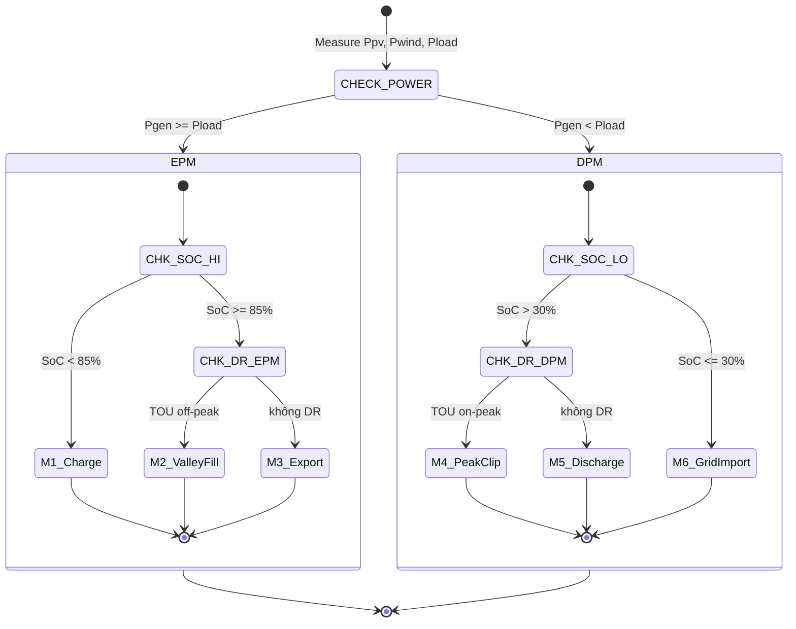
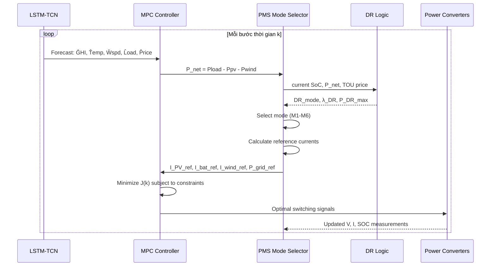

# MODULE 5: Power Management System (PMS)

**Thuộc đề tài:** Real-Time Control of a PV–Wind–Battery Microgrid with Demand Response

**Tài liệu tham khảo chính:**
- Limouni et al. (2025) — MPC and LSTM-TCN for Standalone DC Microgrid [1]
- Panda et al. (2025) — Optimization-Based Energy Management for PV-Battery Systems [2]
- Alam et al. (2024) — Coordinated Power Management for Multi-Source Systems, Scientific Reports 14, 60116 [3]
- Peyghami et al. (2021) — PMS for Grid-Independent DC Microgrid with HESS, Sustainable Energy Tech. & Assessments [4]
- NTU Singapore (2023) — Energy Management Scheme for Grid Connected HESS, IEEE Trans. Ind. Electron. [5]
- Richard et al. (2025) — Coordinated Energy Management for DC Microgrid, Engineering Reports, e70241 [6]
- Amar & Yusupov (2025) — MPC-Based Energy Management of Hybrid Microgrid, Processes 13(9), 2883 [7]

---

## Mục lục

1. [Tổng quan về PMS](#1-tổng-quan-về-pms)
2. [Hai Super-mode chính](#2-hai-super-mode-chính)
3. [Chi tiết 6 Mode vận hành](#3-chi-tiết-6-mode-vận-hành)
4. [State Machine Diagram](#4-state-machine-diagram)
5. [State Transition Logic với Hysteresis](#5-state-transition-logic-với-hysteresis)
6. [Reference Current Generation](#6-reference-current-generation)
7. [Cơ chế Seamless Mode Transition](#7-cơ-chế-seamless-mode-transition)
8. [PMS Algorithm Pseudocode](#8-pms-algorithm-pseudocode)
9. [Ví dụ minh họa PMS hoạt động](#9-ví-dụ-minh-họa-pms-hoạt-động)
10. [PMS Integration với MPC và DR](#10-pms-integration-với-mpc-và-dr)
11. [So sánh PMS giữa các phương pháp](#11-so-sánh-pms-giữa-các-phương-pháp)

---

## 1. Tổng quan về PMS

Power Management System (PMS) là **bộ điều phối năng lượng trung tâm** quyết định chế độ vận hành của microgrid dựa trên:
- **Cân bằng công suất**: $P_{gen} = P_{PV} + P_{wind}$ so với $P_{load}$
- **Trạng thái pin**: $SoC_{bat}$ hiện tại
- **Tín hiệu DR**: Giá điện TOU, threshold net demand
- **Trạng thái lưới**: Grid available hay không

**Vai trò của PMS trong kiến trúc tổng thể:**

```
LSTM-TCN Forecast ──► MPC Controller ──► PMS (chọn mode) ──► Reference Currents ──► Power Converters
                           ▲                    │
                           └─── DR Logic ◄──────┘
```

PMS hoạt động ở **tầng điều khiển giữa** (middle layer):
- **Tầng trên**: MPC optimization (Module 3) — tính toán reference currents tối ưu
- **PMS**: Chọn mode vận hành phù hợp dựa trên trạng thái hệ thống
- **Tầng dưới**: Power converters (điều khiển dòng/thế thực tế)

> **Cơ sở lý thuyết:** Cấu trúc PMS dạng state machine với các mode vận hành được xác định dựa trên power balance và SOC được sử dụng rộng rãi trong literature [1][3][5].

---

## 2. Hai Super-mode chính

Dựa trên [5], PMS phân chia thành 2 super-mode dựa trên dấu của $P_{net}$:

| Super-mode | $P_{net} = P_{load} - P_{gen}$ | Ý nghĩa |
|------------|-------|---------|
| **EPM** (Excess Power Mode) | $P_{net} < 0$ | Thừa năng lượng → sạc pin / xuất lưới / valley fill DR |
| **DPM** (Deficit Power Mode) | $P_{net} > 0$ | Thiếu năng lượng → xả pin / nhập lưới / peak clip DR |

**Công thức xác định super-mode tại bước thời gian k:**

$$P_{net}(k) = P_{load}(k) - P_{PV}(k) - P_{wind}(k)$$

- Nếu $P_{net}(k) < 0$ → **EPM** (battery charging, grid export)
- Nếu $P_{net}(k) > 0$ → **DPM** (battery discharging, grid import)
- Nếu $P_{net}(k) = 0$ → **Balanced mode** (lý tưởng)

---

## 3. Chi tiết 6 Mode vận hành

Mỗi super-mode được chia thành các mode con dựa trên SOC và DR signal:

### EPM (Excess Power — $P_{gen} \geq P_{load}$):

| Mode | Điều kiện kích hoạt | Mô tả | Hành động |
|------|--------------------|-------|-----------|
| **M1** | $SoC_{bat} < 85\%$ | **Battery Charging** | Sạc pin từ surplus |
| **M2** | $SoC_{bat} \geq 85\%$ & tín hiệu TOU off-peak | **DR Valley Fill** | Sạc pin từ lưới (giá rẻ) + export |
| **M3** | $SoC_{bat} \geq 85\%$ & không có DR | **Grid Export** | Xuất toàn bộ surplus lên lưới |

### DPM (Deficit Power — $P_{gen} < P_{load}$):

| Mode | Điều kiện kích hoạt | Mô tả | Hành động |
|------|--------------------|-------|-----------|
| **M4** | $SoC_{bat} > 30\%$ & tín hiệu TOU on-peak | **DR Peak Clip** | Xả pin + cắt 15% tải (DR) |
| **M5** | $SoC_{bat} > 30\%$ & không DR | **Battery Discharging** | Xả pin bù thiếu hụt |
| **M6** | $SoC_{bat} \leq 30\%$ | **Grid Import** | Nhập từ lưới, pin nghỉ |

> **Cơ sở:** Ngưỡng SOC 85% (charging stop) và 30% (discharging stop) là giá trị **điều chỉnh** cho đề tài:
> - Limouni [1] dùng 80% (charging stop) cho standalone DC microgrid có supercapacitor
> - Panda [2] dùng hard limit 20%–90% cho grid-connected PV-battery
> - Đề tài chọn **85% và 30%** vì: grid-connected có thể tận dụng lưới để xả pin sâu hơn (30% thay vì 40%), và charging stop 85% (thay vì 80%) tận dụng được nhiều surplus PV hơn trước khi export lên lưới. Các ngưỡng này nằm trong hard limits 20%–90% (từ Module 1).
>
> ⚠️ **Phân biệt hard limits vs operational thresholds:**
> - **Hard limits** (Module 1, 4): $SoC_{min}=20\%$, $SoC_{max}=90\%$ — đây là ràng buộc tuyệt đối để bảo vệ pin khỏi hư hỏng (overcharge/deep discharge). MPC không bao giờ được vi phạm các giá trị này.
> - **Operational thresholds** (Module 5 — PMS): $SoC_{charge,stop}=85\%$, $SoC_{disch,stop}=30\%$ — đây là ngưỡng vận hành an toàn, có 5% margin từ hard limits để tránh chạm ngưỡng bảo vệ và có không gian cho hysteresis (charge resume ở 80%, discharge resume ở 35%).
>
> Cách phân tách này đảm bảo pin luôn hoạt động trong vùng an toàn, đồng thời tránh chattering khi PMS chuyển mode.

---

## 4. State Machine Diagram



---

## 5. State Transition Logic với Hysteresis

Để tránh chattering (chuyển mode liên tục khi $P_{gen} \approx P_{load}$), PMS sử dụng **hysteresis band**:

$$\text{EPM active khi: } P_{gen} - P_{load} > \Delta P_{hys}$$
$$\text{DPM active khi: } P_{load} - P_{gen} > \Delta P_{hys}$$

Với $\Delta P_{hys} = 0.05 \times P_{rated}$ (5% công suất định mức — verified từ [3]).

Tương tự cho SOC:

| Transition | Ngưỡng kích hoạt | Ngưỡng trở về | Mục đích |
|-----------|-----------------|---------------|----------|
| Charge → Stop | $SoC \geq 85\%$ | $SoC \leq 80\%$ | Tránh overcharge |
| Discharge → Stop | $SoC \leq 30\%$ | $SoC \geq 35\%$ | Tránh deep discharge |

---

## 6. Reference Current Generation

Mỗi mode tính toán reference currents khác nhau cho MPC tracking:

| Mode | $I_{PV,ref}$ | $I_{bat,ref}$ | $I_{wind,ref}$ | $P_{grid,ref}$ | $P_{DR,ref}$ |
|------|:----------:|:-----------:|:------------:|:--------------:|:----------:|
| **M1** (Charge) | MPPT | $\displaystyle -\frac{P_{charge,max}}{V_{DC}}$ | MPPT | $\max(P_{surplus} - P_{bat}, 0)$ | 0 |
| **M2** (Valley) | MPPT | $\displaystyle -\frac{P_{charge,DR}}{V_{DC}}$ | MPPT | $P_{surplus} + P_{bat,DR}$ | $-\alpha P_{load}$ |
| **M3** (Export) | MPPT | 0 | MPPT | $P_{surplus}$ | 0 |
| **M4** (PeakClip) | MPPT | $\displaystyle +\frac{P_{discharge,DR}}{V_{DC}}$ | MPPT | $P_{deficit} - P_{bat,DR}$ | $+\beta P_{load}$ |
| **M5** (Discharge) | MPPT | $\displaystyle +\frac{P_{discharge,max}}{V_{DC}}$ | MPPT | $\max(P_{deficit} - P_{bat}, 0)$ | 0 |
| **M6** (Import) | MPPT | 0 | MPPT | $P_{deficit}$ | $+\beta P_{load}$ |

Trong đó:
- $P_{surplus} = P_{PV} + P_{wind} - P_{load} \quad (>0)$
- $P_{deficit} = P_{load} - P_{PV} - P_{wind} \quad (>0)$
- $\alpha$: tỷ lệ valley fill (0.1–0.15)
- $\beta$: tỷ lệ peak clip (0.1–0.15)
- Dấu $-$ cho $I_{bat,ref}$: đang sạc (dòng âm)
- Dấu $+$ cho $I_{bat,ref}$: đang xả (dòng dương)

---

## 7. Cơ chế Seamless Mode Transition

Khi PMS chuyển mode, cần tránh đột biến dòng điện và điện áp. Cơ chế seamless transition được kế thừa từ [1 — Sigmoid function] và [5 — seamless mode transition]:

### 7.1 Sigmoid Smoothing cho reference currents

Khi chuyển từ Mode $i$ sang Mode $j$ tại thời điểm $k_0$:

$$I_{bat,ref}(k) = I_{bat,ref,i} + \frac{I_{bat,ref,j} - I_{bat,ref,i}}{1 + e^{-z \cdot (k - k_0 - \delta)}}$$

Với $z = 0.5$ (tốc độ chuyển tiếp), $\delta = 3$ (độ trễ — số bước thời gian).

### 7.2 Soft-start cho grid connection

Khi chuyển từ islanded sang grid-connected:

$$P_{grid,ref}(k) = P_{grid,ref,steady} \times \left(1 - e^{-k/\tau}\right)$$

Với $\tau = 5$ bước thời gian.

### 7.3 Power buffer bằng DC bus capacitor

Trong quá trình chuyển tiếp, DC bus capacitor $C_{DC}$ đóng vai trò đệm năng lượng:

$$\Delta V_{DC}(k) = \frac{\Delta P_{transition}(k) \cdot \Delta t}{C_{DC} \cdot V_{DC,ref}}$$

Yêu cầu $\Delta V_{DC} \leq \pm 5\%$ (theo IEEE std 1547 — verified từ [5]).

---

## 8. PMS Algorithm Pseudocode

```
Algorithm: PMS_Mode_Selection
─────────────────────────────
Input:  P_PV(k), P_wind(k), P_load(k), SoC(k)
        TOU_price(k), DR_signal(k)
Output: mode(k), [I_PV_ref, I_bat_ref, I_wind_ref, P_grid_ref, P_DR_ref](k)

1:  // Step 1: Tính net power
2:  P_gen ← P_PV(k) + P_wind(k)
3:  P_net ← P_load(k) - P_gen
4:
5:  // Step 2: Hysteresis check
6:  if |P_net| < ΔP_hys then
7:      retain previous mode
8:      return
9:  end if
10:
11: // Step 3: Xác định super-mode
12: if P_net ≤ -ΔP_hys then           // EPM: thừa năng lượng
13:     if SoC(k) < 85% then
14:         mode ← M1                 // Battery Charging
15:     else if TOU_price(k) == OffPeak then
16:         mode ← M2                 // DR Valley Fill
17:     else
18:         mode ← M3                 // Grid Export
19:     end if
20:
21: else if P_net ≥ ΔP_hys then       // DPM: thiếu năng lượng
22:     if SoC(k) ≤ 30% then
23:         mode ← M6                 // Grid Import
24:     else if TOU_price(k) == OnPeak then
25:         mode ← M4                 // DR Peak Clip
26:     else
27:         mode ← M5                 // Battery Discharging
28:     end if
29: end if
30:
31: // Step 4: Tạo reference currents
32: [I_PV_ref, I_bat_ref, I_wind_ref, P_grid_ref, P_DR_ref] ←
33:     Reference_Currents(mode, P_gen, P_load, SoC)
34:
35: // Step 5: Sigmoid smoothing
36: if mode(k) ≠ mode(k-1) then
37:     I_bat_ref ← Sigmoid_transition(I_bat_ref, last_I_bat_ref)
38:     P_grid_ref ← Soft_start(P_grid_ref)
39: end if
40:
41: return mode, [I_PV_ref, I_bat_ref, I_wind_ref, P_grid_ref, P_DR_ref]
```

---

## 9. Ví dụ minh họa PMS hoạt động

**Scenario: Ngày nắng, gió nhẹ, giá điện theo TOU**

| Time (h) | $P_{PV}$ | $P_{wind}$ | $P_{load}$ | $P_{net}$ | SoC | TOU | **PMS Mode** |
|:--------:|:--------:|:----------:|:----------:|:---------:|:---:|:---:|:------------:|
| 02:00 | 0 | 2 | 5 | **+3** | 45% | Off-peak | **M5** (Discharge) |
| 06:00 | 0.5 | 3 | 8 | **+4.5** | 35% | Off-peak | **M2** (Valley Fill — sạc từ lưới) |
| 09:00 | 12 | 4 | 8 | **-8** | 55% | Mid-peak | **M1** (Charge) |
| 12:00 | 18 | 3 | 10 | **-11** | 82% | Mid-peak | **M1** (Charge) |
| 14:00 | 16 | 2 | 12 | **-6** | 88% | On-peak | **M3** (Export) |
| 18:00 | 3 | 5 | 15 | **+7** | 80% | On-peak | **M4** (Peak Clip) |
| 21:00 | 0 | 4 | 10 | **+6** | 45% | Mid-peak | **M5** (Discharge) |

> **Nhận xét:** PMS tự động chọn Valley Fill vào giờ thấp điểm (06h) để tận dụng giá rẻ, Peak Clip vào giờ cao điểm (18h) khi thiếu hụt, và Export vào giữa trưa khi PV dư thừa và pin đã đầy.

---

## 10. PMS Integration với MPC và DR



---

## 11. So sánh PMS giữa các phương pháp

| Phương pháp | Bài 2 (Limouni) | Đề tài (mở rộng) | Cải tiến |
|-------------|----------------|-----------------|----------|
| Số mode | 5 (1-5, standalone) | 6 (M1-M6, grid-connected) | +1 mode |
| Năng lượng | PV + Battery + SC | PV + **Wind** + Battery | Thêm wind |
| Grid interaction | ❌ | ✅ | Grid-connected |
| DR integration | ❌ | ✅ (Valley Fill, Peak Clip) | Mới |
| Transition | Sigmoid | Sigmoid + Hysteresis | Mượt hơn |
| Hysteresis | Không | ✅ (5% band) | Chống chattering |

---

## Tổng kết Module 5

Module 5 (PMS) đóng vai trò **bộ điều phối trung tâm** trong kiến trúc đề tài:

```
┌──────────────────────────────────────────┐
│           PMS - Power Management         │
├──────────────────────────────────────────┤
│ 1. Xác định EPM/DPM dựa trên P_net       │
│ 2. Chọn 1 trong 6 mode (M1-M6)           │
│ 3. Tính reference currents cho MPC       │
│ 4. Phối hợp với DR Logic                 │
│ 5. Đảm bảo seamless transition           │
│ 6. Chống chattering bằng hysteresis      │
└──────────────────────────────────────────┘
```

## Tài liệu tham khảo

1. Limouni, T., et al. (2025). Intelligent real time control strategy and power management based on MPC and LSTM-TCN model for standalone DC microgrid. *International Journal of Electrical Power and Energy Systems*, 169, 110761.

2. Panda, S., et al. (2025). Optimization‐Based Energy Management for Grid‐Connected Photovoltaic–Battery Systems in Smart Grids Using Demand Response and PSO. *Engineering Reports*, 7(7), e70305.

3. Alam, M. S., Hossain, M. A., & Muyeen, S. M. (2024). Coordinated power management strategy for reliable hybridization of multi-source systems using hybrid MPPT algorithms. *Scientific Reports*, 14, 60116.

4. Peyghami, S., et al. (2021). Power management and control of a grid-independent DC microgrid with hybrid energy storage system. *Sustainable Energy Technologies and Assessments*, 43, 100946.

5. NTU Singapore (2023). Energy management scheme for grid connected hybrid energy storage with battery and supercapacitor. *IEEE Transactions on Industrial Electronics*.

6. Richard, L., et al. (2025). Coordinated Energy Management Strategy for DC Microgrid With Hybrid Energy Storage. *Engineering Reports*, e70241.

7. Amar, A. & Yusupov, Z. (2025). Real-Time Capable MPC-Based Energy Management of Hybrid Microgrid. *Processes*, 13(9), 2883.
