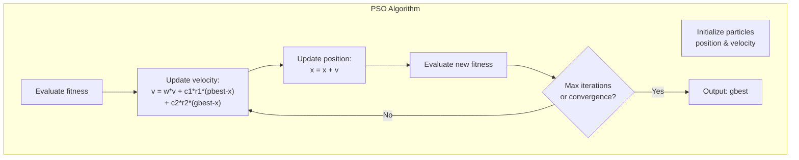
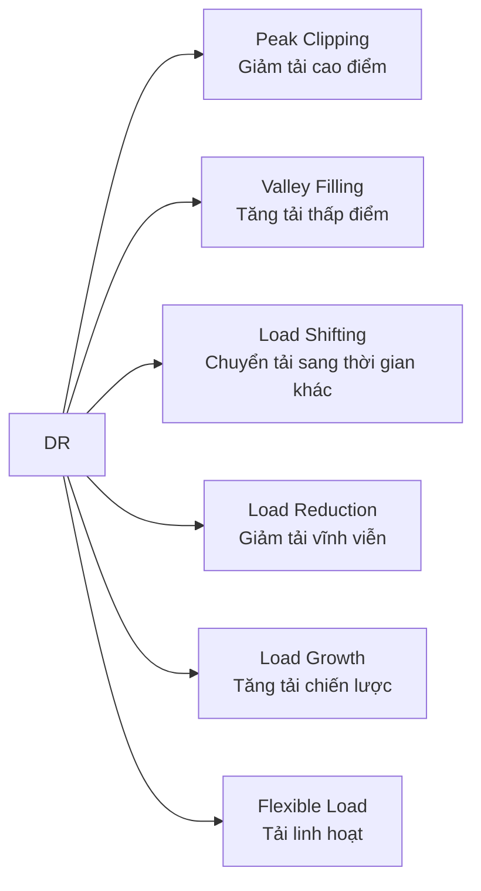
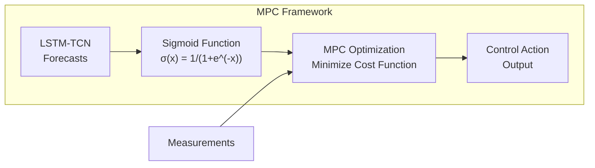
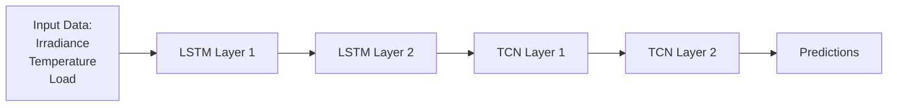
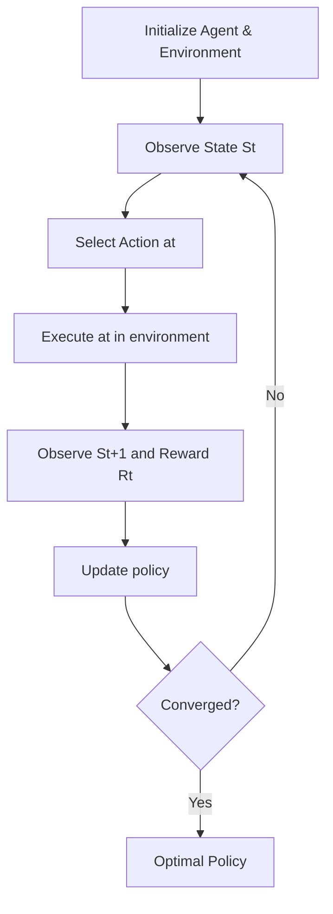
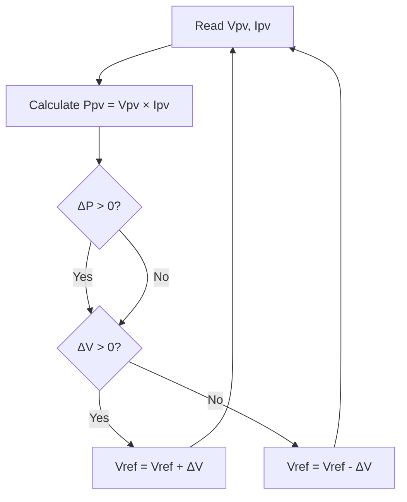

This document describes the key algorithms and theoretical approaches used across all four research papers.

---

## 1. Wind Speed & Power Model

### Formula: Wind Speed at Hub Height
$$V_{hub}(t) = V_{ref}(t) \cdot \left(\frac{H_{hub}}{H_{ref}}\right)^\alpha$$

Where:
- $H_{hub}$: hub axis height
- $H_{ref}$: reference height
- $\alpha$: surface roughness coefficient

### Formula: Wind Turbine Power Output
$$P_{WT}(t) = \begin{cases} 
0 & V_{hub} < V_{cut-in} \text{ or } V_{hub} > V_{cut-out} \\
V_{hub}^3(t) \cdot \left(\frac{V_{r}^3 - V_{cut-in}^3}{V_{r}^3 - V_{cut-in}^3}\right) - P_r \cdot \left(\frac{V_{cut-out}^3 - V_{cut-in}^3}{V_{r}^3 - V_{cut-in}^3}\right) & V_{cut-in} \leq V_{hub} < V_r \\
P_r & V_r \leq V_{hub} \leq V_{cut-out}
\end{cases}$$

**Parameters:**
- $V_{cut-in}$: cut-in speed limit
- $V_{cut-out}$: cut-out speed limit
- $V_r$: rated speed
- $P_r$: rated power

---

## 2. Photovoltaic Power Model

### Formula: PV Power Output
$$P_{PV} = \eta_{PV} \times A \times G$$

Where:
- $\eta_{PV}$: PV module efficiency
- $A$: solar panel surface area (m²)
- $G$: solar irradiance (W/m²)

---

## 3. Battery State of Charge (SoC) Models

### Coulomb Counting Method
$$SoC(t) = \frac{C_{remaining}}{C_{actual}} \times 100\%$$

### Discrete SoC Update
$$SoC_{t+1} = SoC_t + \frac{P_{charge} - P_{discharge}}{C_{battery}}$$

### BESS SoC (Paper 2)
$$SoC(t) = SoC(t-1) \times \frac{P_{bat}(t) \times \eta_{bat}}{E_{bat}}$$

---

## 4. Power Balance Equations

### Basic Power Balance
$$P_t^{WT} + P_t^{Grid} + P_t^{DG} + P_t^{ESS} = P_t^{EV,ch} + P_t^L \quad \forall t \in [T_a, T_d]$$

### EV Charging Constraint
$$0 \leq P_t^{EV,ch} \leq P_{cap} \times C_{EEV}$$

### PV-Battery Grid Balance
$$P_{pv}(t) + P_{bat}(t) = P_{load}(t) + P_{grid}(t)$$

---

## 5. Optimization Algorithms

### 5.1 Particle Swarm Optimization (PSO)

**PSO Parameters:**
- $w$: inertia weight
- $c_1, c_2$: cognitive and social coefficients
- $r_1, r_2$: random numbers [0,1]
- $p_{best}$: personal best
- $g_{best}$: global best

### 5.2 Linear Programming (LP)

**Objective Function:**
$$\min \sum_{t=1}^{T} C(t) \times P_{grid}(t)$$

**Constraints:**
- $SoC_{min} \leq SoC(t) \leq SoC_{max}$
- $P_{inv,min} \leq P_{inv}(t) \leq P_{inv,max}$

---

## 6. Demand Response Techniques

### DR Control Logic

| Technique | Trigger Condition | Action |
|-----------|-------------------|--------|
| Peak Clipping | Net demand > 80% transformer capacity | BESS discharge |
| Valley Filling | Grid demand < 30% average load | BESS charge |
| Load Shifting | Time-of-use pricing | Shift flexible loads |

---

## 7. Model Predictive Control (MPC)

### Sigmoid Integration Function
$$\sigma(x) = \frac{1}{1 + e^{-x}}$$

---

## 8. LSTM-TCN Forecasting Model

**LSTM Benefits:**
- Handles long-term dependencies in time series
- Good for irradiance and load forecasting

**TCN Benefits:**
- Captures local temporal patterns
- Parallel computation efficiency

---

## 9. Reinforcement Learning Framework

### State Space
$$S_t = (P_{solar}, P_{wind}, SOC, D_{load})$$

### Action Space
- Charge battery
- Discharge battery
- Supply load from renewables

### Reward Function
$$R_t = \alpha \cdot U_{renewable} - \beta \cdot L_{loss} - \gamma \cdot P_{imbalance}$$

Where:
- $U_{renewable}$: renewable energy utilization
- $L_{loss}$: energy loss
- $P_{imbalance}$: power imbalance
- $\alpha, \beta, \gamma$: weighting coefficients

### RL Training Algorithm

---

## 10. MPPT Algorithm (Modified Perturb & Observe)

---

## 11. Economic Optimization

### Net Present Cost (NPC)
$$C_{NPC} = \frac{C_{Annual,Total}}{CRF(i, R_{project})}$$

Where:
- $C_{Annual,Total}$: total annual cost
- $CRF$: Capital Recovery Factor
- $i$: annual interest rate
- $R_{project}$: project lifetime

---

## 12. Power Management Modes (Paper 3)

| Mode | Condition | Action |
|------|-----------|--------|
| Mode 1 | $P_{pv} > P_{load}$ & $SoC_{bat} < 80\%$ | Battery Charging |
| Mode 2 | $P_{pv} > P_{load}$ & $SoC_{bat} > 80\%$ & $SoC_{sc} < 80\%$ | SC Charging |
| Mode 3 | $P_{pv} > P_{load}$ & $SoC_{bat} > 80\%$ & $SoC_{sc} > 80\%$ | Power Curtailment |
| Mode 4 | $P_{pv} < P_{load}$ & $SoC_{sc} > 20\%$ | SC Discharging |
| Mode 5 | $P_{pv} < P_{load}$ & $SoC_{sc} < 20\%$ & $SoC_{bat} > 20\%$ | Battery Discharging |

---

## Summary Table

| Paper | Primary Algorithm | Key Innovation |
|-------|------------------|----------------|
| Paper 1 | EMS + OPC UA | Hardware-in-the-loop, MATLAB-PLC integration |
| Paper 2 | PSO + LP | PSO outperforms LP, 15.32% cost savings |
| Paper 3 | LSTM-TCN + MPC | Deep learning forecasting for real-time control |
| Paper 4 | Reinforcement Learning | Autonomous energy management |