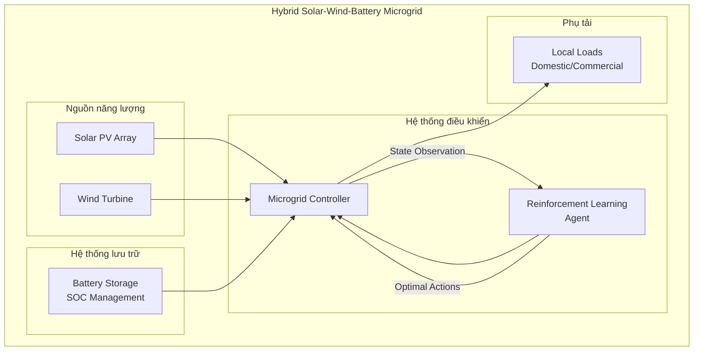
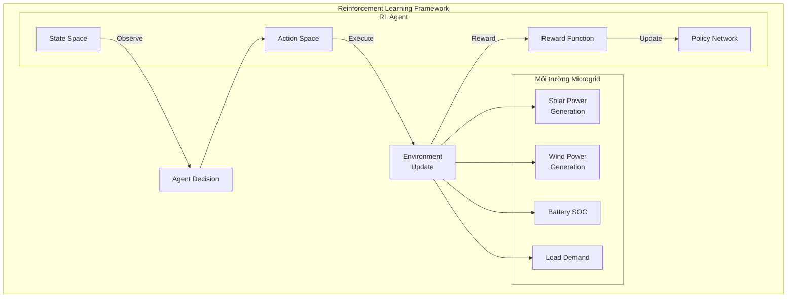
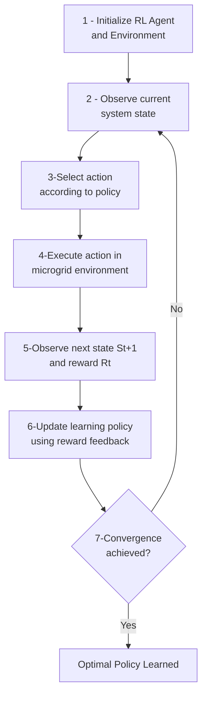

**Tác giả:** K. Geetha
**Institution:** Professor of Computer Science and Engineering, Excel Engineering College, Erode
**Email:** kgeetha.eec@excelcolleges.com
**Tạp chí:** National Journal of Renewable Energy Systems and Innovation, ISSN: 3107-5193, Vol. 2, No. 1, 2026 (pp.10-18)
**DOI:** doi.org/10.17051/NJRESI/02.01.02
**Received:** 09.11.2025 | **Revised:** 07.12.2025 | **Accepted:** 06.01.2026
**Reference:** [[Hybrid Solar–Wind–Battery Microgrid Optimization.pdf]]

---

## 1. Mục tiêu nghiên cứu

### Tóm tắt (Abstract)

Sự phát triển nhanh chóng của năng lượng tái tạo đã dẫn đến sự ra đời của các hệ thống microgrid lai ghép, có khả năng nâng cao tính bền vững và độ tin cậy của năng lượng. Tuy nhiên, tính không liên tục và biến động của nguồn năng lượng mặt trời và gió tạo ra những khó khăn nghiêm trọng cho việc quản lý năng lượng hiệu quả và ổn định lưới điện. Nghiên cứu này đề xuất một hệ thống tối ưu hóa thông minh cho microgrid lai ghép solar-wind-battery sử dụng học tăng cường (RL) để cung cấp phương pháp quản lý năng lượng tự trị và nâng cao hiệu suất hệ thống.

### Mục tiêu chính
1. **Autonomous Energy Management** - Quản lý năng lượng tự trị
2. **Tối ưu hóa hybrid microgrid** kết hợp solar-wind-battery
3. **Cải thiện hiệu suất hệ thống** trong điều kiện biến đổi môi trường

### Vấn đề cần giải quyết
- Tính **không liên tục và biến động** của năng lượng mặt trời và gió
- **Thiếu linh hoạt** của các phương pháp rule-based control truyền thống
- Khó khăn trong việc quản lý **hybrid renewable energy systems**

### Từ khóa
Hybrid microgrid, renewable energy optimization, reinforcement learning, solar energy, wind energy, battery storage, autonomous energy management

### Hybrid Microgrid Architecture

---

## 2. Phương pháp nghiên cứu

### 2.1 Solar Photovoltaic System Model

$$P_{PV} = \eta_{PV} \times A \times G$$

Trong đó:
- $P_{PV}$: công suất tạo ra từ PV
- $\eta_{PV}$: hiệu suất module PV
- $A$: diện tích bề mặt tấm pin
- $G$: cường độ bức xạ mặt trời (W/m²)

### 2.2 Wind Turbine Power Model

$$P_{wind} = \frac{1}{2} \rho A V^3 C_p$$

Trong đó:
- $P_{wind}$: công suất gió
- $\rho$: mật độ không khí
- $A$: diện tích quét rotor
- $V$: tốc độ gió
- $C_p$: hệ số công suất của tuabin

### 2.3 Battery Energy Storage Model

$$SOC_{t+1} = SOC_t + \frac{P_{charge} - P_{discharge}}{C_{battery}}$$

**Ràng buộc vận hành pin:**
- Tránh overcharging và over-discharging
- Duy trì tuổi thọ pin

### 2.4 Reinforcement Learning Framework

### 2.5 State Space Representation

$$S_t = (P_{solar}, P_{wind}, SOC, D_{load})$$

**Giải thích:**
- $P_{solar}$: công suất solar tại thời điểm t
- $P_{wind}$: công suất gió tại thời điểm t
- $SOC$: State of Charge của pin
- $D_{load}$: nhu cầu tải

### 2.6 Action Space

**Các action khả thi:**
1. **Charge battery** - Sạc pin từ surplus renewable power
2. **Discharge battery** - Xả pin để cung cấp cho tải
3. **Supply load from renewables** - Cung cấp tải từ năng lượng tái tạo

### 2.7 Reward Function

$$R_t = \alpha \cdot U_{renewable} - \beta \cdot L_{loss} - \gamma \cdot P_{imbalance}$$

**Giải thích:**
- $U_{renewable}$: mức sử dụng năng lượng tái tạo
- $L_{loss}$: tổn thất năng lượng trong hệ thống
- $P_{imbalance}$: sự mất cân bằng công suất
- $\alpha, \beta, \gamma$: các hệ số trọng số

### 2.8 Thuật toán Reinforcement Learning

### 2.9 Cấu hình mô phỏng (Simulation Setup)

**Tham số môi trường mô phỏng:**

| Tham số | Mô tả |
|---------|-------|
| Môi trường | Hybrid microgrid với solar PV, wind turbine, battery storage, tải động |
| Bức xạ mặt trời | Mô phỏng với biến động thực tế |
| Tốc độ gió | Biến động ngẫu nhiên dựa trên dữ liệu khí tượng |
| Nhu cầu tải | Dao động phản ánh mô hình tiêu thụ thực tế |
| Huấn luyện | Agent tương tác lặp đi lặp lại với môi trường microgrid |

---

## 3. Kết quả nghiên cứu

### 3.1 Hiệu suất năng lượng tái tạo

- **Năng lượng mặt trời:** Theo biểu đồ bức xạ hàng ngày (đỉnh vào giữa trưa)
- **Năng lượng gió:** Biến động ngẫu nhiên dựa trên tốc độ gió
- **Tính bổ sung:** Gió bù đắp khoảng trống năng lượng khi mặt trời giảm vào buổi tối
- **Kết quả:** Hệ thống lai ghép tăng cường độ tin cậy và giảm phụ thuộc vào đơn nguồn

### 3.2 Hiệu suất lưu trữ battery

- Pin lưu trữ năng lượng dư thừa trong thời gian sản xuất cao
- Giải phóng năng lượng trong thời gian sản xuất thấp
- RL controller quản lý hiệu quả chu kỳ charge/discharge
- SOC được duy trì trong giới hạn an toàn (không overcharging/deep discharge)

### 3.3 So sánh chi tiết: RL-Based vs Rule-Based Control

| Chỉ số | Rule-Based Control | RL-Based Optimization | Cải thiện |
|--------|-------------------|---------------------|-----------|
| Renewable Utilization | 72% | **89%** | **+17%** |
| System Loss | 12% | **5%** | **-7%** |
| System Efficiency | 85% | **93%** | **+8%** |

> **Kết quả chính:** Phương pháp RL đạt mức sử dụng năng lượng tái tạo cao hơn ~17% so với phương pháp rule-based truyền thống, giảm tổn thất hệ thống 7% và tăng hiệu suất tổng thể 8%.

### 3.4 Kết luận chính

1. **Reinforcement Learning** cho phép autonomous energy management hiệu quả
2. Hệ thống **thích nghi** với điều kiện môi trường khác nhau
3. **Tối ưu hóa sử dụng năng lượng tái tạo** thông qua smart coordination
4. **Scalable và adaptive model** cho hybrid renewable microgrids

### 3.5 Đóng góp chính

- Phát triển mô hình hybrid renewable microgrid kết hợp solar PV, wind turbine, và battery storage
- Xây dựng kiến trúc RL-based energy management system cho autonomous microgrids
- Tối ưu hóa phân bổ năng lượng để tận dụng năng lượng tái tạo và cân bằng công suất
- Simulation experiments với các điều kiện môi trường khác nhau

### 3.6 Hướng phát triển tương lai

1. **Deep Reinforcement Learning** - Thuật toán RL nâng cao để cải thiện ra quyết định
2. **Demand Response Integration** - Tích hợp chiến lược đáp ứng từ phía tải
3. **Real-world testing** - Kiểm thử trên microgrid thực tế
4. **Multi-agent RL** - Học tăng cường đa tác tử cho mạng lưới microgrid kết nối liên thông

## 4. Điểm mạnh và điểm yếu
### 4.1 Điểm mạnh
+ Khả năng học chính sách điều khiển mà không cần mô hình hệ thống chính xác
+ Cải thiện đáng kể hiệu suất (+8%) và sử dụng năng lượng tái tạo (+17%) so với rule-based
+ RL agent học chính sách tối ưu một cách độc lập thông qua phản hồi từ môi trường
### 4.2 Điểm yếu
+ Chưa tích hợp Demand Response (DR) từ phía tải và thường bỏ qua tương tác lưới điện chính
+ Mô phỏng còn đơn giản, chưa kiểm thử trên hệ thống thực tế
+ Chưa áp dụng các thuật toán deep RL tiên tiến

## Tài liệu tham khảo

1. Bevrani, H., Francois, B., & Ise, T. (2017). *Microgrid dynamics and control*. Hoboken, NJ: Wiley.
2. Chen, Y., Wang, X., & Li, J. (2021). Deep reinforcement learning for optimal energy management in microgrids with renewable energy sources. *IEEE Transactions on Smart Grid*, 12(4), 3214–3225.
3. Du, Y., & Li, F. (2020). Intelligent multi-microgrid energy management based on deep reinforcement learning. *IEEE Transactions on Smart Grid*, 11(3), 2328–2339.
4. Gupta, N., & Kumar, R. (2024). Intelligent optimization of renewable energy microgrids using reinforcement learning techniques. *Sustainable Energy Technologies and Assessments*, 58, 1–10.
5. Gao, Y., Hu, J., & Li, H. (2022). Reinforcement learning-based energy management for hybrid renewable microgrids with battery storage systems. *Renewable Energy*, 188, 1012–1024.
6. Guo, L., Liu, W., Cai, J., Hong, B., & Wang, C. (2020). A two-stage optimal planning and control framework for microgrid energy management using reinforcement learning. *Applied Energy*, 259, 114163.
7. He, Y., Zhang, Y., & Wang, J. (2023). Deep reinforcement learning-based optimal scheduling for renewable microgrid systems with energy storage. *Energy Reports*, 9, 1291–1303.
8. Li, H., Wan, Z., & He, H. (2019). Real-time residential demand response using deep reinforcement learning. *IEEE Transactions on Smart Grid*, 10(4), 3653–3662.
9. Li, J., Dou, B., Zhang, H., Zhang, H., Chen, H., Xu, Y., & Wu, C. (2021). Pyrolysis characteristics and non-isothermal kinetics of waste wood biomass. *Energy*, 226, 120358.
10. Liu, X., Wang, P., & Loh, P. C. (2021). A hybrid reinforcement learning approach for real-time energy management of microgrids. *IEEE Transactions on Sustainable Energy*, 12(1), 332–342.
11. Mohammadi, S., Soleymani, M., & Mozafari, B. (2019). Scenario-based stochastic operation management of microgrid including wind, photovoltaic, micro-turbine, fuel cell, and energy storage devices. *Energy*, 54, 525–535.
12. Park, J., Kim, S., & Lee, H. (2023). Adaptive energy management of hybrid renewable microgrids using deep reinforcement learning. *Energy Reports*, 9, 540–552.
13. Sutton, R. S., & Barto, A. G. (2018). *Reinforcement learning: An introduction* (2nd ed.). Cambridge, MA: MIT Press.
14. Vázquez-Canteli, A., & Nagy, Z. (2019). Reinforcement learning for demand response: A review of algorithms and modeling techniques. *Applied Energy*, 235, 1072–1089.
15. Wang, H., Yang, Y., & Liu, C. (2022). Intelligent scheduling of distributed renewable energy systems using reinforcement learning algorithms. *Energy*, 239, 122312.
16. Xiang, Y., Wu, G., Shen, X., Ma, Y., Gou, J., Xu, W., & Liu, J. (2021). Low-carbon economic dispatch of electricity-gas systems. *Energy*, 226, 120267.
17. Zhang, Y., Li, P., & Wang, B. (2020). Reinforcement learning-based energy management for hybrid renewable microgrid systems. *Applied Energy*, 262, 1–12.
