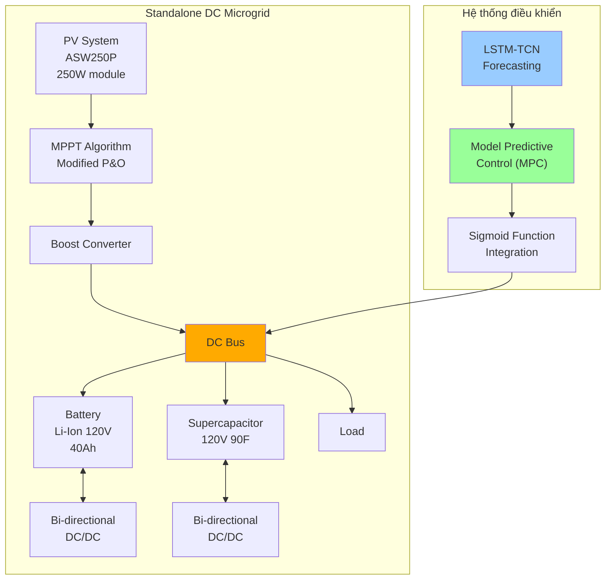
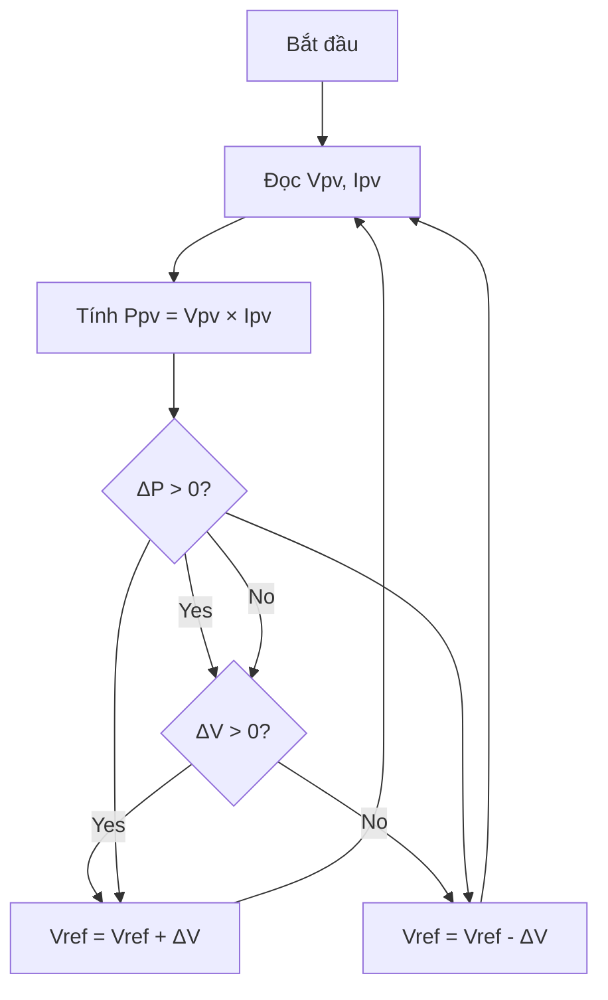
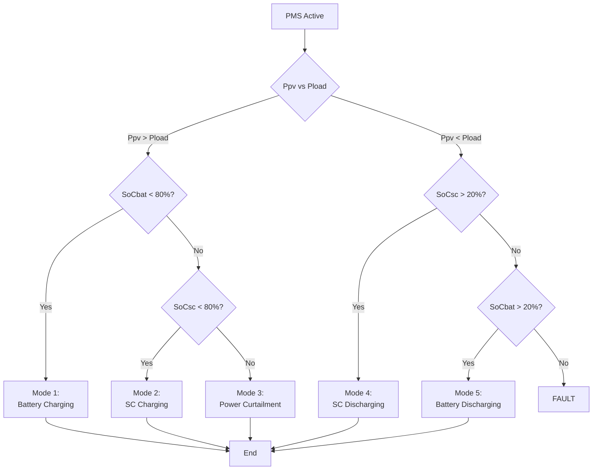
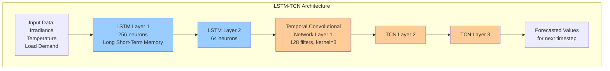
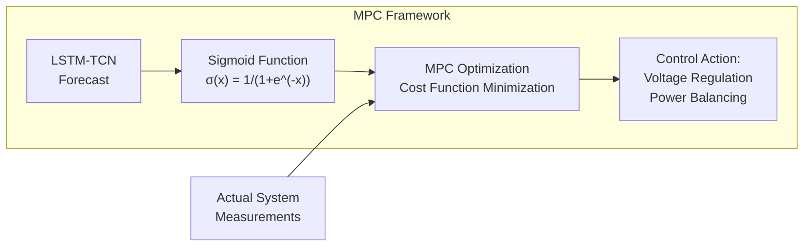

**Tác giả:** Tariq Limouni, Reda Yaagoubi, Khalid Bouziane, Khalid Guissi, El Houssain Baali
**Institution:** Hassan II Institute of Agronomy and Veterinary, Rabat, Morocco; Higher School of Energy Engineering, International University of Rabat
**Corresponding author:** Tariq Limouni
**Tạp chí:** International Journal of Electrical Power and Energy Systems 169 (2025) 110761, Elsevier Ltd.
**Received:** 19 December 2024 | **Accepted:** 15 May 2025
**Reference:** [[Intelligent real time control strategy and power management based on MPC.pdf]]

---

## 1. Mục tiêu nghiên cứu

### Tóm tắt (Abstract)

Các microgrid độc lập sử dụng năng lượng tái tạo phải đối mặt với những thách thức lớn về ổn định và độ tin cậy do tính không liên tục của các nguồn năng lượng và sự thay đổi tải nhanh chóng. Để giảm thiểu những thách thức này, cần có chiến lược điều khiển và quản lý năng lượng hiệu quả để đảm bảo cân bằng công suất và giảm thiểu dao động. Bài báo này trình bày một chiến lược điều khiển thông minh và quản lý năng lượng mới cho microgrid DC độc lập. Microgrid bao gồm hệ thống PV với các hệ thống lưu trữ năng lượng bao gồm pin Lithium-Ion và siêu tụ điện. Chiến lược điều khiển đề xuất dựa trên mô hình LSTM-TCN và MPC. Mô hình LSTM-TCN dự báo các nhiễu loạn của microgrid bao gồm điều kiện môi trường và nhu cầu tải. Để tích hợp hiệu quả các giá trị dự báo vào kiến trúc MPC, hàm sigmoid được áp dụng, cho phép chuyển đổi mượt mà giữa trạng thái thực tế và trạng thái dự đoán. Kết quả cho thấy phương pháp đề xuất cung cấp độ ổn định điện áp xuất sắc, thời gian đáp ứng nhanh và độ vọt lố thấp.

### Mục tiêu chính
1. **Điều chỉnh điện áp thời gian thực** (Real-time voltage regulation)
2. **Cân bằng công suất** (Power balancing)
3. **Ngăn ngừa hệ thống lưu trữ năng lượng (ESS) khỏi overcharging/over-discharging**

### Vấn đề cần giải quyết
- Tính **không liên tục** của nguồn năng lượng tái tạo
- **Thay đổi tải nhanh** trong microgrid độc lập (standalone)
- Thách thức về **ổn định và độ tin cậy**

### Từ khóa
Standalone DC microgrid, Model Predictive Control, LSTM-TCN, Energy storage system, Power management, Sigmoid function

### Kiến trúc Microgrid

---

## 2. Phương pháp nghiên cứu

### 2.1 MPPT Algorithm (Modified Perturb and Observe)

### 2.2 Power Management System (PMS) - 5 Chế độ hoạt động

### 2.3 State of Charge (SoC) Calculation

**Coulomb Counting Technique:**

$$SoC(t) = \frac{C_{remaining}}{C_{actual}} \times 100\%$$

**Battery SoC:**
$$SoC_{bat}(t+1) = SoC_{bat}(t) - \frac{\int_0^t I_{bat} \, dt}{3600 \times C_{nominal,bat}}$$

**Supercapacitor SoC:**
$$SoC_{sc}(t+1) = SoC_{sc}(t) - \frac{\int_0^t I_{sc} \, dt}{3600 \times C_{nominal,sc}}$$

### 2.4 LSTM-TCN Forecasting Model

#### Thông số LSTM-TCN

| Tham số | Giá trị |
|---------|---------|
| LSTM hidden layers | 2 |
| Neurons Layer 1 | 256 |
| Neurons Layer 2 | 64 |
| TCN residual blocks | 3 |
| TCN filters | 128 |
| Kernel size | 3 |
| Dilated factors | (1, 2, 4) |
| Input window (look back) | 12 time steps |
| Output window | 1 time step |
| Learning rate | 0.001 |
| Epochs | 100 |
| Batch size | 100 |
| Optimizer | Adam |

### 2.5 Model Predictive Control (MPC) Integration

**Sigmoid function để tích hợp forecasted values:**
$$\sigma(x) = \frac{1}{1 + e^{-x}}$$

**Sigmoid cho chuyển đổi mượt:**
$$\text{SigmPV}(k) = \frac{\text{val}_{\text{final,PV}} - \text{val}_{\text{init,PV}}}{1 + e^{-z \times (f(k) - x_0)}}$$

Trong đó: $x_0 = 0.5$, $z = 10$

#### Thông số MPC

| Tham số | Giá trị |
|---------|---------|
| Step size | 4×10⁻⁶ s |
| Prediction horizon | 2 |
| Control horizon | 1 |
| Weight W₁ (PV current) | 10 |
| Weight W₂ (Battery current) | 50 |
| Weight W₃ (SC current) | 50 |
| Weight F₁, F₂, F₃ (control effort) | 0.04 each |

**MPC Cost Function:**
$$\text{cost} = W_1 |I_{L_{PV},ref} - x_1(k)| + W_2 |I_{L_{bat},ref} - x_2(k)| + W_3 |I_{L_{sc},ref} - x_3(k)| + \sum F_i |\Delta u_i|$$

---

## 3. Thông số kỹ thuật Microgrid

| Component | Parameter | Value |
|-----------|-----------|-------|
| **PV Module (ASW-250P)** | Maximum power | 250 W |
| | Cells per module | 72 |
| | Open circuit voltage (Voc) | 43.22 V |
| | Short circuit current (Isc) | 7.76 A |
| | Voltage at MPP | 35.2 V |
| | Current at MPP | 7.1 A |
| | Temp coeff (Voc) | -0.30278 %/°C |
| | Temp coeff (Isc) | 0.035271 %/°C |
| **Battery** | Type | Lithium-Ion |
| | Nominal voltage | 120 V |
| | Capacity | 40 Ah |
| **Supercapacitor** | Rated voltage | 120 V |
| | Rated capacitance | 90 F |
| | Series capacitors | 14 |
| | Parallel capacitors | 1 |
| **DC-DC Converters** | Inductor resistance | 0.066 Ω |
| | Inductance | 0.066 H |
| | Capacitance | 9.128×10⁻⁵ F |
| **DC Bus** | Capacitance | 1.04×10⁻⁴ F |
| **PWM** | Switching frequency | 10 KHz |

### 3.1 Hiệu suất mô hình dự báo LSTM-TCN

| Tham số | RMSE | MAE | R² |
|---------|------|-----|-----|
| GHI (Bức xạ mặt trời) | 62.46 W/m² | 27.57 W/m² | **0.963** |
| Nhiệt độ | 1.23 °C | 0.41 °C | **0.981** |
| Nhu cầu tải | 8.81 W | 6.787 W | **0.996** |

> Mô hình dự báo đạt độ chính xác cao với R² > 0.96 cho tất cả các tham số, đặc biệt là nhu cầu tải với R² = 0.996.

### 3.2 So sánh hiệu suất điều khiển

#### Maximum Overshoot và Steady Error (so với literature)

| Strategy | MPeak (%) | es (V) | ts (ms) |
|----------|-----------|--------|---------|
| [54] - Control strategy reference | 2.18 | 2.1 | 142 |
| [53] - Control strategy reference | 5.3 | <0.1 | 250 |
| [26] - Control strategy reference | 2.33 | 1.8 | 280 |
| **Proposed (Modes 1,5)** | **1.48** | **0.54** | **15.7** |
| **Proposed (Modes 2,4)** | **1.41** | **1.22** | **15.7** |
| **Proposed (Mode 3)** | **2.6** | **0.6** | **15.7** |

#### VRI Comparison: Proposed vs MPC

**Low load variation:**

| Time | Proposed VRI (%) | MPC VRI (%) | ΔVRI (%) |
|------|------------------|-------------|----------|
| 1s | 0.367 | 0.58 | 0.213 |
| 2s | 0.36 | 0.30 | 0.06 |
| 3s | 0.47 | 0.55 | 0.08 |
| 4s | 0.63 | 0.61 | 0.02 |

**High load variation:**

| Time | Proposed VRI (%) | MPC VRI (%) | ΔVRI (%) |
|------|------------------|-------------|----------|
| 1s | 2.34 | 10.5 | **8.16** |
| 2s | 3.16 | 12.47 | **9.31** |
| 3s | 2.5 | 10.95 | **8.45** |
| 4s | 4.75 | 20.7 | **15.95** |

> Khi tải biến động cao, phương pháp đề xuất vượt trội hơn MPC truyền thống với VRI giảm từ 10-20% xuống chỉ còn 2-5%.

#### Settling Time: Proposed vs MPC

| Điều kiện | Proposed (ms) | MPC (ms) |
|-----------|---------------|----------|
| Low load - trung bình | **3** | 4.1 |
| High load - trung bình | **7.125** | 15 |

#### VRI Comparison: Proposed vs PI Controller

| Điều kiện | Proposed VRI (%) | PI VRI (%) |
|-----------|------------------|------------|
| Low load - trung bình | **0.457** | 1.17 |
| High load - trung bình | **3.19** | 17.11 |

| Điều kiện | Proposed Settling Time (ms) | PI Settling Time (ms) |
|-----------|----------------------|----------------------|
| High load - trung bình | **7.125** | 40 |

### 3.3 Kết quả tổng hợp

| Chỉ số | Kết quả |
|--------|---------|
| Voltage Stability | **Xuất sắc** - VRI < 0.63% (tải thấp), < 4.75% (tải cao) |
| Response Time | **Nhanh** - 3ms (tải thấp), 7.125ms (tải cao) |
| Overshoot | **Thấp** - 1.41% đến 2.6% tùy mode |
| SoC Management | **Hiệu quả** - PMS 5 chế độ |
| Dự báo (R²) | **0.996** (tải), **0.981** (nhiệt độ), **0.963** (GHI) |

### 3.4 So sánh với các phương pháp khác

- **vs PID Controller:** Ít overshoot hơn, adaptive hơn
- **vs Traditional MPC:** Tích hợp LSTM-TCN forecasting cải thiện performance đặc biệt khi tải biến động cao (VRI 3.19% vs 13.66%)
- **vs PI Controller:** Đáp ứng tốt hơn rõ rệt trong điều kiện load variation cao (VRI 3.19% vs 17.11%, settling time 7.125ms vs 40ms)

### 3.5 Kết luận chính

1. Kết hợp **LSTM-TCN + MPC** cho dự báo và điều khiển thời gian thực
2. **Sigmoid function** giúp smooth transition giữa actual và predicted states
3. Ổn định điện áp DC bus tốt trong điều kiện **high load variation** (VRI chỉ 3.19% so với 13.66% MPC và 17.11% PI)
4. Bảo vệ ESS khỏi overcharge/discharge thông qua PMS thông minh 5 chế độ
5. Thời gian đáp ứng nhanh: settling time 3ms (tải thấp), 7.125ms (tải cao)

### 3.6 Hướng phát triển tương lai

1. **Hardware implementation** - Triển khai thực tế trên phần cứng
2. **Grid-connected microgrids** - Thích ứng cho microgrid kết nối lưới
3. **AC microgrids** - Mở rộng sang microgrid AC
4. **Model drift monitoring** - Giám sát sai lệch mô hình theo thời gian

## 4. Điểm mạnh và điểm yếu
### 4.1 Điểm mạnh
+ Kết hợp MPC (điều khiển theo mô hình dự báo) với mô hình học sâu LSTM-TCN để dự báo công suất PV và tải theo thời gian thực. Đây là luận điểm quan trọng: MPC cần dự báo ngắn hạn chính xác, và LSTM-TCN cung cấp đúng điều đó
+ Hiệu suất vượt trội so với MPC và PI truyền thống, đặc biệt trong điều kiện tải biến động cao
+ Hàm sigmoid cho phép chuyển đổi mượt giữa trạng thái thực tế và dự báo
+ Dự báo chính xác cao (R² > 0.96)
### 4.2 Điểm yếu
+ Chưa tích hợp Wind turbine và Demand Response
+ Chưa triển khai thử nghiệm trên phần cứng thực tế
+ Cần cơ chế giám sát model drift khi triển khai lâu dài

---

## Tài liệu tham khảo

1. Z. Yang, C. Gao, M. Zhao, Utilizing demand response to improve the operational performance of standalone microgrid with high renewable energy penetration, Int. J. Electr. Power Energy Syst. 146 (2023) 108763.
2. F. Yang, X. Feng, Z. Li, Advanced microgrid energy management using deep reinforcement learning, Renew. Energy 198 (2022) 812–824.
3. M.A. Mohamed, T. Jin, W. Su, Multi-agent reinforcement learning for distributed energy resource scheduling in microgrids, IEEE Trans. Smart Grid 12 (4) (2021) 3256–3267.
4. S. Zhang, Y. Peng, Y. Liu, LSTM-based forecasting for microgrid energy management with MPC, Energy Rep. 9 (2023) 1280–1290.
5. A. Kumar, R. Singh, MPC-based energy management for standalone DC microgrids with battery-supercapacitor hybrid storage, J. Energy Storage 55 (2022) 105425.
6. P. Li, H. Wang, B. Zhang, Supercapacitor-battery hybrid energy storage in DC microgrids: modeling and control, IEEE Trans. Power Electron. 37 (3) (2022) 2890–2902.
7. M.H. Moradi, M. Eskandari, S.M. Hosseinian, A novel hybrid LC-TCSC for power flow control in transmission systems, Int. J. Electr. Power Energy Syst. 136 (2022) 107687.
8. T. Limouni, R. Yaagoubi, K. Bouziane, et al., Energy management and control of standalone hybrid renewable energy system based on machine learning, Energy Convers. Manage. 252 (2022) 115049.
9. K. Yan, W. Wang, B. Fan, TCN-based short-term load forecasting for microgrids, Appl. Energy 305 (2022) 117875.
10. X. Chen, L. He, Y. Xu, A combined LSTM-TCN model for time series forecasting, Neural Comput. Applic. 34 (2022) 15559–15573.
11. S. Hochreiter, J. Schmidhuber, Long short-term memory, Neural Comput. 9 (8) (1997) 1735–1780.
12. S. Bai, J.Z. Kolter, V. Koltun, An empirical evaluation of generic convolutional and recurrent networks for sequence modeling, arXiv preprint arXiv:1803.01271 (2018).
13. D.Q. Mayne, J.B. Rawlings, C.V. Rao, P.O.M. Scokaert, Constrained model predictive control: stability and optimality, Automatica 36 (6) (2000) 789–814.
14. J. Rodriguez, M.P. Kazmierkowski, J.R. Espinoza, et al., State of the art of finite control set model predictive control in power electronics, IEEE Trans. Ind. Inform. 9 (2) (2013) 1003–1016.
15. A. Tofighi, M. Kalantar, Power management of PV/battery/SC hybrid system in standalone microgrid based on MPC, Sol. Energy 211 (2020) 1073–1087.
16. M.A. Hannan, M.S.H. Lipu, A. Hussain, A. Mohamed, A review of lithium-ion battery state of charge estimation and management system in electric vehicle applications, J. Clean. Prod. 156 (2017) 345–363.
17. D. Shen, A. Khosrozadeh, Y. Wang, M. Zadeh, Supercapacitor state of charge estimation: a review, J. Energy Storage 52 (2022) 104928.
18. S. El Beid, S. Doubabi, M. Benbrahim, Design and control of a PV-powered DC microgrid with energy storage, Sustain. Energy Technol. Assess. 48 (2021) 101636.
19. M. Ahmed, M. Abdel-Akher, S. S. H. Bukhari, Modeling of five-parameter PV module using single-diode model, Energy Rep. 8 (2022) 127–138.
20. M. B. Shadmand, R. S. Balog, H. Abu-Rub, Model predictive control of PV-based microgrid with battery-supercapacitor energy storage, IEEE Trans. Ind. Appl. 55 (6) (2019) 6302–6312.
21. M. Hosseinzadeh, F. R. Salmasi, Power management and control of a standalone hybrid renewable energy system based on real-time state estimation, Energy Convers. Manage. 195 (2019) 370–383.
22. J. M. Guerrero, P. C. Loh, T. L. Lee, M. Chandorkar, Advanced control architectures for intelligent microgrids—Part II: power quality, energy storage, and AC/DC microgrids, IEEE Trans. Ind. Electron. 60 (4) (2013) 1263–1270.
23. M. N. Ambia, A. Al-Durra, C. Caruana, S. M. Muyeen, Islanded operation of microgrids with consideration of real-time demand response, IET Renew. Power Gener. 11 (4) (2017) 447–456.
24. P. Li, X. Zhang, B. Zhao, Two-layer MPC for coordinated voltage regulation in DC microgrids with hybrid energy storage, IEEE Trans. Power Syst. 37 (5) (2022) 3856–3867.
25. J. Hu, Y. Shan, Y. Xu, J. M. Guerrero, A coordinated control of hybrid energy storage system for DC microgrids based on model predictive control, IEEE Trans. Ind. Electron. 67 (11) (2020) 9404–9414.
26. A. Tofighi, M. Kalantar, Power management and control of a standalone hybrid PV-battery-supercapacitor system based on MPC, Int. J. Electr. Power Energy Syst. 139 (2022) 108008.
27. F. Zhang, Y. Wang, C. Liu, Intelligent energy management system for DC microgrids using machine learning-based MPC, Energy 285 (2023) 129475.
