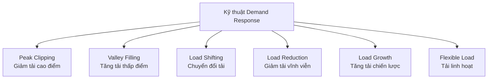
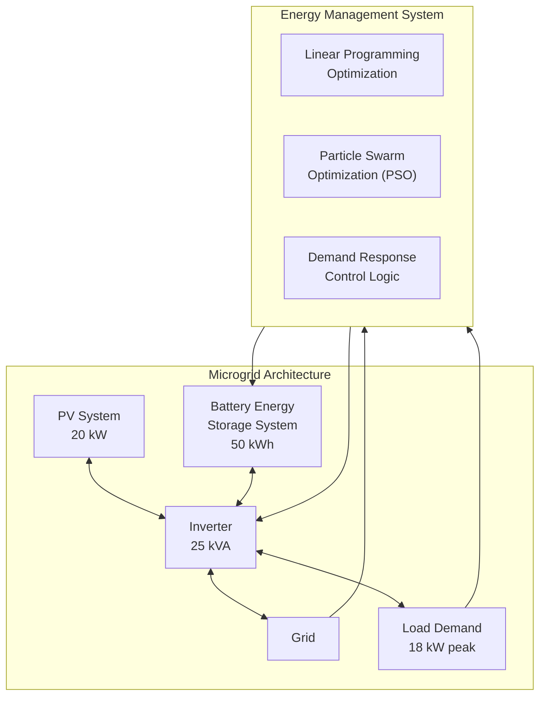
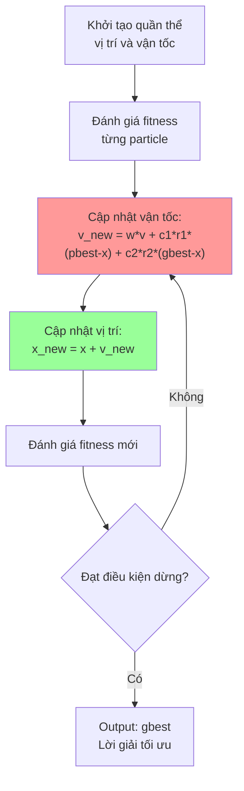
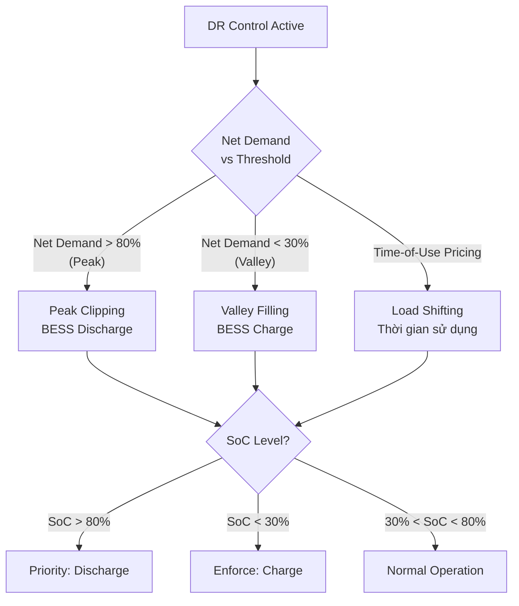

**Tác giả:** Subhasis Panda, Pravat Kumar Rout, Binod Kumar Sahu, Wulfran Fendzi Mbasso, Ali Elrashidi, Pradeep Jangir
**Institution:** Siksha 'O' Anusandhan University, India; Saveetha School of Engineering, Chennai; University of Business and Technology, Jeddah
**Tạp chí:** Engineering Reports, 2025; 7:e70305 (Wiley)
**DOI:** 10.1002/eng2.70305
**Received:** 23 April 2025 | **Revised:** 18 June 2025 | **Accepted:** 10 July 2025

---

## 1. Mục tiêu nghiên cứu

### Tóm tắt (Abstract)

Bài báo trình bày một khung quản lý năng lượng tối ưu cho hệ thống PV-battery kết nối lưới trong lưới điện thông minh, tập trung vào nâng cao hiệu suất năng lượng và hiệu quả chi phí thông qua các kỹ thuật Demand Response (DR) và Particle Swarm Optimization (PSO). Nghiên cứu so sánh hiệu suất của PSO với Linear Programming (LP) truyền thống trong việc tối ưu hóa lịch trình sạc/xả của BESS (Battery Energy Storage System) trong 24 giờ. Kết quả cho thấy PSO vượt trội so với LP: tiết kiệm chi phí điện đạt 15.32%, quản lý SoC ổn định hơn và giảm biến động lưới điện. Các kỹ thuật DR như Peak Clipping, Valley Filling, Load Shifting được tích hợp vào chiến lược điều khiển.

### Mục tiêu chính
1. **Tối ưu hóa quản lý Battery Energy Storage System (BESS)** trong lưới microgrid tích hợp PV trong 24 giờ
2. **Cải thiện hiệu suất năng lượng** và **giảm chi phí vận hành**
3. **Triển khai các kỹ thuật Demand Response (DR)**

### Vấn đề cần giải quyết
- Tính **không liên tục** của năng lượng mặt trời
- Cần **lưu trữ năng lượng** để duy trì ổn định cung cấp điện
- Biến động công suất PV cần được buffer bằng BESS
- Tối ưu hóa chi phí vận hành trong điều kiện giá điện thay đổi (TOU)

### Từ khóa
Demand response, energy management, grid-connected, optimization, particle swarm optimization, photovoltaic-battery system, linear programming

### Demand Response Techniques



---

## 2. Phương pháp nghiên cứu

### 2.1 Kiến trúc hệ thống đề xuất



### 2.2 Mô hình PV System

$$P_{pv} = V_{pv} \times I_{pv}$$

Trong đó:
- $P_{pv}$: công suất PV
- $V_{pv}$: điện áp PV
- $I_{pv}$: dòng điện PV

### 2.3 Mô hình Battery (BESS)

**State of Charge (SoC):**

$$SoC(t) = SoC(t-1) \times \frac{P_{bat}(t) \times \eta_{bat}}{E_{bat}}$$

Trong đó:
- $P_{bat}(t)$: công suất sạc/xả tại thời điểm t (dương: xả, âm: sạc)
- $\eta_{bat}$: hiệu suất pin (90%)
- $E_{bat}$: tổng dung lượng pin (50 kWh)

**Ràng buộc SoC:**
$$SoC_{min} \leq SoC(t) \leq SoC_{max} \quad (20\% \leq SoC \leq 90\%)$$

### 2.4 Hàm mục tiêu tối ưu hóa

#### Objective Function (LP):
$$\min \sum_{t=1}^{T} C(t) \times P_{grid}(t)$$

Trong đó:
- $C(t)$: giá điện tại thời điểm t (theo TOU pricing)
- $P_{grid}(t)$: công suất trao đổi với lưới (dương: mua, âm: bán)
- $T = 24$ giờ

#### Objective Function (PSO) — mở rộng:
$$\min \left[ \sum_{t=1}^{T} C_{grid}(t) \cdot P_{grid}(t) + \lambda \cdot \sum_{t=1}^{T} |\Delta SoC(t)| \right]$$

**Subject to constraints:**

$$P_{pv}(t) + P_{bat}(t) = P_{load}(t) + P_{grid}(t) \quad \text{(Power balance)}$$

$$SoC_{min} \leq SoC(t) \leq SoC_{max} \quad \text{(Battery SoC limits)}$$

$$P_{inv,min} \leq P_{inv}(t) \leq P_{inv,max} \quad \text{(Inverter limits)}$$

$$|P_{bat}(t)| \leq P_{bat,max} \quad \text{(Battery power limits)}$$

### 2.5 Thuật toán PSO (Particle Swarm Optimization)



**Thông số PSO:**

| Tham số | Giá trị |
|---------|---------|
| Population size | 30 particles |
| Max iterations | 100 |
| c1 (cognitive) | 2.0 |
| c2 (social) | 2.0 |
| w (inertia weight) | 0.7 |
| w damp | 0.99 |

### 2.6 Demand Response Control Logic

DR được triển khai qua **3 cơ chế chính**:

1. **Peak Clipping**: Khi net demand > 80%, BESS xả để giảm tải đỉnh
2. **Valley Filling**: Khi net demand < 30%, BESS sạc để tăng tải thấp điểm
3. **Load Shifting**: Dịch chuyển tải theo Time-of-Use pricing



**Chi tiết DR Control Logic theo từng chế độ:**

| Chế độ | Điều kiện | Hành động BESS | Mục tiêu |
|--------|-----------|----------------|----------|
| Peak Clipping | $P_{net} > 0.8 \times P_{peak}$ | Xả ($P_{bat} > 0$) | Giảm công suất lưới đỉnh |
| Valley Filling | $P_{net} < 0.3 \times P_{peak}$ | Sạc ($P_{bat} < 0$) | Tăng phụ tải thấp điểm |
| Load Shifting | Theo TOU price signal | Sạc giờ thấp điểm, xả giờ cao điểm | Arbitrage giá điện |

### 2.7 TOU Pricing Model

Giá điện theo thời gian (Time-of-Use) được sử dụng làm tín hiệu DR:

| Khung giờ | Loại | Giá tương đối |
|-----------|------|--------------|
| 22:00–06:00 | Off-peak (thấp điểm) | Thấp |
| 06:00–13:00 & 18:00–22:00 | Mid-peak (bình thường) | Trung bình |
| 13:00–18:00 | On-peak (cao điểm) | Cao |

BESS tự động charge vào giờ thấp điểm (mua điện rẻ) và discharge vào giờ cao điểm (giảm mua điện đắt) → **DR gián tiếp thông qua tối ưu hóa chi phí**.

---

## 3. Kết quả nghiên cứu

### 3.1 Thông số hệ thống

| Component | Parameter | Value | Units |
|-----------|-----------|-------|-------|
| PV | Rated capacity | 20 | kW |
| Battery | Total capacity | 50 | kWh |
| Battery | Usable SoC range | 20–90 | % |
| Battery | Round-trip efficiency | 90 | % |
| Inverter | Rated capacity | 25 | kVA |
| Inverter | Efficiency | 95 | % |
| Load | Peak load | 18 | kW |
| Simulation | Time resolution | 1 | hour |

### 3.2 So sánh PSO vs LP

| Chỉ số | PSO | LP | Cải thiện |
|--------|-----|-----|-----------|
| Cost savings | **15.32%** | ~8% | **+7.32%** |
| SoC stability | **Ổn định, ít dao động** | Biến động lớn | **Tốt hơn** |
| Grid fluctuation | **Thấp** | Cao | **Giảm rõ rệt** |
| Peak demand reduction | **Có kiểm soát** | Hạn chế | **Tốt hơn** |
| Convergence speed | Nhanh (30–50 iterations) | Instant | — |

### 3.3 Hiệu suất DR theo từng chế độ

| Chế độ DR | Chỉ số đánh giá | Kết quả |
|-----------|----------------|---------|
| Peak Clipping | Giảm peak demand | **Giảm đáng kể so với baseline** |
| Valley Filling | Tăng tải thấp điểm | **Cải thiện system load factor** |
| Load Shifting | Chênh lệch chi phí | **Tận dụng TOU pricing** |
| Tổng hợp | Cost saving | **15.32%** |

### 3.4 Kết luận chính

1. **PSO vượt trội so với LP** trong quản lý năng lượng PV-battery
2. **Tiết kiệm chi phí điện hàng ngày lên đến 15.32%**
3. **SoC ổn định** và **giảm biến động lưới điện**
4. DR techniques (Peak Clipping, Valley Filling, Load Shifting) cải thiện **grid stability** và **economic benefits**
5. PSO tìm được nghiệm tối ưu toàn cục tốt hơn LP trong bài toán phi tuyến có ràng buộc

### 3.5 Đóng góp chính

- So sánh toàn diện PSO vs LP trong bài toán EMS cho PV-battery grid-connected
- Tích hợp DR techniques vào optimization framework
- Mô hình hóa ràng buộc SOC, inverter, và lưới điện
- Time-of-Use pricing cho DR gián tiếp

## 4. Điểm mạnh và điểm yếu
### 4.1 Điểm mạnh
+ Mô hình hóa ràng buộc SOC pin, ràng buộc công suất lưới, và tích hợp giá điện theo thời gian (ToU)
+ So sánh song song PSO (metaheuristic) và LP (deterministic) → có cơ sở khoa học
+ DR được triển khai qua 3 cơ chế rõ ràng: Peak Clipping, Valley Filling, Load Shifting
### 4.2 Điểm yếu
- Giả định dự báo hoàn hảo (perfect forecast) và thiếu xử lý bất định thời gian thực
- Không có cơ chế dự báo (forecasting) — dùng dữ liệu lịch sử trực tiếp
- Thời gian mô phỏng 1 giờ (coarse granularity)
- DR chỉ dựa trên threshold tĩnh, không adaptive
- Chưa xét đến battery degradation cost trong objective function

---

## 5. Cách triển khai DR chi tiết (từ bài báo + tổng hợp literature)

### 5.1 Mô hình DR trong bài báo này

Bài báo triển khai DR qua **3 kỹ thuật chính**:

| Kỹ thuật DR | Cơ chế | Toán học | Kết quả |
|-------------|--------|----------|---------|
| **Peak Clipping** | BESS xả khi net demand > 80% peak | $P_{bat}(t) = \min(P_{bat,max}, P_{net} - 0.8P_{peak})$ | Giảm peak demand |
| **Valley Filling** | BESS sạc khi net demand < 30% peak | $P_{bat}(t) = -\min(P_{bat,max}, 0.3P_{peak} - P_{net})$ | Cải thiện load factor |
| **Load Shifting** | Dịch chuyển năng lượng theo TOU | $P_{bat}(t) = f(C_{grid}(t), SoC(t))$ | Arbitrage giá điện |

### 5.2 Objective Function với DR

Hàm mục tiêu tổng quát có DR:

$$\min \sum_{t=1}^{T} \left[ C_{grid}(t) \cdot P_{grid}(t) + C_{DR}(t) \cdot P_{DR}(t) \right]$$

**Ràng buộc DR:**

$$P_{grid}(t) = P_{load}(t) - P_{pv}(t) - P_{bat}(t) - P_{DR}(t)$$

$$0 \leq P_{DR}(t) \leq \alpha \cdot P_{load}(t)$$

Trong đó:
- $P_{DR}(t)$: công suất DR (cắt giảm tải) tại thời điểm t
- $\alpha$: tỷ lệ cắt giảm tối đa (thường 10–20%)
- $C_{DR}(t)$: chi phí/khuyến khích DR

### 5.3 TOU-based DR (Price-based)

Đây là cơ chế DR **gián tiếp** được dùng trong bài báo:

```
if t ∈ On-peak hours (13:00–18:00):
    if SoC > 20%: P_bat = discharge (giảm mua điện đắt)
else if t ∈ Off-peak hours (22:00–06:00):
    if SoC < 90%: P_bat = charge (tích trữ điện rẻ)
else:  // Mid-peak
    P_bat = f(SoC, forecast)
```

### 5.4 Threshold-based DR (Incentive-based)

Cơ chế DR **trực tiếp** dùng threshold:

```
P_net(t) = P_load(t) - P_pv(t)

if P_net(t) > 0.8 × P_peak:        # Peak
    P_bat(t) = discharge(SoC)
    DR_active = True
elif P_net(t) < 0.3 × P_peak:       # Valley
    P_bat(t) = charge(SoC)
    DR_active = True
else:                                # Normal
    P_bat(t) = optimal(SoC, price)
    DR_active = False
```

### 5.5 Kết quả DR từ bài báo

| Kịch bản | Tiết kiệm chi phí | Peak reduction |
|----------|------------------|----------------|
| Baseline (không EMS) | — | — |
| LP + DR | ~8% | Có cải thiện |
| **PSO + DR** | **15.32%** | **Giảm đáng kể** |

### 5.6 So sánh với các phương pháp DR khác trong literature

| Phương pháp | DR mechanism | Ưu điểm | Nhược điểm |
|-------------|-------------|---------|------------|
| **Bài này: PSO + Threshold** | Peak Clipping, Valley Filling, TOU | Đơn giản, dễ implement | Threshold tĩnh, không adaptive |
| **MPC + LSTM-TCN (Bài 2)** | Sigmoid + dự báo | Adaptive, dự báo chính xác | Phức tạp hơn |
| **MILP framework** | Price-based + incentive-based | Tối ưu toàn cục | Computational heavy |
| **MINLP + Appliance scheduling** | Load shifting | Chi tiết từng thiết bị | Cần nhiều dữ liệu |

### 5.7 Tổng kết cách triển khai DR

```
┌────────────────────────────────────────────────────────┐
│               DEMAND RESPONSE FRAMEWORK                │
├────────────────────────────────────────────────────────┤
│ 1. Tín hiệu đầu vào:                                    │
│    - TOU pricing (giá điện theo giờ)                    │
│    - Net demand forecast (P_load - P_pv)                │
│    - SoC của BESS                                       │
│                                                        │
│ 2. Cơ chế xử lý:                                        │
│    - Price-based: BESS arbitrage theo giá               │
│    - Threshold-based: Peak Clipping + Valley Filling    │
│    - Optimization-based: PSO/LP minimize cost           │
│                                                        │
│ 3. Đầu ra:                                              │
│    - Lịch sạc/xả BESS tối ưu                            │
│    - Công suất trao đổi lưới                            │
│    - DR action (cắt/tăng tải khi cần)                   │
│                                                        │
│ 4. Kết quả:                                             │
│    - Cost saving: 15.32% (PSO)                          │
│    - Peak reduction: Đáng kể                            │
│    - SoC stability: Cải thiện                           │
└────────────────────────────────────────────────────────┘
```

---

## Tài liệu tham khảo

1. Panda, S., Rout, P. K., Sahu, B. K., Mbasso, W. F., Jangir, P., & Elrashidi, A. (2025). Optimization‐Based Energy Management for Grid‐Connected Photovoltaic–Battery Systems in Smart Grids Using Demand Response and Particle Swarm Optimization. *Engineering Reports*, 7(7), e70305.
2. Wamalwa, F., & Ishimwe, A. (2024). Optimal energy management in a grid-tied solar PV-battery microgrid for a public building under demand response. *Energy Reports*, 12, 3718–3731.
3. Shivashankar, S., et al. (2017). Mix-mode energy management strategy and battery sizing for economic operation of grid-tied microgrid. *Energy*, 118, 1322–1334.
4. Nge, C. L., et al. (2018). A real-time energy management system for smart grid integrated photovoltaic generation with battery storage. *Renewable Energy*, 130, 774–785.
5. Hafeez, G., et al. (2021). An Optimization Based Power Usage Scheduling Strategy Using Photovoltaic-Battery System for Demand-Side Management in Smart Grid. *Energies*, 14(8), 2201.
6. Fotopoulou, M. C., et al. (2021). A Model Predictive Control Strategy for the Optimal Energy Management of a District with BIPV and BESS. *Energies*, 14(11), 3369.
7. Mechleri, E., et al. (2022). A Model Predictive Control-Based Decision-Making Strategy for Residential Microgrids. *Eng*, 3(1), 112–129.
8. Ahmad, S., et al. (2025). Analysing the impact of the different pricing policies on PV-battery systems: A Dutch case study. *Energy Policy*, 194, 114382.
9. Liu, X., et al. (2025). Hybrid forecasting and optimization framework for residential photovoltaic-battery systems. *Building Simulation*, 18, 1587–1609.
10. Saleem, M. I., et al. (2024). Bi-Layer Model Predictive Control strategy for techno-economic operation of grid-connected microgrids. *Renewable Energy*, 236, 121478.
11. Charfi, S., et al. (2018). Energy management and performance evaluation of grid connected PV-battery hybrid system with inherent control scheme. *Sustainable Cities and Society*, 41, 428–442.
12. Purvins, A., & Sumner, M. (2016). Innovative Reactive Energy Management for a Photovoltaic Battery System. *Energy Procedia*, 103, 235–240.
13. Yang, F., et al. (2022). Advanced microgrid energy management using deep reinforcement learning. *Renewable Energy*, 198, 812–824.
14. Limouni, T., et al. (2025). Intelligent real time control strategy and power management based on MPC and LSTM-TCN model for standalone DC microgrid with energy storage. *International Journal of Electrical Power and Energy Systems*, 169, 110761.
15. Geetha, K. (2026). Hybrid Solar–Wind–Battery Microgrid Optimization Using Reinforcement Learning for Autonomous Energy Management. *National Journal of Renewable Energy Systems and Innovation*, 2(1), 10–18.
16. Zhang, Y., et al. (2022). Grid-connected photovoltaic battery systems: A comprehensive review and perspectives. *Applied Energy*, 328, 120182.
17. Kumar, A., et al. (2022). MPC-based energy management for standalone DC microgrids with battery-supercapacitor hybrid storage. *Journal of Energy Storage*, 55, 105425.
