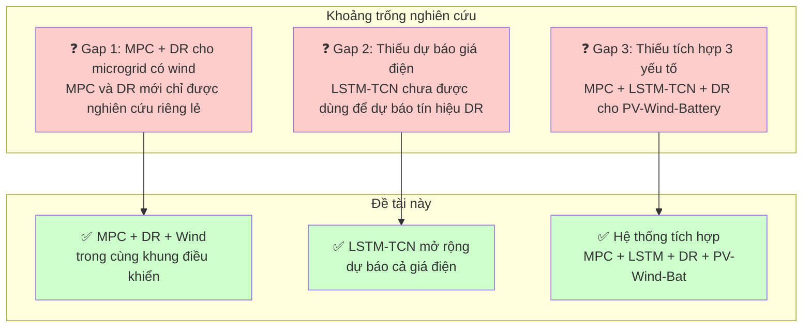

# CHƯƠNG 1: GIỚI THIỆU TỔNG QUAN

> ✅ **Cập nhật:** Citations đã đồng bộ với REFERENCES_MASTER.md (số [1]–[55])

---

## 1.1 Đặt vấn đề

Trong bối cảnh biến đổi khí hậu ngày càng nghiêm trọng và các nguồn năng lượng hóa thạch đang dần cạn kiệt, việc chuyển dịch sang năng lượng tái tạo (NLTT) đã trở thành một xu hướng tất yếu trên toàn cầu. Theo báo cáo "Renewable Energy Statistics 2025" của Cơ quan Năng lượng Tái tạo Quốc tế (IRENA), năng lượng tái tạo chiếm 29,9% sản lượng điện toàn cầu vào năm 2023, đạt 8.928 TWh. Đáng chú ý, năng lượng mặt trời và gió (variable renewables) chiếm 13,2% tổng sản lượng điện toàn cầu, với tốc độ tăng trưởng 15,7% so với năm 2022 [1]. Báo cáo "Renewables 2025" của Cơ quan Năng lượng Quốc tế (IEA) cho thấy công suất NLTT toàn cầu đạt mức kỷ lục 800 GW mới được bổ sung trong năm 2025, trong đó riêng điện mặt trời chiếm hơn 75% (trên 600 GW) [2].

Tuy nhiên, việc tích hợp các nguồn năng lượng tái tạo có tính không liên tục (intermittent) như mặt trời và gió vào lưới điện đặt ra những thách thức to lớn về độ ổn định và tin cậy. Công suất phát từ pin mặt trời phụ thuộc vào cường độ bức xạ và nhiệt độ, trong khi công suất gió biến động theo tốc độ gió — cả hai đều mang tính ngẫu nhiên và khó dự báo chính xác. Điều này dẫn đến sự mất cân bằng giữa cung và cầu, gây dao động tần số và điện áp trên lưới điện [7].

Microgrid (lưới điện nhỏ) đã nổi lên như một giải pháp hiệu quả để tích hợp NLTT phân tán vào hệ thống điện. Microgrid là một hệ thống điện cục bộ có thể hoạt động độc lập (islanded) hoặc kết nối với lưới điện chính (grid-connected), bao gồm các nguồn phát phân tán, hệ thống lưu trữ năng lượng và phụ tải [12]. Thị trường microgrid toàn cầu được định giá 40,4 tỷ USD vào năm 2024 và dự kiến đạt 240,6 tỷ USD vào năm 2035, với tốc độ tăng trưởng kép (CAGR) 17,6% [53]. Sự tăng trưởng này được thúc đẩy bởi nhu cầu ngày càng cao về khả năng phục hồi năng lượng, giảm phụ thuộc vào lưới điện tập trung và các chính sách hỗ trợ NLTT từ các chính phủ trên thế giới.

Bên cạnh đó, Demand Response (DR — đáp ứng nhu cầu) đã trở thành một công cụ quan trọng trong quản lý năng lượng thông minh. DR là các chương trình khuyến khích người tiêu dùng thay đổi hành vi sử dụng điện để đáp ứng với tín hiệu giá hoặc điều kiện lưới điện [4]. Thị trường smart demand response toàn cầu đạt 24,74 tỷ USD vào năm 2024 và dự kiến đạt 89,18 tỷ USD vào năm 2032, với CAGR 17,33% [54]. Sự phát triển của DR đặc biệt quan trọng trong bối cảnh tích hợp NLTT tỷ trọng cao, khi khả năng điều chỉnh phía tải giúp giảm áp lực lên hệ thống trong giờ cao điểm.

Để quản lý microgrid hiệu quả, các phương pháp điều khiển tiên tiến như Model Predictive Control (MPC) đã được nghiên cứu và ứng dụng rộng rãi. MPC là phương pháp điều khiển dựa trên mô hình, sử dụng cửa sổ dự báo trượt (receding horizon) để tối ưu hóa tín hiệu điều khiển trong tương lai dựa trên dự báo trạng thái hệ thống [5]. Kết hợp với các mô hình dự báo học sâu như LSTM-TCN (Long Short-Term Memory — Temporal Convolutional Network), MPC có thể tận dụng dự báo chính xác về bức xạ mặt trời, tốc độ gió và nhu cầu tải để đưa ra quyết định điều khiển tối ưu [9].

Từ những phân tích trên, đề tài "Nghiên cứu điều khiển theo thời gian thực cho hệ PV–Wind–Battery với Demand Response trong Microgrid thông minh" được đề xuất nhằm kết hợp ưu điểm của MPC điều khiển thời gian thực, LSTM-TCN dự báo chính xác, và DR linh hoạt để xây dựng một hệ thống quản lý năng lượng thông minh, hiệu quả và tin cậy cho microgrid kết nối lưới.

---

## 1.2 Mục tiêu nghiên cứu

### 1.2.1 Mục tiêu tổng quát

Xây dựng chiến lược điều khiển thời gian thực tích hợp Demand Response cho microgrid PV–Wind–Battery kết nối lưới, sử dụng MPC kết hợp với mô hình dự báo LSTM-TCN nhằm tối ưu hóa hiệu suất năng lượng, giảm chi phí vận hành và nâng cao độ ổn định hệ thống.

### 1.2.2 Mục tiêu cụ thể

1. **Mô hình hóa hệ thống** microgrid PV–Wind–Battery kết nối lưới: xây dựng mô hình toán học cho các thành phần PV (mô hình 5-parameter single-diode), wind turbine (mô hình parametric), battery (Coulomb counting) và cân bằng công suất lưới.

2. **Xây dựng mô hình dự báo LSTM-TCN** mở rộng: dự báo đồng thời bức xạ mặt trời (GHI), nhiệt độ, tốc độ gió, nhu cầu tải và giá điện — phục vụ cho cả MPC lẫn DR.

3. **Thiết kế bộ điều khiển MPC** với khả năng tích hợp Demand Response: xây dựng hàm mục tiêu có các thành phần chi phí năng lượng (price-based DR), khuyến khích cắt giảm đỉnh (incentive-based DR) và các ràng buộc vận hành.

4. **Phát triển thuật toán Demand Response động**: kết hợp 3 cơ chế DR (Price-based TOU, Peak Clipping, Valley Filling) với cơ chế sigmoid integration để chuyển đổi mượt giữa các trạng thái.

5. **Mô phỏng và đánh giá**: so sánh hiệu suất của phương pháp đề xuất với các phương pháp điều khiển truyền thống (rule-based, MPC không DR) qua các chỉ số VRI, chi phí vận hành, tỷ lệ sử dụng NLTT và thời gian đáp ứng.

---

## 1.3 Đối tượng và phạm vi nghiên cứu

### 1.3.1 Đối tượng nghiên cứu

- **Hệ thống microgrid** kết nối lưới bao gồm: hệ thống pin mặt trời PV (20 kWp), turbine gió (10 kW), hệ thống lưu trữ battery (50 kWh) và bộ inverter hai chiều (30 kVA).
- **Phương pháp điều khiển**: Model Predictive Control (MPC) với cửa sổ dự báo trượt.
- **Mô hình dự báo**: LSTM-TCN (Long Short-Term Memory — Temporal Convolutional Network).
- **Chiến lược Demand Response**: Price-based (TOU), incentive-based (Peak Clipping, Valley Filling).

### 1.3.2 Phạm vi nghiên cứu

- **Phạm vi hệ thống**: Microgrid AC kết nối lưới (grid-connected), bus AC 380V/50Hz, DC bus 800V.
- **Phạm vi điều khiển**: Điều khiển giám sát (supervisory/energy management level) với tần số lấy mẫu 1 giờ cho vòng lặp EMS, không bao gồm điều khiển chi tiết ở tầng converter (switching level).
- **Phạm vi mô phỏng**: Mô phỏng trên MATLAB/Simulink trong 24–168 giờ, với dữ liệu thời tiết và tải mô phỏng dựa trên dữ liệu thực tế.
- **Phạm vi DR**: Các chương trình DR dựa trên giá điện TOU và ngưỡng tải — không bao gồm DR tham gia thị trường điện bán buôn.
- **Giới hạn**: Giả định hệ thống không xét đến chi phí suy giảm battery (battery degradation cost) và không triển khai trên phần cứng thực tế.

---

## 1.4 Phương pháp nghiên cứu

Nghiên cứu được thực hiện theo quy trình gồm 7 giai đoạn:

| Giai đoạn | Nội dung | Phương pháp | Công cụ |
|-----------|----------|-------------|---------|
| **G1** | Xây dựng mô hình vật lý PV–Wind–Battery–Grid | Mô hình hóa toán học dựa trên các công thức vật lý và thông số kỹ thuật từ tài liệu tham khảo | MATLAB/Simulink |
| **G2** | Xây dựng Power Management System (PMS) 6-mode | Phân tích trạng thái hoạt động, xây dựng luật chuyển mode dựa trên ngưỡng SoC và công suất | Flowchart, State machine |
| **G3** | Huấn luyện mô hình dự báo LSTM-TCN | Học sâu (deep learning), min-max scaling, sliding window | Python (TensorFlow/Keras) |
| **G4** | Thiết kế bộ điều khiển MPC | Lý thuyết điều khiển tối ưu, receding horizon, state-space model | MATLAB MPC Toolbox |
| **G5** | Tích hợp Demand Response | Xây dựng DR logic dựa trên TOU pricing + threshold; tích hợp sigmoid function vào MPC | MATLAB |
| **G6** | Mô phỏng và đánh giá | Chạy kịch bản so sánh (5 kịch bản), phân tích 6 KPI | MATLAB/Simulink |
| **G7** | Phân tích kết quả và viết báo cáo | So sánh định lượng, phân tích độ nhạy | — |

**Tiếp cận kế thừa từ các nghiên cứu trước:**

- Kế thừa cấu trúc **MPC + LSTM-TCN** từ công trình của Limouni et al. [9] — một trong những nghiên cứu đầu tiên kết hợp hiệu quả LSTM-TCN với MPC cho microgrid DC.
- Kế thừa cơ chế **Demand Response (Peak Clipping, Valley Filling, Load Shifting)** từ công trình của Panda et al. [10] — nghiên cứu so sánh PSO và LP với DR cho PV-battery grid-connected.
- Bổ sung **mô hình wind turbine** dựa trên mô hình parametric từ Saint-Drenan et al. [13] — mô hình power curve mở cho pitch-regulated horizontal axis wind turbine.
- **Điểm mới**: Kết hợp DR (vốn chỉ dùng với PSO/LP trong [10]) vào khung MPC (vốn không có DR trong [9]), đồng thời thêm wind turbine vào hệ thống PV-battery hiện có.

---

## 1.5 Research Gap

Qua khảo sát các công trình nghiên cứu liên quan, có thể xác định các khoảng trống nghiên cứu (research gaps) như sau:

**Hình 1.1:** Ba khoảng trống nghiên cứu và cách đề tài này giải quyết từng khoảng trống.

### 1.5.1 Các công trình liên quan

| Công trình | Hệ thống | Phương pháp | DR | Grid-connected | Wind |
|-----------|----------|-------------|:--:|:--------------:|:----:|
| Limouni et al. (2025) [9] | PV–Battery–SC | **MPC + LSTM-TCN** | ❌ | ❌ (standalone) | ❌ |
| Panda et al. (2025) [10] | PV–Battery | PSO + LP | ✅ | ✅ | ❌ |
| Geetha (2026) [11] | PV–Wind–Battery | Reinforcement Learning | ❌ | ❌ | ✅ |
| Wamalwa & Ishimwe (2024) [38] | PV–Battery (building) | MINLP | ✅ | ✅ | ❌ |
| Nwe & Swe (2026) [26] | PV–Wind–Battery | **MPC** | ❌ | ✅ | ✅ |
| Saleem et al. (2024) [24] | PV–Battery | Bi-layer MPC | ❌ | ✅ | ❌ |
| **Đề tài này** | **PV–Wind–Battery** | **MPC + LSTM-TCN** | **✅** | **✅** | **✅** |

### 1.5.2 Khoảng trống nghiên cứu

1. **MPC chưa được kết hợp với Demand Response cho microgrid có wind:** Trong khi MPC đã được chứng minh hiệu quả cho điều khiển thời gian thực microgrid [9][26], và DR đã được tích hợp thành công với PSO/LP cho PV-battery [10][38], chưa có nghiên cứu nào kết hợp cả MPC, LSTM-TCN và DR trong cùng một khung điều khiển cho hệ thống PV–Wind–Battery.

2. **Thiếu mô hình dự báo tích hợp DR:** Các mô hình dự báo LSTM-TCN hiện tại chỉ tập trung vào dự báo NLTT và tải [9], chưa mở rộng sang dự báo giá điện (electricity price) làm tín hiệu đầu vào cho DR.

3. **Chưa có nghiên cứu nào tích hợp cả 3 yếu tố:** MPC (điều khiển tối ưu thời gian thực) + LSTM-TCN (dự báo chính xác) + Demand Response (linh hoạt phía tải) cho hệ thống PV–Wind–Battery kết nối lưới.

Xuất phát từ những khoảng trống trên, đề tài này đề xuất một khung điều khiển tích hợp MPC với LSTM-TCN và DR, áp dụng cho microgrid PV–Wind–Battery kết nối lưới. Đây là hướng nghiên cứu có tính mới và tiềm năng ứng dụng cao.

---

## 1.6 Cấu trúc báo cáo

Báo cáo được tổ chức thành 6 chương:

**Chương 1: Giới thiệu tổng quan** — Trình bày bối cảnh, đặt vấn đề, mục tiêu nghiên cứu, đối tượng và phạm vi, phương pháp nghiên cứu, research gap và cấu trúc báo cáo.

**Chương 2: Cơ sở lý thuyết** — Trình bày các kiến thức nền tảng về: (2.1) Hệ thống microgrid PV–Wind–Battery, (2.2) Model Predictive Control (MPC), (2.3) Mô hình dự báo LSTM-TCN, (2.4) Demand Response trong năng lượng tái tạo.

**Chương 3: Xây dựng mô hình hệ thống** — Trình bày: (3.1) Kiến trúc microgrid kết nối lưới, (3.2) Mô hình hóa các thành phần, (3.3) Hàm mục tiêu và ràng buộc, (3.4) Tích hợp DR vào MPC.

**Chương 4: Thuật toán điều khiển đề xuất** — Trình bày: (4.1) Thuật toán dự báo LSTM-TCN mở rộng, (4.2) Vòng lặp điều khiển MPC, (4.3) Lập lịch DR động, (4.4) Lưu đồ thuật toán tổng thể.

**Chương 5: Mô phỏng và kết quả** — Trình bày: (5.1) Tham số hệ thống và môi trường mô phỏng, (5.2) Các kịch bản mô phỏng, (5.3) Kết quả mô phỏng theo các chỉ số KPI, (5.4) So sánh giữa các phương pháp, (5.5) Phân tích độ nhạy.

**Chương 6: Kết luận và hướng phát triển** — Tổng kết kết quả đạt được, các hạn chế và đề xuất hướng nghiên cứu tiếp theo.

---

## Tài liệu tham khảo Chương 1

*(Đánh số theo REFERENCES_MASTER.md — xem file riêng để biết đầy đủ 55 tài liệu)*

[1] IRENA (2025). *Renewable energy statistics 2025*.
[2] IEA (2025). *Renewables 2025*.
[4] U.S. Department of Energy (2006). *Benefits of demand response*.
[5] Camacho, E. F., & Bordons, C. (2007). *Model predictive control* (2nd ed.). Springer.
[7] Bevrani, H., Francois, B., & Ise, T. (2017). *Microgrid dynamics and control*. Wiley.
[9] Limouni, T., et al. (2025). MPC and LSTM-TCN for standalone DC microgrid. *IJEPES*, 169, 110761.
[10] Panda, S., et al. (2025). Optimization-Based Energy Management... *Engineering Reports*, 7(7), e70305.
[11] Geetha, K. (2026). Hybrid Solar–Wind–Battery Microgrid Optimization Using RL. *NJRESI*, 2(1), 10–18.
[12] Lasseter, R. H. (2002). MicroGrids. *IEEE PES Winter Meeting*, 1, 305–308.
[13] Saint-Drenan, Y.-M., et al. (2020). A parametric model for wind turbine power curves. *Renewable Energy*, 157, 754–768.
[24] Saleem, M. I., et al. (2024). Bi-Layer MPC. *Renewable Energy*, 236, 121478.
[26] Nwe, H., & Swe, W. (2026). Energy Management of Grid Connected PV-Wind-Battery Using MPC. *IJCS*, 15(1).
[38] Wamalwa, F., & Ishimwe, A. (2024). Optimal energy management... public building under DR. *Energy Reports*, 12, 3718–3731.
[53] Transparency Market Research (2025). *Microgrid Market Report*.
[54] Kings Research (2025). *Smart Demand Response Market Report*.

> 📌 **Ghi chú:** Các số [3], [6], [8], [14]–[23], [25], [27]–[37], [39]–[52], [55] không được trích dẫn trực tiếp trong Chương 1 nhưng có trong REFERENCES_MASTER.md để sử dụng cho các chương sau.
