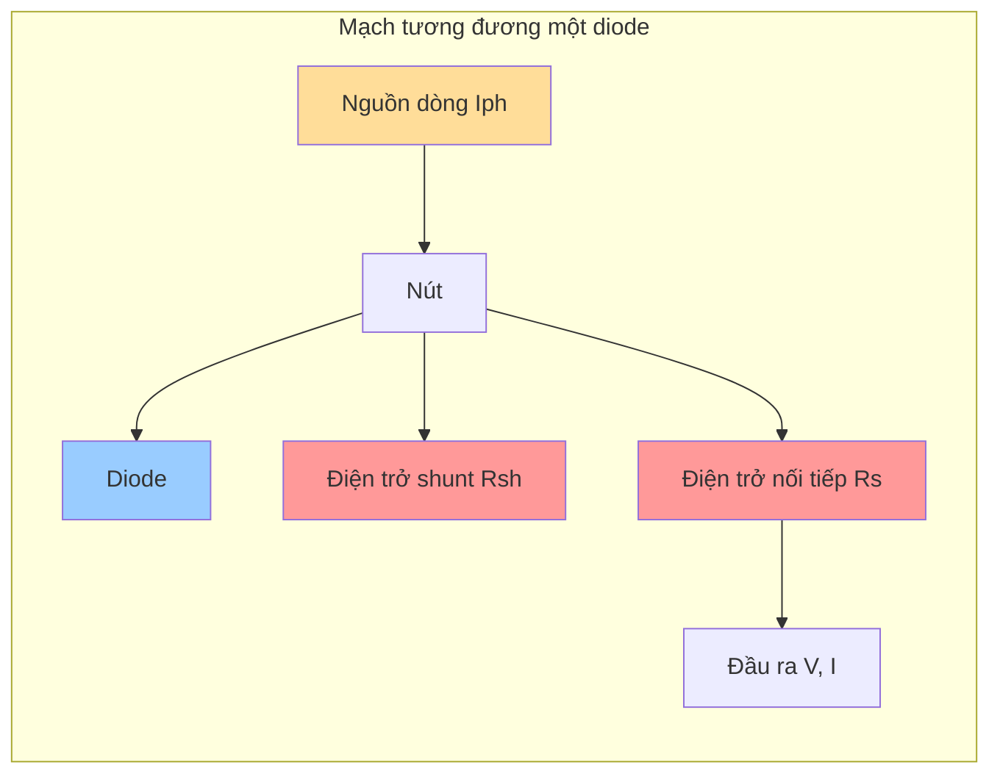
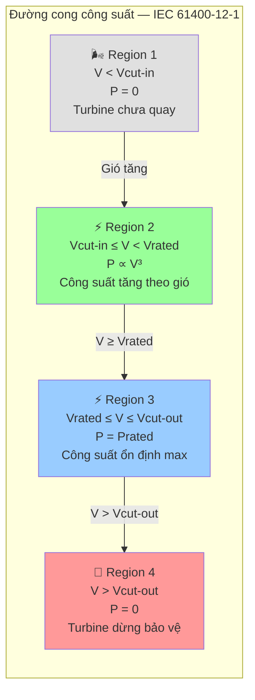
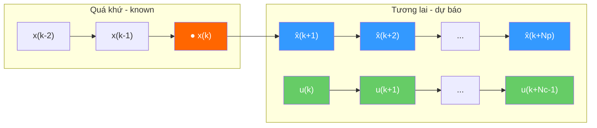
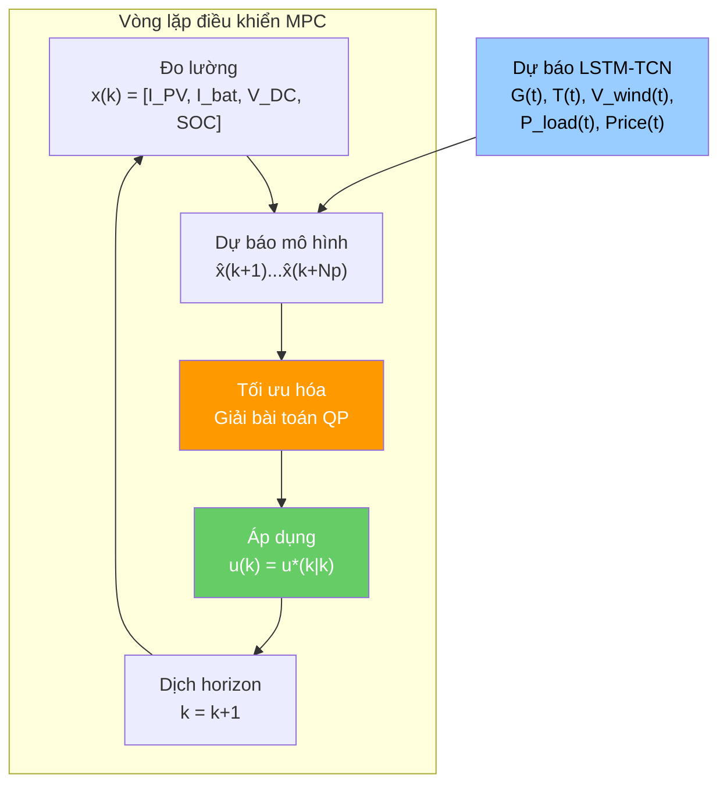
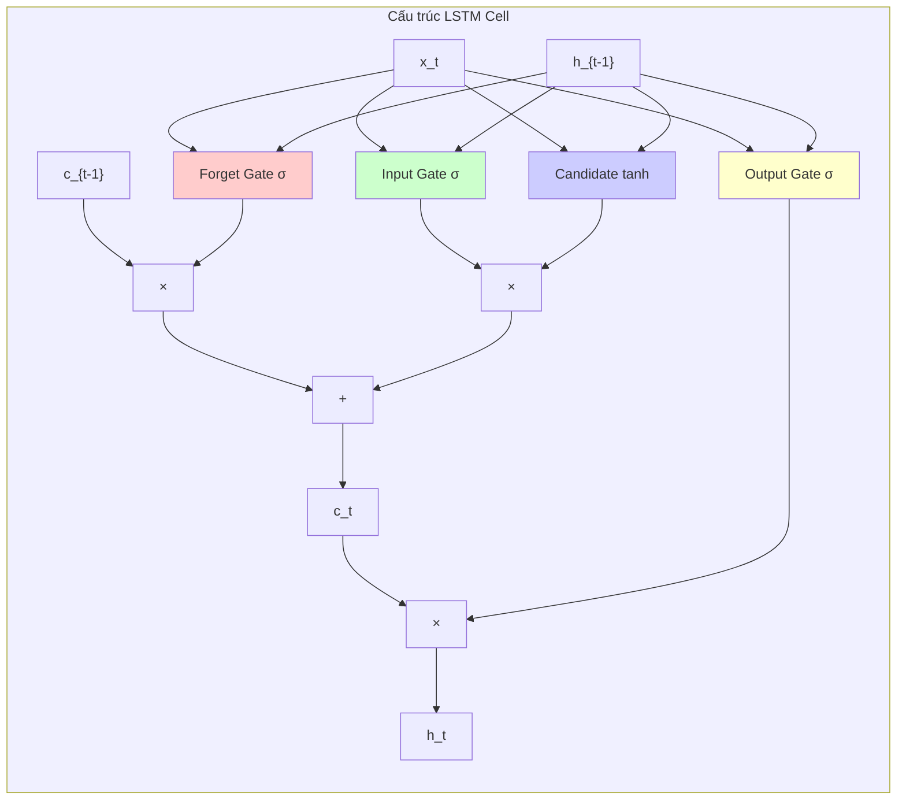
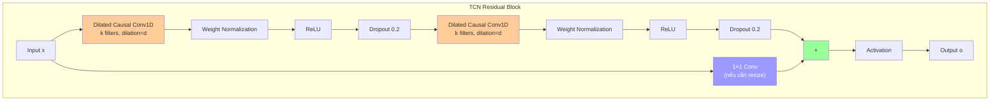
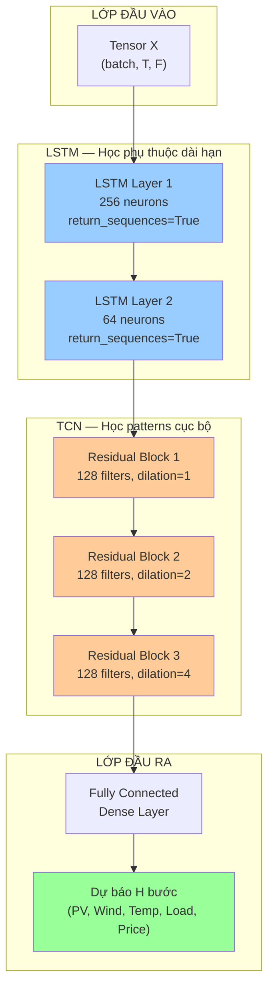
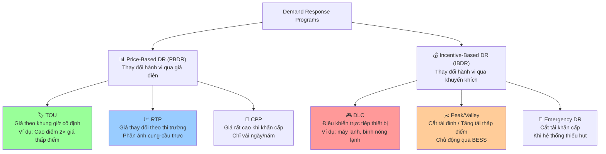

# CHƯƠNG 2: CƠ SỞ LÝ THUYẾT

---

Chương này trình bày các cơ sở lý thuyết nền tảng cho đề tài, bao gồm: (1) mô hình hóa các nguồn năng lượng trong microgrid PV–Wind–Battery, (2) lý thuyết về Model Predictive Control (MPC), (3) kiến trúc mạng LSTM-TCN cho bài toán dự báo chuỗi thời gian, và (4) các khái niệm về Demand Response (DR) trong hệ thống điện. Các nội dung này là nền tảng để xây dựng mô hình hệ thống ở Chương 3 và thuật toán điều khiển đề xuất ở Chương 4.

---

## 2.1 Hệ thống PV–Wind–Battery Microgrid

### 2.1.1 Mô hình PV

Mô hình PV được sử dụng phổ biến nhất trong các công cụ mô phỏng là **mô hình một diode 5 tham số** (single-diode 5-parameter model) [15][16]. Mô hình này dựa trên mạch tương đương một diode của Shockley, biểu diễn mối quan hệ giữa dòng điện và điện áp đầu ra của module PV.



**Hình 2.1:** Mạch tương đương một diode của module PV [15]. Dòng quang điện $I_{ph}$ được mô hình hóa như một nguồn dòng, song song với diode (đại diện cho tiếp xúc PN) và điện trở shunt $R_{sh}$ (đại diện cho dòng rò). Điện trở nối tiếp $R_s$ đại diện cho tổn hao trên đường dẫn.

**Phương trình đặc tính I-V:**

$$I = I_{ph} - I_0 \left[ \exp\left( \frac{V + I \cdot R_s}{n \cdot V_T} \right) - 1 \right] - \frac{V + I \cdot R_s}{R_{sh}} \tag{2.1}$$

Trong đó:
- $I$: dòng điện đầu ra module (A)
- $V$: điện áp đầu ra module (V)
- $I_{ph}$: dòng quang điện (photocurrent) (A)
- $I_0$: dòng bão hòa ngược của diode (saturation current) (A)
- $R_s$: điện trở nối tiếp (series resistance) (Ω)
- $R_{sh}$: điện trở shunt (shunt resistance) (Ω)
- $n$: hệ số lý tưởng của diode (diode ideality factor)
- $V_T$: điện áp nhiệt (thermal voltage) (V), $V_T = k \cdot T_c / q$ với $k = 1.381 \times 10^{-23}$ J/K, $q = 1.602 \times 10^{-19}$ C

Các tham số này phụ thuộc vào nhiệt độ và bức xạ mặt trời. Dòng quang điện $I_{ph}$ tỷ lệ thuận với cường độ bức xạ và chịu ảnh hưởng của nhiệt độ qua hệ số nhiệt [15]:

$$I_{ph} = \frac{G}{G_{ref}} \cdot \left[ I_{ph,ref} + \mu_{I_{SC}} (T_c - T_{c,ref}) \right] \tag{2.2}$$

Trong bài toán điều khiển và tối ưu hóa, mô hình 5 tham số thường được thay thế bằng mô hình rút gọn để giảm chi phí tính toán [9][10]. Công suất PV được biểu diễn đơn giản dưới dạng:

$$P_{PV} = \eta_{PV} \times A \times G \tag{2.3}$$

Với $\eta_{PV}$ là hiệu suất module (bao gồm tổn hao nhiệt độ, bụi), $A$ là tổng diện tích tấm pin và $G$ là cường độ bức xạ mặt trời. Mô hình rút gọn này phù hợp cho các bài toán MPC yêu cầu tính toán thời gian thực.

### 2.1.2 Mô hình Wind Turbine

Công suất có sẵn trong gió được xác định bởi động năng của luồng không khí đi qua rotor [14]:

$$P_{wind\_available} = \frac{1}{2} \rho A_{rotor} V^3 \tag{2.4}$$

Tuy nhiên, theo giới hạn Betz, tỷ lệ công suất tối đa mà turbine gió có thể trích xuất từ luồng gió là 16/27 ≈ 59,3%. Hệ số này được gọi là hệ số công suất $C_p$, và trong thực tế, $C_p$ của turbine gió thương mại thường đạt 0,35–0,50 [14].

Đường cong công suất của turbine gió theo tiêu chuẩn IEC 61400-12-1 [3] được định nghĩa bởi mối quan hệ giữa tốc độ gió tại độ cao hub và công suất điện đầu ra, bao gồm 4 vùng hoạt động:



**Hình 2.2:** Bốn vùng hoạt động của đường cong công suất turbine gió theo IEC 61400-12-1 [3][14]. Vùng 2 là vùng hoạt động chính, nơi công suất tỷ lệ với lập phương tốc độ gió.

$$\begin{aligned}
&\text{Vùng 1: } V < V_{cut-in} \quad &&\rightarrow P = 0 \\
&\text{Vùng 2: } V_{cut-in} \leq V < V_{rated} \quad &&\rightarrow P = \frac{1}{2}\rho A V^3 C_p \\
&\text{Vùng 3: } V_{rated} \leq V \leq V_{cut-out} \quad &&\rightarrow P = P_{rated} \\
&\text{Vùng 4: } V > V_{cut-out} \quad &&\rightarrow P = 0
\end{aligned} \tag{2.5}$$

Vận tốc gió tại độ cao hub thường được ước lượng từ vận tốc gió đo tại độ cao tham chiếu bằng mô hình lũy thừa (power law) [13][14]:

$$V_{hub} = V_{ref} \cdot \left(\frac{H_{hub}}{H_{ref}}\right)^\alpha \tag{2.6}$$

Với $\alpha$ là hệ số nhám bề mặt, phụ thuộc vào địa hình lắp đặt.

Trong các bài toán tối ưu hóa thời gian thực, mô hình vật lý đầy đủ (2.5) thường được thay thế bằng mô hình cubic rút gọn để giảm chi phí tính toán. Mô hình cubic chuẩn hóa chỉ phụ thuộc vào bốn tham số đầu vào [14]:

$$P_{WT} \approx \begin{cases}
0 & V < V_{cut-in} \\[6pt]
P_{rated} \cdot \left( \dfrac{V - V_{cut-in}}{V_{rated} - V_{cut-in}} \right)^3 & V_{cut-in} \leq V < V_{rated} \\[10pt]
P_{rated} & V_{rated} \leq V \leq V_{cut-out} \\[6pt]
0 & V > V_{cut-out}
\end{cases} \tag{2.7}$$

### 2.1.3 Mô hình Battery

Trạng thái sạc (State of Charge — SoC) của battery là thông số quan trọng nhất trong quản lý năng lượng [17]. Phương pháp ước lượng SoC phổ biến nhất là **Coulomb counting** (đếm điện tích), dựa trên định luật bảo toàn điện tích [17][18].

**Công thức liên tục:**

$$SoC(t) = SoC(t_0) + \frac{1}{C_{rated}} \int_{t_0}^{t} \eta \cdot i(\tau) \, d\tau \tag{2.8}$$

**Công thức rời rạc (sử dụng trong MPC):**

$$SoC(k+1) = SoC(k) + \frac{\eta_{ch} \cdot P_{ch}(k) \cdot \Delta t}{E_{bat}} - \frac{P_{dch}(k) \cdot \Delta t}{\eta_{dch} \cdot E_{bat}} \tag{2.9}$$

Trong đó $SoC$ là phần trăm dung lượng còn lại, $\eta_{ch}$ và $\eta_{dch}$ là hiệu suất sạc và xả, $P_{ch}$ và $P_{dch}$ là công suất sạc/xả, $E_{bat}$ là tổng dung lượng pin.

Battery có các ràng buộc vận hành sau [17]:

- **Giới hạn SOC:** $SoC_{min} \leq SoC(k) \leq SoC_{max}$
- **Giới hạn công suất:** $0 \leq P_{ch}(k) \leq P_{ch,max}$, $0 \leq P_{dch}(k) \leq P_{dch,max}$
- **Ràng buộc loại trừ:** Không được sạc và xả đồng thời ($P_{ch}(k) \cdot P_{dch}(k) = 0$)

### 2.1.4 Cân bằng công suất

Trong một microgrid, tại mọi thời điểm, tổng công suất phát phải bằng tổng công suất tiêu thụ [7][12]. Đối với hệ thống PV–Wind–Battery kết nối lưới, cân bằng công suất được biểu diễn dưới dạng:

$$P_{PV} + P_{WT} + P_{bat} + P_{grid} = P_{load} \tag{2.10}$$

Trong đó:
- $P_{PV}$, $P_{WT}$: công suất phát từ PV và wind turbine ($\geq 0$)
- $P_{bat}$: công suất battery ($> 0$: xả, $< 0$: sạc)
- $P_{grid}$: công suất trao đổi với lưới ($> 0$: mua, $< 0$: bán)
- $P_{load}$: công suất tải tiêu thụ

Khi có sự tham gia của Demand Response (DR), DR là cơ chế điều chỉnh phía tải, làm thay đổi nhu cầu tải hiệu dụng [10]. Phương trình cân bằng công suất khi có DR trở thành:

$$P_{PV} + P_{WT} + P_{bat} + P_{grid} = P_{load} - P_{DR} \tag{2.11}$$

với $P_{DR} > 0$ ứng với cắt giảm tải (Peak Clipping) và $P_{DR} < 0$ ứng với tăng tải (Valley Filling).

---

## 2.2 Model Predictive Control (MPC)

### 2.2.1 Nguyên lý MPC

Model Predictive Control (MPC) là một phương pháp điều khiển tiên tiến sử dụng **mô hình toán học của hệ thống** để dự báo hành vi tương lai và tối ưu hóa tín hiệu điều khiển tại mỗi bước thời gian [5][6]. Không giống như các bộ điều khiển kinh điển (PI, PID) chỉ phản ứng dựa trên sai số hiện tại, MPC chủ động tính toán chuỗi điều khiển tối ưu dựa trên dự báo.

Các ưu điểm chính của MPC:

1. **Xử lý ràng buộc (constraint handling):** MPC có thể đảm bảo các biến trạng thái và biến điều khiển luôn nằm trong giới hạn cho phép.
2. **Điều khiển đa biến (MIMO):** MPC điều khiển đồng thời nhiều biến (dòng, áp, SOC) trong một bài toán tối ưu duy nhất.
3. **Khả năng dự báo:** MPC tận dụng thông tin dự báo để đưa ra quyết định tối ưu, thay vì chỉ phản ứng khi sai số đã xảy ra.
4. **Bù trễ thời gian:** MPC có thể bù được thời gian trễ do tính toán và truyền thông.

### 2.2.2 Cơ chế Receding Horizon

Cơ chế Receding Horizon (dịch chuyển cửa sổ dự báo) là nguyên lý hoạt động cốt lõi của MPC.



**Hình 2.3:** Nguyên lý receding horizon của MPC tại bước thời gian k: (1) đo trạng thái hiện tại $x(k)$, (2) dự báo trạng thái tương lai $\hat{x}(k+N_p)$ dựa trên mô hình, (3) tìm chuỗi điều khiển $u(k)...u(k+N_c-1)$ tối ưu, (4) chỉ áp dụng $u(k)$, (5) dịch horizon và lặp lại.

Receding horizon (dịch chuyển cửa sổ dự báo) là nguyên lý hoạt động cốt lõi của MPC. Tại mỗi bước thời gian $k$, MPC thực hiện chu trình sau [6][8]:

```
Bước 1: Đo trạng thái hiện tại x(k)
Bước 2: Dự báo đầu ra tương lai ŷ(k+1|k)...ŷ(k+Np|k) dựa trên mô hình
Bước 3: Giải bài toán tối ưu trên cửa sổ dự báo Np bước
Bước 4: Chỉ áp dụng tín hiệu điều khiển đầu tiên u(k) = u*(k|k)
Bước 5: Dịch horizon: k ← k+1, quay lại Bước 1
```

Việc chỉ áp dụng tín hiệu đầu tiên và giải lại bài toán ở mỗi bước tạo ra cơ chế **feedback kín (closed-loop)**, giúp MPC thích ứng với sai số mô hình và nhiễu không dự báo được.



**Hình 2.4:** Sơ đồ khối vòng lặp điều khiển MPC. Tại mỗi bước thời gian, MPC nhận giá trị đo lường từ cảm biến và dự báo từ mô hình LSTM-TCN, giải bài toán tối ưu, và chỉ áp dụng tín hiệu điều khiển đầu tiên trước khi dịch horizon.

### 2.2.3 State-Space Model

MPC sử dụng mô hình không gian trạng thái (state-space model) để dự báo hành vi tương lai. Một hệ thống tuyến tính được mô tả bởi [5][6]:

**Dạng rời rạc (discrete-time):**

$$x(k+1) = A \cdot x(k) + B \cdot u(k) + B_d \cdot d(k) \tag{2.12}$$

$$y(k) = C \cdot x(k)$$

Trong đó:
- $x(k) \in \mathbb{R}^{n_x}$: vector trạng thái
- $u(k) \in \mathbb{R}^{n_u}$: vector điều khiển
- $d(k) \in \mathbb{R}^{n_d}$: vector nhiễu (các yếu tố bên ngoài không điều khiển được)
- $A$, $B$, $B_d$, $C$: các ma trận hệ thống

Ý nghĩa của phương trình (2.12) là: trạng thái ở bước tiếp theo được tính từ trạng thái hiện tại, tín hiệu điều khiển và nhiễu đầu vào. Đây là **công thức dự báo** của MPC. Cho phép tính $x(k+1)$ nếu biết $x(k)$ và $u(k)$, rồi tính tiếp $x(k+2)$, $x(k+3)$ cho đến hết prediction horizon.

Trong các hệ thống power electronics, mô hình boost converter được mô tả bởi phương trình vi phân mô tả dòng điện qua cuộn cảm [19]:

$$\frac{dI_L}{dt} = -\frac{r_L}{L} I_L + \frac{V_{in}}{L} - \frac{V_{DC}}{L}(1-U) \tag{2.13}$$

Phương trình này được rời rạc hóa bằng phương pháp Forward Euler để đưa về dạng (2.12).

### 2.2.4 Cost Function và Constraints

Tại mỗi bước thời gian, MPC giải bài toán tối ưu với hàm mục tiêu có dạng tổng quát [8]:

$$J(k) = \underbrace{\sum_{j=1}^{N_p} \left\| y(k+j|k) - y_{ref}(k+j) \right\|_Q^2}_{\text{Sai số bám}} + \underbrace{\sum_{j=0}^{N_c-1} \left\| \Delta u(k+j|k) \right\|_R^2}_{\text{Nỗ lực điều khiển}} \tag{2.14}$$

Bài toán được đưa về dạng Quadratic Programming (QP) chuẩn [21]:

$$\min_{\Delta U} \frac{1}{2} \Delta U^T H \Delta U + f^T \Delta U \quad \text{s.t.} \quad A_{eq}\Delta U = b_{eq}, \; A_{in}\Delta U \leq b_{in} \tag{2.15}$$

Các ràng buộc trong MPC được phân làm hai loại [6]:

- **Ràng buộc cứng (Hard Constraints):** $x_{min} \leq x(k) \leq x_{max}$, $u_{min} \leq u(k) \leq u_{max}$
- **Ràng buộc mềm (Soft Constraints):** Cho phép vi phạm với chi phí phạt, thêm slack variable $\epsilon \geq 0$ để tránh bài toán không feasible.

### 2.2.5 So sánh MPC với các phương pháp khác

| Tiêu chí | PI/PID | MPC |
|----------|--------|-----|
| Xử lý ràng buộc | ❌ Không thể | ✅ Tự nhiên |
| Dự báo | ❌ Chỉ phản ứng | ✅ Chủ động |
| Đa biến (MIMO) | ❌ Từng vòng riêng | ✅ Một bài toán |
| Overshoot | Cao hơn | Thấp hơn [9] |
| Thời gian tính | ~1 μs | ~70 μs (OSQP) [21] |

MPC phù hợp cho bài toán microgrid vì hệ thống có nhiều ràng buộc (dòng, áp, SOC) và đa biến (PV + Wind + Battery). Ngoài ra, MPC có thể tận dụng dự báo từ LSTM-TCN để tối ưu hóa chi phí vận hành.

---

## 2.3 LSTM-TCN Forecasting

### 2.3.1 LSTM cho chuỗi thời gian

Long Short-Term Memory (LSTM) — được giới thiệu bởi Hochreiter & Schmidhuber (1997) [28] — là một biến thể của Recurrent Neural Network (RNN) được thiết kế để giải quyết vấn đề **gradient vanishing/exploding** thông qua cơ chế cổng (gates). Mỗi LSTM cell bao gồm ba cổng điều khiển luồng thông tin và một ô nhớ (cell state) duy trì thông tin dài hạn.

**Cấu trúc một LSTM cell:**

| Gate | Công thức | Chức năng |
|------|-----------|-----------|
| Forget | $f_t = \sigma(W_f \cdot [h_{t-1}, x_t] + b_f)$ | Quyết định thông tin nào cần quên |
| Input | $i_t = \sigma(W_i \cdot [h_{t-1}, x_t] + b_i)$ | Quyết định thông tin nào cập nhật |
| Candidate | $\tilde{c}_t = \tanh(W_c \cdot [h_{t-1}, x_t] + b_c)$ | Giá trị ứng viên mới |
| Cell update | $c_t = f_t \odot c_{t-1} + i_t \odot \tilde{c}_t$ | Cập nhật trạng thái ô nhớ |
| Output | $o_t = \sigma(W_o \cdot [h_{t-1}, x_t] + b_o)$ | Quyết định đầu ra |
| Hidden | $h_t = o_t \odot \tanh(c_t)$ | Trạng thái ẩn mới |



**Hình 2.5:** Cấu trúc chi tiết của một LSTM cell [28]. Ba cổng (forget, input, output) điều khiển luồng thông tin qua ô nhớ $c_t$, cho phép mô hình học các phụ thuộc dài hạn.

LSTM có khả năng học các phụ thuộc dài hạn trong chuỗi thời gian nhờ cơ chế gate cho phép thông tin được giữ lại hoặc loại bỏ một cách có chọn lọc. Điều này đặc biệt hữu ích cho dự báo năng lượng tái tạo, nơi các mẫu hình thời tiết có chu kỳ ngày/đêm và theo mùa [32].

### 2.3.2 TCN Residual Blocks

Temporal Convolutional Network (TCN) được Bai, Kolter & Koltun (2018) [29] giới thiệu như một giải pháp thay thế cho RNN. TCN kết hợp ba kỹ thuật chính:

**1. Causal Convolution:** Đảm bảo đầu ra tại thời điểm $t$ chỉ phụ thuộc vào đầu vào tại các thời điểm $t, t-1, ..., t-k+1$ (không rò rỉ thông tin từ tương lai). Padding được tính bằng:

$$\text{Padding} = (k - 1) \times d \tag{2.16}$$

**2. Dilated Convolution:** Cho phép tăng receptive field mà không tăng số tham số, bằng cách bỏ qua các mẫu theo một khoảng cách dilation $d$. Với exponential dilation $d = 2^i$, receptive field được tính:

$$RFS = 1 + \sum_{i=0}^{L-1} (k - 1) \cdot d_i \tag{2.17}$$

**3. Residual Connection:** Kết nối tắt (skip connection) giúp ổn định gradient khi network sâu. Output của residual block:

$$o = \text{Activation}(x + F(x)) \tag{2.18}$$



**Hình 2.6:** Cấu trúc residual block của TCN [29]. Mỗi block gồm 2 dilated causal convolution layers với weight normalization, ReLU, dropout và skip connection.

### 2.3.3 Kiến trúc lai LSTM-TCN

Dựa trên literature, có ba cách kết hợp LSTM và TCN [9][32][34]:

| Kiểu | Mô tả | Đặc điểm |
|------|-------|----------|
| **Sequential: LSTM → TCN** | LSTM học long-term dependencies, TCN học local patterns | Được chọn trong đề tài [9] |
| Sequential: TCN → LSTM | TCN trích xuất features, LSTM học dependencies | Phù hợp dữ liệu có nhiễu cao |
| Parallel: LSTM \|\| TCN | Hai nhánh độc lập, concatenate features | Tăng độ chính xác nhưng nặng tính toán |



**Hình 2.7:** Kiến trúc Sequential LSTM → TCN [9][29]. LSTM học các phụ thuộc dài hạn trong chuỗi thời gian (256→64 neurons), sau đó TCN với 3 residual blocks trích xuất các patterns cục bộ bằng dilated causal convolution.

Kiến trúc Sequential LSTM → TCN hoạt động như sau:

- **Đầu vào:** Tensor $X \in \mathbb{R}^{batch \times T \times F}$ với $T$ bước thời gian và $F$ features
- **LSTM:** Trích xuất đặc trưng tuần tự, output là chuỗi hidden states
- **TCN:** Áp dụng dilated causal convolution trên chuỗi hidden states để học local patterns
- **Đầu ra:** Dự báo các giá trị tương lai

Kiến trúc này được đánh giá cao trong lĩnh vực năng lượng nhờ khả năng kết hợp ưu điểm của cả LSTM (học phụ thuộc dài hạn) và TCN (song song hóa tính toán, ổn định gradient) [32][34]. Nghiên cứu của Limouni et al. [9] đã chứng minh hiệu quả của kiến trúc này trong dự báo công suất PV và tải cho microgrid, với hệ số xác định $R^2 > 0,96$ cho tất cả các tham số dự báo.

---

## 2.4 Demand Response trong năng lượng tái tạo

### 2.4.1 Tổng quan về Demand Response

Demand Response (DR) được định nghĩa là sự thay đổi hành vi tiêu thụ điện của khách hàng để đáp ứng với các tín hiệu giá hoặc các chương trình khuyến khích [4][40]. DR đóng vai trò quan trọng trong việc cân bằng cung cầu, giảm peak demand và tối ưu hóa vận hành lưới điện.

Phân loại DR dựa trên cơ chế tác động:



**Hình 2.8:** Phân loại các chương trình Demand Response [4][40]. Đề tài này sử dụng TOU (price-based) và Peak/Valley (incentive-based).

### 2.4.2 Price-Based DR (TOU, RTP)

**Price-based DR** khuyến khích khách hàng thay đổi hành vi tiêu thụ thông qua tín hiệu giá điện [42][43]. Các chương trình phổ biến gồm:

- **Time-of-Use (TOU):** Giá điện được chia thành các khung giờ cố định (cao điểm, thấp điểm, bình thường). Đây là cơ chế phổ biến nhất và dễ triển khai.
- **Real-Time Pricing (RTP):** Giá điện thay đổi theo từng giờ hoặc theo thị trường điện. Phản ánh chính xác chi phí sản xuất điện tại từng thời điểm.
- **Critical Peak Pricing (CPP):** Giá rất cao trong một số giờ khẩn cấp (thường vài ngày/năm).

Mối quan hệ giữa giá điện và nhu cầu tiêu thụ được mô hình hóa thông qua **hệ số co giãn giá** (price elasticity) [40][44]:

$$\varepsilon_{m,n} = \frac{\Delta q_m / q_m^0}{\Delta p_n / p_n^0} \tag{2.19}$$

Trong đó $\varepsilon_{m,n}$ là hệ số co giãn giữa giờ $m$ và $n$. Khi $m = n$, đó là self-elasticity (giá trị âm: giá tăng → tiêu thụ giảm). Khi $m \neq n$, đó là cross-elasticity (giá trị dương: giá một giờ tăng → tải chuyển sang giờ khác).

### 2.4.3 Incentive-Based DR

**Incentive-based DR** khuyến khích khách hàng cắt giảm hoặc dịch chuyển tải thông qua các khoản thanh toán trực tiếp [38][41]. Các cơ chế phổ biến:

- **Direct Load Control (DLC):** Nhà vận hành có thể trực tiếp điều khiển thiết bị của khách hàng (ví dụ: máy điều hòa, bình nước nóng) trong thời gian ngắn.
- **Peak Clipping:** Cắt giảm tải khi nhu cầu vượt quá ngưỡng cho phép.
- **Valley Filling:** Tăng tải vào thời điểm thấp điểm để cải thiện hệ số tải.

Hai cơ chế Peak Clipping và Valley Filling đặc biệt phù hợp với microgrid có battery storage [10]. Khi áp dụng DR với battery:

- **Peak Clipping:** $P_{DR} > 0$ — giảm công suất tải đỉnh bằng cách xả battery
- **Valley Filling:** $P_{DR} < 0$ — tăng công suất tải thấp điểm bằng cách sạc battery từ lưới

### 2.4.4 Mô hình hóa DR trong bài toán tối ưu

DR được tích hợp vào bài toán tối ưu hóa năng lượng theo hai cách [10][38]:

**Cách 1 — Price-based DR (gián tiếp):** Giá điện TOU được đưa vào hàm mục tiêu:

$$\min \sum C_{TOU}(t) \cdot P_{grid}(t) \cdot \Delta t \tag{2.20}$$

Khi giá điện cao, MPC có xu hướng giảm $P_{grid}$ (mua ít hơn) bằng cách xả battery.

**Cách 2 — Incentive-based DR (trực tiếp):** Thêm ràng buộc và phần thưởng DR vào bài toán tối ưu:

$$J_{DR} = -\sum \lambda_{DR}(t) \cdot P_{DR}(t) \cdot \Delta t \tag{2.21}$$

Với ràng buộc:
- Peak Clipping: $0 \leq P_{DR} \leq \alpha \cdot P_{load}$
- Valley Filling: $-\beta \cdot P_{load} \leq P_{DR} \leq 0$

Hai cơ chế này thường được kết hợp: price-based DR làm nền tảng, incentive-based DR ghi đè khi cần thiết để đảm bảo độ tin cậy của hệ thống [45][46].

---

## Tài liệu tham khảo Chương 2

> Các số tham khảo tương ứng với danh mục tài liệu tham khảo tổng hợp trong **REFERENCES_MASTER.md**.

| Số | Tài liệu |
|:--:|:---------|
| [3] | IEC 61400-12-1:2022 |
| [4] | US DoE (2006). *Benefits of demand response*. Report to Congress. |
| [5] | Camacho & Bordons (2007). *Model predictive control* (2nd ed.). Springer. |
| [6] | Rawlings, Mayne & Diehl (2017). *Model predictive control: Theory and design*. Nob Hill. |
| [7] | Bevrani, Francois & Ise (2017). *Microgrid dynamics and control*. Wiley. |
| [8] | Bemporad, Morari & Ricker (2020). *MPC Toolbox User's Guide*. MathWorks. |
| [9] | **Limouni et al. (2025).** *IJEPES*, 169, 110761. |
| [10] | **Panda et al. (2025).** *Engineering Reports*, 7(7), e70305. |
| [12] | Lasseter (2002). MicroGrids. *IEEE PES Winter Meeting*. |
| [13] | Saint-Drenan et al. (2020). *Renewable Energy*, 157, 754–768. |
| [14] | Villanueva & Feijóo (2023). *Energies*, 16(1), 180. |
| [15] | Sandia Labs (2024). *Single diode equivalent circuit models*. PVPMC. |
| [16] | PVsyst (2024). *Standard one-diode model*. |
| [17] | Mocera & Somà (2024). *Batteries*, 10(1), 34. |
| [18] | Pattipati et al. (2021). *Energies*, 14(14), 4074. |
| [19] | **Shan et al. (2019).** *IEEE Trans. Sustainable Energy*, 10(4), 1823–1833. |
| [21] | **Stellato et al. (2020).** *Math. Prog. Comp.*, 12(4), 637–672. |
| [28] | **Hochreiter & Schmidhuber (1997).** *Neural Computation*, 9(8), 1735–1780. |
| [29] | **Bai, Kolter & Koltun (2018).** *arXiv:1803.01271*. |
| [32] | Lara-Benítez et al. (2021). *Int. J. Neural Systems*, 31(3), 2130001. |
| [34] | Wang et al. (2024). *Frontiers in Energy Research*, 12, 1384142. |
| [38] | Wamalwa & Ishimwe (2024). *Energy Reports*, 12, 3718–3731. |
| [40] | Imani et al. (2025). *Demand Response Modeling in Microgrid Operation: A Review*. SciSpace. |
| [41] | Zaitsev et al. (2025). *Scientific Reports*, 15, 86232. |
| [42] | Energies (2018). *Energies*, 11(11), 3258. |
| [43] | Energies (2023). *Energies*, 16(23), 7858. |
| [44] | Energies (2025). *Energies*, 18(10), 2637. |
| [45] | Energies (2025). *Energies*, 18(24), 6484. |
| [46] | Energies (2021). *Energies*, 14(19), 6333. |
