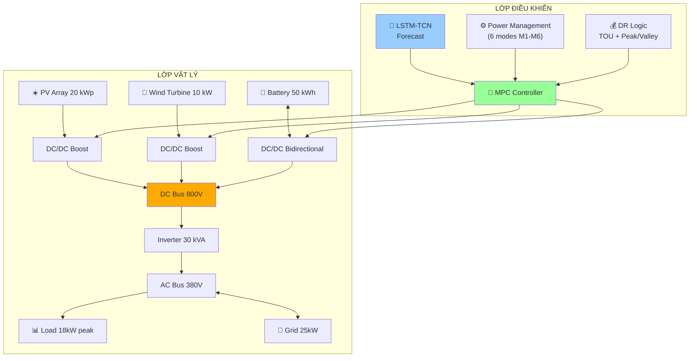
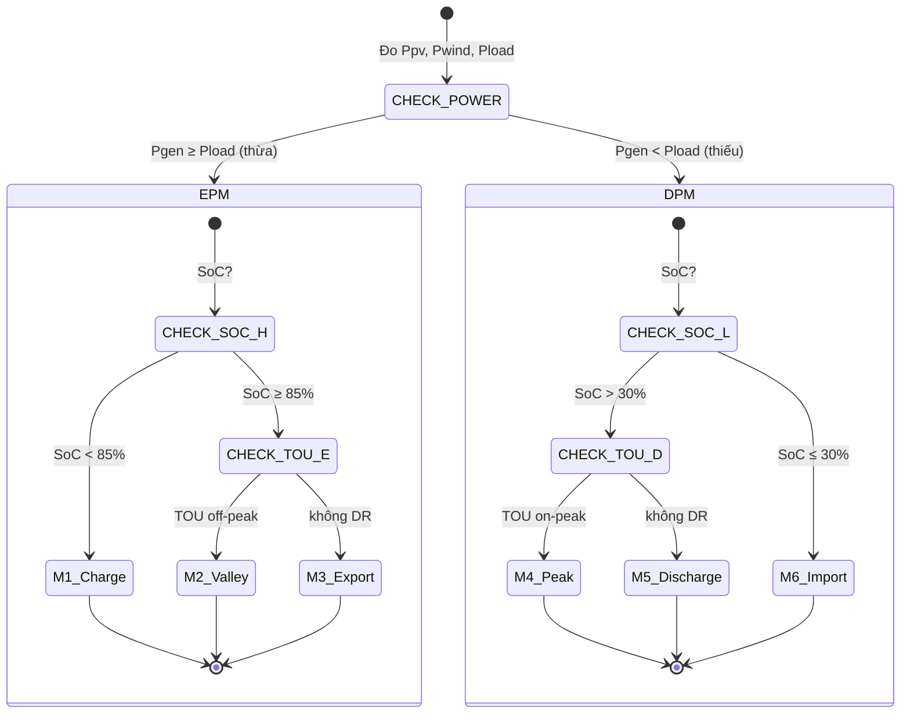
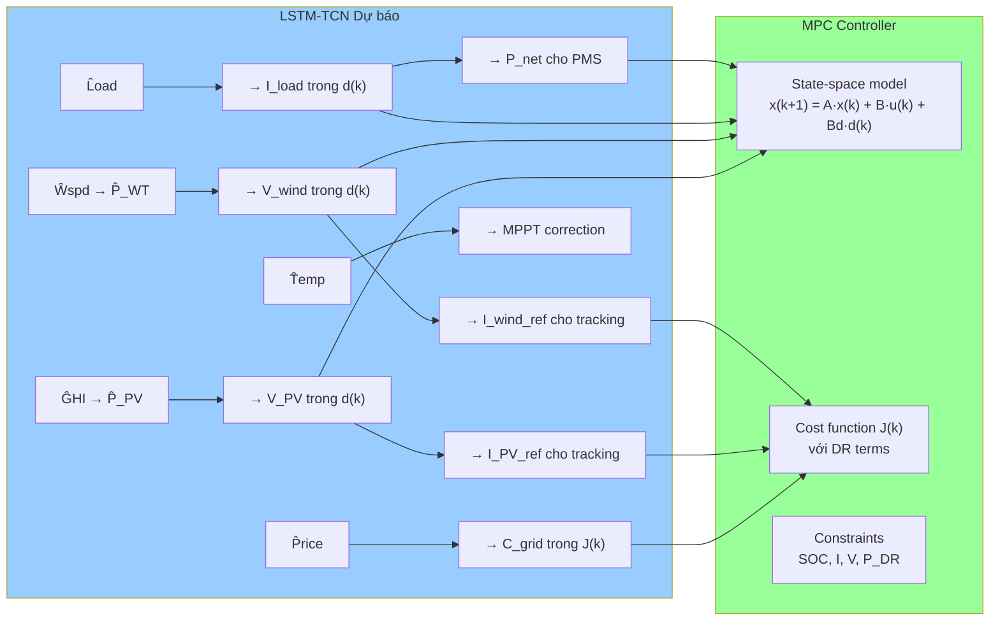
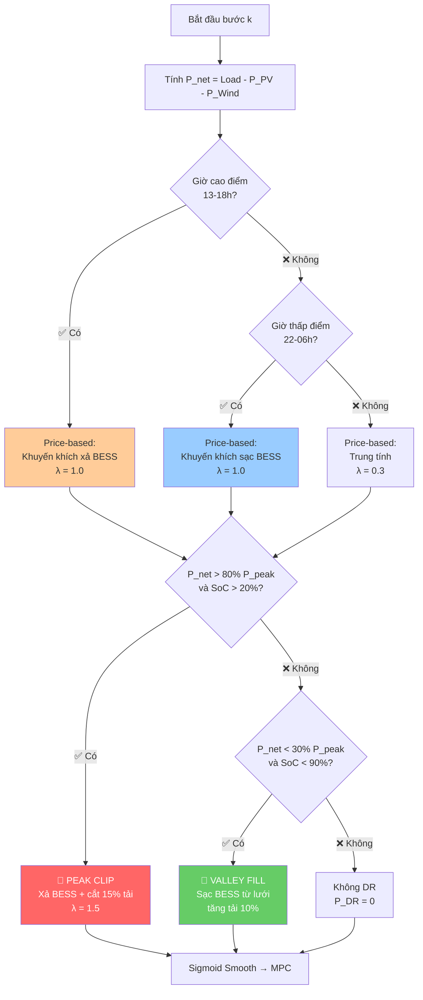
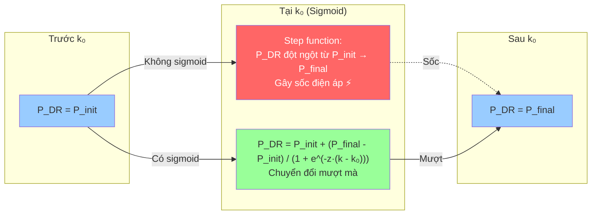

# CHƯƠNG 3: XÂY DỰNG MÔ HÌNH HỆ THỐNG

---

## 3.1 Kiến trúc microgrid kết nối lưới

### 3.1.1 Sơ đồ tổng thể hệ thống

Hệ thống microgrid trong đề tài này là một microgrid lai ghép nối lưới (grid-connected hybrid microgrid) bao gồm các nguồn năng lượng tái tạo (PV, wind turbine), hệ thống lưu trữ năng lượng (battery), và khả năng trao đổi công suất với lưới điện quốc gia [7][12]. Hình 3.1 mô tả kiến trúc tổng thể của hệ thống.

```
  ☀️ PV ARRAY              💨 WIND TURBINE              🔋 BATTERY
 20 kWp, 80 modules        10 kW, rotor 7m             50 kWh, 120V
     │                          │                          │
     ▼                          ▼                          ▼
 ┌─────────┐              ┌─────────┐              ┌────────────┐
 │  DC/DC  │              │  DC/DC  │              │  DC/DC Bi  │
 │  Boost  │              │  Boost  │              │  directional│
 │  PV→DC  │              │  W→DC   │              │  Bat↔DC    │
 └────┬────┘              └────┬────┘              └─────┬──────┘
      │                        │                         │
      └────────────────────────┼─────────────────────────┘
                               │
                        ┌──────▼───────┐
                        │   DC BUS     │
                        │   800 V      │
                        └──────┬───────┘
                               │
                        ┌──────▼──────────┐
                        │   INVERTER      │
                        │   30 kVA        │
                        │   DC ↔ AC      │
                        └──────┬──────────┘
                               │
                        ┌──────▼──────────┐
                        │   AC BUS        │
                        │   380 V / 50 Hz │
                        └──────┬──────────┘
                               │
              ┌────────────────┼────────────────┐
              │                │                │
              ▼                ▼                ▼
        ┌──────────┐    ┌──────────┐    ┌──────────────┐
        │  TẢI     │    │  LƯỚI    │    │  DR Control  │
        │ 18 kW    │    │  ĐIỆN    │    │  (Peak/Valley)│
        │ peak     │    │  25 kW   │    │              │
        └──────────┘    │ max in/  │    └──────────────┘
                        │ out      │
                        └──────────┘

   Hình 3.1: Sơ đồ khối kiến trúc microgrid PV–Wind–Battery kết nối lưới
```

### 3.1.2 Nguyên lý hoạt động



**Hình 3.2:** Kiến trúc tổng thể hệ thống gồm lớp vật lý (PV, wind, battery, inverter, lưới) và lớp điều khiển (LSTM-TCN, PMS, DR, MPC).

Hệ thống vận hành dựa trên sự phối hợp giữa các nguồn năng lượng và lưới điện, được điều khiển bởi **Power Management System (PMS)** gồm 6 chế độ (M1–M6) [49][52]. PMS chia làm hai super-mode dựa trên dấu của công suất thực $P_{net}$:

$$P_{net}(t) = P_{load}(t) - P_{PV}(t) - P_{wind}(t) \tag{3.1}$$

**Excess Power Mode (EPM):** Khi $P_{net} < 0$, tổng phát lớn hơn tải, năng lượng dư thừa được dùng để sạc pin hoặc xuất lên lưới.

**Deficit Power Mode (DPM):** Khi $P_{net} > 0$, tổng phát không đủ đáp ứng tải, pin xả hoặc lưới bù vào.

| Ký hiệu | Giá trị | Mô tả |
|---------|---------|-------|
| $P_{PV}$ | 0–20 kW | Công suất phát từ PV |
| $P_{wind}$ | 0–10 kW | Công suất phát từ wind turbine |
| $P_{bat}$ | -25–25 kW | Công suất battery (dương: xả, âm: sạc) |
| $P_{grid}$ | -25–25 kW | Công suất trao đổi lưới (dương: mua, âm: bán) |
| $P_{DR}$ | -10–15% tải | Công suất Demand Response |
| $P_{load}$ | 0–18 kW | Nhu cầu tải |

### 3.1.3 Chi tiết 6 chế độ PMS

Cơ chế hoạt động của PMS có thể được biểu diễn dưới dạng state machine như Hình 3.3:



**Hình 3.3:** State machine của PMS với 6 chế độ vận hành M1–M6. EPM (Excess Power Mode) khi thừa năng lượng, DPM (Deficit Power Mode) khi thiếu.

Bảng 3.1 trình bày 6 chế độ hoạt động của PMS, được xác định bởi super-mode (EPM/DPM), trạng thái SOC và tín hiệu giá điện.

**Bảng 3.1: 6 chế độ vận hành của PMS**

| Mode | Super-mode | Điều kiện kích hoạt | Hành động | DR? |
|------|-----------|--------------------|-----------|:---:|
| **M1** | EPM | $P_{gen} \geq P_{load}$ và $SoC < 85\%$ | Sạc battery từ surplus | ❌ |
| **M2** | EPM | $P_{gen} \geq P_{load}$ và $SoC \geq 85\%$ và TOU off-peak | Sạc battery từ lưới (giá rẻ) | ✅ |
| **M3** | EPM | $P_{gen} \geq P_{load}$ và $SoC \geq 85\%$ và không DR | Xuất surplus lên lưới | ❌ |
| **M4** | DPM | $P_{gen} < P_{load}$ và $SoC > 30\%$ và TOU on-peak | Xả battery + cắt tải 15% | ✅ |
| **M5** | DPM | $P_{gen} < P_{load}$ và $SoC > 30\%$ và không DR | Xả battery bù thiếu hụt | ❌ |
| **M6** | DPM | $P_{gen} < P_{load}$ và $SoC \leq 30\%$ | Nhập từ lưới | ❌ |

---

## 3.2 Mô hình hóa các thành phần

### 3.2.1 Hệ thống PV

Mô hình PV sử dụng trong bài toán điều khiển là mô hình rút gọn, phù hợp với yêu cầu tính toán thời gian thực của MPC:

$$P_{PV}(t) = \eta_{PV} \times A \times G(t) \tag{3.2}$$

Trong đó:
- $P_{PV}(t)$: công suất PV tại thời điểm t (W)
- $\eta_{PV}$: hiệu suất module PV (bao gồm tổn hao nhiệt độ, bụi)
- $A$: tổng diện tích bề mặt tấm pin (m²)
- $G(t)$: cường độ bức xạ mặt trời (W/m²)

Module PV được chọn là **ASW-250P** [9]. Hệ thống gồm 80 module, tổng công suất 20 kWp [10].

**Bảng 3.2: Thông số PV**

| Tham số | Ký hiệu | Giá trị | Đơn vị |
|---------|---------|---------|--------|
| Công suất cực đại mỗi module | $P_{max}$ | 250 | W |
| Số tế bào mỗi module | $N_{cs}$ | 72 | — |
| Điện áp hở mạch | $V_{oc}$ | 43.22 | V |
| Dòng ngắn mạch | $I_{sc}$ | 7.76 | A |
| Điện áp tại MPP | $V_{mp}$ | 35.2 | V |
| Dòng tại MPP | $I_{mp}$ | 7.1 | A |
| Hệ số nhiệt Voc | $\mu_{V_{OC}}$ | -0.30278 | %/°C |
| Hệ số nhiệt Isc | $\mu_{I_{SC}}$ | 0.035271 | %/°C |
| Số module (hệ thống 20 kWp) | — | 80 | module |

Điện áp đầu ra của PV ở dạng rút gọn được tính từ công suất và dòng điện:

$$V_{PV}(t) = \frac{P_{PV}(t)}{I_{PV}(t)} \tag{3.3}$$

### 3.2.2 Hệ thống Wind Turbine

Wind turbine là thành phần bổ sung mới cho đề tài (không xuất hiện trong hai bài báo tham khảo chính [9][10]). Công suất phát được mô hình hóa bằng mô hình cubic rút gọn, phù hợp với yêu cầu tính toán nhanh của MPC [14]:

$$P_{WT}(t) \approx \begin{cases}
0 & V_{hub}(t) < V_{cut-in} \\[6pt]
P_{rated} \cdot \left( \dfrac{V_{hub}(t) - V_{cut-in}}{V_{rated} - V_{cut-in}} \right)^3 & V_{cut-in} \leq V_{hub}(t) < V_{rated} \\[10pt]
P_{rated} & V_{rated} \leq V_{hub}(t) \leq V_{cut-out} \\[6pt]
0 & V_{hub}(t) > V_{cut-out}
\end{cases} \tag{3.4}$$

Khác với mô hình vật lý đầy đủ ($P = \frac{1}{2}\rho A V^3 C_p$) cần ước lượng mật độ không khí $\rho$, diện tích quét rotor $A_{rotor}$ và hệ số công suất $C_p$, mô hình cubic rút gọn chỉ phụ thuộc vào bốn thông số đầu vào ($P_{rated}, V_{cut-in}, V_{rated}, V_{cut-out}$) và tốc độ gió $V_{hub}$. Điều này giúp giảm đáng kể chi phí tính toán trong vòng lặp MPC. Theo Villanueva & Feijóo [14], mô hình cubic là một trong những mô hình tham số phổ biến và chính xác nhất cho vùng hoạt động giữa cut-in và rated speed.

Vận tốc gió tại độ cao hub được tính từ vận tốc gió đo tại độ cao tham chiếu bằng mô hình power law [13][14]:

$$V_{hub}(t) = V_{ref}(t) \cdot \left(\frac{H_{hub}}{H_{ref}}\right)^\alpha \tag{3.5}$$

**Bảng 3.3: Thông số Wind Turbine**

| Tham số | Ký hiệu | Giá trị | Đơn vị |
|---------|---------|---------|--------|
| Công suất định mức | $P_{rated}$ | 10 | kW |
| Tốc độ gió khởi động | $V_{cut-in}$ | 3 | m/s |
| Tốc độ gió định mức | $V_{rated}$ | 12 | m/s |
| Tốc độ gió cắt | $V_{cut-out}$ | 25 | m/s |
| Đường kính rotor | $D$ | 7 | m |
| Độ cao hub | $H_{hub}$ | 30 | m |
| Hệ số nhám bề mặt | $\alpha$ | 0.14 | — |

### 3.2.3 Hệ thống battery (BESS)

Trạng thái SOC của battery được ước lượng bằng phương pháp **Coulomb counting** [17][18]:

$$SoC(k+1) = SoC(k) + \frac{\eta_{ch} \cdot P_{ch}(k) \cdot \Delta t}{E_{bat}} - \frac{P_{dch}(k) \cdot \Delta t}{\eta_{dch} \cdot E_{bat}} \tag{3.6}$$

Trong đó $P_{bat}(t) = P_{dch}(t) - P_{ch}(t)$ với quy ước dương là xả, âm là sạc.

**Bảng 3.4: Thông số Battery**

| Tham số | Ký hiệu | Giá trị | Đơn vị |
|---------|---------|---------|--------|
| Dung lượng định mức | $E_{bat}$ | 50 | kWh |
| Điện áp nominal | $V_{nom}$ | 120 | V |
| SOC tối thiểu (hard limit) | $SoC_{min}$ | 20 | % |
| SOC tối đa (hard limit) | $SoC_{max}$ | 90 | % |
| Hiệu suất sạc | $\eta_{ch}$ | 0.95 | — |
| Hiệu suất xả | $\eta_{dch}$ | 0.95 | — |
| Công suất sạc tối đa | $P_{ch,max}$ | 25 | kW |
| Công suất xả tối đa | $P_{dch,max}$ | 25 | kW |

### 3.2.4 Bộ biến đổi DC-DC

Các bộ biến đổi DC-DC đóng vai trò giao tiếp giữa nguồn phát (PV, wind, battery) và DC bus [19][20]. Mỗi bộ biến đổi được điều khiển bởi tín hiệu duty cycle $U_i(k) \in [0, 1]$.

**Bảng 3.5: Thông số bộ biến đổi**

| Component | $L$ (H) | $r_L$ (Ω) | $C$ (F) | $f_{sw}$ (kHz) |
|-----------|---------|-----------|---------|-----------------|
| PV Boost | $6.6 \times 10^{-2}$ | 0.066 | $9.128 \times 10^{-5}$ | 10 |
| Battery Bidirectional | $6.6 \times 10^{-2}$ | 0.066 | — | 10 |
| Wind Boost | $5.0 \times 10^{-3}$ [26] | 0.015 | $9.128 \times 10^{-5}$ | 10 |
| DC Bus Capacitor | — | — | $1.04 \times 10^{-4}$ | — |

> **Ghi chú về $L_{wind}$:** Giá trị cuộn cảm của wind boost converter (5 mH) nhỏ hơn PV boost converter (66 mH) do đặc tính khác nhau của nguồn. Wind turbine sử dụng máy phát PMSG (permanent magnet synchronous generator) có tần số thay đổi theo tốc độ gió, khác với PV là nguồn DC thuần túy. Giá trị này được tham khảo từ nghiên cứu về boost converter cho PMSG wind turbine [26] và các tài liệu thiết kế converter cho hệ thống gió công suất nhỏ [20].

### 3.2.5 Cân bằng công suất

Tại bus AC, tổng công suất phát phải bằng tổng công suất tiêu thụ thực tế. DR là cơ chế điều chỉnh phía tải (load-side management), do đó nó làm thay đổi nhu cầu tải thay vì đóng góp vào nguồn phát:

$$P_{PV}(t) + P_{WT}(t) + P_{bat}(t) + P_{grid}(t) = P_{load}(t) - P_{DR}(t) \tag{3.7}$$

Công thức này nhất quán với các nghiên cứu trước đây: vế trái gồm các nguồn phát (PV, wind, battery, grid) được sử dụng phổ biến trong các mô hình microgrid [9][10][26], và vế phải thể hiện tải sau khi điều chỉnh bởi DR, tương tự cách biểu diễn trong các nghiên cứu về demand response cho microgrid [38][41][45].

**Giải thích:** DR làm thay đổi tải hiệu dụng. Khi cắt tải (Peak Clipping), $P_{DR} > 0$, vế phải giảm — nhu cầu phát từ nguồn giảm. Khi tăng tải (Valley Filling), $P_{DR} < 0$, vế phải tăng — nhu cầu phát từ nguồn tăng (BESS sạc thêm).

Với quy ước dấu:
- $P_{PV} \geq 0$, $P_{WT} \geq 0$: công suất phát
- $P_{bat} > 0$: xả pin; $P_{bat} < 0$: sạc pin
- $P_{grid} > 0$: mua từ lưới; $P_{grid} < 0$: bán lên lưới
- $P_{DR} > 0$: cắt tải (Peak Clipping) → vế phải giảm
- $P_{DR} < 0$: tăng tải (Valley Filling) → vế phải tăng

Ràng buộc công suất lưới và inverter:

$$-P_{grid,export} \leq P_{grid}(t) \leq P_{grid,import} \tag{3.8}$$
$$-P_{inv,max} \leq P_{inv}(t) \leq P_{inv,max} \tag{3.9}$$

**Bảng 3.6: Tổng kết thông số hệ thống**

| Thành phần | Tham số | Giá trị | Đơn vị |
|-----------|---------|---------|--------|
| **PV System** | Công suất lắp đặt | 20 | kWp |
| | Số module (ASW-250P) | 80 | module |
| **Wind Turbine** | Công suất định mức | 10 | kW |
| | Vcut-in / Vrated / Vcut-out | 3 / 12 / 25 | m/s |
| **Battery** | Dung lượng | 50 | kWh |
| | SoC min / max | 20 / 90 | % |
| | Hiệu suất sạc/xả | 0.95 / 0.95 | — |
| **Inverter** | Công suất định mức | 30 | kVA |
| **Grid** | Công suất mua/bán max | 25 / 25 | kW |
| **Load** | Công suất đỉnh | 18 | kW |

---

## 3.3 Hàm mục tiêu và ràng buộc

### 3.3.1 State-Space Model cho MPC

MPC sử dụng mô hình không gian trạng thái (state-space model) để dự báo hành vi tương lai của hệ thống [5][6]. Khác với phần lý thuyết ở Chương 2, mục này trình bày ma trận cụ thể cho hệ thống PV–Wind–Battery, dựa trên mô hình hóa bộ biến đổi công suất từ các nghiên cứu của Shan et al. [19] và Limouni et al. [9].

**Vector trạng thái** gồm 5 biến:

$$x(k) = \begin{bmatrix} I_{L_{PV}}(k) & I_{L_{bat}}(k) & I_{L_{wind}}(k) & V_{DC}(k) & SoC(k) \end{bmatrix}^T \in \mathbb{R}^5 \tag{3.10}$$

Trong đó:
- $I_{L_{PV}}$: dòng qua cuộn cảm PV boost converter (A)
- $I_{L_{bat}}$: dòng qua cuộn cảm battery bidirectional converter (A)
- $I_{L_{wind}}$: dòng qua cuộn cảm wind boost converter (A)
- $V_{DC}$: điện áp DC bus (V)
- $SoC$: trạng thái sạc của pin (%)

**Vector điều khiển** gồm 3 biến:

$$u(k) = \begin{bmatrix} U_{PV}(k) & U_{bat}(k) & U_{wind}(k) \end{bmatrix}^T \in \mathbb{R}^3 \tag{3.11}$$

$U_{PV}, U_{bat}, U_{wind}$ là duty cycle của từng bộ biến đổi, có giá trị trong đoạn [0, 1].

**Liên kết giữa LSTM-TCN và MPC:**



**Hình 3.4:** Luồng dữ liệu từ LSTM-TCN vào MPC. Các dự báo đi vào MPC qua 2 ngả: (1) vector nhiễu $d(k)$ để dự báo trạng thái tương lai, (2) tham chiếu $I_{ref}$ và DR parameter trong cost function.

**Vector nhiễu (disturbance)** — các giá trị dự báo từ LSTM-TCN:

$$d(k) = \begin{bmatrix} V_{PV}(k) & V_{wind}(k) & I_{load}(k) \end{bmatrix}^T \tag{3.12}$$

**Mô hình trạng thái dạng LTV (Linear Time-Varying):**

$$x(k+1) = A(k) \cdot x(k) + B(k) \cdot u(k) + B_d \cdot d(k) \tag{3.13}$$

**Ma trận hệ thống $A$ ($5 \times 5$):**

$$A = \begin{bmatrix}
1 - \frac{T_s r_{L_{PV}}}{L_{PV}} & 0 & 0 & \frac{T_s(U_{PV,0}-1)}{L_{PV}} & 0 \\[6pt]
0 & 1 - \frac{T_s r_{L_{bat}}}{L_{bat}} & 0 & \frac{T_s(U_{bat,0}-1)}{L_{bat}} & 0 \\[6pt]
0 & 0 & 1 - \frac{T_s r_{L_{wind}}}{L_{wind}} & \frac{T_s(U_{wind,0}-1)}{L_{wind}} & 0 \\[6pt]
\frac{T_s(1-U_{PV,0})}{C_{DC}} & \frac{T_s(1-U_{bat,0})}{C_{DC}} & \frac{T_s(1-U_{wind,0})}{C_{DC}} & 1 & 0 \\[6pt]
0 & \frac{T_s}{3600 \cdot C_{nominal}} & 0 & 0 & 1
\end{bmatrix} \tag{3.14}$$

**Ma trận đầu vào $B$ ($5 \times 3$):**

$$B = \begin{bmatrix}
\frac{T_s V_{DC,0}}{L_{PV}} & 0 & 0 \\[6pt]
0 & \frac{T_s V_{DC,0}}{L_{bat}} & 0 \\[6pt]
0 & 0 & \frac{T_s V_{DC,0}}{L_{wind}} \\[6pt]
-\frac{T_s I_{L_{PV},0}}{C_{DC}} & -\frac{T_s I_{L_{bat},0}}{C_{DC}} & -\frac{T_s I_{L_{wind},0}}{C_{DC}} \\[6pt]
0 & 0 & 0
\end{bmatrix} \tag{3.15}$$

**Ma trận nhiễu $B_d$ ($5 \times 3$):**

$$B_d = \begin{bmatrix}
\frac{T_s}{L_{PV}} & 0 & 0 \\[6pt]
0 & \frac{T_s}{L_{bat}} & 0 \\[6pt]
0 & 0 & \frac{T_s}{L_{wind}} \\[6pt]
0 & 0 & -\frac{T_s}{C_{DC}} \\[6pt]
0 & 0 & 0
\end{bmatrix} \tag{3.16}$$

> **Tính chất LTV:** Các ma trận $A$ và $B$ phụ thuộc vào điểm làm việc $(U_{i,0}, V_{DC,0}, I_{L_i,0})$, do đó được cập nhật tại mỗi bước thời gian dựa trên trạng thái hiện tại [19][55]. Phương pháp LTV-MPC này cho phép giảm thời gian tính toán ~100 lần so với NMPC (phi tuyến), với độ chính xác chấp nhận được cho ứng dụng power electronics.

### 3.3.2 Cost Function

Hàm mục tiêu của MPC được thiết kế để cân bằng giữa bám mục tiêu (tracking) và tối ưu hóa chi phí năng lượng [5][8]. Dạng toàn phương (Quadratic Programming) được sử dụng để đảm bảo thời gian giải real-time [21]:

$$J(k) = \underbrace{W_{PV} \sum_{j=1}^{N_p} \left(I_{L_{PV}}(k+j) - I_{PV,ref}(k+j)\right)^2}_{\text{PV current tracking}}$$

$$+ \underbrace{W_{bat} \sum_{j=1}^{N_p} \left(I_{L_{bat}}(k+j) - I_{bat,ref}(k+j)\right)^2}_{\text{Battery current tracking}}$$

$$+ \underbrace{W_{wind} \sum_{j=1}^{N_p} \left(I_{L_{wind}}(k+j) - I_{wind,ref}(k+j)\right)^2}_{\text{Wind current tracking}}$$

$$+ \underbrace{W_{DC} \sum_{j=1}^{N_p} \left(V_{DC}(k+j) - V_{DC,ref}\right)^2}_{\text{DC bus voltage regulation}}$$

$$+ \underbrace{W_{SOC} \sum_{j=1}^{N_p} \left(SoC(k+j) - SoC_{ref}\right)^2}_{\text{SOC reference tracking}}$$

$$+ \underbrace{\sum_{i \in \{PV,bat,wind\}} F_i \sum_{j=0}^{N_c-1} \Delta u_i^2(k+j)}_{\text{Control effort penalty}}$$

$$+ \underbrace{\beta \cdot \sum_{j=1}^{N_p} C_{TOU}(k+j) \cdot P_{grid}(k+j) \cdot \Delta t}_{\text{Price-based DR: TOU electricity cost}}$$

$$- \underbrace{\sum_{j=1}^{N_p} \lambda_{DR}(k+j) \cdot P_{DR}(k+j) \cdot \Delta t}_{\text{Incentive-based DR: DR reward}} \tag{3.17}$$

**Bảng 3.7: Các trọng số của cost function**

| Trọng số | Giá trị | Mục đích | Ảnh hưởng |
|----------|---------|----------|-----------|
| $W_{PV}$ | 10 | Bám dòng PV | Cao → PV luôn ở MPPT |
| $W_{bat}$ | 50 | Bám dòng battery | Cao → battery đáp ứng nhanh |
| $W_{wind}$ | 10 | Bám dòng wind | Tương tự PV |
| $W_{DC}$ | 100 | Giữ DC bus ổn định | **Cao nhất** → ưu tiên số 1 |
| $W_{SOC}$ | 1 | SOC tham chiếu | Thấp → chỉ tham khảo |
| $F_i$ | 0.04 | Chống dao động duty cycle | Nhỏ → cho phép thay đổi |
| $\beta$ | 1.0 | DR price weight | Tùy chỉnh theo DR |

> **Nguyên tắc chọn trọng số:** $W_{DC} > W_{bat} > W_{PV} \approx W_{wind} > W_{SOC}$ [9][19]. DC bus voltage là ưu tiên cao nhất vì ảnh hưởng trực tiếp đến toàn bộ hệ thống.

### 3.3.3 Ràng buộc (Constraints)

Bảng 3.8 tổng kết các ràng buộc trong bài toán MPC:

**Bảng 3.8: Ràng buộc của hệ thống**

| Loại | Biểu thức | Giá trị | Ghi chú |
|------|-----------|---------|---------|
| SOC pin | $20\% \leq SoC(k) \leq 90\%$ | — | Bảo vệ pin |
| Dòng điện | $\|I_{L_i}(k)\| \leq I_{i,max}$ | — | Bảo vệ converter |
| Điện áp DC bus | $720V \leq V_{DC}(k) \leq 880V$ | ±10% | IEEE 1547 |
| Duty cycle | $0 \leq U_i(k) \leq 1$ | — | Vật lý |
| Grid power | $-25kW \leq P_{grid}(k) \leq 25kW$ | — | Giới hạn lưới |
| DR Peak Clip | $0 \leq P_{DR}(k) \leq 0.15P_{load}(k)$ | 15% tải | Khi $P_{net} > 80\%$ |
| DR Valley Fill | $-0.10P_{load}(k) \leq P_{DR}(k) \leq 0$ | 10% tải | Khi $P_{net} < 30\%$ |

### 3.3.4 Thông số MPC

Đề tài sử dụng hai vòng điều khiển MPC với các thông số khác nhau:

**Bảng 3.9: Thông số MPC**

| Tham số | Inner Loop (Current Control) | Outer Loop (EMS) | Đơn vị |
|---------|:---------------------------:|:----------------:|:------:|
| Sample time $T_s$ | $4 \times 10^{-6}$ | 3600 | s |
| Prediction horizon $N_p$ | 2 | 24 | steps |
| Control horizon $N_c$ | 1 | 24 | steps |
| DC bus reference $V_{DC,ref}$ | 800 | — | V |
| Solver | OSQP [21] | LP/PSO [10] | — |

Vòng Inner Loop chạy ở tần số 250 kHz, đảm nhiệm điều khiển dòng điện tức thời và ổn định điện áp DC bus. Vòng Outer Loop chạy mỗi 1 giờ, đảm nhiệm lập lịch tối ưu cho DR dựa trên dự báo 24 giờ từ LSTM-TCN.

---

## 3.4 Tích hợp DR vào MPC

### 3.4.1 Mô hình TOU Pricing

Demand Response loại price-based được thực hiện thông qua cấu trúc giá điện TOU (Time-of-Use) [42][43], kế thừa từ nghiên cứu của Panda et al. [10] và mở rộng lên 5 khung giờ dựa trên các mô hình TOU tối ưu [44][46].

**Bảng 3.10: Cấu trúc giá TOU**

| Khung giờ | Loại | Giá (relative) | Hành động BESS |
|-----------|------|:--------------:|----------------|
| 22:00–06:00 | Off-peak (thấp điểm) | $0.5 \times p_0$ | Sạc (mua điện rẻ) |
| 06:00–09:00 | Valley (sáng sớm) | $0.8 \times p_0$ | Trung tính / Sạc nhẹ |
| 09:00–13:00 | Mid-peak (trung bình) | $1.0 \times p_0$ | Trung tính |
| 13:00–18:00 | On-peak (cao điểm) | $2.0 \times p_0$ | Xả (giảm mua điện đắt) |
| 18:00–22:00 | Evening (tối) | $1.2 \times p_0$ | Trung tính |

TOU pricing được tích hợp vào MPC thông qua thành phần $C_{TOU}(t) \cdot P_{grid}(t)$ trong cost function (công thức 3.17). Khi giá điện cao (on-peak), MPC có xu hướng giảm $P_{grid}$ (mua ít hơn) bằng cách xả battery nhiều hơn. Ngược lại, khi giá thấp (off-peak), MPC có xu hướng sạc battery từ lưới.

### 3.4.2 Threshold DR Logic

Cơ chế threshold-based DR sử dụng hai ngưỡng công suất kết hợp với tín hiệu TOU để quyết định chế độ DR. Hình 3.5 mô tả lưu đồ quyết định DR 2 lớp:



**Hình 3.5:** Lưu đồ DR Logic 2 lớp. Lớp 1 (Price-based): TOU pricing — khuyến khích xả/sạc BESS theo giá điện. Lớp 2 (Threshold-based): Peak Clipping và Valley Filling — kích hoạt khi net demand vượt ngưỡng.

Cơ chế incentive-based DR sử dụng hai ngưỡng công suất để kích hoạt Peak Clipping và Valley Filling [10][38][41].

**Peak Clipping:**

Khi net demand vượt quá 80% công suất đỉnh và pin còn khả năng xả:

$$\text{if } P_{net}(t) > 0.8 \cdot P_{peak} \text{ and } SoC > 20\% \implies \text{Peak Clipping Active}$$

Lượng công suất DR tối đa bị giới hạn:

$$0 \leq P_{DR}(t) \leq 0.15 \cdot P_{load}(t) \tag{3.18}$$

**Valley Filling:**

Khi net demand dưới 30% công suất đỉnh và pin còn khả năng sạc:

$$\text{if } P_{net}(t) < 0.3 \cdot P_{peak} \text{ and } SoC < 90\% \implies \text{Valley Filling Active}$$

Giới hạn công suất DR:

$$-0.10 \cdot P_{load}(t) \leq P_{DR}(t) \leq 0 \tag{3.19}$$

Hai cơ chế DR này được kết hợp theo thứ tự ưu tiên: **Price-based DR (TOU) kích hoạt trước, Threshold-based DR ghi đè nếu điều kiện khắt khe hơn.**

### 3.4.3 Sigmoid Integration

Để tránh các chuyển đổi đột ngột giữa các chế độ DR (có thể gây sốc điện áp và dao động công suất), hàm sigmoid được áp dụng để làm mượt tín hiệu tham chiếu:

$$\text{Sigm}_{DR}(k) = \frac{P_{DR}^{final} - P_{DR}^{init}}{1 + e^{-z \cdot (k - k_0)}} + P_{DR}^{init} \tag{3.20}$$

Với các tham số:
- $z = 10$: độ dốc của sigmoid (càng cao càng dốc)
- $k_0$: thời điểm bắt đầu chuyển đổi
- $P_{DR}^{init}$: giá trị DR trước khi chuyển
- $P_{DR}^{final}$: giá trị DR sau khi chuyển



**Hình 3.6:** So sánh hiệu ứng làm mượt của sigmoid (xanh) với step function (đỏ). Thay vì chuyển đổi đột ngột từ $P_{init}$ lên $P_{final}$ — gây sốc điện áp và dao động công suất — sigmoid tạo ra quá trình chuyển đổi mượt mà, giúp hệ thống ổn định trong quá trình chuyển chế độ DR.

> **Tài liệu tham khảo:** Kỹ thuật sigmoid integration được kế thừa từ Limouni et al. [9] — nguyên bản được dùng để làm mượt quá trình tích hợp forecasted values vào MPC. Trong đề tài này, kỹ thuật tương tự được áp dụng cho DR transition.

---

## Tài liệu tham khảo Chương 3

> **Ghi chú:** Các số tham khảo dưới đây tương ứng với danh mục tài liệu tham khảo tổng hợp trong **REFERENCES_MASTER.md**.

| Số | Tài liệu | Nội dung trích dẫn |
|:--:|:---------|:-------------------|
| [3] | IEC 61400-12-1:2022 | Tiêu chuẩn wind turbine power curve |
| [5] | Camacho & Bordons (2007) — *Model Predictive Control*, Springer | Lý thuyết MPC nền tảng |
| [6] | Rawlings et al. (2017) — *Model Predictive Control: Theory and Design* | MPC receding horizon |
| [7] | Bevrani et al. (2017) — *Microgrid Dynamics and Control*, Wiley | Kiến trúc microgrid |
| [8] | Bemporad et al. (2020) — *MPC Toolbox User's Guide*, MathWorks | QP formulation |
| [9] | **Limouni et al. (2025)** — *IJEPES*, 169, 110761 | PV module ASW-250P, state-space model, MPC weights, sigmoid |
| [10] | **Panda et al. (2025)** — *Engineering Reports*, 7(7), e70305 | Hệ thống 20kW/50kWh, TOU pricing, threshold DR |
| [12] | Lasseter (2002) — *IEEE PES Winter Meeting* | Microgrid concept |
| [13] | Saint-Drenan et al. (2020) — *Renewable Energy*, 157, 754–768 | Wind power curve parametric model |
| [14] | Villanueva & Feijóo (2023) — *Energies*, 16(1), 180 | Wind turbine power curve review |
| [17] | Mocera & Somà (2024) — *Batteries*, 10(1), 34 | Battery SOC modeling |
| [18] | Pattipati et al. (2021) — *Energies*, 14(14), 4074 | Coulomb counting method |
| [19] | **Shan et al. (2019)** — *IEEE Trans. Sustainable Energy*, 10(4), 1823–1833 | MPC cho PV-wind-battery, LTV model |
| [20] | Singh et al. (2025) — *Springer LNEE* | Bidirectional converter MPC |
| [21] | **Stellato et al. (2020)** — *Math. Prog. Comp.*, 12(4), 637–672 | OSQP solver |
| [26] | Nwe & Swe (2026) — *Indonesian J. Computer Science*, 15(1) | MPC cho grid-connected PV-wind-battery |
| [38] | Wamalwa & Ishimwe (2024) — *Energy Reports*, 12, 3718–3731 | DR cho PV-battery microgrid |
| [41] | Zaitsev et al. (2025) — *Scientific Reports*, 15, 86232 | Price-elastic DR optimization |
| [42] | Energies (2018) — *Energies*, 11(11), 3258 | TOU pricing robust optimization |
| [43] | Energies (2023) — *Energies*, 16(23), 7858 | TOU tariff optimization model |
| [44] | Energies (2025) — *Energies*, 18(10), 2637 | TOU pricing với time delay |
| [45] | Energies (2025) — *Energies*, 18(24), 6484 | Stochastic DR optimization |
| [46] | Energies (2021) — *Energies*, 14(19), 6333 | Multi-objective TOU dispatch |
| [49] | Rekioua et al. (2024) — *Scientific Reports*, 14, 10267 | Coordinated power management |
| [52] | Taye (2025) — *Engineering Reports*, 7(6), e70241 | DC microgrid energy management |
| [55] | UPC (2021) — *ECC Proceedings* | LTV-MPC cho grid-tied VSC |
