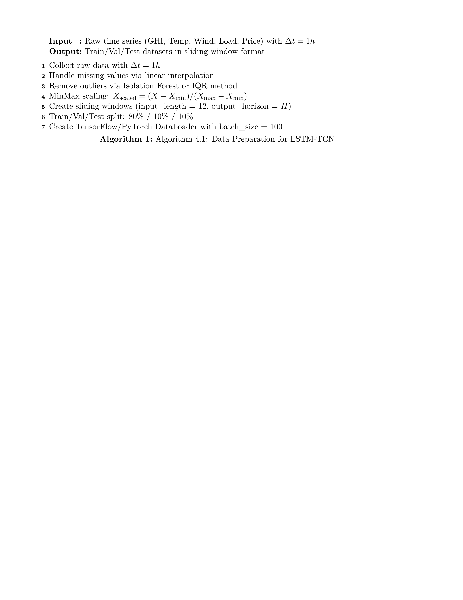
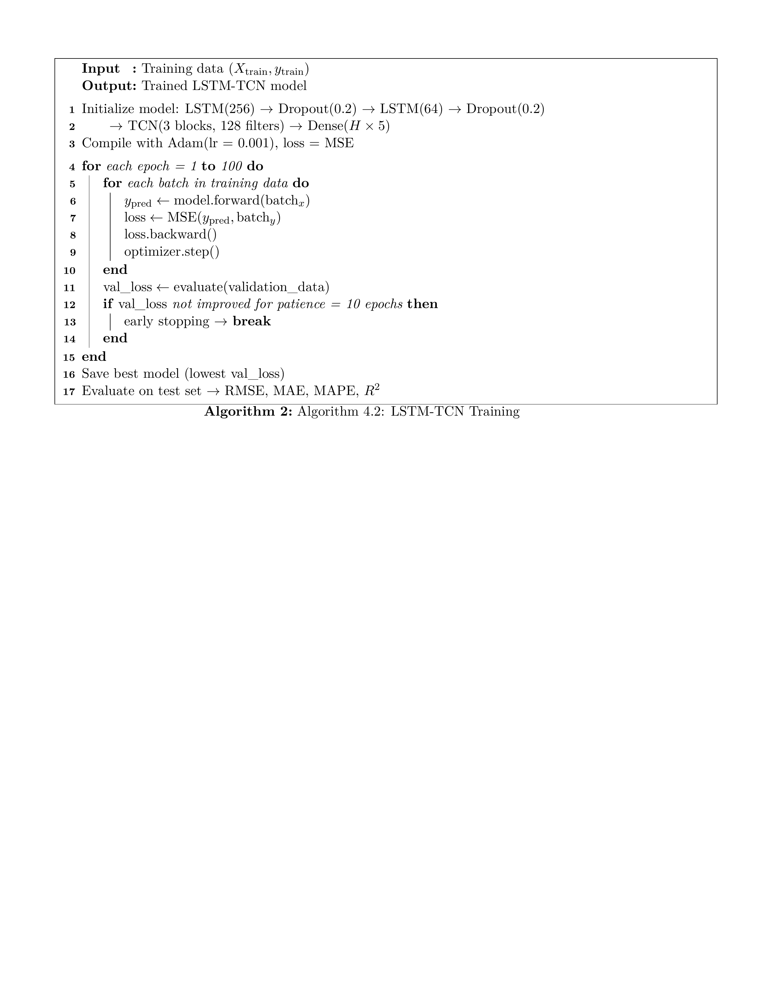
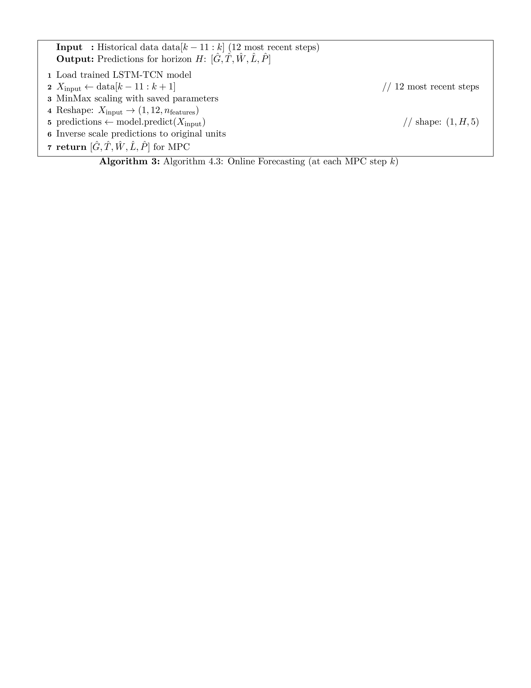
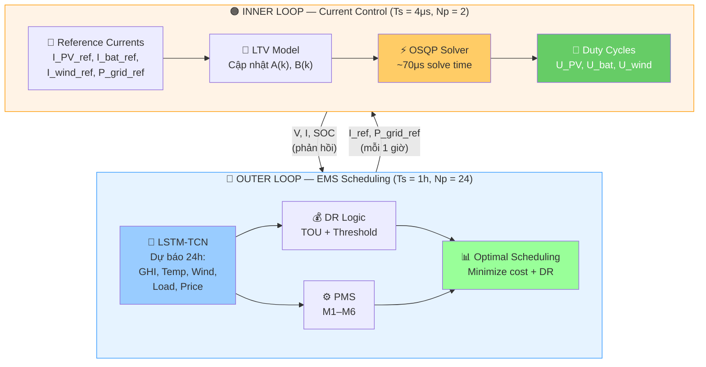
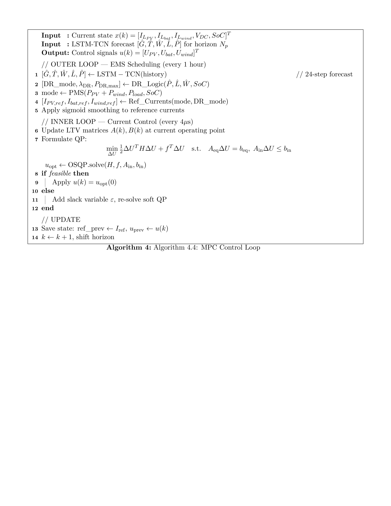
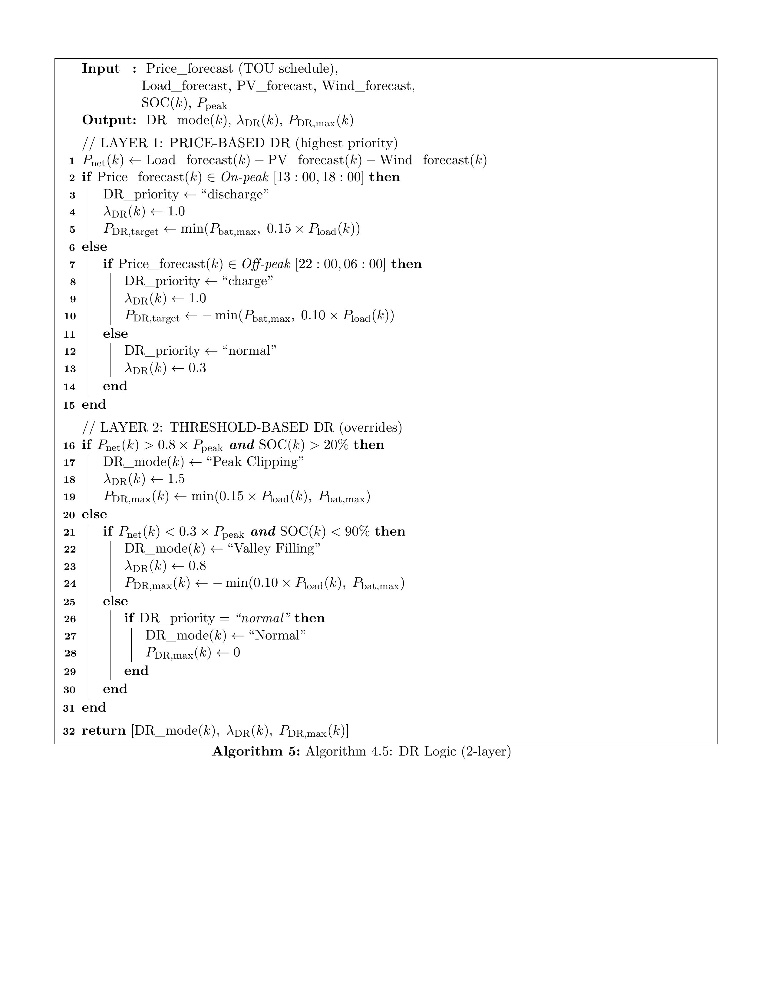
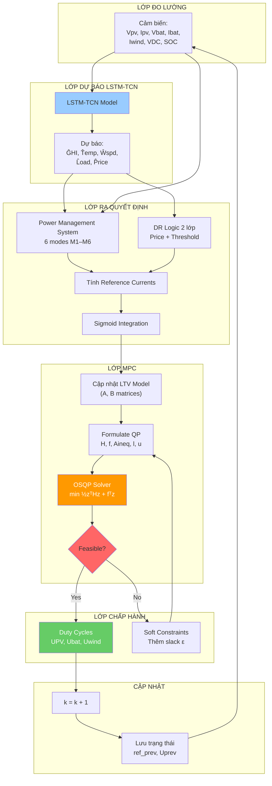
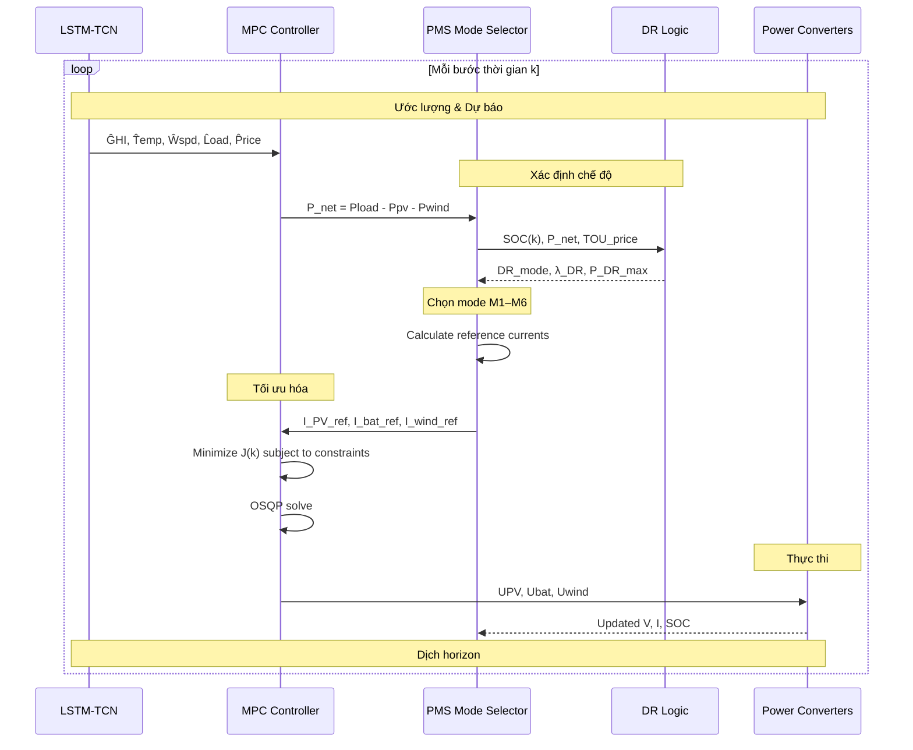
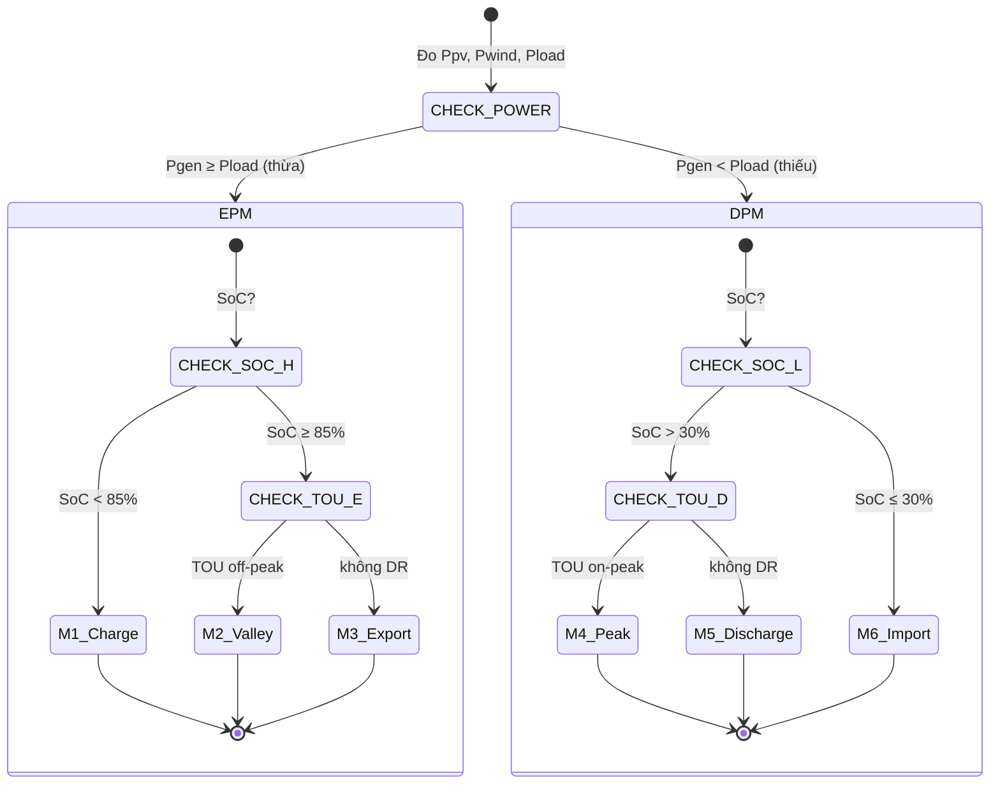
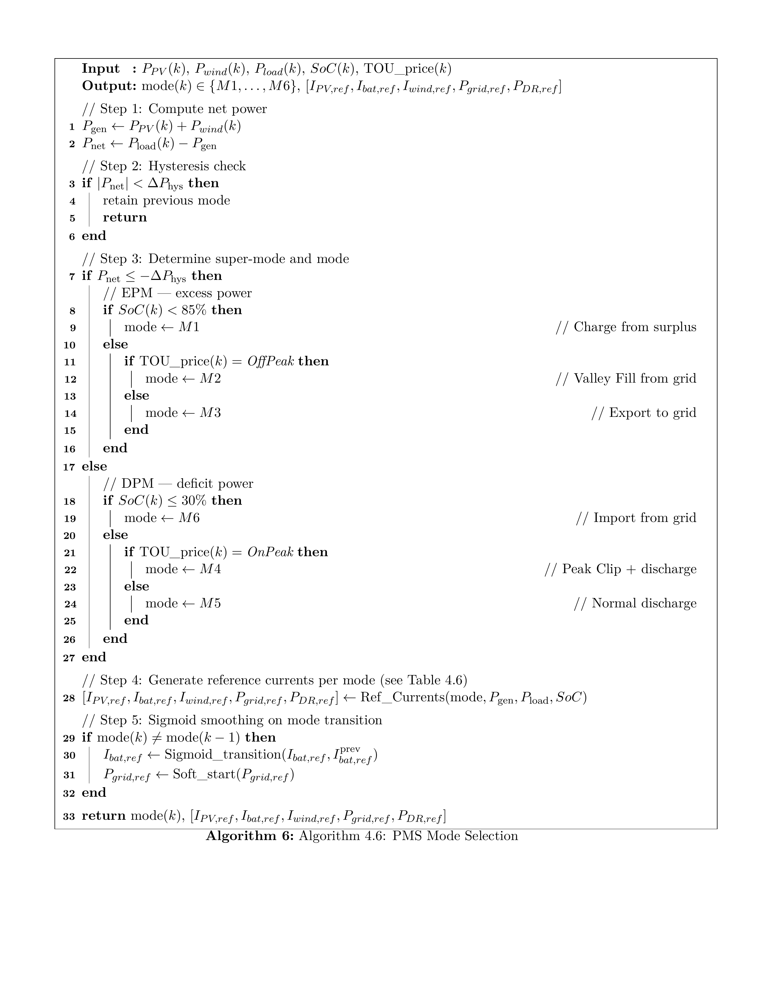

`# CHƯƠNG 4: THUẬT TOÁN ĐIỀU KHIỂN ĐỀ XUẤT

> ✅ **Cập nhật:** Citations đã đồng bộ với REFERENCES_MASTER.md (số [1]–[55])

---

Chương này trình bày chi tiết các thuật toán điều khiển được đề xuất cho hệ thống microgrid PV–Wind–Battery kết nối lưới tích hợp Demand Response. Nội dung được chia làm bốn phần chính: (4.1) thuật toán dự báo LSTM-TCN mở rộng, (4.2) vòng lặp điều khiển MPC, (4.3) lập lịch DR động, và (4.4) lưu đồ thuật toán tổng thể phối hợp giữa các module.

---

## 4.1 Thuật toán dự báo LSTM-TCN mở rộng

### 4.1.1 Kiến trúc mạng đề xuất

Mô hình dự báo LSTM-TCN trong đề tài này kế thừa kiến trúc Sequential LSTM → TCN từ công trình của Limouni et al. [9] và mở rộng để đáp ứng các yêu cầu mới: dự báo đồng thời công suất gió và giá điện phục vụ cho cả MPC lẫn DR.

**Kiến trúc tổng thể:**

```
Input: (batch_size, 12, 6)      // 12 time steps, 6 features 
  ↓
LSTM Layer 1 (256): (batch_size, 12, 256)     // Học phụ thuộc dài hạn
  ↓ Dropout 0.2
LSTM Layer 2 (64):  (batch_size, 12, 64)      // Giảm chiều đặc trưng
  ↓ Dropout 0.2
TCN Block 1 (d=1):  (batch_size, 12, 128)     // Local patterns
  ↓
TCN Block 2 (d=2):  (batch_size, 12, 128)     // Mở rộng receptive field
  ↓
TCN Block 3 (d=4):  (batch_size, 12, 128)     // Receptive field rộng nhất
  ↓
Dense Layer:         (batch_size, H, 5)        // H = prediction horizon
```

Trong đó:
- **LSTM (2 layers):** Học các phụ thuộc dài hạn (long-term dependencies) trong chuỗi thời gian thông qua cơ chế cổng (forget gate, input gate, output gate). Lớp thứ nhất với 256 neurons trích xuất đặc trưng tổng quát, lớp thứ hai với 64 neurons giảm chiều và tổng hợp thông tin.
- **TCN (3 residual blocks):** Học các patterns cục bộ (local temporal patterns) bằng dilated causal convolution. Exponential dilation $d = [1, 2, 4]$ cho phép mở rộng receptive field mà không tăng số tham số.
- **Dense Layer:** Đầu ra với $H \times 5$ neurons, trong đó $H$ là prediction horizon và 5 là số lượng targets.

### 4.1.2 Mở rộng từ bài báo gốc

So với kiến trúc của Limouni et al. [9], đề tài này có ba mở rộng chính:

| Khía cạnh | Bài báo gốc (Limouni 2025) [9] | Đề tài (mở rộng) |
|-----------|-------------------------------|------------------|
| **Input features** | GHI, Temperature, Load | GHI, Temperature, **Wind Speed**, Load, **Electricity Price**, **Time features** |
| **Output targets** | GHI, Temp, Load (3 targets) | PV, Wind, Temp, Load, Price **(5 targets)** |
| **Output horizon** | 1 step | 1–4 steps (cho MPC) |

**Input features chi tiết:**

| # | Feature | Ký hiệu | Đơn vị | Gốc [9] | Mới |
|---|---------|---------|--------|:-------:|:---:|
| 1 | Bức xạ mặt trời (GHI) | $G(t)$ | W/m² | ✅ | — |
| 2 | Nhiệt độ môi trường | $T(t)$ | °C | ✅ | — |
| 3 | Tốc độ gió | $V_{wind}(t)$ | m/s | ❌ | ✅ |
| 4 | Nhu cầu tải | $P_{load}(t)$ | kW | ✅ | — |
| 5 | Giá điện | $C_{grid}(t)$ | $/kWh | ❌ | ✅ |
| 6 | Giờ trong ngày | $hour(t)$ | [0–23] | — | ✅ |

**Output targets chi tiết:**

| # | Target | Ký hiệu | Đơn vị | Phục vụ cho |
|---|--------|---------|--------|-------------|
| 1 | Công suất PV | $\hat{P}_{PV}(t+1)$ | kW | MPC reference |
| 2 | Công suất gió | $\hat{P}_{WT}(t+1)$ | kW | MPC reference |
| 3 | Nhiệt độ | $\hat{T}(t+1)$ | °C | MPPT correction |
| 4 | Nhu cầu tải | $\hat{P}_{load}(t+1)$ | kW | Power balance |
| 5 | Giá điện | $\hat{C}_{grid}(t+1)$ | $/kWh | DR cost function |

### 4.1.3 Cơ chế Sliding Window

Dữ liệu thời gian được cắt thành các cửa sổ chồng lấn (overlapping windows) để huấn luyện mô hình:

```
Time steps:  1  2  3  4  5  6  7  8  9  10 11 12 | 13 14 15 16 ...
Window 1:    [x₁  x₂  ...  x₁₂]                → [ŷ₁₃]     (dự báo 1 bước)
Window 2:        [x₂  x₃  ...  x₁₃]            → [ŷ₁₄]
Window 3:            [x₃  x₄  ...  x₁₄]        → [ŷ₁₅]
```

**Tham số sliding window:**

| Tham số | Giá trị | Ý nghĩa |
|---------|---------|---------|
| Input window (look-back) | 12 steps | 12 bước quá khứ (12 giờ) |
| Output horizon (H) | 1–4 steps | Dự báo tương lai cho MPC |
| Step size | 1 | Dịch chuyển 1 bước mỗi lần |
| Time resolution | 1 hour | Mỗi bước = 1 giờ |

Để dự báo multi-step phục vụ MPC prediction horizon, đề tài sử dụng phương pháp **Direct multi-output**:

$$[\hat{y}_{t+1}, \hat{y}_{t+2}, ..., \hat{y}_{t+H}] = f(x_{t-11}, x_{t-10}, ..., x_{t}) \tag{4.1}$$

Phương pháp này dự báo trực tiếp H bước cùng lúc, tránh sai số tích lũy của phương pháp iterative (tự hồi quy từng bước).

### 4.1.4 Hyperparameters

**Bảng 4.1: Hyperparameters của mô hình LSTM-TCN**

| Nhóm | Tham số | Giá trị | Khoảng tuning |
|------|---------|:-------:|:-------------:|
| **LSTM** | Layer 1 neurons | 256 | [64, 128, 256, 512] |
| | Layer 2 neurons | 64 | [32, 64, 128] |
| | Dropout | 0.2 | [0.1, 0.2, 0.3, 0.4] |
| **TCN** | Residual blocks | 3 | [2, 3, 4, 5] |
| | Filters | 128 | [64, 128, 256] |
| | Kernel size | 3 | [3, 5, 7] |
| | Dilation | [1, 2, 4] | Exponential base 2 |
| | Dropout | 0.2 | [0.1, 0.2, 0.3] |
| **Training** | Learning rate | 0.001 | [1e-4, 1e-3, 1e-2] |
| | Optimizer | Adam | Adam, SGD, RMSprop |
| | Epochs | 100 | [50, 100, 200] + early stopping |
| | Batch size | 100 | [32, 64, 100, 128] |
| **Data** | Input window | 12 | [6, 12, 24, 48] |
| | Output horizon (H) | 1–4 | Theo MPC requirement |

### 4.1.5 Thuật toán huấn luyện

**Algorithm 4.1: Data Preparation for LSTM-TCN**



**Algorithm 4.2: LSTM-TCN Training**



**Algorithm 4.3: Online Forecasting (tại mỗi MPC step k)**



### 4.1.6 Các chỉ số đánh giá

**Bảng 4.2: Chỉ số đánh giá mô hình dự báo**

| Metric | Công thức | Ý nghĩa | Target |
|--------|-----------|---------|:------:|
| **RMSE** | $\sqrt{\frac{1}{n}\sum_{i=1}^{n}(y_{pred,i} - y_{true,i})^2}$ | Sai số căn bậc hai trung bình | Thấp |
| **MAE** | $\frac{1}{n}\sum_{i=1}^{n} |y_{pred,i} - y_{true,i}|$ | Sai số tuyệt đối trung bình | Thấp |
| **MAPE** | $\frac{100\%}{n}\sum_{i=1}^{n} \left|\frac{y_{pred,i} - y_{true,i}}{y_{true,i}}\right|$ | Sai số phần trăm | < 5% |
| **R²** | $1 - \frac{\sum(y_{pred,i} - y_{true,i})^2}{\sum(y_{true,i} - \bar{y})^2}$ | Hệ số xác định | > 0.95 |

Kết quả kỳ vọng dựa trên công trình của Limouni et al. [9]: hệ số xác định $R^2 > 0,96$ cho tất cả các tham số dự báo, trong đó giá điện TOU (deterministic) đạt $R^2 \approx 1,0$.

---

## 4.2 Vòng lặp điều khiển MPC

### 4.2.1 Tổng quan vòng lặp điều khiển

Bộ điều khiển MPC trong đề tài này sử dụng hai vòng điều khiển lồng nhau (cascade control):

1. **Inner Loop (Current Control):** Chạy ở tần số 250 kHz ($T_s = 4 \mu s$), đảm nhiệm điều khiển dòng điện tức thời qua các bộ biến đổi DC-DC và ổn định điện áp DC bus. Vòng này sử dụng mô hình LTV (Linear Time-Varying) cập nhật theo điểm làm việc.

2. **Outer Loop (EMS Scheduling):** Chạy mỗi 1 giờ ($T_s = 3600 s$), đảm nhiệm lập lịch tối ưu năng lượng với prediction horizon 24 giờ, tích hợp dự báo từ LSTM-TCN và tín hiệu Demand Response.

**Bảng 4.3: Thông số hai vòng điều khiển MPC**

| Tham số | Inner Loop (Current Control) | Outer Loop (EMS) | Đơn vị |
|---------|:----------:|:----------:|:------:|
| Sample time $T_s$ | $4 \times 10^{-6}$ | 3600 | s |
| Prediction horizon $N_p$ | 2 | 24 | steps |
| Control horizon $N_c$ | 1 | 24 | steps |
| DC bus reference $V_{DC,ref}$ | 800 | — | V |
| Solver | OSQP [21] | LP/PSO [10] | — |



**Hình 4.1:** Sơ đồ hai vòng điều khiển MPC. Outer Loop (xanh) chạy mỗi 1 giờ với dự báo LSTM-TCN 24 bước, PMS và DR logic để lập lịch tối ưu. Inner Loop (cam) chạy ở 250 kHz với LTV model và OSQP solver để điều khiển dòng điện tức thời. Hai vòng kết nối qua dòng tham chiếu và tín hiệu phản hồi trạng thái.

### 4.2.2 Thuật toán điều khiển MPC

**Algorithm 4.4: MPC Control Loop**



---

## 4.3 Lập lịch DR động

### 4.3.1 Nguyên lý DR 2 lớp

Demand Response trong đề tài này sử dụng cơ chế **2 lớp (2-layer DR)**:

1. **Lớp 1 — Price-based DR (TOU):** Dựa trên giá điện theo khung giờ, khuyến khích BESS arbitrage — xả khi giá cao, sạc khi giá thấp. Lớp này là DR gián tiếp, tác động qua cost function.

2. **Lớp 2 — Threshold-based DR (Peak Clipping / Valley Filling):** Dựa trên ngưỡng net demand, kích hoạt cắt giảm tải hoặc tăng tải. Lớp này là DR trực tiếp, ghi đè lên lớp 1 khi điều kiện khắt khe hơn.

### 4.3.2 Cấu trúc giá TOU

**Bảng 4.5: Khung giá TOU**

| Khung giờ | Loại | Giá (relative) | Hành động BESS |
|-----------|------|:--------------:|----------------|
| 22:00–06:00 | Off-peak (thấp điểm) | $0.5 \times p_0$ | Sạc (mua điện rẻ) |
| 06:00–09:00 | Valley (sáng sớm) | $0.8 \times p_0$ | Trung tính / Sạc nhẹ |
| 09:00–13:00 | Mid-peak (trung bình) | $1.0 \times p_0$ | Trung tính |
| 13:00–18:00 | On-peak (cao điểm) | $2.0 \times p_0$ | Xả (giảm mua điện đắt) |
| 18:00–22:00 | Evening (tối) | $1.2 \times p_0$ | Trung tính |

### 4.3.3 Ngưỡng kích hoạt Threshold DR

**Peak Clipping** được kích hoạt khi net demand vượt quá 80% công suất đỉnh và pin còn khả năng xả:

$$\text{if } P_{net}(t) > 0.8 \cdot P_{peak} \text{ and } SoC > 20\% \implies \text{Peak Clipping Active}$$

$$0 \leq P_{DR}(t) \leq 0.15 \cdot P_{load}(t) \tag{4.5}$$

**Valley Filling** được kích hoạt khi net demand dưới 30% công suất đỉnh và pin còn khả năng sạc:

$$\text{if } P_{net}(t) < 0.3 \cdot P_{peak} \text{ and } SoC < 90\% \implies \text{Valley Filling Active}$$

$$-0.10 \cdot P_{load}(t) \leq P_{DR}(t) \leq 0 \tag{4.6}$$

### 4.3.4 Thuật toán DR Logic

**Algorithm 4.5: DR Logic (2-layer)**



### 4.3.5 Sigmoid Integration cho DR Transition

Để tránh chuyển đổi đột ngột giữa các chế độ DR (có thể gây sốc điện áp và dao động công suất), hàm sigmoid được áp dụng để làm mượt tín hiệu:

$$\text{Sigm}_{DR}(k) = \frac{P_{DR}^{final} - P_{DR}^{init}}{1 + e^{-z \cdot (k - k_0)}} + P_{DR}^{init} \tag{4.7}$$

Trong đó:
- $z = 10$: độ dốc của sigmoid
- $k_0$: thời điểm bắt đầu chuyển đổi
- $P_{DR}^{init}$: giá trị DR trước khi chuyển
- $P_{DR}^{final}$: giá trị DR sau khi chuyển

Kỹ thuật này được kế thừa từ Limouni et al. [9] — nguyên bản dùng để làm mượt forecasted values, nay được áp dụng cho DR transition.

### 4.3.6 Các ràng buộc DR

| Ràng buộc | Biểu thức | Giá trị |
|-----------|-----------|:-------:|
| Peak Clipping | $0 \leq P_{DR}(k) \leq 0.15P_{load}(k)$ | 15% tải |
| Valley Fill | $-0.10P_{load}(k) \leq P_{DR}(k) \leq 0$ | 10% tải |
| Ramp rate | $\left|\frac{dP_{DR}}{dt}\right| \leq R_{DR,max}$ | Sigmoid đảm bảo |

---

## 4.4 Lưu đồ thuật toán tổng thể

### 4.4.1 Sơ đồ khối tổng thể



**Hình 4.2:** Lưu đồ thuật toán tổng thể. Dữ liệu đo lường đi vào LSTM-TCN để dự báo, sau đó PMS và DR Logic xác định chế độ vận hành, MPC giải bài toán QP, và duty cycles được gửi đến các bộ biến đổi.

### 4.4.2 Sơ đồ tuần tự các module



**Hình 4.3:** Sơ đồ tuần tự phối hợp giữa các module trong một bước thời gian. LSTM-TCN cung cấp dự báo, PMS và DR xác định chế độ, MPC tối ưu hóa và gửi tín hiệu điều khiển.

### 4.4.3 State Machine PMS 6-mode

Hệ thống PMS hoạt động như một state machine với 6 chế độ (M1–M6), được xác định bởi super-mode (EPM/DPM), trạng thái SOC và tín hiệu giá điện:



**Hình 4.4:** State machine của PMS với 6 chế độ M1–M6, được phân làm hai super-mode EPM (Excess Power Mode) và DPM (Deficit Power Mode).

### 4.4.4 Reference Currents theo từng mode

**Bảng 4.6: Dòng điện tham chiếu theo PMS mode**

| Mode | $I_{PV,ref}$ | $I_{bat,ref}$ | $I_{wind,ref}$ | $P_{grid,ref}$ | $P_{DR,ref}$ |
|------|:-----------:|:------------:|:-------------:|:--------------:|:----------:|
| **M1** (Charge) | MPPT | $\displaystyle -\frac{P_{charge,max}}{V_{DC}}$ | MPPT | $\max(P_{surplus} - P_{bat}, 0)$ | 0 |
| **M2** (Valley) | MPPT | $\displaystyle -\frac{P_{charge,DR}}{V_{DC}}$ | MPPT | $P_{surplus} + P_{bat,DR}$ | $-\alpha P_{load}$ |
| **M3** (Export) | MPPT | 0 | MPPT | $P_{surplus}$ | 0 |
| **M4** (PeakClip) | MPPT | $\displaystyle +\frac{P_{discharge,DR}}{V_{DC}}$ | MPPT | $P_{deficit} - P_{bat,DR}$ | $+\beta P_{load}$ |
| **M5** (Discharge) | MPPT | $\displaystyle +\frac{P_{discharge,max}}{V_{DC}}$ | MPPT | $\max(P_{deficit} - P_{bat}, 0)$ | 0 |
| **M6** (Import) | MPPT | 0 | MPPT | $P_{deficit}$ | 0 |

Trong đó:
- $P_{surplus} = P_{PV} + P_{wind} - P_{load} > 0$ (năng lượng thừa)
- $P_{deficit} = P_{load} - P_{PV} - P_{wind} > 0$ (năng lượng thiếu)
- $\alpha = 0.10$: tỷ lệ valley fill
- $\beta = 0.15$: tỷ lệ peak clip
- Dấu $-$ cho $I_{bat,ref}$: sạc (dòng âm)
- Dấu $+$ cho $I_{bat,ref}$: xả (dòng dương)

### 4.4.5 Thuật toán PMS

**Algorithm 4.6: PMS Mode Selection**



### 4.4.6 Cơ chế chống chattering

Để tránh hiện tượng chattering (chuyển mode liên tục khi $P_{gen} \approx P_{load}$), PMS sử dụng **hysteresis band**:

$$\text{EPM active khi: } P_{gen} - P_{load} > \Delta P_{hys}$$
$$\text{DPM active khi: } P_{load} - P_{gen} > \Delta P_{hys}$$

Với $\Delta P_{hys} = 0.05 \times P_{rated}$ (5% công suất định mức).

Tương tự cho SOC transitions:

| Transition | Ngưỡng kích hoạt | Ngưỡng trở về | Mục đích |
|-----------|-----------------|---------------|----------|
| Charge → Stop | $SoC \geq 85\%$ | $SoC \leq 80\%$ | Tránh overcharge |
| Discharge → Stop | $SoC \leq 30\%$ | $SoC \geq 35\%$ | Tránh deep discharge |

### 4.4.7 Cơ chế Seamless Mode Transition

Khi PMS chuyển mode, cần tránh đột biến dòng điện và điện áp. Cơ chế seamless transition được thực hiện qua ba kỹ thuật:

**1. Sigmoid Smoothing cho dòng điện tham chiếu:**

Khi chuyển từ Mode $i$ sang Mode $j$ tại thời điểm $k_0$:

$$I_{bat,ref}(k) = I_{bat,ref,i} + \frac{I_{bat,ref,j} - I_{bat,ref,i}}{1 + e^{-z \cdot (k - k_0 - \delta)}} \tag{4.8}$$

Với $z = 0.5$, $\delta = 3$ (số bước thời gian).

**2. Soft-start cho grid connection:**

Khi chuyển chế độ liên quan đến lưới điện:

$$P_{grid,ref}(k) = P_{grid,ref,steady} \times \left(1 - e^{-k/\tau}\right) \tag{4.9}$$

Với $\tau = 5$ bước thời gian.

**3. Power buffer bằng DC bus capacitor:**

Trong quá trình chuyển tiếp, DC bus capacitor $C_{DC}$ đóng vai trò đệm năng lượng:

$$\Delta V_{DC}(k) = \frac{\Delta P_{transition}(k) \cdot \Delta t}{C_{DC} \cdot V_{DC,ref}} \tag{4.10}$$

Yêu cầu $\Delta V_{DC} \leq \pm 5\%$ (theo IEEE std 1547).

---

## Tổng kết Chương 4

Chương này đã trình bày chi tiết các thuật toán điều khiển cốt lõi của đề tài dưới dạng mã giả (pseudocode) sử dụng gói algorithm2e:

1. **LSTM-TCN mở rộng (mục 4.1):** Gồm ba thuật toán — Data Preparation (Algorithm 4.1), LSTM-TCN Training (Algorithm 4.2) và Online Forecasting (Algorithm 4.3). Kiến trúc Sequential LSTM(256→64) → TCN(3 blocks, 128 filters) → Dense với 6 đầu vào và 5 đầu ra, sliding window 12 bước, huấn luyện với Adam optimizer và early stopping.

2. **MPC (mục 4.2):** Thuật toán MPC Control Loop (Algorithm 4.4) mô tả hai vòng điều khiển lồng nhau — inner loop (250 kHz, Np=2) cho dòng điện và outer loop (1h, Np=24) cho EMS scheduling, sử dụng LTV-MPC và OSQP solver với warm start (~70μs).

3. **DR động (mục 4.3):** Thuật toán DR Logic 2 lớp (Algorithm 4.5) với price-based (TOU 5 khung giờ) và threshold-based (Peak Clipping 80% / Valley Filling 30%), tích hợp sigmoid integration cho smooth transition.

4. **PMS (mục 4.4):** Thuật toán PMS Mode Selection (Algorithm 4.6) với state machine 6-mode, hysteresis band 5\% chống chattering, reference currents theo từng mode, và cơ chế seamless transition (sigmoid + soft-start + power buffer).

Các thuật toán này sẽ được đánh giá thông qua mô phỏng trên MATLAB/Simulink ở Chương 5, với 5 kịch bản so sánh khác nhau để kiểm chứng hiệu quả của phương pháp đề xuất.

---

## Tài liệu tham khảo Chương 4

*(Đánh số theo REFERENCES_MASTER.md — xem file riêng để biết đầy đủ 55 tài liệu)*

[9] Limouni, T., et al. (2025). Intelligent real time control strategy... MPC and LSTM-TCN. *IJEPES*, 169, 110761.
[10] Panda, S., et al. (2025). Optimization-Based Energy Management... *Engineering Reports*, 7(7), e70305.
[19] Shan, Y., et al. (2019). Model Predictive Control of Bidirectional DC–DC Converters... *IEEE Trans. Sustainable Energy*, 10(4), 1823–1833.
[21] Stellato, B., et al. (2020). OSQP: An operator splitting solver for quadratic programs. *Mathematical Programming Computation*, 12(4), 637–672.
[28] Hochreiter, S., & Schmidhuber, J. (1997). Long short-term memory. *Neural Computation*, 9(8), 1735–1780.
[29] Bai, S., Kolter, J. Z., & Koltun, V. (2018). An empirical evaluation of generic convolutional and recurrent networks for sequence modeling. *arXiv:1803.01271*.
[32] Lara-Benítez, P., et al. (2021). An experimental review on deep learning architectures for time series forecasting. *Int. J. Neural Systems*, 31(3), 2130001.
[34] Wang, Y., et al. (2024). Short-term power load forecasting... LSTM-TCN. *Frontiers in Energy Research*, 12, 1384142.
[38] Wamalwa, F., & Ishimwe, A. (2024). Optimal energy management... public building under DR. *Energy Reports*, 12, 3718–3731.
[41] Zaitsev, I., et al. (2025). Advanced microgrid optimization... price-elastic DR. *Scientific Reports*, 15, 86232.
[42] Energies (2018). Robust optimization for electricity retailer with TOU pricing. *Energies*, 11(11), 3258.
[43] Energies (2023). Three-stage monthly TOU tariff optimization model. *Energies*, 16(23), 7858.
[55] UPC (2021). LTV-MPC for grid-tied voltage source converters. *ECC Proceedings*.
